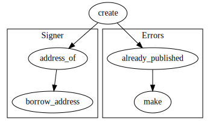
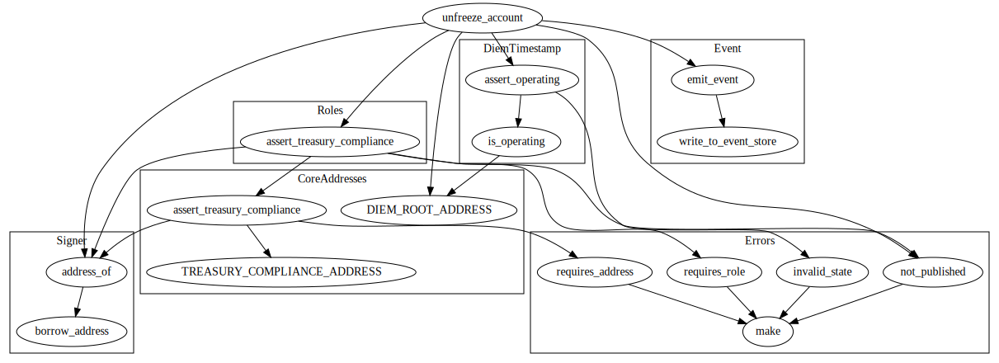
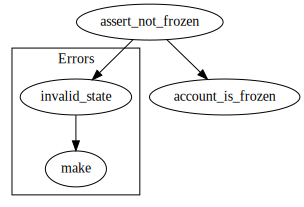

# Module `0x1::AccountFreezing`

Module which manages freezing of accounts.

-  [Resource `FreezingBit`](#0x1_AccountFreezing_FreezingBit)
-  [Resource `FreezeEventsHolder`](#0x1_AccountFreezing_FreezeEventsHolder)
-  [Struct `FreezeAccountEvent`](#0x1_AccountFreezing_FreezeAccountEvent)
-  [Struct `UnfreezeAccountEvent`](#0x1_AccountFreezing_UnfreezeAccountEvent)
-  [Constants](#@Constants_0)
-  [Function `initialize`](#0x1_AccountFreezing_initialize)
-  [Function `create`](#0x1_AccountFreezing_create)
-  [Function `freeze_account`](#0x1_AccountFreezing_freeze_account)
-  [Function `unfreeze_account`](#0x1_AccountFreezing_unfreeze_account)
-  [Function `account_is_frozen`](#0x1_AccountFreezing_account_is_frozen)
-  [Function `assert_not_frozen`](#0x1_AccountFreezing_assert_not_frozen)
-  [Module Specification](#@Module_Specification_1)
    -  [Initialization](#@Initialization_2)
    -  [Access Control](#@Access_Control_3)
    -  [Helper Functions](#@Helper_Functions_4)

<pre><code><b>use</b> <a href="CoreAddresses.md#0x1_CoreAddresses">0x1::CoreAddresses</a>;
<b>use</b> <a href="DiemTimestamp.md#0x1_DiemTimestamp">0x1::DiemTimestamp</a>;
<b>use</b> <a href="../../../move-stdlib/docs/Errors.md#0x1_Errors">0x1::Errors</a>;
<b>use</b> <a href="../../../move-stdlib/docs/Event.md#0x1_Event">0x1::Event</a>;
<b>use</b> <a href="Roles.md#0x1_Roles">0x1::Roles</a>;
<b>use</b> <a href="../../../move-stdlib/docs/Signer.md#0x1_Signer">0x1::Signer</a>;
</code></pre>

Show all the modules that "AccountFreezing" depends on directly or indirectly

Show all the modules that depend on "AccountFreezing" directly or indirectly

## Resource `FreezingBit`

<pre><code><b>resource</b> <b>struct</b> <a href="AccountFreezing.md#0x1_AccountFreezing_FreezingBit">FreezingBit</a>
</code></pre>

Fields

<dl>
<dt>
<code>is_frozen: bool</code>
</dt>
<dd>
 If <code>is_frozen</code> is set true, the account cannot be used to send transactions or receive funds
</dd>
</dl>

## Resource `FreezeEventsHolder`

<pre><code><b>resource</b> <b>struct</b> <a href="AccountFreezing.md#0x1_AccountFreezing_FreezeEventsHolder">FreezeEventsHolder</a>
</code></pre>

Fields

<dl>
<dt>
<code>freeze_event_handle: <a href="../../../move-stdlib/docs/Event.md#0x1_Event_EventHandle">Event::EventHandle</a>&lt;<a href="AccountFreezing.md#0x1_AccountFreezing_FreezeAccountEvent">AccountFreezing::FreezeAccountEvent</a>&gt;</code>
</dt>
<dd>

</dd>
<dt>
<code>unfreeze_event_handle: <a href="../../../move-stdlib/docs/Event.md#0x1_Event_EventHandle">Event::EventHandle</a>&lt;<a href="AccountFreezing.md#0x1_AccountFreezing_UnfreezeAccountEvent">AccountFreezing::UnfreezeAccountEvent</a>&gt;</code>
</dt>
<dd>

</dd>
</dl>

## Struct `FreezeAccountEvent`

Message for freeze account events

<pre><code><b>struct</b> <a href="AccountFreezing.md#0x1_AccountFreezing_FreezeAccountEvent">FreezeAccountEvent</a>
</code></pre>

Fields

<dl>
<dt>
<code>initiator_address: address</code>
</dt>
<dd>
 The address that initiated freeze txn
</dd>
<dt>
<code>frozen_address: address</code>
</dt>
<dd>
 The address that was frozen
</dd>
</dl>

## Struct `UnfreezeAccountEvent`

Message for unfreeze account events

<pre><code><b>struct</b> <a href="AccountFreezing.md#0x1_AccountFreezing_UnfreezeAccountEvent">UnfreezeAccountEvent</a>
</code></pre>

Fields

<dl>
<dt>
<code>initiator_address: address</code>
</dt>
<dd>
 The address that initiated unfreeze txn
</dd>
<dt>
<code>unfrozen_address: address</code>
</dt>
<dd>
 The address that was unfrozen
</dd>
</dl>

## Constants

The account is frozen

<pre><code><b>const</b> <a href="AccountFreezing.md#0x1_AccountFreezing_EACCOUNT_FROZEN">EACCOUNT_FROZEN</a>: u64 = 5;
</code></pre>

An attempt to freeze the Diem Root account was attempted

<pre><code><b>const</b> <a href="AccountFreezing.md#0x1_AccountFreezing_ECANNOT_FREEZE_DIEM_ROOT">ECANNOT_FREEZE_DIEM_ROOT</a>: u64 = 3;
</code></pre>

An attempt to freeze the Treasury & Compliance account was attempted

<pre><code><b>const</b> <a href="AccountFreezing.md#0x1_AccountFreezing_ECANNOT_FREEZE_TC">ECANNOT_FREEZE_TC</a>: u64 = 4;
</code></pre>

A property expected of the <code><a href="AccountFreezing.md#0x1_AccountFreezing_FreezeEventsHolder">FreezeEventsHolder</a></code> resource didn't hold

<pre><code><b>const</b> <a href="AccountFreezing.md#0x1_AccountFreezing_EFREEZE_EVENTS_HOLDER">EFREEZE_EVENTS_HOLDER</a>: u64 = 1;
</code></pre>

The <code><a href="AccountFreezing.md#0x1_AccountFreezing_FreezingBit">FreezingBit</a></code> resource is in an invalid state

<pre><code><b>const</b> <a href="AccountFreezing.md#0x1_AccountFreezing_EFREEZING_BIT">EFREEZING_BIT</a>: u64 = 2;
</code></pre>

## Function `initialize`

<pre><code><b>public</b> <b>fun</b> <a href="AccountFreezing.md#0x1_AccountFreezing_initialize">initialize</a>(dr_account: &signer)
</code></pre>

Implementation

<pre><code><b>public</b> <b>fun</b> <a href="AccountFreezing.md#0x1_AccountFreezing_initialize">initialize</a>(dr_account: &signer) {
    <a href="DiemTimestamp.md#0x1_DiemTimestamp_assert_genesis">DiemTimestamp::assert_genesis</a>();
    <a href="CoreAddresses.md#0x1_CoreAddresses_assert_diem_root">CoreAddresses::assert_diem_root</a>(dr_account);
    <b>assert</b>(
        !<b>exists</b>&lt;<a href="AccountFreezing.md#0x1_AccountFreezing_FreezeEventsHolder">FreezeEventsHolder</a>&gt;(<a href="../../../move-stdlib/docs/Signer.md#0x1_Signer_address_of">Signer::address_of</a>(dr_account)),
        <a href="../../../move-stdlib/docs/Errors.md#0x1_Errors_already_published">Errors::already_published</a>(<a href="AccountFreezing.md#0x1_AccountFreezing_EFREEZE_EVENTS_HOLDER">EFREEZE_EVENTS_HOLDER</a>)
    );
    move_to(dr_account, <a href="AccountFreezing.md#0x1_AccountFreezing_FreezeEventsHolder">FreezeEventsHolder</a> {
        freeze_event_handle: <a href="../../../move-stdlib/docs/Event.md#0x1_Event_new_event_handle">Event::new_event_handle</a>(dr_account),
        unfreeze_event_handle: <a href="../../../move-stdlib/docs/Event.md#0x1_Event_new_event_handle">Event::new_event_handle</a>(dr_account),
    });
}
</code></pre>

Specification

<pre><code><b>include</b> <a href="DiemTimestamp.md#0x1_DiemTimestamp_AbortsIfNotGenesis">DiemTimestamp::AbortsIfNotGenesis</a>;
<b>include</b> <a href="CoreAddresses.md#0x1_CoreAddresses_AbortsIfNotDiemRoot">CoreAddresses::AbortsIfNotDiemRoot</a>{account: dr_account};

<b>let</b> addr = <a href="../../../move-stdlib/docs/Signer.md#0x1_Signer_spec_address_of">Signer::spec_address_of</a>(dr_account);
<b>aborts_if</b> <b>exists</b>&lt;<a href="AccountFreezing.md#0x1_AccountFreezing_FreezeEventsHolder">FreezeEventsHolder</a>&gt;(addr) <b>with</b> <a href="../../../move-stdlib/docs/Errors.md#0x1_Errors_ALREADY_PUBLISHED">Errors::ALREADY_PUBLISHED</a>;
<b>ensures</b> <b>exists</b>&lt;<a href="AccountFreezing.md#0x1_AccountFreezing_FreezeEventsHolder">FreezeEventsHolder</a>&gt;(addr);
</code></pre>

Show all the functions that "initialize" calls

## Function `create`

<pre><code><b>public</b> <b>fun</b> <a href="AccountFreezing.md#0x1_AccountFreezing_create">create</a>(account: &signer)
</code></pre>

Implementation

<pre><code><b>public</b> <b>fun</b> <a href="AccountFreezing.md#0x1_AccountFreezing_create">create</a>(account: &signer) {
    <b>let</b> addr = <a href="../../../move-stdlib/docs/Signer.md#0x1_Signer_address_of">Signer::address_of</a>(account);
    <b>assert</b>(!<b>exists</b>&lt;<a href="AccountFreezing.md#0x1_AccountFreezing_FreezingBit">FreezingBit</a>&gt;(addr), <a href="../../../move-stdlib/docs/Errors.md#0x1_Errors_already_published">Errors::already_published</a>(<a href="AccountFreezing.md#0x1_AccountFreezing_EFREEZING_BIT">EFREEZING_BIT</a>));
    move_to(account, <a href="AccountFreezing.md#0x1_AccountFreezing_FreezingBit">FreezingBit</a> { is_frozen: <b>false</b> })
}
</code></pre>

Specification

<pre><code><b>let</b> addr = <a href="../../../move-stdlib/docs/Signer.md#0x1_Signer_spec_address_of">Signer::spec_address_of</a>(account);
<b>modifies</b> <b>global</b>&lt;<a href="AccountFreezing.md#0x1_AccountFreezing_FreezingBit">FreezingBit</a>&gt;(addr);
<b>aborts_if</b> <b>exists</b>&lt;<a href="AccountFreezing.md#0x1_AccountFreezing_FreezingBit">FreezingBit</a>&gt;(addr) <b>with</b> <a href="../../../move-stdlib/docs/Errors.md#0x1_Errors_ALREADY_PUBLISHED">Errors::ALREADY_PUBLISHED</a>;
<b>ensures</b> <a href="AccountFreezing.md#0x1_AccountFreezing_spec_account_is_not_frozen">spec_account_is_not_frozen</a>(addr);
</code></pre>

Show all the functions that "create" calls

## Function `freeze_account`

Freeze the account at <code>addr</code>.

<pre><code><b>public</b> <b>fun</b> <a href="AccountFreezing.md#0x1_AccountFreezing_freeze_account">freeze_account</a>(account: &signer, frozen_address: address)
</code></pre>

Implementation

<pre><code><b>public</b> <b>fun</b> <a href="AccountFreezing.md#0x1_AccountFreezing_freeze_account">freeze_account</a>(
    account: &signer,
    frozen_address: address,
)
<b>acquires</b> <a href="AccountFreezing.md#0x1_AccountFreezing_FreezingBit">FreezingBit</a>, <a href="AccountFreezing.md#0x1_AccountFreezing_FreezeEventsHolder">FreezeEventsHolder</a> {
    <a href="DiemTimestamp.md#0x1_DiemTimestamp_assert_operating">DiemTimestamp::assert_operating</a>();
    <a href="Roles.md#0x1_Roles_assert_treasury_compliance">Roles::assert_treasury_compliance</a>(account);
    // The diem root account and TC cannot be frozen
    <b>assert</b>(frozen_address != <a href="CoreAddresses.md#0x1_CoreAddresses_DIEM_ROOT_ADDRESS">CoreAddresses::DIEM_ROOT_ADDRESS</a>(), <a href="../../../move-stdlib/docs/Errors.md#0x1_Errors_invalid_argument">Errors::invalid_argument</a>(<a href="AccountFreezing.md#0x1_AccountFreezing_ECANNOT_FREEZE_DIEM_ROOT">ECANNOT_FREEZE_DIEM_ROOT</a>));
    <b>assert</b>(frozen_address != <a href="CoreAddresses.md#0x1_CoreAddresses_TREASURY_COMPLIANCE_ADDRESS">CoreAddresses::TREASURY_COMPLIANCE_ADDRESS</a>(), <a href="../../../move-stdlib/docs/Errors.md#0x1_Errors_invalid_argument">Errors::invalid_argument</a>(<a href="AccountFreezing.md#0x1_AccountFreezing_ECANNOT_FREEZE_TC">ECANNOT_FREEZE_TC</a>));
    <b>assert</b>(<b>exists</b>&lt;<a href="AccountFreezing.md#0x1_AccountFreezing_FreezingBit">FreezingBit</a>&gt;(frozen_address), <a href="../../../move-stdlib/docs/Errors.md#0x1_Errors_not_published">Errors::not_published</a>(<a href="AccountFreezing.md#0x1_AccountFreezing_EFREEZING_BIT">EFREEZING_BIT</a>));
    borrow_global_mut&lt;<a href="AccountFreezing.md#0x1_AccountFreezing_FreezingBit">FreezingBit</a>&gt;(frozen_address).is_frozen = <b>true</b>;
    <b>let</b> initiator_address = <a href="../../../move-stdlib/docs/Signer.md#0x1_Signer_address_of">Signer::address_of</a>(account);
    <a href="../../../move-stdlib/docs/Event.md#0x1_Event_emit_event">Event::emit_event</a>&lt;<a href="AccountFreezing.md#0x1_AccountFreezing_FreezeAccountEvent">FreezeAccountEvent</a>&gt;(
        &<b>mut</b> borrow_global_mut&lt;<a href="AccountFreezing.md#0x1_AccountFreezing_FreezeEventsHolder">FreezeEventsHolder</a>&gt;(<a href="CoreAddresses.md#0x1_CoreAddresses_DIEM_ROOT_ADDRESS">CoreAddresses::DIEM_ROOT_ADDRESS</a>()).freeze_event_handle,
        <a href="AccountFreezing.md#0x1_AccountFreezing_FreezeAccountEvent">FreezeAccountEvent</a> {
            initiator_address,
            frozen_address
        },
    );
}
</code></pre>

Specification

<pre><code><b>include</b> <a href="DiemTimestamp.md#0x1_DiemTimestamp_AbortsIfNotOperating">DiemTimestamp::AbortsIfNotOperating</a>;
<b>include</b> <a href="Roles.md#0x1_Roles_AbortsIfNotTreasuryCompliance">Roles::AbortsIfNotTreasuryCompliance</a>;
<b>aborts_if</b> frozen_address == <a href="CoreAddresses.md#0x1_CoreAddresses_DIEM_ROOT_ADDRESS">CoreAddresses::DIEM_ROOT_ADDRESS</a>() <b>with</b> <a href="../../../move-stdlib/docs/Errors.md#0x1_Errors_INVALID_ARGUMENT">Errors::INVALID_ARGUMENT</a>;
<b>aborts_if</b> frozen_address == <a href="CoreAddresses.md#0x1_CoreAddresses_TREASURY_COMPLIANCE_ADDRESS">CoreAddresses::TREASURY_COMPLIANCE_ADDRESS</a>() <b>with</b> <a href="../../../move-stdlib/docs/Errors.md#0x1_Errors_INVALID_ARGUMENT">Errors::INVALID_ARGUMENT</a>;
<b>aborts_if</b> !<b>exists</b>&lt;<a href="AccountFreezing.md#0x1_AccountFreezing_FreezingBit">FreezingBit</a>&gt;(frozen_address) <b>with</b> <a href="../../../move-stdlib/docs/Errors.md#0x1_Errors_NOT_PUBLISHED">Errors::NOT_PUBLISHED</a>;
<b>ensures</b> <a href="AccountFreezing.md#0x1_AccountFreezing_spec_account_is_frozen">spec_account_is_frozen</a>(frozen_address);
<b>include</b> <a href="AccountFreezing.md#0x1_AccountFreezing_FreezeAccountEmits">FreezeAccountEmits</a>;
</code></pre>

<pre><code><b>schema</b> <a href="AccountFreezing.md#0x1_AccountFreezing_FreezeAccountEmits">FreezeAccountEmits</a> {
    account: &signer;
    frozen_address: address;
    
    <b>let</b> handle = <b>global</b>&lt;<a href="AccountFreezing.md#0x1_AccountFreezing_FreezeEventsHolder">FreezeEventsHolder</a>&gt;(<a href="CoreAddresses.md#0x1_CoreAddresses_DIEM_ROOT_ADDRESS">CoreAddresses::DIEM_ROOT_ADDRESS</a>()).freeze_event_handle;
    
    <b>let</b> msg = <a href="AccountFreezing.md#0x1_AccountFreezing_FreezeAccountEvent">FreezeAccountEvent</a> {
        initiator_address: <a href="../../../move-stdlib/docs/Signer.md#0x1_Signer_spec_address_of">Signer::spec_address_of</a>(account),
        frozen_address
    };
    emits msg <b>to</b> handle;
}
</code></pre>

Show all the functions that "freeze_account" calls

## Function `unfreeze_account`

Unfreeze the account at <code>addr</code>.

<pre><code><b>public</b> <b>fun</b> <a href="AccountFreezing.md#0x1_AccountFreezing_unfreeze_account">unfreeze_account</a>(account: &signer, unfrozen_address: address)
</code></pre>

Implementation

<pre><code><b>public</b> <b>fun</b> <a href="AccountFreezing.md#0x1_AccountFreezing_unfreeze_account">unfreeze_account</a>(
    account: &signer,
    unfrozen_address: address,
)
<b>acquires</b> <a href="AccountFreezing.md#0x1_AccountFreezing_FreezingBit">FreezingBit</a>, <a href="AccountFreezing.md#0x1_AccountFreezing_FreezeEventsHolder">FreezeEventsHolder</a> {
    <a href="DiemTimestamp.md#0x1_DiemTimestamp_assert_operating">DiemTimestamp::assert_operating</a>();
    <a href="Roles.md#0x1_Roles_assert_treasury_compliance">Roles::assert_treasury_compliance</a>(account);
    <b>assert</b>(<b>exists</b>&lt;<a href="AccountFreezing.md#0x1_AccountFreezing_FreezingBit">FreezingBit</a>&gt;(unfrozen_address), <a href="../../../move-stdlib/docs/Errors.md#0x1_Errors_not_published">Errors::not_published</a>(<a href="AccountFreezing.md#0x1_AccountFreezing_EFREEZING_BIT">EFREEZING_BIT</a>));
    borrow_global_mut&lt;<a href="AccountFreezing.md#0x1_AccountFreezing_FreezingBit">FreezingBit</a>&gt;(unfrozen_address).is_frozen = <b>false</b>;
    <b>let</b> initiator_address = <a href="../../../move-stdlib/docs/Signer.md#0x1_Signer_address_of">Signer::address_of</a>(account);
    <a href="../../../move-stdlib/docs/Event.md#0x1_Event_emit_event">Event::emit_event</a>&lt;<a href="AccountFreezing.md#0x1_AccountFreezing_UnfreezeAccountEvent">UnfreezeAccountEvent</a>&gt;(
        &<b>mut</b> borrow_global_mut&lt;<a href="AccountFreezing.md#0x1_AccountFreezing_FreezeEventsHolder">FreezeEventsHolder</a>&gt;(<a href="CoreAddresses.md#0x1_CoreAddresses_DIEM_ROOT_ADDRESS">CoreAddresses::DIEM_ROOT_ADDRESS</a>()).unfreeze_event_handle,
        <a href="AccountFreezing.md#0x1_AccountFreezing_UnfreezeAccountEvent">UnfreezeAccountEvent</a> {
            initiator_address,
            unfrozen_address
        },
    );
}
</code></pre>

Specification

<pre><code><b>include</b> <a href="DiemTimestamp.md#0x1_DiemTimestamp_AbortsIfNotOperating">DiemTimestamp::AbortsIfNotOperating</a>;
<b>include</b> <a href="Roles.md#0x1_Roles_AbortsIfNotTreasuryCompliance">Roles::AbortsIfNotTreasuryCompliance</a>;
<b>aborts_if</b> !<b>exists</b>&lt;<a href="AccountFreezing.md#0x1_AccountFreezing_FreezingBit">FreezingBit</a>&gt;(unfrozen_address) <b>with</b> <a href="../../../move-stdlib/docs/Errors.md#0x1_Errors_NOT_PUBLISHED">Errors::NOT_PUBLISHED</a>;
<b>ensures</b> !<a href="AccountFreezing.md#0x1_AccountFreezing_spec_account_is_frozen">spec_account_is_frozen</a>(unfrozen_address);
<b>include</b> <a href="AccountFreezing.md#0x1_AccountFreezing_UnfreezeAccountEmits">UnfreezeAccountEmits</a>;
</code></pre>

<pre><code><b>schema</b> <a href="AccountFreezing.md#0x1_AccountFreezing_UnfreezeAccountEmits">UnfreezeAccountEmits</a> {
    account: &signer;
    unfrozen_address: address;
    
    <b>let</b> handle = <b>global</b>&lt;<a href="AccountFreezing.md#0x1_AccountFreezing_FreezeEventsHolder">FreezeEventsHolder</a>&gt;(<a href="CoreAddresses.md#0x1_CoreAddresses_DIEM_ROOT_ADDRESS">CoreAddresses::DIEM_ROOT_ADDRESS</a>()).unfreeze_event_handle;
    
    <b>let</b> msg = <a href="AccountFreezing.md#0x1_AccountFreezing_UnfreezeAccountEvent">UnfreezeAccountEvent</a> {
        initiator_address: <a href="../../../move-stdlib/docs/Signer.md#0x1_Signer_spec_address_of">Signer::spec_address_of</a>(account),
        unfrozen_address
    };
    emits msg <b>to</b> handle;
}
</code></pre>

Show all the functions that "unfreeze_account" calls

## Function `account_is_frozen`

Returns if the account at <code>addr</code> is frozen.

<pre><code><b>public</b> <b>fun</b> <a href="AccountFreezing.md#0x1_AccountFreezing_account_is_frozen">account_is_frozen</a>(addr: address): bool
</code></pre>

Implementation

<pre><code><b>public</b> <b>fun</b> <a href="AccountFreezing.md#0x1_AccountFreezing_account_is_frozen">account_is_frozen</a>(addr: address): bool
<b>acquires</b> <a href="AccountFreezing.md#0x1_AccountFreezing_FreezingBit">FreezingBit</a> {
    <b>exists</b>&lt;<a href="AccountFreezing.md#0x1_AccountFreezing_FreezingBit">FreezingBit</a>&gt;(addr) && borrow_global&lt;<a href="AccountFreezing.md#0x1_AccountFreezing_FreezingBit">FreezingBit</a>&gt;(addr).is_frozen
 }
</code></pre>

Specification

<pre><code><b>aborts_if</b> <b>false</b>;
<b>pragma</b> opaque = <b>true</b>;
<b>ensures</b> result == <a href="AccountFreezing.md#0x1_AccountFreezing_spec_account_is_frozen">spec_account_is_frozen</a>(addr);
</code></pre>

Show all the functions that "account_is_frozen" calls

## Function `assert_not_frozen`

Assert that an account is not frozen.

<pre><code><b>public</b> <b>fun</b> <a href="AccountFreezing.md#0x1_AccountFreezing_assert_not_frozen">assert_not_frozen</a>(account: address)
</code></pre>

Implementation

<pre><code><b>public</b> <b>fun</b> <a href="AccountFreezing.md#0x1_AccountFreezing_assert_not_frozen">assert_not_frozen</a>(account: address) <b>acquires</b> <a href="AccountFreezing.md#0x1_AccountFreezing_FreezingBit">FreezingBit</a> {
    <b>assert</b>(!<a href="AccountFreezing.md#0x1_AccountFreezing_account_is_frozen">account_is_frozen</a>(account), <a href="../../../move-stdlib/docs/Errors.md#0x1_Errors_invalid_state">Errors::invalid_state</a>(<a href="AccountFreezing.md#0x1_AccountFreezing_EACCOUNT_FROZEN">EACCOUNT_FROZEN</a>));
}
</code></pre>

Specification

<pre><code><b>pragma</b> opaque;
<b>include</b> <a href="AccountFreezing.md#0x1_AccountFreezing_AbortsIfFrozen">AbortsIfFrozen</a>;
</code></pre>

<pre><code><b>schema</b> <a href="AccountFreezing.md#0x1_AccountFreezing_AbortsIfFrozen">AbortsIfFrozen</a> {
    account: address;
    <b>aborts_if</b> <a href="AccountFreezing.md#0x1_AccountFreezing_spec_account_is_frozen">spec_account_is_frozen</a>(account) <b>with</b> <a href="../../../move-stdlib/docs/Errors.md#0x1_Errors_INVALID_STATE">Errors::INVALID_STATE</a>;
}
</code></pre>

Show all the functions that "assert_not_frozen" calls

## Module Specification

### Initialization

<code><a href="AccountFreezing.md#0x1_AccountFreezing_FreezeEventsHolder">FreezeEventsHolder</a></code> always exists after genesis.

<pre><code><b>invariant</b> [<b>global</b>] <a href="DiemTimestamp.md#0x1_DiemTimestamp_is_operating">DiemTimestamp::is_operating</a>() ==&gt;
    <b>exists</b>&lt;<a href="AccountFreezing.md#0x1_AccountFreezing_FreezeEventsHolder">FreezeEventsHolder</a>&gt;(<a href="CoreAddresses.md#0x1_CoreAddresses_DIEM_ROOT_ADDRESS">CoreAddresses::DIEM_ROOT_ADDRESS</a>());
</code></pre>

### Access Control

The account of DiemRoot is not freezable [[F1]][ROLE].
After genesis, FreezingBit of DiemRoot is always false.

<pre><code><b>invariant</b> [<b>global</b>] <a href="DiemTimestamp.md#0x1_DiemTimestamp_is_operating">DiemTimestamp::is_operating</a>() ==&gt;
    <a href="AccountFreezing.md#0x1_AccountFreezing_spec_account_is_not_frozen">spec_account_is_not_frozen</a>(<a href="CoreAddresses.md#0x1_CoreAddresses_DIEM_ROOT_ADDRESS">CoreAddresses::DIEM_ROOT_ADDRESS</a>());
</code></pre>

The account of TreasuryCompliance is not freezable [[F2]][ROLE].
After genesis, FreezingBit of TreasuryCompliance is always false.

<pre><code><b>invariant</b> [<b>global</b>] <a href="DiemTimestamp.md#0x1_DiemTimestamp_is_operating">DiemTimestamp::is_operating</a>() ==&gt;
    <a href="AccountFreezing.md#0x1_AccountFreezing_spec_account_is_not_frozen">spec_account_is_not_frozen</a>(<a href="CoreAddresses.md#0x1_CoreAddresses_TREASURY_COMPLIANCE_ADDRESS">CoreAddresses::TREASURY_COMPLIANCE_ADDRESS</a>());
</code></pre>

resource struct FreezingBit persists

<pre><code><b>invariant</b> <b>update</b> [<b>global</b>] <b>forall</b> addr: address <b>where</b> <b>old</b>(<b>exists</b>&lt;<a href="AccountFreezing.md#0x1_AccountFreezing_FreezingBit">FreezingBit</a>&gt;(addr)): <b>exists</b>&lt;<a href="AccountFreezing.md#0x1_AccountFreezing_FreezingBit">FreezingBit</a>&gt;(addr);
</code></pre>

resource struct FreezeEventsHolder is there forever after initialization

<pre><code><b>invariant</b> <b>update</b> [<b>global</b>] <a href="DiemTimestamp.md#0x1_DiemTimestamp_is_operating">DiemTimestamp::is_operating</a>() ==&gt; <b>exists</b>&lt;<a href="AccountFreezing.md#0x1_AccountFreezing_FreezeEventsHolder">FreezeEventsHolder</a>&gt;(<a href="CoreAddresses.md#0x1_CoreAddresses_DIEM_ROOT_ADDRESS">CoreAddresses::DIEM_ROOT_ADDRESS</a>());
</code></pre>

The permission "{Freeze,Unfreeze}Account" is granted to TreasuryCompliance only [[H7]][PERMISSION].

<pre><code><b>apply</b> <a href="Roles.md#0x1_Roles_AbortsIfNotTreasuryCompliance">Roles::AbortsIfNotTreasuryCompliance</a> <b>to</b> freeze_account, unfreeze_account;
</code></pre>

Only (un)freeze functions can change the freezing bits of accounts [[H7]][PERMISSION].

<pre><code><b>apply</b> <a href="AccountFreezing.md#0x1_AccountFreezing_FreezingBitRemainsSame">FreezingBitRemainsSame</a> <b>to</b> * <b>except</b> freeze_account, unfreeze_account;
</code></pre>

<pre><code><b>schema</b> <a href="AccountFreezing.md#0x1_AccountFreezing_FreezingBitRemainsSame">FreezingBitRemainsSame</a> {
    <b>ensures</b> <b>forall</b> addr: address <b>where</b> <b>old</b>(<b>exists</b>&lt;<a href="AccountFreezing.md#0x1_AccountFreezing_FreezingBit">FreezingBit</a>&gt;(addr)):
        <b>global</b>&lt;<a href="AccountFreezing.md#0x1_AccountFreezing_FreezingBit">FreezingBit</a>&gt;(addr).is_frozen == <b>old</b>(<b>global</b>&lt;<a href="AccountFreezing.md#0x1_AccountFreezing_FreezingBit">FreezingBit</a>&gt;(addr).is_frozen);
}
</code></pre>

### Helper Functions

<pre><code><b>define</b> <a href="AccountFreezing.md#0x1_AccountFreezing_spec_account_is_frozen">spec_account_is_frozen</a>(addr: address): bool {
    <b>exists</b>&lt;<a href="AccountFreezing.md#0x1_AccountFreezing_FreezingBit">FreezingBit</a>&gt;(addr) && <b>global</b>&lt;<a href="AccountFreezing.md#0x1_AccountFreezing_FreezingBit">FreezingBit</a>&gt;(addr).is_frozen
}

<b>define</b> <a href="AccountFreezing.md#0x1_AccountFreezing_spec_account_is_not_frozen">spec_account_is_not_frozen</a>(addr: address): bool {
    <b>exists</b>&lt;<a href="AccountFreezing.md#0x1_AccountFreezing_FreezingBit">FreezingBit</a>&gt;(addr) && !<b>global</b>&lt;<a href="AccountFreezing.md#0x1_AccountFreezing_FreezingBit">FreezingBit</a>&gt;(addr).is_frozen
}
</code></pre>

[//]: # ("File containing references which can be used from documentation")
[ACCESS_CONTROL]: https://github.com/diem/dip/blob/main/dips/dip-2.md
[ROLE]: https://github.com/diem/dip/blob/main/dips/dip-2.md#roles
[PERMISSION]: https://github.com/diem/dip/blob/main/dips/dip-2.md#permissions
