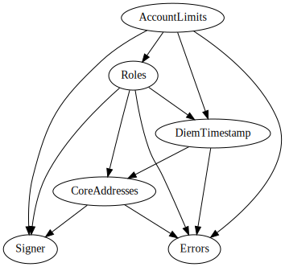
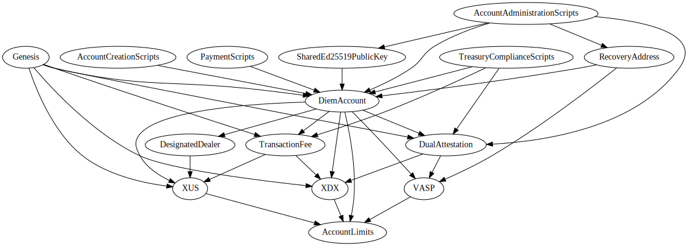
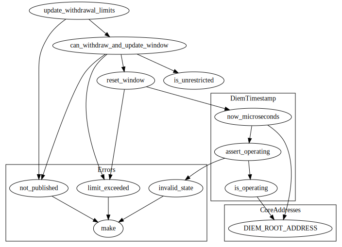
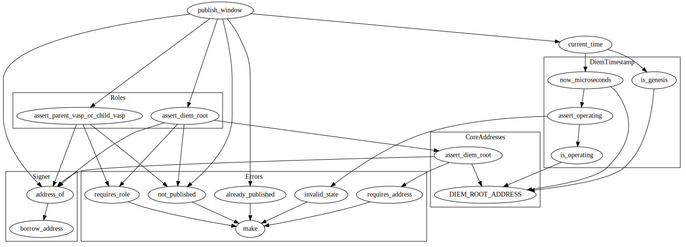
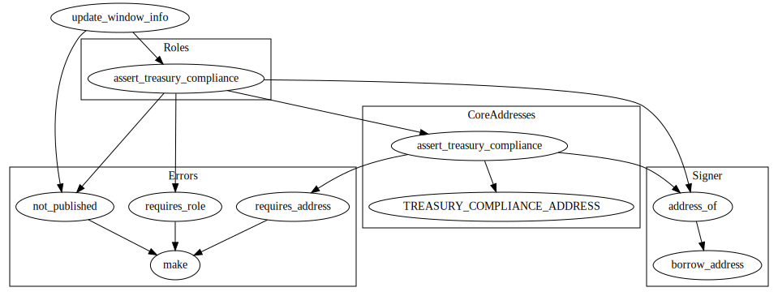
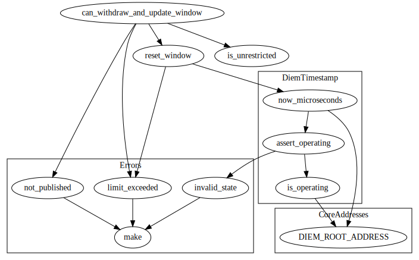
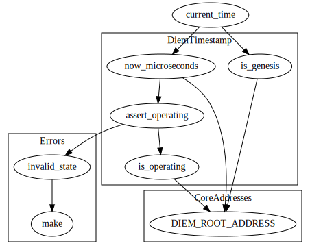

# Module `0x1::AccountLimits`

Module which manages account limits, like the amount of currency which can flow in or out over
a given time period.

-  [Resource `AccountLimitMutationCapability`](#0x1_AccountLimits_AccountLimitMutationCapability)
-  [Resource `LimitsDefinition`](#0x1_AccountLimits_LimitsDefinition)
-  [Resource `Window`](#0x1_AccountLimits_Window)
-  [Constants](#@Constants_0)
-  [Function `grant_mutation_capability`](#0x1_AccountLimits_grant_mutation_capability)
-  [Function `update_deposit_limits`](#0x1_AccountLimits_update_deposit_limits)
-  [Function `update_withdrawal_limits`](#0x1_AccountLimits_update_withdrawal_limits)
-  [Function `publish_window`](#0x1_AccountLimits_publish_window)
-  [Function `publish_unrestricted_limits`](#0x1_AccountLimits_publish_unrestricted_limits)
-  [Function `update_limits_definition`](#0x1_AccountLimits_update_limits_definition)
-  [Function `update_window_info`](#0x1_AccountLimits_update_window_info)
-  [Function `reset_window`](#0x1_AccountLimits_reset_window)
-  [Function `can_receive_and_update_window`](#0x1_AccountLimits_can_receive_and_update_window)
-  [Function `can_withdraw_and_update_window`](#0x1_AccountLimits_can_withdraw_and_update_window)
-  [Function `is_unrestricted`](#0x1_AccountLimits_is_unrestricted)
-  [Function `limits_definition_address`](#0x1_AccountLimits_limits_definition_address)
-  [Function `has_limits_published`](#0x1_AccountLimits_has_limits_published)
-  [Function `has_window_published`](#0x1_AccountLimits_has_window_published)
-  [Function `current_time`](#0x1_AccountLimits_current_time)
-  [Module Specification](#@Module_Specification_1)

<pre><code><b>use</b> <a href="DiemTimestamp.md#0x1_DiemTimestamp">0x1::DiemTimestamp</a>;
<b>use</b> <a href="../../../move-stdlib/docs/Errors.md#0x1_Errors">0x1::Errors</a>;
<b>use</b> <a href="Roles.md#0x1_Roles">0x1::Roles</a>;
<b>use</b> <a href="../../../move-stdlib/docs/Signer.md#0x1_Signer">0x1::Signer</a>;
</code></pre>

Show all the modules that "AccountLimits" depends on directly or indirectly

Show all the modules that depend on "AccountLimits" directly or indirectly

## Resource `AccountLimitMutationCapability`

An operations capability that restricts callers of this module since
the operations can mutate account states.

<pre><code><b>resource</b> <b>struct</b> <a href="AccountLimits.md#0x1_AccountLimits_AccountLimitMutationCapability">AccountLimitMutationCapability</a>
</code></pre>

Fields

<dl>
<dt>
<code>dummy_field: bool</code>
</dt>
<dd>

</dd>
</dl>

## Resource `LimitsDefinition`

A resource specifying the account limits per-currency. There is a default
"unlimited" <code><a href="AccountLimits.md#0x1_AccountLimits_LimitsDefinition">LimitsDefinition</a></code> resource for accounts published at
<code><a href="CoreAddresses.md#0x1_CoreAddresses_DIEM_ROOT_ADDRESS">CoreAddresses::DIEM_ROOT_ADDRESS</a>()</code>, but other accounts may have
different account limit definitons. In such cases, they will have a
<code><a href="AccountLimits.md#0x1_AccountLimits_LimitsDefinition">LimitsDefinition</a></code> published under their (root) account.

<pre><code><b>resource</b> <b>struct</b> <a href="AccountLimits.md#0x1_AccountLimits_LimitsDefinition">LimitsDefinition</a>&lt;CoinType&gt;
</code></pre>

Fields

<dl>
<dt>
<code>max_inflow: u64</code>
</dt>
<dd>
 The maximum inflow allowed during the specified time period.
</dd>
<dt>
<code>max_outflow: u64</code>
</dt>
<dd>
 The maximum outflow allowed during the specified time period.
</dd>
<dt>
<code>time_period: u64</code>
</dt>
<dd>
 Time period, specified in microseconds
</dd>
<dt>
<code>max_holding: u64</code>
</dt>
<dd>
 The maximum amount that can be held
</dd>
</dl>

Specification

<pre><code><b>invariant</b> max_inflow &gt; 0;
<b>invariant</b> max_outflow &gt; 0;
<b>invariant</b> time_period &gt; 0;
<b>invariant</b> max_holding &gt; 0;
</code></pre>

## Resource `Window`

A struct holding account transaction information for the time window
starting at <code>window_start</code> and lasting for the <code>time_period</code> specified
in the limits definition at <code>limit_address</code>.

<pre><code><b>resource</b> <b>struct</b> <a href="AccountLimits.md#0x1_AccountLimits_Window">Window</a>&lt;CoinType&gt;
</code></pre>

Fields

<dl>
<dt>
<code>window_start: u64</code>
</dt>
<dd>
 Time window start in microseconds
</dd>
<dt>
<code>window_inflow: u64</code>
</dt>
<dd>
 The inflow during this time window
</dd>
<dt>
<code>window_outflow: u64</code>
</dt>
<dd>
 The inflow during this time window
</dd>
<dt>
<code>tracked_balance: u64</code>
</dt>
<dd>
 The balance that this account has held during this time period.
</dd>
<dt>
<code>limit_address: address</code>
</dt>
<dd>
 address storing the LimitsDefinition resource that governs this window
</dd>
</dl>

## Constants

<pre><code><b>const</b> <a href="AccountLimits.md#0x1_AccountLimits_MAX_U64">MAX_U64</a>: u64 = 18446744073709551615;
</code></pre>

The <code><a href="AccountLimits.md#0x1_AccountLimits_LimitsDefinition">LimitsDefinition</a></code> resource is in an invalid state

<pre><code><b>const</b> <a href="AccountLimits.md#0x1_AccountLimits_ELIMITS_DEFINITION">ELIMITS_DEFINITION</a>: u64 = 0;
</code></pre>

The <code><a href="AccountLimits.md#0x1_AccountLimits_Window">Window</a></code> resource is in an invalid state

<pre><code><b>const</b> <a href="AccountLimits.md#0x1_AccountLimits_EWINDOW">EWINDOW</a>: u64 = 1;
</code></pre>

24 hours in microseconds

<pre><code><b>const</b> <a href="AccountLimits.md#0x1_AccountLimits_ONE_DAY">ONE_DAY</a>: u64 = 86400000000;
</code></pre>

## Function `grant_mutation_capability`

Grant a capability to call this module. This does not necessarily
need to be a unique capability.

<pre><code><b>public</b> <b>fun</b> <a href="AccountLimits.md#0x1_AccountLimits_grant_mutation_capability">grant_mutation_capability</a>(dr_account: &signer): <a href="AccountLimits.md#0x1_AccountLimits_AccountLimitMutationCapability">AccountLimits::AccountLimitMutationCapability</a>
</code></pre>

Implementation

<pre><code><b>public</b> <b>fun</b> <a href="AccountLimits.md#0x1_AccountLimits_grant_mutation_capability">grant_mutation_capability</a>(dr_account: &signer): <a href="AccountLimits.md#0x1_AccountLimits_AccountLimitMutationCapability">AccountLimitMutationCapability</a> {
    <a href="DiemTimestamp.md#0x1_DiemTimestamp_assert_genesis">DiemTimestamp::assert_genesis</a>();
    <a href="Roles.md#0x1_Roles_assert_diem_root">Roles::assert_diem_root</a>(dr_account);
    <a href="AccountLimits.md#0x1_AccountLimits_AccountLimitMutationCapability">AccountLimitMutationCapability</a>{}
}
</code></pre>

Specification

<pre><code><b>include</b> <a href="DiemTimestamp.md#0x1_DiemTimestamp_AbortsIfNotGenesis">DiemTimestamp::AbortsIfNotGenesis</a>;
<b>include</b> <a href="Roles.md#0x1_Roles_AbortsIfNotDiemRoot">Roles::AbortsIfNotDiemRoot</a>{account: dr_account};
</code></pre>

Show all the functions that "grant_mutation_capability" calls

## Function `update_deposit_limits`

Determines if depositing <code>amount</code> of <code>CoinType</code> coins into the
account at <code>addr</code> is amenable with their account limits.
Returns false if this deposit violates the account limits.

<pre><code><b>public</b> <b>fun</b> <a href="AccountLimits.md#0x1_AccountLimits_update_deposit_limits">update_deposit_limits</a>&lt;CoinType&gt;(amount: u64, addr: address, _cap: &<a href="AccountLimits.md#0x1_AccountLimits_AccountLimitMutationCapability">AccountLimits::AccountLimitMutationCapability</a>): bool
</code></pre>

Implementation

<pre><code><b>public</b> <b>fun</b> <a href="AccountLimits.md#0x1_AccountLimits_update_deposit_limits">update_deposit_limits</a>&lt;CoinType: store&gt;(
    amount: u64,
    addr: address,
    _cap: &<a href="AccountLimits.md#0x1_AccountLimits_AccountLimitMutationCapability">AccountLimitMutationCapability</a>,
): bool <b>acquires</b> <a href="AccountLimits.md#0x1_AccountLimits_LimitsDefinition">LimitsDefinition</a>, <a href="AccountLimits.md#0x1_AccountLimits_Window">Window</a> {
    <b>assert</b>(<b>exists</b>&lt;<a href="AccountLimits.md#0x1_AccountLimits_Window">Window</a>&lt;CoinType&gt;&gt;(addr), <a href="../../../move-stdlib/docs/Errors.md#0x1_Errors_not_published">Errors::not_published</a>(<a href="AccountLimits.md#0x1_AccountLimits_EWINDOW">EWINDOW</a>));
    <a href="AccountLimits.md#0x1_AccountLimits_can_receive_and_update_window">can_receive_and_update_window</a>&lt;CoinType&gt;(
        amount,
        borrow_global_mut&lt;<a href="AccountLimits.md#0x1_AccountLimits_Window">Window</a>&lt;CoinType&gt;&gt;(addr),
    )
}
</code></pre>

Specification

<pre><code><b>pragma</b> opaque;
<b>modifies</b> <b>global</b>&lt;<a href="AccountLimits.md#0x1_AccountLimits_Window">Window</a>&lt;CoinType&gt;&gt;(addr);
<b>include</b> <a href="AccountLimits.md#0x1_AccountLimits_UpdateDepositLimitsAbortsIf">UpdateDepositLimitsAbortsIf</a>&lt;CoinType&gt;;
<b>include</b> <a href="AccountLimits.md#0x1_AccountLimits_CanReceiveEnsures">CanReceiveEnsures</a>&lt;CoinType&gt;{receiving: <b>global</b>&lt;<a href="AccountLimits.md#0x1_AccountLimits_Window">Window</a>&lt;CoinType&gt;&gt;(addr)};
</code></pre>

<pre><code><b>schema</b> <a href="AccountLimits.md#0x1_AccountLimits_UpdateDepositLimitsAbortsIf">UpdateDepositLimitsAbortsIf</a>&lt;CoinType&gt; {
    amount: u64;
    addr: address;
    <b>include</b> <a href="AccountLimits.md#0x1_AccountLimits_AbortsIfNoWindow">AbortsIfNoWindow</a>&lt;CoinType&gt;;
    <b>include</b> <a href="AccountLimits.md#0x1_AccountLimits_CanReceiveAbortsIf">CanReceiveAbortsIf</a>&lt;CoinType&gt;{receiving: <b>global</b>&lt;<a href="AccountLimits.md#0x1_AccountLimits_Window">Window</a>&lt;CoinType&gt;&gt;(addr)};
}
</code></pre>

<pre><code><b>schema</b> <a href="AccountLimits.md#0x1_AccountLimits_AbortsIfNoWindow">AbortsIfNoWindow</a>&lt;CoinType&gt; {
    addr: address;
    <b>aborts_if</b> !<b>exists</b>&lt;<a href="AccountLimits.md#0x1_AccountLimits_Window">Window</a>&lt;CoinType&gt;&gt;(addr) <b>with</b> <a href="../../../move-stdlib/docs/Errors.md#0x1_Errors_NOT_PUBLISHED">Errors::NOT_PUBLISHED</a>;
}
</code></pre>

<pre><code><b>define</b> <a href="AccountLimits.md#0x1_AccountLimits_spec_update_deposit_limits">spec_update_deposit_limits</a>&lt;CoinType&gt;(amount: u64, addr: address): bool {
   <a href="AccountLimits.md#0x1_AccountLimits_spec_receiving_limits_ok">spec_receiving_limits_ok</a>(<b>global</b>&lt;<a href="AccountLimits.md#0x1_AccountLimits_Window">Window</a>&lt;CoinType&gt;&gt;(addr), amount)
}
</code></pre>

Show all the functions that "update_deposit_limits" calls

## Function `update_withdrawal_limits`

Determine if withdrawing <code>amount</code> of <code>CoinType</code> coins from
the account at <code>addr</code> would violate the account limits for that account.
Returns <code><b>false</b></code> if this withdrawal violates account limits.

<pre><code><b>public</b> <b>fun</b> <a href="AccountLimits.md#0x1_AccountLimits_update_withdrawal_limits">update_withdrawal_limits</a>&lt;CoinType&gt;(amount: u64, addr: address, _cap: &<a href="AccountLimits.md#0x1_AccountLimits_AccountLimitMutationCapability">AccountLimits::AccountLimitMutationCapability</a>): bool
</code></pre>

Implementation

<pre><code><b>public</b> <b>fun</b> <a href="AccountLimits.md#0x1_AccountLimits_update_withdrawal_limits">update_withdrawal_limits</a>&lt;CoinType: store&gt;(
    amount: u64,
    addr: address,
    _cap: &<a href="AccountLimits.md#0x1_AccountLimits_AccountLimitMutationCapability">AccountLimitMutationCapability</a>,
): bool <b>acquires</b> <a href="AccountLimits.md#0x1_AccountLimits_LimitsDefinition">LimitsDefinition</a>, <a href="AccountLimits.md#0x1_AccountLimits_Window">Window</a> {
    <b>assert</b>(<b>exists</b>&lt;<a href="AccountLimits.md#0x1_AccountLimits_Window">Window</a>&lt;CoinType&gt;&gt;(addr), <a href="../../../move-stdlib/docs/Errors.md#0x1_Errors_not_published">Errors::not_published</a>(<a href="AccountLimits.md#0x1_AccountLimits_EWINDOW">EWINDOW</a>));
    <a href="AccountLimits.md#0x1_AccountLimits_can_withdraw_and_update_window">can_withdraw_and_update_window</a>&lt;CoinType&gt;(
        amount,
        borrow_global_mut&lt;<a href="AccountLimits.md#0x1_AccountLimits_Window">Window</a>&lt;CoinType&gt;&gt;(addr),
    )
}
</code></pre>

Specification

<pre><code><b>pragma</b> opaque;
<b>modifies</b> <b>global</b>&lt;<a href="AccountLimits.md#0x1_AccountLimits_Window">Window</a>&lt;CoinType&gt;&gt;(addr);
<b>include</b> <a href="AccountLimits.md#0x1_AccountLimits_UpdateWithdrawalLimitsAbortsIf">UpdateWithdrawalLimitsAbortsIf</a>&lt;CoinType&gt;;
<b>include</b> <a href="AccountLimits.md#0x1_AccountLimits_CanWithdrawEnsures">CanWithdrawEnsures</a>&lt;CoinType&gt;{sending: <b>global</b>&lt;<a href="AccountLimits.md#0x1_AccountLimits_Window">Window</a>&lt;CoinType&gt;&gt;(addr)};
</code></pre>

<pre><code><b>schema</b> <a href="AccountLimits.md#0x1_AccountLimits_UpdateWithdrawalLimitsAbortsIf">UpdateWithdrawalLimitsAbortsIf</a>&lt;CoinType&gt; {
    amount: u64;
    addr: address;
    <b>include</b> <a href="AccountLimits.md#0x1_AccountLimits_AbortsIfNoWindow">AbortsIfNoWindow</a>&lt;CoinType&gt;;
    <b>include</b> <a href="AccountLimits.md#0x1_AccountLimits_CanWithdrawAbortsIf">CanWithdrawAbortsIf</a>&lt;CoinType&gt;{sending: <b>global</b>&lt;<a href="AccountLimits.md#0x1_AccountLimits_Window">Window</a>&lt;CoinType&gt;&gt;(addr)};
}
</code></pre>

<pre><code><b>define</b> <a href="AccountLimits.md#0x1_AccountLimits_spec_update_withdrawal_limits">spec_update_withdrawal_limits</a>&lt;CoinType&gt;(amount: u64, addr: address): bool {
   <a href="AccountLimits.md#0x1_AccountLimits_spec_withdrawal_limits_ok">spec_withdrawal_limits_ok</a>(<b>global</b>&lt;<a href="AccountLimits.md#0x1_AccountLimits_Window">Window</a>&lt;CoinType&gt;&gt;(addr), amount)
}
</code></pre>

Show all the functions that "update_withdrawal_limits" calls

## Function `publish_window`

All accounts that could be subject to account limits will have a
<code><a href="AccountLimits.md#0x1_AccountLimits_Window">Window</a></code> for each currency they can hold published at the top level.
Root accounts for multi-account entities will hold this resource at
their root/parent account.

<pre><code><b>public</b> <b>fun</b> <a href="AccountLimits.md#0x1_AccountLimits_publish_window">publish_window</a>&lt;CoinType&gt;(dr_account: &signer, to_limit: &signer, limit_address: address)
</code></pre>

Implementation

<pre><code><b>public</b> <b>fun</b> <a href="AccountLimits.md#0x1_AccountLimits_publish_window">publish_window</a>&lt;CoinType: store&gt;(
    dr_account: &signer,
    to_limit: &signer,
    limit_address: address,
) {
    <a href="Roles.md#0x1_Roles_assert_diem_root">Roles::assert_diem_root</a>(dr_account);
    <b>assert</b>(<b>exists</b>&lt;<a href="AccountLimits.md#0x1_AccountLimits_LimitsDefinition">LimitsDefinition</a>&lt;CoinType&gt;&gt;(limit_address), <a href="../../../move-stdlib/docs/Errors.md#0x1_Errors_not_published">Errors::not_published</a>(<a href="AccountLimits.md#0x1_AccountLimits_ELIMITS_DEFINITION">ELIMITS_DEFINITION</a>));
    <a href="Roles.md#0x1_Roles_assert_parent_vasp_or_child_vasp">Roles::assert_parent_vasp_or_child_vasp</a>(to_limit);
    <b>assert</b>(
        !<b>exists</b>&lt;<a href="AccountLimits.md#0x1_AccountLimits_Window">Window</a>&lt;CoinType&gt;&gt;(<a href="../../../move-stdlib/docs/Signer.md#0x1_Signer_address_of">Signer::address_of</a>(to_limit)),
        <a href="../../../move-stdlib/docs/Errors.md#0x1_Errors_already_published">Errors::already_published</a>(<a href="AccountLimits.md#0x1_AccountLimits_EWINDOW">EWINDOW</a>)
    );
    move_to(
        to_limit,
        <a href="AccountLimits.md#0x1_AccountLimits_Window">Window</a>&lt;CoinType&gt; {
            window_start: <a href="AccountLimits.md#0x1_AccountLimits_current_time">current_time</a>(),
            window_inflow: 0,
            window_outflow: 0,
            tracked_balance: 0,
            limit_address,
        }
    )
}
</code></pre>

Specification

<pre><code><b>include</b> <a href="AccountLimits.md#0x1_AccountLimits_PublishWindowAbortsIf">PublishWindowAbortsIf</a>&lt;CoinType&gt;;
</code></pre>

<pre><code><b>schema</b> <a href="AccountLimits.md#0x1_AccountLimits_PublishWindowAbortsIf">PublishWindowAbortsIf</a>&lt;CoinType&gt; {
    dr_account: signer;
    to_limit: signer;
    limit_address: address;
}
</code></pre>

Only ParentVASP and ChildVASP can have the account limits [[E1]][ROLE][[E2]][ROLE][[E3]][ROLE][[E4]][ROLE][[E5]][ROLE][[E6]][ROLE][[E7]][ROLE].

<pre><code><b>schema</b> <a href="AccountLimits.md#0x1_AccountLimits_PublishWindowAbortsIf">PublishWindowAbortsIf</a>&lt;CoinType&gt; {
    <b>include</b> <a href="Roles.md#0x1_Roles_AbortsIfNotParentVaspOrChildVasp">Roles::AbortsIfNotParentVaspOrChildVasp</a>{account: to_limit};
    <b>include</b> <a href="Roles.md#0x1_Roles_AbortsIfNotDiemRoot">Roles::AbortsIfNotDiemRoot</a>{account: dr_account};
    <b>aborts_if</b> !<b>exists</b>&lt;<a href="AccountLimits.md#0x1_AccountLimits_LimitsDefinition">LimitsDefinition</a>&lt;CoinType&gt;&gt;(limit_address) <b>with</b> <a href="../../../move-stdlib/docs/Errors.md#0x1_Errors_NOT_PUBLISHED">Errors::NOT_PUBLISHED</a>;
    <b>aborts_if</b> <b>exists</b>&lt;<a href="AccountLimits.md#0x1_AccountLimits_Window">Window</a>&lt;CoinType&gt;&gt;(<a href="../../../move-stdlib/docs/Signer.md#0x1_Signer_spec_address_of">Signer::spec_address_of</a>(to_limit)) <b>with</b> <a href="../../../move-stdlib/docs/Errors.md#0x1_Errors_ALREADY_PUBLISHED">Errors::ALREADY_PUBLISHED</a>;
}
</code></pre>

Show all the functions that "publish_window" calls

## Function `publish_unrestricted_limits`

Unrestricted limits are represented by setting all fields in the
limits definition to <code><a href="AccountLimits.md#0x1_AccountLimits_MAX_U64">MAX_U64</a></code>. Anyone can publish an unrestricted
limits since no windows will point to this limits definition unless the
TC account, or a caller with access to a <code>&<a href="AccountLimits.md#0x1_AccountLimits_AccountLimitMutationCapability">AccountLimitMutationCapability</a></code> points a
window to it. Additionally, the TC controls the values held within this
resource once it's published.

<pre><code><b>public</b> <b>fun</b> <a href="AccountLimits.md#0x1_AccountLimits_publish_unrestricted_limits">publish_unrestricted_limits</a>&lt;CoinType&gt;(publish_account: &signer)
</code></pre>

Implementation

<pre><code><b>public</b> <b>fun</b> <a href="AccountLimits.md#0x1_AccountLimits_publish_unrestricted_limits">publish_unrestricted_limits</a>&lt;CoinType: store&gt;(publish_account: &signer) {
    <b>assert</b>(
        !<b>exists</b>&lt;<a href="AccountLimits.md#0x1_AccountLimits_LimitsDefinition">LimitsDefinition</a>&lt;CoinType&gt;&gt;(<a href="../../../move-stdlib/docs/Signer.md#0x1_Signer_address_of">Signer::address_of</a>(publish_account)),
        <a href="../../../move-stdlib/docs/Errors.md#0x1_Errors_already_published">Errors::already_published</a>(<a href="AccountLimits.md#0x1_AccountLimits_ELIMITS_DEFINITION">ELIMITS_DEFINITION</a>)
    );
    move_to(
        publish_account,
        <a href="AccountLimits.md#0x1_AccountLimits_LimitsDefinition">LimitsDefinition</a>&lt;CoinType&gt; {
            max_inflow: <a href="AccountLimits.md#0x1_AccountLimits_MAX_U64">MAX_U64</a>,
            max_outflow: <a href="AccountLimits.md#0x1_AccountLimits_MAX_U64">MAX_U64</a>,
            max_holding: <a href="AccountLimits.md#0x1_AccountLimits_MAX_U64">MAX_U64</a>,
            time_period: <a href="AccountLimits.md#0x1_AccountLimits_ONE_DAY">ONE_DAY</a>,
        }
    )
}
</code></pre>

Specification

TODO: turned off verification until we solve the
generic type/specific invariant issue. Similar to
in DiemConfig, this function violates an invariant in
XUS about LimitsDefinition<XUS>.

<pre><code><b>pragma</b> verify = <b>false</b>;
<b>include</b> <a href="AccountLimits.md#0x1_AccountLimits_PublishUnrestrictedLimitsAbortsIf">PublishUnrestrictedLimitsAbortsIf</a>&lt;CoinType&gt;;
</code></pre>

<pre><code><b>schema</b> <a href="AccountLimits.md#0x1_AccountLimits_PublishUnrestrictedLimitsAbortsIf">PublishUnrestrictedLimitsAbortsIf</a>&lt;CoinType&gt; {
    publish_account: signer;
    <b>aborts_if</b> <b>exists</b>&lt;<a href="AccountLimits.md#0x1_AccountLimits_LimitsDefinition">LimitsDefinition</a>&lt;CoinType&gt;&gt;(<a href="../../../move-stdlib/docs/Signer.md#0x1_Signer_spec_address_of">Signer::spec_address_of</a>(publish_account))
        <b>with</b> <a href="../../../move-stdlib/docs/Errors.md#0x1_Errors_ALREADY_PUBLISHED">Errors::ALREADY_PUBLISHED</a>;
}
</code></pre>

<pre><code><b>schema</b> <a href="AccountLimits.md#0x1_AccountLimits_PublishUnrestrictedLimitsEnsures">PublishUnrestrictedLimitsEnsures</a>&lt;CoinType&gt; {
    publish_account: signer;
    <b>ensures</b> <b>exists</b>&lt;<a href="AccountLimits.md#0x1_AccountLimits_LimitsDefinition">LimitsDefinition</a>&lt;CoinType&gt;&gt;(<a href="../../../move-stdlib/docs/Signer.md#0x1_Signer_spec_address_of">Signer::spec_address_of</a>(publish_account));
}
</code></pre>

Show all the functions that "publish_unrestricted_limits" calls

## Function `update_limits_definition`

Updates the <code><a href="AccountLimits.md#0x1_AccountLimits_LimitsDefinition">LimitsDefinition</a>&lt;CoinType&gt;</code> resource at <code>limit_address</code>.
If any of the field arguments is <code>0</code> the corresponding field is not updated.

TODO: This should be specified.

<pre><code><b>public</b> <b>fun</b> <a href="AccountLimits.md#0x1_AccountLimits_update_limits_definition">update_limits_definition</a>&lt;CoinType&gt;(tc_account: &signer, limit_address: address, new_max_inflow: u64, new_max_outflow: u64, new_max_holding_balance: u64, new_time_period: u64)
</code></pre>

Implementation

<pre><code><b>public</b> <b>fun</b> <a href="AccountLimits.md#0x1_AccountLimits_update_limits_definition">update_limits_definition</a>&lt;CoinType: store&gt;(
    tc_account: &signer,
    limit_address: address,
    new_max_inflow: u64,
    new_max_outflow: u64,
    new_max_holding_balance: u64,
    new_time_period: u64,
) <b>acquires</b> <a href="AccountLimits.md#0x1_AccountLimits_LimitsDefinition">LimitsDefinition</a> {
    <a href="Roles.md#0x1_Roles_assert_treasury_compliance">Roles::assert_treasury_compliance</a>(tc_account);
    // As we don't have Optionals for txn scripts, in update_account_limit_definition.<b>move</b>
    // we <b>use</b> 0 value <b>to</b> represent a None (ie no <b>update</b> <b>to</b> that variable)
    <b>assert</b>(<b>exists</b>&lt;<a href="AccountLimits.md#0x1_AccountLimits_LimitsDefinition">LimitsDefinition</a>&lt;CoinType&gt;&gt;(limit_address), <a href="../../../move-stdlib/docs/Errors.md#0x1_Errors_not_published">Errors::not_published</a>(<a href="AccountLimits.md#0x1_AccountLimits_ELIMITS_DEFINITION">ELIMITS_DEFINITION</a>));
    <b>let</b> limits_def = borrow_global_mut&lt;<a href="AccountLimits.md#0x1_AccountLimits_LimitsDefinition">LimitsDefinition</a>&lt;CoinType&gt;&gt;(limit_address);
    <b>if</b> (new_max_inflow &gt; 0) { limits_def.max_inflow = new_max_inflow };
    <b>if</b> (new_max_outflow &gt; 0) { limits_def.max_outflow = new_max_outflow };
    <b>if</b> (new_max_holding_balance &gt; 0) { limits_def.max_holding = new_max_holding_balance };
    <b>if</b> (new_time_period &gt; 0) { limits_def.time_period = new_time_period };
}
</code></pre>

Show all the functions that "update_limits_definition" calls

## Function `update_window_info`

Update either the <code>tracked_balance</code> or <code>limit_address</code> fields of the
<code><a href="AccountLimits.md#0x1_AccountLimits_Window">Window</a>&lt;CoinType&gt;</code> stored under <code>window_address</code>.
* Since we don't track balances of accounts before they are limited, once
they do become limited the approximate balance in <code>CoinType</code> held by
the entity across all of its accounts will need to be set by the association.
if <code>aggregate_balance</code> is set to zero the field is not updated.
* This updates the <code>limit_address</code> in the window resource to a new limits definition at
<code>new_limit_address</code>. If the <code>aggregate_balance</code> needs to be updated
but the <code>limit_address</code> should remain the same, the current
<code>limit_address</code> needs to be passed in for <code>new_limit_address</code>.
TODO(wrwg): specify

<pre><code><b>public</b> <b>fun</b> <a href="AccountLimits.md#0x1_AccountLimits_update_window_info">update_window_info</a>&lt;CoinType&gt;(tc_account: &signer, window_address: address, aggregate_balance: u64, new_limit_address: address)
</code></pre>

Implementation

<pre><code><b>public</b> <b>fun</b> <a href="AccountLimits.md#0x1_AccountLimits_update_window_info">update_window_info</a>&lt;CoinType: store&gt;(
    tc_account: &signer,
    window_address: address,
    aggregate_balance: u64,
    new_limit_address: address,
) <b>acquires</b> <a href="AccountLimits.md#0x1_AccountLimits_Window">Window</a> {
    <a href="Roles.md#0x1_Roles_assert_treasury_compliance">Roles::assert_treasury_compliance</a>(tc_account);
    <b>let</b> window = borrow_global_mut&lt;<a href="AccountLimits.md#0x1_AccountLimits_Window">Window</a>&lt;CoinType&gt;&gt;(window_address);
    <b>if</b> (aggregate_balance != 0)  { window.tracked_balance = aggregate_balance };
    <b>assert</b>(<b>exists</b>&lt;<a href="AccountLimits.md#0x1_AccountLimits_LimitsDefinition">LimitsDefinition</a>&lt;CoinType&gt;&gt;(new_limit_address), <a href="../../../move-stdlib/docs/Errors.md#0x1_Errors_not_published">Errors::not_published</a>(<a href="AccountLimits.md#0x1_AccountLimits_ELIMITS_DEFINITION">ELIMITS_DEFINITION</a>));
    window.limit_address = new_limit_address;
}
</code></pre>

Show all the functions that "update_window_info" calls

## Function `reset_window`

If the time window starting at <code>window.window_start</code> and lasting for
<code>limits_definition.time_period</code> has elapsed, resets the window and
the inflow and outflow records.

<pre><code><b>fun</b> <a href="AccountLimits.md#0x1_AccountLimits_reset_window">reset_window</a>&lt;CoinType&gt;(window: &<b>mut</b> <a href="AccountLimits.md#0x1_AccountLimits_Window">AccountLimits::Window</a>&lt;CoinType&gt;, limits_definition: &<a href="AccountLimits.md#0x1_AccountLimits_LimitsDefinition">AccountLimits::LimitsDefinition</a>&lt;CoinType&gt;)
</code></pre>

Implementation

<pre><code><b>fun</b> <a href="AccountLimits.md#0x1_AccountLimits_reset_window">reset_window</a>&lt;CoinType: store&gt;(window: &<b>mut</b> <a href="AccountLimits.md#0x1_AccountLimits_Window">Window</a>&lt;CoinType&gt;, limits_definition: &<a href="AccountLimits.md#0x1_AccountLimits_LimitsDefinition">LimitsDefinition</a>&lt;CoinType&gt;) {
    <b>let</b> current_time = <a href="DiemTimestamp.md#0x1_DiemTimestamp_now_microseconds">DiemTimestamp::now_microseconds</a>();
    <b>assert</b>(window.window_start &lt;= <a href="AccountLimits.md#0x1_AccountLimits_MAX_U64">MAX_U64</a> - limits_definition.time_period, <a href="../../../move-stdlib/docs/Errors.md#0x1_Errors_limit_exceeded">Errors::limit_exceeded</a>(<a href="AccountLimits.md#0x1_AccountLimits_EWINDOW">EWINDOW</a>));
    <b>if</b> (current_time &gt; window.window_start + limits_definition.time_period) {
        window.window_start = current_time;
        window.window_inflow = 0;
        window.window_outflow = 0;
    }
}
</code></pre>

Specification

<pre><code><b>pragma</b> opaque;
<b>include</b> <a href="AccountLimits.md#0x1_AccountLimits_ResetWindowAbortsIf">ResetWindowAbortsIf</a>&lt;CoinType&gt;;
<b>include</b> <a href="AccountLimits.md#0x1_AccountLimits_ResetWindowEnsures">ResetWindowEnsures</a>&lt;CoinType&gt;;
</code></pre>

<pre><code><b>schema</b> <a href="AccountLimits.md#0x1_AccountLimits_ResetWindowAbortsIf">ResetWindowAbortsIf</a>&lt;CoinType&gt; {
    window: <a href="AccountLimits.md#0x1_AccountLimits_Window">Window</a>&lt;CoinType&gt;;
    limits_definition: <a href="AccountLimits.md#0x1_AccountLimits_LimitsDefinition">LimitsDefinition</a>&lt;CoinType&gt;;
    <b>include</b> <a href="DiemTimestamp.md#0x1_DiemTimestamp_AbortsIfNotOperating">DiemTimestamp::AbortsIfNotOperating</a>;
    <b>aborts_if</b> window.window_start + limits_definition.time_period &gt; max_u64() <b>with</b> <a href="../../../move-stdlib/docs/Errors.md#0x1_Errors_LIMIT_EXCEEDED">Errors::LIMIT_EXCEEDED</a>;
}
</code></pre>

<pre><code><b>schema</b> <a href="AccountLimits.md#0x1_AccountLimits_ResetWindowEnsures">ResetWindowEnsures</a>&lt;CoinType&gt; {
    window: <a href="AccountLimits.md#0x1_AccountLimits_Window">Window</a>&lt;CoinType&gt;;
    limits_definition: <a href="AccountLimits.md#0x1_AccountLimits_LimitsDefinition">LimitsDefinition</a>&lt;CoinType&gt;;
    <b>ensures</b> window == <b>old</b>(<a href="AccountLimits.md#0x1_AccountLimits_spec_window_reset_with_limits">spec_window_reset_with_limits</a>(window, limits_definition));
}
</code></pre>

<pre><code><b>define</b> <a href="AccountLimits.md#0x1_AccountLimits_spec_window_expired">spec_window_expired</a>&lt;CoinType&gt;(
    window: <a href="AccountLimits.md#0x1_AccountLimits_Window">Window</a>&lt;CoinType&gt;,
    limits_definition: <a href="AccountLimits.md#0x1_AccountLimits_LimitsDefinition">LimitsDefinition</a>&lt;CoinType&gt;
): bool {
    <a href="DiemTimestamp.md#0x1_DiemTimestamp_spec_now_microseconds">DiemTimestamp::spec_now_microseconds</a>() &gt; window.window_start + limits_definition.time_period
}

<b>define</b> <a href="AccountLimits.md#0x1_AccountLimits_spec_window_reset_with_limits">spec_window_reset_with_limits</a>&lt;CoinType&gt;(
    window: <a href="AccountLimits.md#0x1_AccountLimits_Window">Window</a>&lt;CoinType&gt;,
    limits_definition: <a href="AccountLimits.md#0x1_AccountLimits_LimitsDefinition">LimitsDefinition</a>&lt;CoinType&gt;
): <a href="AccountLimits.md#0x1_AccountLimits_Window">Window</a>&lt;CoinType&gt; {
    <b>if</b> (<a href="AccountLimits.md#0x1_AccountLimits_spec_window_expired">spec_window_expired</a>&lt;CoinType&gt;(window, limits_definition)) {
        <a href="AccountLimits.md#0x1_AccountLimits_Window">Window</a>&lt;CoinType&gt;{
            limit_address: window.limit_address,
            tracked_balance: window.tracked_balance,
            window_start: <a href="DiemTimestamp.md#0x1_DiemTimestamp_spec_now_microseconds">DiemTimestamp::spec_now_microseconds</a>(),
            window_inflow: 0,
            window_outflow: 0
        }
    } <b>else</b> {
        window
    }
}
</code></pre>

Show all the functions that "reset_window" calls

## Function `can_receive_and_update_window`

Verify that the receiving account tracked by the <code>receiving</code> window
can receive <code>amount</code> funds without violating requirements
specified the <code>limits_definition</code> passed in.
If the receipt of <code>amount</code> doesn't violate the limits <code>amount</code> of
<code>CoinType</code> is recorded as received in the given <code>receiving</code> window.

<pre><code><b>fun</b> <a href="AccountLimits.md#0x1_AccountLimits_can_receive_and_update_window">can_receive_and_update_window</a>&lt;CoinType&gt;(amount: u64, receiving: &<b>mut</b> <a href="AccountLimits.md#0x1_AccountLimits_Window">AccountLimits::Window</a>&lt;CoinType&gt;): bool
</code></pre>

Implementation

<pre><code><b>fun</b> <a href="AccountLimits.md#0x1_AccountLimits_can_receive_and_update_window">can_receive_and_update_window</a>&lt;CoinType: store&gt;(
    amount: u64,
    receiving: &<b>mut</b> <a href="AccountLimits.md#0x1_AccountLimits_Window">Window</a>&lt;CoinType&gt;,
): bool <b>acquires</b> <a href="AccountLimits.md#0x1_AccountLimits_LimitsDefinition">LimitsDefinition</a> {
    <b>assert</b>(<b>exists</b>&lt;<a href="AccountLimits.md#0x1_AccountLimits_LimitsDefinition">LimitsDefinition</a>&lt;CoinType&gt;&gt;(receiving.limit_address), <a href="../../../move-stdlib/docs/Errors.md#0x1_Errors_not_published">Errors::not_published</a>(<a href="AccountLimits.md#0x1_AccountLimits_ELIMITS_DEFINITION">ELIMITS_DEFINITION</a>));
    <b>let</b> limits_definition = borrow_global&lt;<a href="AccountLimits.md#0x1_AccountLimits_LimitsDefinition">LimitsDefinition</a>&lt;CoinType&gt;&gt;(receiving.limit_address);
    // If the limits are unrestricted then don't do any more work.
    <b>if</b> (<a href="AccountLimits.md#0x1_AccountLimits_is_unrestricted">is_unrestricted</a>(limits_definition)) <b>return</b> <b>true</b>;

    <a href="AccountLimits.md#0x1_AccountLimits_reset_window">reset_window</a>(receiving, limits_definition);
    // Check that the inflow is OK
    // TODO(wrwg): instead of aborting <b>if</b> the below additions overflow, we should perhaps just have ok <b>false</b>.
    <b>assert</b>(receiving.window_inflow &lt;= <a href="AccountLimits.md#0x1_AccountLimits_MAX_U64">MAX_U64</a> - amount, <a href="../../../move-stdlib/docs/Errors.md#0x1_Errors_limit_exceeded">Errors::limit_exceeded</a>(<a href="AccountLimits.md#0x1_AccountLimits_EWINDOW">EWINDOW</a>));
    <b>let</b> inflow_ok = (receiving.window_inflow + amount) &lt;= limits_definition.max_inflow;
    // Check that the holding after the deposit is OK
    <b>assert</b>(receiving.tracked_balance &lt;= <a href="AccountLimits.md#0x1_AccountLimits_MAX_U64">MAX_U64</a> - amount, <a href="../../../move-stdlib/docs/Errors.md#0x1_Errors_limit_exceeded">Errors::limit_exceeded</a>(<a href="AccountLimits.md#0x1_AccountLimits_EWINDOW">EWINDOW</a>));
    <b>let</b> holding_ok = (receiving.tracked_balance + amount) &lt;= limits_definition.max_holding;
    // The account <b>with</b> `receiving` window can receive the payment so record it.
    <b>if</b> (inflow_ok && holding_ok) {
        receiving.window_inflow = receiving.window_inflow + amount;
        receiving.tracked_balance = receiving.tracked_balance + amount;
    };
    inflow_ok && holding_ok
}
</code></pre>

Specification

<pre><code><b>pragma</b> opaque;
<b>include</b> <a href="AccountLimits.md#0x1_AccountLimits_CanReceiveAbortsIf">CanReceiveAbortsIf</a>&lt;CoinType&gt;;
<b>include</b> <a href="AccountLimits.md#0x1_AccountLimits_CanReceiveEnsures">CanReceiveEnsures</a>&lt;CoinType&gt;;
</code></pre>

<pre><code><b>schema</b> <a href="AccountLimits.md#0x1_AccountLimits_CanReceiveAbortsIf">CanReceiveAbortsIf</a>&lt;CoinType&gt; {
    amount: num;
    receiving: <a href="AccountLimits.md#0x1_AccountLimits_Window">Window</a>&lt;CoinType&gt;;
    <b>aborts_if</b> !<b>exists</b>&lt;<a href="AccountLimits.md#0x1_AccountLimits_LimitsDefinition">LimitsDefinition</a>&lt;CoinType&gt;&gt;(receiving.limit_address) <b>with</b> <a href="../../../move-stdlib/docs/Errors.md#0x1_Errors_NOT_PUBLISHED">Errors::NOT_PUBLISHED</a>;
    <b>include</b> !<a href="AccountLimits.md#0x1_AccountLimits_spec_window_unrestricted">spec_window_unrestricted</a>&lt;CoinType&gt;(receiving) ==&gt; <a href="AccountLimits.md#0x1_AccountLimits_CanReceiveRestrictedAbortsIf">CanReceiveRestrictedAbortsIf</a>&lt;CoinType&gt;;
}
</code></pre>

<pre><code><b>schema</b> <a href="AccountLimits.md#0x1_AccountLimits_CanReceiveRestrictedAbortsIf">CanReceiveRestrictedAbortsIf</a>&lt;CoinType&gt; {
    amount: num;
    receiving: <a href="AccountLimits.md#0x1_AccountLimits_Window">Window</a>&lt;CoinType&gt;;
    <b>include</b> <a href="AccountLimits.md#0x1_AccountLimits_ResetWindowAbortsIf">ResetWindowAbortsIf</a>&lt;CoinType&gt;{
        window: receiving,
        limits_definition: <a href="AccountLimits.md#0x1_AccountLimits_spec_window_limits">spec_window_limits</a>&lt;CoinType&gt;(receiving)
    };
    <b>aborts_if</b> <a href="AccountLimits.md#0x1_AccountLimits_spec_window_reset">spec_window_reset</a>(receiving).window_inflow + amount &gt; max_u64() <b>with</b> <a href="../../../move-stdlib/docs/Errors.md#0x1_Errors_LIMIT_EXCEEDED">Errors::LIMIT_EXCEEDED</a>;
    <b>aborts_if</b> <a href="AccountLimits.md#0x1_AccountLimits_spec_window_reset">spec_window_reset</a>(receiving).tracked_balance + amount &gt; max_u64() <b>with</b> <a href="../../../move-stdlib/docs/Errors.md#0x1_Errors_LIMIT_EXCEEDED">Errors::LIMIT_EXCEEDED</a>;
}
</code></pre>

<pre><code><b>schema</b> <a href="AccountLimits.md#0x1_AccountLimits_CanReceiveEnsures">CanReceiveEnsures</a>&lt;CoinType&gt; {
    amount: num;
    receiving: <a href="AccountLimits.md#0x1_AccountLimits_Window">Window</a>&lt;CoinType&gt;;
    result: bool;
    <b>ensures</b> result == <a href="AccountLimits.md#0x1_AccountLimits_spec_receiving_limits_ok">spec_receiving_limits_ok</a>(<b>old</b>(receiving), amount);
    <b>ensures</b>
        <b>if</b> (result && !<a href="AccountLimits.md#0x1_AccountLimits_spec_window_unrestricted">spec_window_unrestricted</a>(<b>old</b>(receiving)))
            receiving == <a href="AccountLimits.md#0x1_AccountLimits_spec_update_inflow">spec_update_inflow</a>(<a href="AccountLimits.md#0x1_AccountLimits_spec_window_reset">spec_window_reset</a>(<b>old</b>(receiving)), amount)
        <b>else</b>
            receiving == <a href="AccountLimits.md#0x1_AccountLimits_spec_window_reset">spec_window_reset</a>(<b>old</b>(receiving)) || receiving == <b>old</b>(receiving);
}
</code></pre>

Returns the limits associated with this window.

<pre><code><b>define</b> <a href="AccountLimits.md#0x1_AccountLimits_spec_window_limits">spec_window_limits</a>&lt;CoinType&gt;(window: <a href="AccountLimits.md#0x1_AccountLimits_Window">Window</a>&lt;CoinType&gt;): <a href="AccountLimits.md#0x1_AccountLimits_LimitsDefinition">LimitsDefinition</a>&lt;CoinType&gt; {
   <b>global</b>&lt;<a href="AccountLimits.md#0x1_AccountLimits_LimitsDefinition">LimitsDefinition</a>&lt;CoinType&gt;&gt;(window.limit_address)
}
</code></pre>

Returns true of the window has unrestricted limits.

<pre><code><b>define</b> <a href="AccountLimits.md#0x1_AccountLimits_spec_window_unrestricted">spec_window_unrestricted</a>&lt;CoinType&gt;(window: <a href="AccountLimits.md#0x1_AccountLimits_Window">Window</a>&lt;CoinType&gt;): bool {
   <a href="AccountLimits.md#0x1_AccountLimits_spec_is_unrestricted">spec_is_unrestricted</a>(<a href="AccountLimits.md#0x1_AccountLimits_spec_window_limits">spec_window_limits</a>&lt;CoinType&gt;(window))
}
</code></pre>

Resets wrapping variables of the given window.

<pre><code><b>define</b> <a href="AccountLimits.md#0x1_AccountLimits_spec_window_reset">spec_window_reset</a>&lt;CoinType&gt;(window: <a href="AccountLimits.md#0x1_AccountLimits_Window">Window</a>&lt;CoinType&gt;): <a href="AccountLimits.md#0x1_AccountLimits_Window">Window</a>&lt;CoinType&gt; {
   <a href="AccountLimits.md#0x1_AccountLimits_spec_window_reset_with_limits">spec_window_reset_with_limits</a>(window, <a href="AccountLimits.md#0x1_AccountLimits_spec_window_limits">spec_window_limits</a>&lt;CoinType&gt;(window))
}
</code></pre>

Checks whether receiving limits are satisfied.

<pre><code><b>define</b> <a href="AccountLimits.md#0x1_AccountLimits_spec_receiving_limits_ok">spec_receiving_limits_ok</a>&lt;CoinType&gt;(receiving: <a href="AccountLimits.md#0x1_AccountLimits_Window">Window</a>&lt;CoinType&gt;, amount: u64): bool {
   <a href="AccountLimits.md#0x1_AccountLimits_spec_window_unrestricted">spec_window_unrestricted</a>(receiving) ||
       <a href="AccountLimits.md#0x1_AccountLimits_spec_window_reset">spec_window_reset</a>(receiving).window_inflow + amount
               &lt;= <a href="AccountLimits.md#0x1_AccountLimits_spec_window_limits">spec_window_limits</a>(receiving).max_inflow &&
       <a href="AccountLimits.md#0x1_AccountLimits_spec_window_reset">spec_window_reset</a>(receiving).tracked_balance + amount
               &lt;= <a href="AccountLimits.md#0x1_AccountLimits_spec_window_limits">spec_window_limits</a>(receiving).max_holding
}
</code></pre>

<pre><code><b>define</b> <a href="AccountLimits.md#0x1_AccountLimits_spec_update_inflow">spec_update_inflow</a>&lt;CoinType&gt;(receiving: <a href="AccountLimits.md#0x1_AccountLimits_Window">Window</a>&lt;CoinType&gt;, amount: u64): <a href="AccountLimits.md#0x1_AccountLimits_Window">Window</a>&lt;CoinType&gt; {
   update_field(update_field(receiving,
       window_inflow, receiving.window_inflow + amount),
       tracked_balance, receiving.tracked_balance + amount)
}
</code></pre>

Show all the functions that "can_receive_and_update_window" calls

## Function `can_withdraw_and_update_window`

Verify that <code>amount</code> can be withdrawn from the account tracked
by the <code>sending</code> window without violating any limits specified
in its <code>limits_definition</code>.
If the withdrawal of <code>amount</code> doesn't violate the limits <code>amount</code> of
<code>CoinType</code> is recorded as withdrawn in the given <code>sending</code> window.

<pre><code><b>fun</b> <a href="AccountLimits.md#0x1_AccountLimits_can_withdraw_and_update_window">can_withdraw_and_update_window</a>&lt;CoinType&gt;(amount: u64, sending: &<b>mut</b> <a href="AccountLimits.md#0x1_AccountLimits_Window">AccountLimits::Window</a>&lt;CoinType&gt;): bool
</code></pre>

Implementation

<pre><code><b>fun</b> <a href="AccountLimits.md#0x1_AccountLimits_can_withdraw_and_update_window">can_withdraw_and_update_window</a>&lt;CoinType: store&gt;(
    amount: u64,
    sending: &<b>mut</b> <a href="AccountLimits.md#0x1_AccountLimits_Window">Window</a>&lt;CoinType&gt;,
): bool <b>acquires</b> <a href="AccountLimits.md#0x1_AccountLimits_LimitsDefinition">LimitsDefinition</a> {
    <b>assert</b>(<b>exists</b>&lt;<a href="AccountLimits.md#0x1_AccountLimits_LimitsDefinition">LimitsDefinition</a>&lt;CoinType&gt;&gt;(sending.limit_address), <a href="../../../move-stdlib/docs/Errors.md#0x1_Errors_not_published">Errors::not_published</a>(<a href="AccountLimits.md#0x1_AccountLimits_ELIMITS_DEFINITION">ELIMITS_DEFINITION</a>));
    <b>let</b> limits_definition = borrow_global&lt;<a href="AccountLimits.md#0x1_AccountLimits_LimitsDefinition">LimitsDefinition</a>&lt;CoinType&gt;&gt;(sending.limit_address);
    // If the limits are unrestricted then don't do any more work.
    <b>if</b> (<a href="AccountLimits.md#0x1_AccountLimits_is_unrestricted">is_unrestricted</a>(limits_definition)) <b>return</b> <b>true</b>;

    <a href="AccountLimits.md#0x1_AccountLimits_reset_window">reset_window</a>(sending, limits_definition);
    // Check outflow is OK
    <b>assert</b>(sending.window_outflow &lt;= <a href="AccountLimits.md#0x1_AccountLimits_MAX_U64">MAX_U64</a> - amount, <a href="../../../move-stdlib/docs/Errors.md#0x1_Errors_limit_exceeded">Errors::limit_exceeded</a>(<a href="AccountLimits.md#0x1_AccountLimits_EWINDOW">EWINDOW</a>));
    <b>let</b> outflow_ok = sending.window_outflow + amount &lt;= limits_definition.max_outflow;
    // Flow is OK, so record it.
    <b>if</b> (outflow_ok) {
        sending.window_outflow = sending.window_outflow + amount;
        sending.tracked_balance = <b>if</b> (amount &gt;= sending.tracked_balance) 0
                                   <b>else</b> sending.tracked_balance - amount;
    };
    outflow_ok
}
</code></pre>

Specification

<pre><code><b>pragma</b> opaque;
<b>include</b> <a href="AccountLimits.md#0x1_AccountLimits_CanWithdrawAbortsIf">CanWithdrawAbortsIf</a>&lt;CoinType&gt;;
<b>include</b> <a href="AccountLimits.md#0x1_AccountLimits_CanWithdrawEnsures">CanWithdrawEnsures</a>&lt;CoinType&gt;;
</code></pre>

<pre><code><b>schema</b> <a href="AccountLimits.md#0x1_AccountLimits_CanWithdrawAbortsIf">CanWithdrawAbortsIf</a>&lt;CoinType&gt; {
    amount: u64;
    sending: &<b>mut</b> <a href="AccountLimits.md#0x1_AccountLimits_Window">Window</a>&lt;CoinType&gt;;
    <b>aborts_if</b> !<b>exists</b>&lt;<a href="AccountLimits.md#0x1_AccountLimits_LimitsDefinition">LimitsDefinition</a>&lt;CoinType&gt;&gt;(sending.limit_address) <b>with</b> <a href="../../../move-stdlib/docs/Errors.md#0x1_Errors_NOT_PUBLISHED">Errors::NOT_PUBLISHED</a>;
    <b>include</b> !<a href="AccountLimits.md#0x1_AccountLimits_spec_window_unrestricted">spec_window_unrestricted</a>(sending) ==&gt; <a href="AccountLimits.md#0x1_AccountLimits_CanWithdrawRestrictedAbortsIf">CanWithdrawRestrictedAbortsIf</a>&lt;CoinType&gt;;
}
</code></pre>

<pre><code><b>schema</b> <a href="AccountLimits.md#0x1_AccountLimits_CanWithdrawRestrictedAbortsIf">CanWithdrawRestrictedAbortsIf</a>&lt;CoinType&gt; {
    amount: u64;
    sending: &<b>mut</b> <a href="AccountLimits.md#0x1_AccountLimits_Window">Window</a>&lt;CoinType&gt;;
    <b>include</b> <a href="AccountLimits.md#0x1_AccountLimits_ResetWindowAbortsIf">ResetWindowAbortsIf</a>&lt;CoinType&gt;{
        window: sending,
        limits_definition: <a href="AccountLimits.md#0x1_AccountLimits_spec_window_limits">spec_window_limits</a>&lt;CoinType&gt;(sending)
    };
    <b>aborts_if</b> <a href="AccountLimits.md#0x1_AccountLimits_spec_window_reset">spec_window_reset</a>(sending).window_outflow + amount &gt; <a href="AccountLimits.md#0x1_AccountLimits_MAX_U64">MAX_U64</a> <b>with</b> <a href="../../../move-stdlib/docs/Errors.md#0x1_Errors_LIMIT_EXCEEDED">Errors::LIMIT_EXCEEDED</a>;
}
</code></pre>

<pre><code><b>schema</b> <a href="AccountLimits.md#0x1_AccountLimits_CanWithdrawEnsures">CanWithdrawEnsures</a>&lt;CoinType&gt; {
    result: bool;
    amount: u64;
    sending: &<b>mut</b> <a href="AccountLimits.md#0x1_AccountLimits_Window">Window</a>&lt;CoinType&gt;;
    <b>ensures</b> result == <a href="AccountLimits.md#0x1_AccountLimits_spec_withdrawal_limits_ok">spec_withdrawal_limits_ok</a>(<b>old</b>(sending), amount);
    <b>ensures</b>
        <b>if</b> (result && !<a href="AccountLimits.md#0x1_AccountLimits_spec_window_unrestricted">spec_window_unrestricted</a>(<b>old</b>(sending)))
            sending == <a href="AccountLimits.md#0x1_AccountLimits_spec_update_outflow">spec_update_outflow</a>(<a href="AccountLimits.md#0x1_AccountLimits_spec_window_reset">spec_window_reset</a>(<b>old</b>(sending)), amount)
        <b>else</b>
            sending == <a href="AccountLimits.md#0x1_AccountLimits_spec_window_reset">spec_window_reset</a>(<b>old</b>(sending)) || sending == <b>old</b>(sending);
}
</code></pre>

Check whether withdrawal limits are satisfied.

<pre><code><b>define</b> <a href="AccountLimits.md#0x1_AccountLimits_spec_withdrawal_limits_ok">spec_withdrawal_limits_ok</a>&lt;CoinType&gt;(sending: <a href="AccountLimits.md#0x1_AccountLimits_Window">Window</a>&lt;CoinType&gt;, amount: u64): bool {
   <a href="AccountLimits.md#0x1_AccountLimits_spec_window_unrestricted">spec_window_unrestricted</a>(sending) ||
   <a href="AccountLimits.md#0x1_AccountLimits_spec_window_reset">spec_window_reset</a>(sending).window_outflow + amount &lt;= <a href="AccountLimits.md#0x1_AccountLimits_spec_window_limits">spec_window_limits</a>(sending).max_outflow
}
</code></pre>

Update outflow.

<pre><code><b>define</b> <a href="AccountLimits.md#0x1_AccountLimits_spec_update_outflow">spec_update_outflow</a>&lt;CoinType&gt;(sending: <a href="AccountLimits.md#0x1_AccountLimits_Window">Window</a>&lt;CoinType&gt;, amount: u64): <a href="AccountLimits.md#0x1_AccountLimits_Window">Window</a>&lt;CoinType&gt; {
   update_field(update_field(sending,
       window_outflow, sending.window_outflow + amount),
       tracked_balance, <b>if</b> (amount &gt;= sending.tracked_balance) 0
                        <b>else</b> sending.tracked_balance - amount)
}
</code></pre>

Show all the functions that "can_withdraw_and_update_window" calls

## Function `is_unrestricted`

Determine whether the <code><a href="AccountLimits.md#0x1_AccountLimits_LimitsDefinition">LimitsDefinition</a></code> resource has no restrictions.

<pre><code><b>fun</b> <a href="AccountLimits.md#0x1_AccountLimits_is_unrestricted">is_unrestricted</a>&lt;CoinType&gt;(limits_def: &<a href="AccountLimits.md#0x1_AccountLimits_LimitsDefinition">AccountLimits::LimitsDefinition</a>&lt;CoinType&gt;): bool
</code></pre>

Implementation

<pre><code><b>fun</b> <a href="AccountLimits.md#0x1_AccountLimits_is_unrestricted">is_unrestricted</a>&lt;CoinType: store&gt;(limits_def: &<a href="AccountLimits.md#0x1_AccountLimits_LimitsDefinition">LimitsDefinition</a>&lt;CoinType&gt;): bool {
    limits_def.max_inflow == <a href="AccountLimits.md#0x1_AccountLimits_MAX_U64">MAX_U64</a> &&
    limits_def.max_outflow == <a href="AccountLimits.md#0x1_AccountLimits_MAX_U64">MAX_U64</a> &&
    limits_def.max_holding == <a href="AccountLimits.md#0x1_AccountLimits_MAX_U64">MAX_U64</a> &&
    limits_def.time_period == <a href="AccountLimits.md#0x1_AccountLimits_ONE_DAY">ONE_DAY</a>
}
</code></pre>

Specification

<pre><code><b>pragma</b> opaque;
<b>aborts_if</b> <b>false</b>;
<b>ensures</b> result == <a href="AccountLimits.md#0x1_AccountLimits_spec_is_unrestricted">spec_is_unrestricted</a>(limits_def);
</code></pre>

Checks whether the limits definition is unrestricted.

<pre><code><b>define</b> <a href="AccountLimits.md#0x1_AccountLimits_spec_is_unrestricted">spec_is_unrestricted</a>&lt;CoinType&gt;(limits_def: <a href="AccountLimits.md#0x1_AccountLimits_LimitsDefinition">LimitsDefinition</a>&lt;CoinType&gt;): bool {
    limits_def.max_inflow == max_u64() &&
    limits_def.max_outflow == max_u64() &&
    limits_def.max_holding == max_u64() &&
    limits_def.time_period == 86400000000
}
</code></pre>

Show all the functions that "is_unrestricted" calls

## Function `limits_definition_address`

<pre><code><b>public</b> <b>fun</b> <a href="AccountLimits.md#0x1_AccountLimits_limits_definition_address">limits_definition_address</a>&lt;CoinType&gt;(addr: address): address
</code></pre>

Implementation

<pre><code><b>public</b> <b>fun</b> <a href="AccountLimits.md#0x1_AccountLimits_limits_definition_address">limits_definition_address</a>&lt;CoinType: store&gt;(addr: address): address <b>acquires</b> <a href="AccountLimits.md#0x1_AccountLimits_Window">Window</a> {
    borrow_global&lt;<a href="AccountLimits.md#0x1_AccountLimits_Window">Window</a>&lt;CoinType&gt;&gt;(addr).limit_address
}
</code></pre>

Show all the functions that "limits_definition_address" calls

## Function `has_limits_published`

<pre><code><b>public</b> <b>fun</b> <a href="AccountLimits.md#0x1_AccountLimits_has_limits_published">has_limits_published</a>&lt;CoinType&gt;(addr: address): bool
</code></pre>

Implementation

<pre><code><b>public</b> <b>fun</b> <a href="AccountLimits.md#0x1_AccountLimits_has_limits_published">has_limits_published</a>&lt;CoinType: store&gt;(addr: address): bool {
    <b>exists</b>&lt;<a href="AccountLimits.md#0x1_AccountLimits_LimitsDefinition">LimitsDefinition</a>&lt;CoinType&gt;&gt;(addr)
}
</code></pre>

Show all the functions that "has_limits_published" calls

## Function `has_window_published`

<pre><code><b>public</b> <b>fun</b> <a href="AccountLimits.md#0x1_AccountLimits_has_window_published">has_window_published</a>&lt;CoinType&gt;(addr: address): bool
</code></pre>

Implementation

<pre><code><b>public</b> <b>fun</b> <a href="AccountLimits.md#0x1_AccountLimits_has_window_published">has_window_published</a>&lt;CoinType: store&gt;(addr: address): bool {
    <b>exists</b>&lt;<a href="AccountLimits.md#0x1_AccountLimits_Window">Window</a>&lt;CoinType&gt;&gt;(addr)
}
</code></pre>

Specification

<pre><code><b>ensures</b> result == <a href="AccountLimits.md#0x1_AccountLimits_spec_has_window_published">spec_has_window_published</a>&lt;CoinType&gt;(addr);
</code></pre>

<pre><code><b>define</b> <a href="AccountLimits.md#0x1_AccountLimits_spec_has_window_published">spec_has_window_published</a>&lt;CoinType&gt;(addr: address): bool {
    <b>exists</b>&lt;<a href="AccountLimits.md#0x1_AccountLimits_Window">Window</a>&lt;CoinType&gt;&gt;(addr)
}
</code></pre>

Show all the functions that "has_window_published" calls

## Function `current_time`

<pre><code><b>fun</b> <a href="AccountLimits.md#0x1_AccountLimits_current_time">current_time</a>(): u64
</code></pre>

Implementation

<pre><code><b>fun</b> <a href="AccountLimits.md#0x1_AccountLimits_current_time">current_time</a>(): u64 {
    <b>if</b> (<a href="DiemTimestamp.md#0x1_DiemTimestamp_is_genesis">DiemTimestamp::is_genesis</a>()) 0 <b>else</b> <a href="DiemTimestamp.md#0x1_DiemTimestamp_now_microseconds">DiemTimestamp::now_microseconds</a>()
}
</code></pre>

Show all the functions that "current_time" calls

## Module Specification

<code><a href="AccountLimits.md#0x1_AccountLimits_LimitsDefinition">LimitsDefinition</a>&lt;CoinType&gt;</code> persists after publication.

<pre><code><b>invariant</b> <b>update</b> [<b>global</b>]
    <b>forall</b> addr: address, coin_type: type <b>where</b> <b>old</b>(<b>exists</b>&lt;<a href="AccountLimits.md#0x1_AccountLimits_LimitsDefinition">LimitsDefinition</a>&lt;coin_type&gt;&gt;(addr)):
        <b>exists</b>&lt;<a href="AccountLimits.md#0x1_AccountLimits_LimitsDefinition">LimitsDefinition</a>&lt;coin_type&gt;&gt;(addr);
</code></pre>

<code><a href="AccountLimits.md#0x1_AccountLimits_Window">Window</a>&lt;CoinType&gt;</code> persists after publication

<pre><code><b>invariant</b> <b>update</b> [<b>global</b>]
    <b>forall</b> window_addr: address, coin_type: type <b>where</b> <b>old</b>(<b>exists</b>&lt;<a href="AccountLimits.md#0x1_AccountLimits_Window">Window</a>&lt;coin_type&gt;&gt;(window_addr)):
        <b>exists</b>&lt;<a href="AccountLimits.md#0x1_AccountLimits_Window">Window</a>&lt;coin_type&gt;&gt;(window_addr);
</code></pre>

Invariant that <code><a href="AccountLimits.md#0x1_AccountLimits_LimitsDefinition">LimitsDefinition</a></code> exists if a <code><a href="AccountLimits.md#0x1_AccountLimits_Window">Window</a></code> exists.

<pre><code><b>invariant</b> [<b>global</b>]
   <b>forall</b> window_addr: address, coin_type: type <b>where</b> <b>exists</b>&lt;<a href="AccountLimits.md#0x1_AccountLimits_Window">Window</a>&lt;coin_type&gt;&gt;(window_addr):
        <b>exists</b>&lt;<a href="AccountLimits.md#0x1_AccountLimits_LimitsDefinition">LimitsDefinition</a>&lt;coin_type&gt;&gt;(<b>global</b>&lt;<a href="AccountLimits.md#0x1_AccountLimits_Window">Window</a>&lt;coin_type&gt;&gt;(window_addr).limit_address);
</code></pre>

[//]: # ("File containing references which can be used from documentation")
[ACCESS_CONTROL]: https://github.com/diem/dip/blob/main/dips/dip-2.md
[ROLE]: https://github.com/diem/dip/blob/main/dips/dip-2.md#roles
[PERMISSION]: https://github.com/diem/dip/blob/main/dips/dip-2.md#permissions
