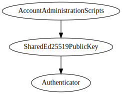

# Module `0x1::Authenticator`

Move representation of the authenticator types used in Diem. The supported types are Ed25519 (single-sig)
and MultiEd25519 (K-of-N multisig).

-  [Struct `MultiEd25519PublicKey`](#0x1_Authenticator_MultiEd25519PublicKey)
-  [Constants](#@Constants_0)
-  [Function `create_multi_ed25519`](#0x1_Authenticator_create_multi_ed25519)
-  [Function `ed25519_authentication_key`](#0x1_Authenticator_ed25519_authentication_key)
-  [Function `multi_ed25519_authentication_key`](#0x1_Authenticator_multi_ed25519_authentication_key)
-  [Function `public_keys`](#0x1_Authenticator_public_keys)
-  [Function `threshold`](#0x1_Authenticator_threshold)

<pre><code><b>use</b> <a href="../../../move-stdlib/docs/BCS.md#0x1_BCS">0x1::BCS</a>;
<b>use</b> <a href="../../../move-stdlib/docs/Errors.md#0x1_Errors">0x1::Errors</a>;
<b>use</b> <a href="../../../move-stdlib/docs/Hash.md#0x1_Hash">0x1::Hash</a>;
<b>use</b> <a href="../../../move-stdlib/docs/Vector.md#0x1_Vector">0x1::Vector</a>;
</code></pre>

Show all the modules that "Authenticator" depends on directly or indirectly

Show all the modules that depend on "Authenticator" directly or indirectly

## Struct `MultiEd25519PublicKey`

A multi-ed25519 public key

<pre><code><b>struct</b> <a href="Authenticator.md#0x1_Authenticator_MultiEd25519PublicKey">MultiEd25519PublicKey</a>
</code></pre>

Fields

<dl>
<dt>
<code>public_keys: vector&lt;vector&lt;u8&gt;&gt;</code>
</dt>
<dd>
 vector of ed25519 public keys
</dd>
<dt>
<code>threshold: u8</code>
</dt>
<dd>
 approval threshold
</dd>
</dl>

## Constants

Not enough keys were provided for the specified threshold when creating an <code>MultiEd25519</code> key

<pre><code><b>const</b> <a href="Authenticator.md#0x1_Authenticator_ENOT_ENOUGH_KEYS_FOR_THRESHOLD">ENOT_ENOUGH_KEYS_FOR_THRESHOLD</a>: u64 = 1;
</code></pre>

Too many keys were provided for the specified threshold when creating an <code>MultiEd25519</code> key

<pre><code><b>const</b> <a href="Authenticator.md#0x1_Authenticator_ENUM_KEYS_ABOVE_MAX_THRESHOLD">ENUM_KEYS_ABOVE_MAX_THRESHOLD</a>: u64 = 2;
</code></pre>

Threshold provided was 0 which can't be used to create a <code>MultiEd25519</code> key

<pre><code><b>const</b> <a href="Authenticator.md#0x1_Authenticator_EZERO_THRESHOLD">EZERO_THRESHOLD</a>: u64 = 0;
</code></pre>

Maximum number of keys allowed in a MultiEd25519 public/private key

<pre><code><b>const</b> <a href="Authenticator.md#0x1_Authenticator_MAX_MULTI_ED25519_KEYS">MAX_MULTI_ED25519_KEYS</a>: u64 = 32;
</code></pre>

Scheme byte ID for multi-ed25519

<pre><code><b>const</b> <a href="Authenticator.md#0x1_Authenticator_MULTI_ED25519_SCHEME_ID">MULTI_ED25519_SCHEME_ID</a>: u8 = 1;
</code></pre>

Scheme byte ID for ed25519

<pre><code><b>const</b> <a href="Authenticator.md#0x1_Authenticator_SINGLE_ED25519_SCHEME_ID">SINGLE_ED25519_SCHEME_ID</a>: u8 = 0;
</code></pre>

## Function `create_multi_ed25519`

Create a a multisig policy from a vector of ed25519 public keys and a threshold.
Note: this does *not* check uniqueness of keys. Repeated keys are convenient to
encode weighted multisig policies. For example Alice AND 1 of Bob or Carol is
public_key: {alice_key, alice_key, bob_key, carol_key}, threshold: 3
Aborts if threshold is zero or bigger than the length of <code>public_keys</code>.

<pre><code><b>public</b> <b>fun</b> <a href="Authenticator.md#0x1_Authenticator_create_multi_ed25519">create_multi_ed25519</a>(public_keys: vector&lt;vector&lt;u8&gt;&gt;, threshold: u8): <a href="Authenticator.md#0x1_Authenticator_MultiEd25519PublicKey">Authenticator::MultiEd25519PublicKey</a>
</code></pre>

Implementation

<pre><code><b>public</b> <b>fun</b> <a href="Authenticator.md#0x1_Authenticator_create_multi_ed25519">create_multi_ed25519</a>(
    public_keys: vector&lt;vector&lt;u8&gt;&gt;,
    threshold: u8
): <a href="Authenticator.md#0x1_Authenticator_MultiEd25519PublicKey">MultiEd25519PublicKey</a> {
    // check threshold requirements
    <b>let</b> len = <a href="../../../move-stdlib/docs/Vector.md#0x1_Vector_length">Vector::length</a>(&public_keys);
    <b>assert</b>(threshold != 0, <a href="../../../move-stdlib/docs/Errors.md#0x1_Errors_invalid_argument">Errors::invalid_argument</a>(<a href="Authenticator.md#0x1_Authenticator_EZERO_THRESHOLD">EZERO_THRESHOLD</a>));
    <b>assert</b>(
        (threshold <b>as</b> u64) &lt;= len,
        <a href="../../../move-stdlib/docs/Errors.md#0x1_Errors_invalid_argument">Errors::invalid_argument</a>(<a href="Authenticator.md#0x1_Authenticator_ENOT_ENOUGH_KEYS_FOR_THRESHOLD">ENOT_ENOUGH_KEYS_FOR_THRESHOLD</a>)
    );
    // the multied25519 signature scheme allows at most 32 keys
    <b>assert</b>(
        len &lt;= <a href="Authenticator.md#0x1_Authenticator_MAX_MULTI_ED25519_KEYS">MAX_MULTI_ED25519_KEYS</a>,
        <a href="../../../move-stdlib/docs/Errors.md#0x1_Errors_invalid_argument">Errors::invalid_argument</a>(<a href="Authenticator.md#0x1_Authenticator_ENUM_KEYS_ABOVE_MAX_THRESHOLD">ENUM_KEYS_ABOVE_MAX_THRESHOLD</a>)
    );

    <a href="Authenticator.md#0x1_Authenticator_MultiEd25519PublicKey">MultiEd25519PublicKey</a> { public_keys, threshold }
}
</code></pre>

Show all the functions that "create_multi_ed25519" calls

## Function `ed25519_authentication_key`

Compute an authentication key for the ed25519 public key <code>public_key</code>

<pre><code><b>public</b> <b>fun</b> <a href="Authenticator.md#0x1_Authenticator_ed25519_authentication_key">ed25519_authentication_key</a>(public_key: vector&lt;u8&gt;): vector&lt;u8&gt;
</code></pre>

Implementation

<pre><code><b>public</b> <b>fun</b> <a href="Authenticator.md#0x1_Authenticator_ed25519_authentication_key">ed25519_authentication_key</a>(public_key: vector&lt;u8&gt;): vector&lt;u8&gt; {
    <a href="../../../move-stdlib/docs/Vector.md#0x1_Vector_push_back">Vector::push_back</a>(&<b>mut</b> public_key, <a href="Authenticator.md#0x1_Authenticator_SINGLE_ED25519_SCHEME_ID">SINGLE_ED25519_SCHEME_ID</a>);
    <a href="../../../move-stdlib/docs/Hash.md#0x1_Hash_sha3_256">Hash::sha3_256</a>(public_key)
}
</code></pre>

Specification

<pre><code><b>pragma</b> opaque = <b>true</b>;
<b>aborts_if</b> <b>false</b>;
<b>ensures</b> [abstract] result == <a href="Authenticator.md#0x1_Authenticator_spec_ed25519_authentication_key">spec_ed25519_authentication_key</a>(public_key);
</code></pre>

We use an uninterpreted function to represent the result of key construction. The actual value
does not matter for the verification of callers.

<pre><code><b>define</b> <a href="Authenticator.md#0x1_Authenticator_spec_ed25519_authentication_key">spec_ed25519_authentication_key</a>(public_key: vector&lt;u8&gt;): vector&lt;u8&gt;;
</code></pre>

Show all the functions that "ed25519_authentication_key" calls

## Function `multi_ed25519_authentication_key`

Compute a multied25519 account authentication key for the policy <code>k</code>

<pre><code><b>public</b> <b>fun</b> <a href="Authenticator.md#0x1_Authenticator_multi_ed25519_authentication_key">multi_ed25519_authentication_key</a>(k: &<a href="Authenticator.md#0x1_Authenticator_MultiEd25519PublicKey">Authenticator::MultiEd25519PublicKey</a>): vector&lt;u8&gt;
</code></pre>

Implementation

<pre><code><b>public</b> <b>fun</b> <a href="Authenticator.md#0x1_Authenticator_multi_ed25519_authentication_key">multi_ed25519_authentication_key</a>(k: &<a href="Authenticator.md#0x1_Authenticator_MultiEd25519PublicKey">MultiEd25519PublicKey</a>): vector&lt;u8&gt; {
    <b>let</b> public_keys = &k.public_keys;
    <b>let</b> len = <a href="../../../move-stdlib/docs/Vector.md#0x1_Vector_length">Vector::length</a>(public_keys);
    <b>let</b> authentication_key_preimage = <a href="../../../move-stdlib/docs/Vector.md#0x1_Vector_empty">Vector::empty</a>();
    <b>let</b> i = 0;
    <b>while</b> (i &lt; len) {
        <b>let</b> public_key = *<a href="../../../move-stdlib/docs/Vector.md#0x1_Vector_borrow">Vector::borrow</a>(public_keys, i);
        <a href="../../../move-stdlib/docs/Vector.md#0x1_Vector_append">Vector::append</a>(
            &<b>mut</b> authentication_key_preimage,
            public_key
        );
        i = i + 1;
    };
    <a href="../../../move-stdlib/docs/Vector.md#0x1_Vector_append">Vector::append</a>(&<b>mut</b> authentication_key_preimage, <a href="../../../move-stdlib/docs/BCS.md#0x1_BCS_to_bytes">BCS::to_bytes</a>(&k.threshold));
    <a href="../../../move-stdlib/docs/Vector.md#0x1_Vector_push_back">Vector::push_back</a>(&<b>mut</b> authentication_key_preimage, <a href="Authenticator.md#0x1_Authenticator_MULTI_ED25519_SCHEME_ID">MULTI_ED25519_SCHEME_ID</a>);
    <a href="../../../move-stdlib/docs/Hash.md#0x1_Hash_sha3_256">Hash::sha3_256</a>(authentication_key_preimage)
}
</code></pre>

Specification

<pre><code><b>pragma</b> opaque;
<b>aborts_if</b> <b>false</b>;
<b>ensures</b> [abstract] result == <a href="Authenticator.md#0x1_Authenticator_spec_multi_ed25519_authentication_key">spec_multi_ed25519_authentication_key</a>(k);
</code></pre>

We use an uninterpreted function to represent the result of key construction. The actual value
does not matter for the verification of callers.

<pre><code><b>define</b> <a href="Authenticator.md#0x1_Authenticator_spec_multi_ed25519_authentication_key">spec_multi_ed25519_authentication_key</a>(k: <a href="Authenticator.md#0x1_Authenticator_MultiEd25519PublicKey">MultiEd25519PublicKey</a>): vector&lt;u8&gt;;
</code></pre>

Show all the functions that "multi_ed25519_authentication_key" calls

## Function `public_keys`

Return the public keys involved in the multisig policy <code>k</code>

<pre><code><b>public</b> <b>fun</b> <a href="Authenticator.md#0x1_Authenticator_public_keys">public_keys</a>(k: &<a href="Authenticator.md#0x1_Authenticator_MultiEd25519PublicKey">Authenticator::MultiEd25519PublicKey</a>): &vector&lt;vector&lt;u8&gt;&gt;
</code></pre>

Implementation

<pre><code><b>public</b> <b>fun</b> <a href="Authenticator.md#0x1_Authenticator_public_keys">public_keys</a>(k: &<a href="Authenticator.md#0x1_Authenticator_MultiEd25519PublicKey">MultiEd25519PublicKey</a>): &vector&lt;vector&lt;u8&gt;&gt; {
    &k.public_keys
}
</code></pre>

Show all the functions that "public_keys" calls

## Function `threshold`

Return the threshold for the multisig policy <code>k</code>

<pre><code><b>public</b> <b>fun</b> <a href="Authenticator.md#0x1_Authenticator_threshold">threshold</a>(k: &<a href="Authenticator.md#0x1_Authenticator_MultiEd25519PublicKey">Authenticator::MultiEd25519PublicKey</a>): u8
</code></pre>

Implementation

<pre><code><b>public</b> <b>fun</b> <a href="Authenticator.md#0x1_Authenticator_threshold">threshold</a>(k: &<a href="Authenticator.md#0x1_Authenticator_MultiEd25519PublicKey">MultiEd25519PublicKey</a>): u8 {
    *&k.threshold
}
</code></pre>

Show all the functions that "threshold" calls

[//]: # ("File containing references which can be used from documentation")
[ACCESS_CONTROL]: https://github.com/diem/dip/blob/main/dips/dip-2.md
[ROLE]: https://github.com/diem/dip/blob/main/dips/dip-2.md#roles
[PERMISSION]: https://github.com/diem/dip/blob/main/dips/dip-2.md#permissions
