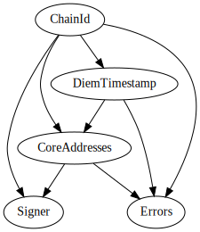
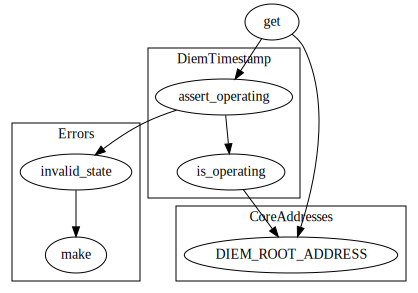

# Module `0x1::ChainId`

The chain id distinguishes between different chains (e.g., testnet and the main Diem network).
One important role is to prevent transactions intended for one chain from being executed on another.
This code provides a container for storing a chain id and functions to initialize and get it.

-  [Resource `ChainId`](#0x1_ChainId_ChainId)
-  [Constants](#@Constants_0)
-  [Function `initialize`](#0x1_ChainId_initialize)
-  [Function `get`](#0x1_ChainId_get)
-  [Module Specification](#@Module_Specification_1)
    -  [Initialization](#@Initialization_2)
    -  [Helper Functions](#@Helper_Functions_3)

<pre><code><b>use</b> <a href="CoreAddresses.md#0x1_CoreAddresses">0x1::CoreAddresses</a>;
<b>use</b> <a href="DiemTimestamp.md#0x1_DiemTimestamp">0x1::DiemTimestamp</a>;
<b>use</b> <a href="../../../move-stdlib/docs/Errors.md#0x1_Errors">0x1::Errors</a>;
<b>use</b> <a href="../../../move-stdlib/docs/Signer.md#0x1_Signer">0x1::Signer</a>;
</code></pre>

Show all the modules that "ChainId" depends on directly or indirectly

Show all the modules that depend on "ChainId" directly or indirectly

## Resource `ChainId`

<pre><code><b>resource</b> <b>struct</b> <a href="ChainId.md#0x1_ChainId">ChainId</a>
</code></pre>

Fields

<dl>
<dt>
<code>id: u8</code>
</dt>
<dd>

</dd>
</dl>

## Constants

The <code><a href="ChainId.md#0x1_ChainId">ChainId</a></code> resource was not in the required state

<pre><code><b>const</b> <a href="ChainId.md#0x1_ChainId_ECHAIN_ID">ECHAIN_ID</a>: u64 = 0;
</code></pre>

## Function `initialize`

Publish the chain ID <code>id</code> of this Diem instance under the DiemRoot account

<pre><code><b>public</b> <b>fun</b> <a href="ChainId.md#0x1_ChainId_initialize">initialize</a>(dr_account: &signer, id: u8)
</code></pre>

Implementation

<pre><code><b>public</b> <b>fun</b> <a href="ChainId.md#0x1_ChainId_initialize">initialize</a>(dr_account: &signer, id: u8) {
    <a href="DiemTimestamp.md#0x1_DiemTimestamp_assert_genesis">DiemTimestamp::assert_genesis</a>();
    <a href="CoreAddresses.md#0x1_CoreAddresses_assert_diem_root">CoreAddresses::assert_diem_root</a>(dr_account);
    <b>assert</b>(!<b>exists</b>&lt;<a href="ChainId.md#0x1_ChainId">ChainId</a>&gt;(<a href="../../../move-stdlib/docs/Signer.md#0x1_Signer_address_of">Signer::address_of</a>(dr_account)), <a href="../../../move-stdlib/docs/Errors.md#0x1_Errors_already_published">Errors::already_published</a>(<a href="ChainId.md#0x1_ChainId_ECHAIN_ID">ECHAIN_ID</a>));
    move_to(dr_account, <a href="ChainId.md#0x1_ChainId">ChainId</a> { id })
}
</code></pre>

Specification

<pre><code><b>pragma</b> opaque;

<b>let</b> dr_addr = <a href="../../../move-stdlib/docs/Signer.md#0x1_Signer_address_of">Signer::address_of</a>(dr_account);
<b>modifies</b> <b>global</b>&lt;<a href="ChainId.md#0x1_ChainId">ChainId</a>&gt;(dr_addr);
<b>include</b> <a href="DiemTimestamp.md#0x1_DiemTimestamp_AbortsIfNotGenesis">DiemTimestamp::AbortsIfNotGenesis</a>;
<b>include</b> <a href="CoreAddresses.md#0x1_CoreAddresses_AbortsIfNotDiemRoot">CoreAddresses::AbortsIfNotDiemRoot</a>{account: dr_account};
<b>aborts_if</b> <b>exists</b>&lt;<a href="ChainId.md#0x1_ChainId">ChainId</a>&gt;(dr_addr) <b>with</b> <a href="../../../move-stdlib/docs/Errors.md#0x1_Errors_ALREADY_PUBLISHED">Errors::ALREADY_PUBLISHED</a>;
<b>ensures</b> <b>exists</b>&lt;<a href="ChainId.md#0x1_ChainId">ChainId</a>&gt;(dr_addr);
</code></pre>

Show all the functions that "initialize" calls

## Function `get`

Return the chain ID of this Diem instance

<pre><code><b>public</b> <b>fun</b> <a href="ChainId.md#0x1_ChainId_get">get</a>(): u8
</code></pre>

Implementation

<pre><code><b>public</b> <b>fun</b> <a href="ChainId.md#0x1_ChainId_get">get</a>(): u8 <b>acquires</b> <a href="ChainId.md#0x1_ChainId">ChainId</a> {
    <a href="DiemTimestamp.md#0x1_DiemTimestamp_assert_operating">DiemTimestamp::assert_operating</a>();
    borrow_global&lt;<a href="ChainId.md#0x1_ChainId">ChainId</a>&gt;(<a href="CoreAddresses.md#0x1_CoreAddresses_DIEM_ROOT_ADDRESS">CoreAddresses::DIEM_ROOT_ADDRESS</a>()).id
}
</code></pre>

Show all the functions that "get" calls

## Module Specification

### Initialization

When Diem is operating, the chain id is always available.

<pre><code><b>invariant</b> [<b>global</b>] <a href="DiemTimestamp.md#0x1_DiemTimestamp_is_operating">DiemTimestamp::is_operating</a>() ==&gt; <b>exists</b>&lt;<a href="ChainId.md#0x1_ChainId">ChainId</a>&gt;(<a href="CoreAddresses.md#0x1_CoreAddresses_DIEM_ROOT_ADDRESS">CoreAddresses::DIEM_ROOT_ADDRESS</a>());
</code></pre>

### Helper Functions

<pre><code><b>define</b> <a href="ChainId.md#0x1_ChainId_spec_get_chain_id">spec_get_chain_id</a>(): u8 {
   <b>global</b>&lt;<a href="ChainId.md#0x1_ChainId">ChainId</a>&gt;(<a href="CoreAddresses.md#0x1_CoreAddresses_DIEM_ROOT_ADDRESS">CoreAddresses::DIEM_ROOT_ADDRESS</a>()).id
}
</code></pre>

[//]: # ("File containing references which can be used from documentation")
[ACCESS_CONTROL]: https://github.com/diem/dip/blob/main/dips/dip-2.md
[ROLE]: https://github.com/diem/dip/blob/main/dips/dip-2.md#roles
[PERMISSION]: https://github.com/diem/dip/blob/main/dips/dip-2.md#permissions
