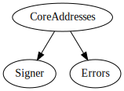
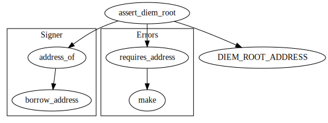
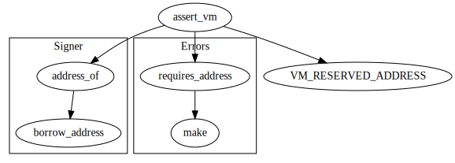

# Module `0x1::CoreAddresses`

Module providing well-known addresses and related logic.

> Note: this module currently defines zero-argument functions like <code><a href="CoreAddresses.md#0x1_CoreAddresses_DIEM_ROOT_ADDRESS">Self::DIEM_ROOT_ADDRESS</a>()</code> using capitalization
> in the name, following the convention for constants. Eventually, those functions are planned to become actual
> global constants, once the Move language supports this feature.

-  [Constants](#@Constants_0)
-  [Function `DIEM_ROOT_ADDRESS`](#0x1_CoreAddresses_DIEM_ROOT_ADDRESS)
-  [Function `CURRENCY_INFO_ADDRESS`](#0x1_CoreAddresses_CURRENCY_INFO_ADDRESS)
-  [Function `TREASURY_COMPLIANCE_ADDRESS`](#0x1_CoreAddresses_TREASURY_COMPLIANCE_ADDRESS)
-  [Function `VM_RESERVED_ADDRESS`](#0x1_CoreAddresses_VM_RESERVED_ADDRESS)
-  [Function `CORE_CODE_ADDRESS`](#0x1_CoreAddresses_CORE_CODE_ADDRESS)
-  [Function `assert_diem_root`](#0x1_CoreAddresses_assert_diem_root)
-  [Function `assert_treasury_compliance`](#0x1_CoreAddresses_assert_treasury_compliance)
-  [Function `assert_vm`](#0x1_CoreAddresses_assert_vm)
-  [Function `assert_currency_info`](#0x1_CoreAddresses_assert_currency_info)

<pre><code><b>use</b> <a href="../../../move-stdlib/docs/Errors.md#0x1_Errors">0x1::Errors</a>;
<b>use</b> <a href="../../../move-stdlib/docs/Signer.md#0x1_Signer">0x1::Signer</a>;
</code></pre>

Show all the modules that "CoreAddresses" depends on directly or indirectly

Show all the modules that depend on "CoreAddresses" directly or indirectly

## Constants

The operation can only be performed by the account where currencies are registered

<pre><code><b>const</b> <a href="CoreAddresses.md#0x1_CoreAddresses_ECURRENCY_INFO">ECURRENCY_INFO</a>: u64 = 3;
</code></pre>

The operation can only be performed by the account at 0xA550C18 (Diem Root)

<pre><code><b>const</b> <a href="CoreAddresses.md#0x1_CoreAddresses_EDIEM_ROOT">EDIEM_ROOT</a>: u64 = 0;
</code></pre>

The operation can only be performed by the account at 0xB1E55ED (Treasury & Compliance)

<pre><code><b>const</b> <a href="CoreAddresses.md#0x1_CoreAddresses_ETREASURY_COMPLIANCE">ETREASURY_COMPLIANCE</a>: u64 = 1;
</code></pre>

The operation can only be performed by the VM

<pre><code><b>const</b> <a href="CoreAddresses.md#0x1_CoreAddresses_EVM">EVM</a>: u64 = 2;
</code></pre>

## Function `DIEM_ROOT_ADDRESS`

The address of the Diem root account. This account is
created in genesis, and cannot be changed. This address has
ultimate authority over the permissions granted (or removed) from
accounts on-chain.

<pre><code><b>public</b> <b>fun</b> <a href="CoreAddresses.md#0x1_CoreAddresses_DIEM_ROOT_ADDRESS">DIEM_ROOT_ADDRESS</a>(): address
</code></pre>

Implementation

<pre><code><b>public</b> <b>fun</b> <a href="CoreAddresses.md#0x1_CoreAddresses_DIEM_ROOT_ADDRESS">DIEM_ROOT_ADDRESS</a>(): address {
    0xA550C18
}
</code></pre>

Show all the functions that "DIEM_ROOT_ADDRESS" calls

## Function `CURRENCY_INFO_ADDRESS`

The (singleton) address under which the <code><a href="Diem.md#0x1_Diem_CurrencyInfo">0x1::Diem::CurrencyInfo</a></code> resource for
every registered currency is published. This is the same as the
<code>DIEM_ROOT_ADDRESS</code> but there is no requirement that it must
be this from an operational viewpoint, so this is why this is separated out.

<pre><code><b>public</b> <b>fun</b> <a href="CoreAddresses.md#0x1_CoreAddresses_CURRENCY_INFO_ADDRESS">CURRENCY_INFO_ADDRESS</a>(): address
</code></pre>

Implementation

<pre><code><b>public</b> <b>fun</b> <a href="CoreAddresses.md#0x1_CoreAddresses_CURRENCY_INFO_ADDRESS">CURRENCY_INFO_ADDRESS</a>(): address {
    0xA550C18
}
</code></pre>

Show all the functions that "CURRENCY_INFO_ADDRESS" calls

## Function `TREASURY_COMPLIANCE_ADDRESS`

The account address of the treasury and compliance account in
charge of minting/burning and other day-to-day but privileged
operations. The account at this address is created in genesis.

<pre><code><b>public</b> <b>fun</b> <a href="CoreAddresses.md#0x1_CoreAddresses_TREASURY_COMPLIANCE_ADDRESS">TREASURY_COMPLIANCE_ADDRESS</a>(): address
</code></pre>

Implementation

<pre><code><b>public</b> <b>fun</b> <a href="CoreAddresses.md#0x1_CoreAddresses_TREASURY_COMPLIANCE_ADDRESS">TREASURY_COMPLIANCE_ADDRESS</a>(): address {
    0xB1E55ED
}
</code></pre>

Show all the functions that "TREASURY_COMPLIANCE_ADDRESS" calls

## Function `VM_RESERVED_ADDRESS`

The reserved address for transactions inserted by the VM into blocks (e.g.
block metadata transactions). Because the transaction is sent from
the VM, an account _cannot_ exist at the <code>0x0</code> address since there
is no signer for the transaction.

<pre><code><b>public</b> <b>fun</b> <a href="CoreAddresses.md#0x1_CoreAddresses_VM_RESERVED_ADDRESS">VM_RESERVED_ADDRESS</a>(): address
</code></pre>

Implementation

<pre><code><b>public</b> <b>fun</b> <a href="CoreAddresses.md#0x1_CoreAddresses_VM_RESERVED_ADDRESS">VM_RESERVED_ADDRESS</a>(): address {
    0x0
}
</code></pre>

Show all the functions that "VM_RESERVED_ADDRESS" calls

## Function `CORE_CODE_ADDRESS`

The reserved address where all core modules are published. No
account can be created at this address.

<pre><code><b>public</b> <b>fun</b> <a href="CoreAddresses.md#0x1_CoreAddresses_CORE_CODE_ADDRESS">CORE_CODE_ADDRESS</a>(): address
</code></pre>

Implementation

<pre><code><b>public</b> <b>fun</b> <a href="CoreAddresses.md#0x1_CoreAddresses_CORE_CODE_ADDRESS">CORE_CODE_ADDRESS</a>(): address {
    0x1
}
</code></pre>

Show all the functions that "CORE_CODE_ADDRESS" calls

## Function `assert_diem_root`

Assert that the account is the Diem root address.

<pre><code><b>public</b> <b>fun</b> <a href="CoreAddresses.md#0x1_CoreAddresses_assert_diem_root">assert_diem_root</a>(account: &signer)
</code></pre>

Implementation

<pre><code><b>public</b> <b>fun</b> <a href="CoreAddresses.md#0x1_CoreAddresses_assert_diem_root">assert_diem_root</a>(account: &signer) {
    <b>assert</b>(<a href="../../../move-stdlib/docs/Signer.md#0x1_Signer_address_of">Signer::address_of</a>(account) == <a href="CoreAddresses.md#0x1_CoreAddresses_DIEM_ROOT_ADDRESS">DIEM_ROOT_ADDRESS</a>(), <a href="../../../move-stdlib/docs/Errors.md#0x1_Errors_requires_address">Errors::requires_address</a>(<a href="CoreAddresses.md#0x1_CoreAddresses_EDIEM_ROOT">EDIEM_ROOT</a>))
}
</code></pre>

Specification

<pre><code><b>pragma</b> opaque;
<b>include</b> <a href="CoreAddresses.md#0x1_CoreAddresses_AbortsIfNotDiemRoot">AbortsIfNotDiemRoot</a>;
</code></pre>

Specifies that a function aborts if the account does not have the Diem root address.

<pre><code><b>schema</b> <a href="CoreAddresses.md#0x1_CoreAddresses_AbortsIfNotDiemRoot">AbortsIfNotDiemRoot</a> {
    account: signer;
    <b>aborts_if</b> <a href="../../../move-stdlib/docs/Signer.md#0x1_Signer_spec_address_of">Signer::spec_address_of</a>(account) != <a href="CoreAddresses.md#0x1_CoreAddresses_DIEM_ROOT_ADDRESS">DIEM_ROOT_ADDRESS</a>()
        <b>with</b> <a href="../../../move-stdlib/docs/Errors.md#0x1_Errors_REQUIRES_ADDRESS">Errors::REQUIRES_ADDRESS</a>;
}
</code></pre>

Show all the functions that "assert_diem_root" calls

## Function `assert_treasury_compliance`

Assert that the signer has the treasury compliance address.

<pre><code><b>public</b> <b>fun</b> <a href="CoreAddresses.md#0x1_CoreAddresses_assert_treasury_compliance">assert_treasury_compliance</a>(account: &signer)
</code></pre>

Implementation

<pre><code><b>public</b> <b>fun</b> <a href="CoreAddresses.md#0x1_CoreAddresses_assert_treasury_compliance">assert_treasury_compliance</a>(account: &signer) {
    <b>assert</b>(
        <a href="../../../move-stdlib/docs/Signer.md#0x1_Signer_address_of">Signer::address_of</a>(account) == <a href="CoreAddresses.md#0x1_CoreAddresses_TREASURY_COMPLIANCE_ADDRESS">TREASURY_COMPLIANCE_ADDRESS</a>(),
        <a href="../../../move-stdlib/docs/Errors.md#0x1_Errors_requires_address">Errors::requires_address</a>(<a href="CoreAddresses.md#0x1_CoreAddresses_ETREASURY_COMPLIANCE">ETREASURY_COMPLIANCE</a>)
    )
}
</code></pre>

Specification

<pre><code><b>pragma</b> opaque;
<b>include</b> <a href="CoreAddresses.md#0x1_CoreAddresses_AbortsIfNotTreasuryCompliance">AbortsIfNotTreasuryCompliance</a>;
</code></pre>

Specifies that a function aborts if the account does not have the treasury compliance address.

<pre><code><b>schema</b> <a href="CoreAddresses.md#0x1_CoreAddresses_AbortsIfNotTreasuryCompliance">AbortsIfNotTreasuryCompliance</a> {
    account: signer;
    <b>aborts_if</b> <a href="../../../move-stdlib/docs/Signer.md#0x1_Signer_spec_address_of">Signer::spec_address_of</a>(account) != <a href="CoreAddresses.md#0x1_CoreAddresses_TREASURY_COMPLIANCE_ADDRESS">TREASURY_COMPLIANCE_ADDRESS</a>()
        <b>with</b> <a href="../../../move-stdlib/docs/Errors.md#0x1_Errors_REQUIRES_ADDRESS">Errors::REQUIRES_ADDRESS</a>;
}
</code></pre>

Show all the functions that "assert_treasury_compliance" calls

## Function `assert_vm`

Assert that the signer has the VM reserved address.

<pre><code><b>public</b> <b>fun</b> <a href="CoreAddresses.md#0x1_CoreAddresses_assert_vm">assert_vm</a>(account: &signer)
</code></pre>

Implementation

<pre><code><b>public</b> <b>fun</b> <a href="CoreAddresses.md#0x1_CoreAddresses_assert_vm">assert_vm</a>(account: &signer) {
    <b>assert</b>(<a href="../../../move-stdlib/docs/Signer.md#0x1_Signer_address_of">Signer::address_of</a>(account) == <a href="CoreAddresses.md#0x1_CoreAddresses_VM_RESERVED_ADDRESS">VM_RESERVED_ADDRESS</a>(), <a href="../../../move-stdlib/docs/Errors.md#0x1_Errors_requires_address">Errors::requires_address</a>(<a href="CoreAddresses.md#0x1_CoreAddresses_EVM">EVM</a>))
}
</code></pre>

Specification

<pre><code><b>pragma</b> opaque;
<b>include</b> <a href="CoreAddresses.md#0x1_CoreAddresses_AbortsIfNotVM">AbortsIfNotVM</a>;
</code></pre>

Specifies that a function aborts if the account does not have the VM reserved address.

<pre><code><b>schema</b> <a href="CoreAddresses.md#0x1_CoreAddresses_AbortsIfNotVM">AbortsIfNotVM</a> {
    account: signer;
    <b>aborts_if</b> <a href="../../../move-stdlib/docs/Signer.md#0x1_Signer_spec_address_of">Signer::spec_address_of</a>(account) != <a href="CoreAddresses.md#0x1_CoreAddresses_VM_RESERVED_ADDRESS">VM_RESERVED_ADDRESS</a>()
        <b>with</b> <a href="../../../move-stdlib/docs/Errors.md#0x1_Errors_REQUIRES_ADDRESS">Errors::REQUIRES_ADDRESS</a>;
}
</code></pre>

Show all the functions that "assert_vm" calls

## Function `assert_currency_info`

Assert that the signer has the currency info address.

<pre><code><b>public</b> <b>fun</b> <a href="CoreAddresses.md#0x1_CoreAddresses_assert_currency_info">assert_currency_info</a>(account: &signer)
</code></pre>

Implementation

<pre><code><b>public</b> <b>fun</b> <a href="CoreAddresses.md#0x1_CoreAddresses_assert_currency_info">assert_currency_info</a>(account: &signer) {
    <b>assert</b>(<a href="../../../move-stdlib/docs/Signer.md#0x1_Signer_address_of">Signer::address_of</a>(account) == <a href="CoreAddresses.md#0x1_CoreAddresses_CURRENCY_INFO_ADDRESS">CURRENCY_INFO_ADDRESS</a>(), <a href="../../../move-stdlib/docs/Errors.md#0x1_Errors_requires_address">Errors::requires_address</a>(<a href="CoreAddresses.md#0x1_CoreAddresses_ECURRENCY_INFO">ECURRENCY_INFO</a>))
}
</code></pre>

Specification

<pre><code><b>pragma</b> opaque;
<b>include</b> <a href="CoreAddresses.md#0x1_CoreAddresses_AbortsIfNotCurrencyInfo">AbortsIfNotCurrencyInfo</a>;
</code></pre>

Specifies that a function aborts if the account has not the currency info address.

<pre><code><b>schema</b> <a href="CoreAddresses.md#0x1_CoreAddresses_AbortsIfNotCurrencyInfo">AbortsIfNotCurrencyInfo</a> {
    account: signer;
    <b>aborts_if</b> <a href="../../../move-stdlib/docs/Signer.md#0x1_Signer_spec_address_of">Signer::spec_address_of</a>(account) != <a href="CoreAddresses.md#0x1_CoreAddresses_CURRENCY_INFO_ADDRESS">CURRENCY_INFO_ADDRESS</a>()
        <b>with</b> <a href="../../../move-stdlib/docs/Errors.md#0x1_Errors_REQUIRES_ADDRESS">Errors::REQUIRES_ADDRESS</a>;
}
</code></pre>

Show all the functions that "assert_currency_info" calls

[//]: # ("File containing references which can be used from documentation")
[ACCESS_CONTROL]: https://github.com/diem/dip/blob/main/dips/dip-2.md
[ROLE]: https://github.com/diem/dip/blob/main/dips/dip-2.md#roles
[PERMISSION]: https://github.com/diem/dip/blob/main/dips/dip-2.md#permissions
