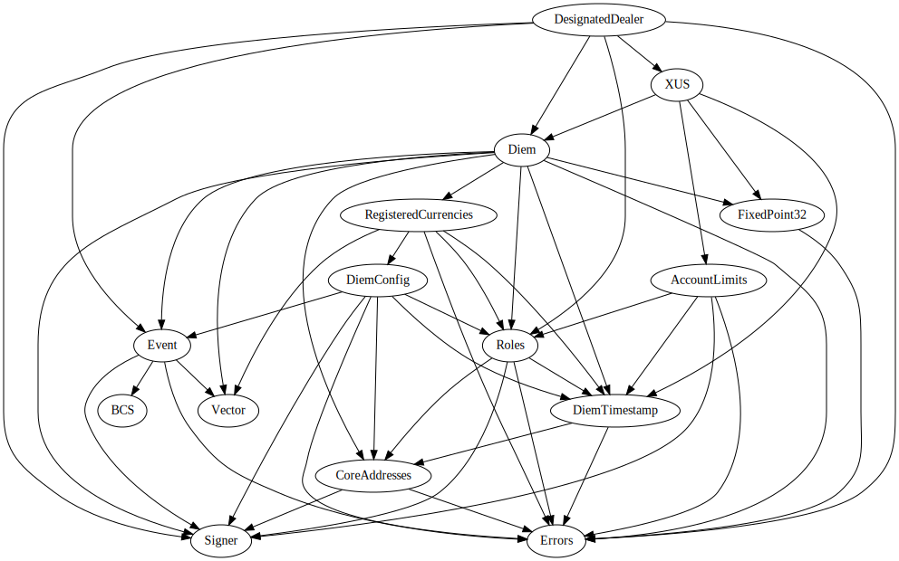

# Module `0x1::DesignatedDealer`

Module providing functionality for designated dealers.

-  [Resource `Dealer`](#0x1_DesignatedDealer_Dealer)
-  [Resource `TierInfo`](#0x1_DesignatedDealer_TierInfo)
-  [Struct `ReceivedMintEvent`](#0x1_DesignatedDealer_ReceivedMintEvent)
-  [Constants](#@Constants_0)
-  [Function `publish_designated_dealer_credential`](#0x1_DesignatedDealer_publish_designated_dealer_credential)
-  [Function `add_currency`](#0x1_DesignatedDealer_add_currency)
-  [Function `tiered_mint`](#0x1_DesignatedDealer_tiered_mint)
-  [Function `exists_at`](#0x1_DesignatedDealer_exists_at)
-  [Module Specification](#@Module_Specification_1)

<pre><code><b>use</b> <a href="Diem.md#0x1_Diem">0x1::Diem</a>;
<b>use</b> <a href="../../../move-stdlib/docs/Errors.md#0x1_Errors">0x1::Errors</a>;
<b>use</b> <a href="../../../move-stdlib/docs/Event.md#0x1_Event">0x1::Event</a>;
<b>use</b> <a href="Roles.md#0x1_Roles">0x1::Roles</a>;
<b>use</b> <a href="../../../move-stdlib/docs/Signer.md#0x1_Signer">0x1::Signer</a>;
<b>use</b> <a href="XUS.md#0x1_XUS">0x1::XUS</a>;
</code></pre>

Show all the modules that "DesignatedDealer" depends on directly or indirectly

Show all the modules that depend on "DesignatedDealer" directly or indirectly

## Resource `Dealer`

A <code><a href="DesignatedDealer.md#0x1_DesignatedDealer">DesignatedDealer</a></code> always holds this <code><a href="DesignatedDealer.md#0x1_DesignatedDealer_Dealer">Dealer</a></code> resource regardless of the
currencies it can hold. All <code><a href="DesignatedDealer.md#0x1_DesignatedDealer_ReceivedMintEvent">ReceivedMintEvent</a></code> events for all
currencies will be emitted on <code>mint_event_handle</code>.

<pre><code><b>resource</b> <b>struct</b> <a href="DesignatedDealer.md#0x1_DesignatedDealer_Dealer">Dealer</a>
</code></pre>

Fields

<dl>
<dt>
<code>mint_event_handle: <a href="../../../move-stdlib/docs/Event.md#0x1_Event_EventHandle">Event::EventHandle</a>&lt;<a href="DesignatedDealer.md#0x1_DesignatedDealer_ReceivedMintEvent">DesignatedDealer::ReceivedMintEvent</a>&gt;</code>
</dt>
<dd>
 Handle for mint events
</dd>
</dl>

## Resource `TierInfo`

The <code><a href="DesignatedDealer.md#0x1_DesignatedDealer_TierInfo">TierInfo</a></code> resource holds the information needed to track which
tier a mint to a DD needs to be in.
DEPRECATED: This resource is no longer used and will be removed from the system

<pre><code><b>resource</b> <b>struct</b> <a href="DesignatedDealer.md#0x1_DesignatedDealer_TierInfo">TierInfo</a>&lt;CoinType&gt;
</code></pre>

Fields

<dl>
<dt>
<code>window_start: u64</code>
</dt>
<dd>
 Time window start in microseconds
</dd>
<dt>
<code>window_inflow: u64</code>
</dt>
<dd>
 The minted inflow during this time window
</dd>
<dt>
<code>tiers: vector&lt;u64&gt;</code>
</dt>
<dd>
 0-indexed array of tier upperbounds
</dd>
</dl>

## Struct `ReceivedMintEvent`

Message for mint events

<pre><code><b>struct</b> <a href="DesignatedDealer.md#0x1_DesignatedDealer_ReceivedMintEvent">ReceivedMintEvent</a>
</code></pre>

Fields

<dl>
<dt>
<code>currency_code: vector&lt;u8&gt;</code>
</dt>
<dd>
 The currency minted
</dd>
<dt>
<code>destination_address: address</code>
</dt>
<dd>
 The address that receives the mint
</dd>
<dt>
<code>amount: u64</code>
</dt>
<dd>
 The amount minted (in base units of <code>currency_code</code>)
</dd>
</dl>

## Constants

The <code><a href="DesignatedDealer.md#0x1_DesignatedDealer">DesignatedDealer</a></code> resource is in an invalid state

<pre><code><b>const</b> <a href="DesignatedDealer.md#0x1_DesignatedDealer_EDEALER">EDEALER</a>: u64 = 0;
</code></pre>

A zero mint amount was provided

<pre><code><b>const</b> <a href="DesignatedDealer.md#0x1_DesignatedDealer_EINVALID_MINT_AMOUNT">EINVALID_MINT_AMOUNT</a>: u64 = 4;
</code></pre>

## Function `publish_designated_dealer_credential`

Publishes a <code><a href="DesignatedDealer.md#0x1_DesignatedDealer_Dealer">Dealer</a></code> resource under <code>dd</code> with a <code>PreburnQueue</code>.
If <code>add_all_currencies = <b>true</b></code> this will add a <code>PreburnQueue</code>,
for each known currency at launch.

<pre><code><b>public</b> <b>fun</b> <a href="DesignatedDealer.md#0x1_DesignatedDealer_publish_designated_dealer_credential">publish_designated_dealer_credential</a>&lt;CoinType&gt;(dd: &signer, tc_account: &signer, add_all_currencies: bool)
</code></pre>

Implementation

<pre><code><b>public</b> <b>fun</b> <a href="DesignatedDealer.md#0x1_DesignatedDealer_publish_designated_dealer_credential">publish_designated_dealer_credential</a>&lt;CoinType: store&gt;(
    dd: &signer,
    tc_account: &signer,
    add_all_currencies: bool,
){
    <a href="Roles.md#0x1_Roles_assert_treasury_compliance">Roles::assert_treasury_compliance</a>(tc_account);
    <a href="Roles.md#0x1_Roles_assert_designated_dealer">Roles::assert_designated_dealer</a>(dd);
    <b>assert</b>(!<b>exists</b>&lt;<a href="DesignatedDealer.md#0x1_DesignatedDealer_Dealer">Dealer</a>&gt;(<a href="../../../move-stdlib/docs/Signer.md#0x1_Signer_address_of">Signer::address_of</a>(dd)), <a href="../../../move-stdlib/docs/Errors.md#0x1_Errors_already_published">Errors::already_published</a>(<a href="DesignatedDealer.md#0x1_DesignatedDealer_EDEALER">EDEALER</a>));
    move_to(dd, <a href="DesignatedDealer.md#0x1_DesignatedDealer_Dealer">Dealer</a> { mint_event_handle: <a href="../../../move-stdlib/docs/Event.md#0x1_Event_new_event_handle">Event::new_event_handle</a>&lt;<a href="DesignatedDealer.md#0x1_DesignatedDealer_ReceivedMintEvent">ReceivedMintEvent</a>&gt;(dd) });
    <b>if</b> (add_all_currencies) {
        <a href="DesignatedDealer.md#0x1_DesignatedDealer_add_currency">add_currency</a>&lt;<a href="XUS.md#0x1_XUS">XUS</a>&gt;(dd, tc_account);
    } <b>else</b> {
        <a href="DesignatedDealer.md#0x1_DesignatedDealer_add_currency">add_currency</a>&lt;CoinType&gt;(dd, tc_account);
    };
}
</code></pre>

Specification

<pre><code><b>pragma</b> opaque;

<b>let</b> dd_addr = <a href="../../../move-stdlib/docs/Signer.md#0x1_Signer_spec_address_of">Signer::spec_address_of</a>(dd);
<b>include</b> <a href="Roles.md#0x1_Roles_AbortsIfNotTreasuryCompliance">Roles::AbortsIfNotTreasuryCompliance</a>{account: tc_account};
<b>include</b> <a href="Roles.md#0x1_Roles_AbortsIfNotDesignatedDealer">Roles::AbortsIfNotDesignatedDealer</a>{account: dd};
<b>aborts_if</b> <b>exists</b>&lt;<a href="DesignatedDealer.md#0x1_DesignatedDealer_Dealer">Dealer</a>&gt;(dd_addr) <b>with</b> <a href="../../../move-stdlib/docs/Errors.md#0x1_Errors_ALREADY_PUBLISHED">Errors::ALREADY_PUBLISHED</a>;
<b>include</b> <b>if</b> (add_all_currencies) <a href="DesignatedDealer.md#0x1_DesignatedDealer_AddCurrencyAbortsIf">AddCurrencyAbortsIf</a>&lt;<a href="XUS.md#0x1_XUS">XUS</a>&gt;{dd_addr: dd_addr}
        <b>else</b> <a href="DesignatedDealer.md#0x1_DesignatedDealer_AddCurrencyAbortsIf">AddCurrencyAbortsIf</a>&lt;CoinType&gt;{dd_addr: dd_addr};
<b>modifies</b> <b>global</b>&lt;<a href="DesignatedDealer.md#0x1_DesignatedDealer_Dealer">Dealer</a>&gt;(dd_addr);
<b>ensures</b> <b>exists</b>&lt;<a href="DesignatedDealer.md#0x1_DesignatedDealer_Dealer">Dealer</a>&gt;(dd_addr);
<b>modifies</b> <b>global</b>&lt;<a href="../../../move-stdlib/docs/Event.md#0x1_Event_EventHandleGenerator">Event::EventHandleGenerator</a>&gt;(dd_addr);
<b>modifies</b> <b>global</b>&lt;<a href="Diem.md#0x1_Diem_PreburnQueue">Diem::PreburnQueue</a>&lt;CoinType&gt;&gt;(dd_addr);
<b>modifies</b> <b>global</b>&lt;<a href="Diem.md#0x1_Diem_PreburnQueue">Diem::PreburnQueue</a>&lt;<a href="XUS.md#0x1_XUS">XUS</a>&gt;&gt;(dd_addr);
</code></pre>

Show all the functions that "publish_designated_dealer_credential" calls

## Function `add_currency`

Adds the needed resources to the DD account <code>dd</code> in order to work with <code>CoinType</code>.
Public so that a currency can be added to a DD later on. Will require
multi-signer transactions in order to add a new currency to an existing DD.

<pre><code><b>public</b> <b>fun</b> <a href="DesignatedDealer.md#0x1_DesignatedDealer_add_currency">add_currency</a>&lt;CoinType&gt;(dd: &signer, tc_account: &signer)
</code></pre>

Implementation

<pre><code><b>public</b> <b>fun</b> <a href="DesignatedDealer.md#0x1_DesignatedDealer_add_currency">add_currency</a>&lt;CoinType: store&gt;(dd: &signer, tc_account: &signer) {
    <a href="Roles.md#0x1_Roles_assert_treasury_compliance">Roles::assert_treasury_compliance</a>(tc_account);
    <b>let</b> dd_addr = <a href="../../../move-stdlib/docs/Signer.md#0x1_Signer_address_of">Signer::address_of</a>(dd);
    <b>assert</b>(<a href="DesignatedDealer.md#0x1_DesignatedDealer_exists_at">exists_at</a>(dd_addr), <a href="../../../move-stdlib/docs/Errors.md#0x1_Errors_not_published">Errors::not_published</a>(<a href="DesignatedDealer.md#0x1_DesignatedDealer_EDEALER">EDEALER</a>));
    <a href="Diem.md#0x1_Diem_publish_preburn_queue_to_account">Diem::publish_preburn_queue_to_account</a>&lt;CoinType&gt;(dd, tc_account);
}
</code></pre>

Specification

<pre><code><b>pragma</b> opaque;

<b>let</b> dd_addr = <a href="../../../move-stdlib/docs/Signer.md#0x1_Signer_spec_address_of">Signer::spec_address_of</a>(dd);
<b>include</b> <a href="Roles.md#0x1_Roles_AbortsIfNotTreasuryCompliance">Roles::AbortsIfNotTreasuryCompliance</a>{account: tc_account};
<b>include</b> <a href="Roles.md#0x1_Roles_AbortsIfNotDesignatedDealer">Roles::AbortsIfNotDesignatedDealer</a>{account: dd};
<b>include</b> <a href="DesignatedDealer.md#0x1_DesignatedDealer_AbortsIfNoDealer">AbortsIfNoDealer</a>{dd_addr: dd_addr};
<b>include</b> <a href="DesignatedDealer.md#0x1_DesignatedDealer_AddCurrencyAbortsIf">AddCurrencyAbortsIf</a>&lt;CoinType&gt;{dd_addr: dd_addr};
<b>modifies</b> <b>global</b>&lt;<a href="Diem.md#0x1_Diem_PreburnQueue">Diem::PreburnQueue</a>&lt;CoinType&gt;&gt;(dd_addr);
</code></pre>

<pre><code><b>schema</b> <a href="DesignatedDealer.md#0x1_DesignatedDealer_AddCurrencyAbortsIf">AddCurrencyAbortsIf</a>&lt;CoinType&gt; {
    dd_addr: address;
    <b>include</b> <a href="Diem.md#0x1_Diem_AbortsIfNoCurrency">Diem::AbortsIfNoCurrency</a>&lt;CoinType&gt;;
    <b>aborts_if</b> <a href="Diem.md#0x1_Diem_is_synthetic_currency">Diem::is_synthetic_currency</a>&lt;CoinType&gt;() <b>with</b> <a href="../../../move-stdlib/docs/Errors.md#0x1_Errors_INVALID_ARGUMENT">Errors::INVALID_ARGUMENT</a>;
    <b>aborts_if</b> <b>exists</b>&lt;<a href="Diem.md#0x1_Diem_PreburnQueue">Diem::PreburnQueue</a>&lt;CoinType&gt;&gt;(dd_addr) <b>with</b> <a href="../../../move-stdlib/docs/Errors.md#0x1_Errors_ALREADY_PUBLISHED">Errors::ALREADY_PUBLISHED</a>;
    <b>aborts_if</b> <b>exists</b>&lt;<a href="Diem.md#0x1_Diem_Preburn">Diem::Preburn</a>&lt;CoinType&gt;&gt;(dd_addr) <b>with</b> <a href="../../../move-stdlib/docs/Errors.md#0x1_Errors_INVALID_STATE">Errors::INVALID_STATE</a>;
}
</code></pre>

Show all the functions that "add_currency" calls

## Function `tiered_mint`

<pre><code><b>public</b> <b>fun</b> <a href="DesignatedDealer.md#0x1_DesignatedDealer_tiered_mint">tiered_mint</a>&lt;CoinType&gt;(tc_account: &signer, amount: u64, dd_addr: address, _tier_index: u64): <a href="Diem.md#0x1_Diem_Diem">Diem::Diem</a>&lt;CoinType&gt;
</code></pre>

Implementation

<pre><code><b>public</b> <b>fun</b> <a href="DesignatedDealer.md#0x1_DesignatedDealer_tiered_mint">tiered_mint</a>&lt;CoinType: store&gt;(
    tc_account: &signer,
    amount: u64,
    dd_addr: address,
    // tiers are deprecated. We <b>continue</b> <b>to</b> accept this argument for backward
    // compatibility, but it will be ignored.
    _tier_index: u64,
): <a href="Diem.md#0x1_Diem_Diem">Diem::Diem</a>&lt;CoinType&gt; <b>acquires</b> <a href="DesignatedDealer.md#0x1_DesignatedDealer_Dealer">Dealer</a>, <a href="DesignatedDealer.md#0x1_DesignatedDealer_TierInfo">TierInfo</a> {
    <a href="Roles.md#0x1_Roles_assert_treasury_compliance">Roles::assert_treasury_compliance</a>(tc_account);
    <b>assert</b>(amount &gt; 0, <a href="../../../move-stdlib/docs/Errors.md#0x1_Errors_invalid_argument">Errors::invalid_argument</a>(<a href="DesignatedDealer.md#0x1_DesignatedDealer_EINVALID_MINT_AMOUNT">EINVALID_MINT_AMOUNT</a>));
    <b>assert</b>(<a href="DesignatedDealer.md#0x1_DesignatedDealer_exists_at">exists_at</a>(dd_addr), <a href="../../../move-stdlib/docs/Errors.md#0x1_Errors_not_published">Errors::not_published</a>(<a href="DesignatedDealer.md#0x1_DesignatedDealer_EDEALER">EDEALER</a>));

    // Delete deprecated `<a href="DesignatedDealer.md#0x1_DesignatedDealer_TierInfo">TierInfo</a>` resources.
    // TODO: delete this code once there are no more <a href="DesignatedDealer.md#0x1_DesignatedDealer_TierInfo">TierInfo</a> resources in the system
    <b>if</b> (<b>exists</b>&lt;<a href="DesignatedDealer.md#0x1_DesignatedDealer_TierInfo">TierInfo</a>&lt;CoinType&gt;&gt;(dd_addr)) {
        <b>let</b> <a href="DesignatedDealer.md#0x1_DesignatedDealer_TierInfo">TierInfo</a> { window_start: _, window_inflow: _, tiers: _ } = move_from&lt;<a href="DesignatedDealer.md#0x1_DesignatedDealer_TierInfo">TierInfo</a>&lt;CoinType&gt;&gt;(dd_addr);
    };

    // Send <a href="DesignatedDealer.md#0x1_DesignatedDealer_ReceivedMintEvent">ReceivedMintEvent</a>
    <a href="../../../move-stdlib/docs/Event.md#0x1_Event_emit_event">Event::emit_event</a>&lt;<a href="DesignatedDealer.md#0x1_DesignatedDealer_ReceivedMintEvent">ReceivedMintEvent</a>&gt;(
        &<b>mut</b> borrow_global_mut&lt;<a href="DesignatedDealer.md#0x1_DesignatedDealer_Dealer">Dealer</a>&gt;(dd_addr).mint_event_handle,
        <a href="DesignatedDealer.md#0x1_DesignatedDealer_ReceivedMintEvent">ReceivedMintEvent</a> {
            currency_code: <a href="Diem.md#0x1_Diem_currency_code">Diem::currency_code</a>&lt;CoinType&gt;(),
            destination_address: dd_addr,
            amount
        },
    );
    <a href="Diem.md#0x1_Diem_mint">Diem::mint</a>&lt;CoinType&gt;(tc_account, amount)
}
</code></pre>

Specification

<pre><code><b>pragma</b> opaque;
<b>include</b> <a href="DesignatedDealer.md#0x1_DesignatedDealer_TieredMintAbortsIf">TieredMintAbortsIf</a>&lt;CoinType&gt;;
<b>modifies</b> <b>global</b>&lt;<a href="DesignatedDealer.md#0x1_DesignatedDealer_Dealer">Dealer</a>&gt;(dd_addr);
<b>modifies</b> <b>global</b>&lt;<a href="Diem.md#0x1_Diem_CurrencyInfo">Diem::CurrencyInfo</a>&lt;CoinType&gt;&gt;(<a href="CoreAddresses.md#0x1_CoreAddresses_CURRENCY_INFO_ADDRESS">CoreAddresses::CURRENCY_INFO_ADDRESS</a>());
<b>ensures</b> <b>exists</b>&lt;<a href="Diem.md#0x1_Diem_CurrencyInfo">Diem::CurrencyInfo</a>&lt;CoinType&gt;&gt;(<a href="CoreAddresses.md#0x1_CoreAddresses_CURRENCY_INFO_ADDRESS">CoreAddresses::CURRENCY_INFO_ADDRESS</a>());
<b>modifies</b> <b>global</b>&lt;<a href="DesignatedDealer.md#0x1_DesignatedDealer_TierInfo">TierInfo</a>&lt;CoinType&gt;&gt;(dd_addr);
<b>ensures</b> !<b>exists</b>&lt;<a href="DesignatedDealer.md#0x1_DesignatedDealer_TierInfo">TierInfo</a>&lt;CoinType&gt;&gt;(dd_addr);

<b>let</b> currency_info = <b>global</b>&lt;<a href="Diem.md#0x1_Diem_CurrencyInfo">Diem::CurrencyInfo</a>&lt;CoinType&gt;&gt;(<a href="CoreAddresses.md#0x1_CoreAddresses_CURRENCY_INFO_ADDRESS">CoreAddresses::CURRENCY_INFO_ADDRESS</a>());
<b>ensures</b> result.value == amount;
<b>ensures</b> currency_info == update_field(<b>old</b>(currency_info), total_value, <b>old</b>(currency_info.total_value) + amount);
</code></pre>

<pre><code><b>schema</b> <a href="DesignatedDealer.md#0x1_DesignatedDealer_TieredMintAbortsIf">TieredMintAbortsIf</a>&lt;CoinType&gt; {
    tc_account: signer;
    dd_addr: address;
    amount: u64;
    <b>include</b> <a href="Roles.md#0x1_Roles_AbortsIfNotTreasuryCompliance">Roles::AbortsIfNotTreasuryCompliance</a>{account: tc_account};
    <b>aborts_if</b> amount == 0 <b>with</b> <a href="../../../move-stdlib/docs/Errors.md#0x1_Errors_INVALID_ARGUMENT">Errors::INVALID_ARGUMENT</a>;
    <b>include</b> <a href="DesignatedDealer.md#0x1_DesignatedDealer_AbortsIfNoDealer">AbortsIfNoDealer</a>;
    <b>aborts_if</b> !<b>exists</b>&lt;<a href="Diem.md#0x1_Diem_MintCapability">Diem::MintCapability</a>&lt;CoinType&gt;&gt;(<a href="../../../move-stdlib/docs/Signer.md#0x1_Signer_spec_address_of">Signer::spec_address_of</a>(tc_account)) <b>with</b> <a href="../../../move-stdlib/docs/Errors.md#0x1_Errors_REQUIRES_CAPABILITY">Errors::REQUIRES_CAPABILITY</a>;
    <b>include</b> <a href="Diem.md#0x1_Diem_MintAbortsIf">Diem::MintAbortsIf</a>&lt;CoinType&gt;{value: amount};
}
</code></pre>

Show all the functions that "tiered_mint" calls

## Function `exists_at`

<pre><code><b>public</b> <b>fun</b> <a href="DesignatedDealer.md#0x1_DesignatedDealer_exists_at">exists_at</a>(dd_addr: address): bool
</code></pre>

Implementation

<pre><code><b>public</b> <b>fun</b> <a href="DesignatedDealer.md#0x1_DesignatedDealer_exists_at">exists_at</a>(dd_addr: address): bool {
    <b>exists</b>&lt;<a href="DesignatedDealer.md#0x1_DesignatedDealer_Dealer">Dealer</a>&gt;(dd_addr)
}
</code></pre>

Specification

<pre><code><b>pragma</b> opaque;
<b>aborts_if</b> <b>false</b>;
<b>ensures</b> result == <b>exists</b>&lt;<a href="DesignatedDealer.md#0x1_DesignatedDealer_Dealer">Dealer</a>&gt;(dd_addr);
</code></pre>

Show all the functions that "exists_at" calls

## Module Specification

resource struct Dealer persists after publication

<pre><code><b>invariant</b> <b>update</b> [<b>global</b>] <b>forall</b> addr: address <b>where</b> <b>old</b>(<b>exists</b>&lt;<a href="DesignatedDealer.md#0x1_DesignatedDealer_Dealer">Dealer</a>&gt;(addr)): <b>exists</b>&lt;<a href="DesignatedDealer.md#0x1_DesignatedDealer_Dealer">Dealer</a>&gt;(addr);
</code></pre>

[//]: # ("File containing references which can be used from documentation")
[ACCESS_CONTROL]: https://github.com/diem/dip/blob/main/dips/dip-2.md
[ROLE]: https://github.com/diem/dip/blob/main/dips/dip-2.md#roles
[PERMISSION]: https://github.com/diem/dip/blob/main/dips/dip-2.md#permissions
