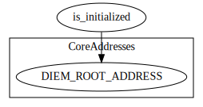

# Module `0x1::DiemBlock`

This module defines a struct storing the metadata of the block and new block events.

-  [Resource `BlockMetadata`](#0x1_DiemBlock_BlockMetadata)
-  [Struct `NewBlockEvent`](#0x1_DiemBlock_NewBlockEvent)
-  [Constants](#@Constants_0)
-  [Function `initialize_block_metadata`](#0x1_DiemBlock_initialize_block_metadata)
-  [Function `is_initialized`](#0x1_DiemBlock_is_initialized)
-  [Function `block_prologue`](#0x1_DiemBlock_block_prologue)
-  [Function `get_current_block_height`](#0x1_DiemBlock_get_current_block_height)
-  [Module Specification](#@Module_Specification_1)
    -  [Initialization](#@Initialization_2)

<pre><code><b>use</b> <a href="CoreAddresses.md#0x1_CoreAddresses">0x1::CoreAddresses</a>;
<b>use</b> <a href="DiemSystem.md#0x1_DiemSystem">0x1::DiemSystem</a>;
<b>use</b> <a href="DiemTimestamp.md#0x1_DiemTimestamp">0x1::DiemTimestamp</a>;
<b>use</b> <a href="../../../move-stdlib/docs/Errors.md#0x1_Errors">0x1::Errors</a>;
<b>use</b> <a href="../../../move-stdlib/docs/Event.md#0x1_Event">0x1::Event</a>;
</code></pre>

Show all the modules that "DiemBlock" depends on directly or indirectly

Show all the modules that depend on "DiemBlock" directly or indirectly

## Resource `BlockMetadata`

<pre><code><b>resource</b> <b>struct</b> <a href="DiemBlock.md#0x1_DiemBlock_BlockMetadata">BlockMetadata</a>
</code></pre>

Fields

<dl>
<dt>
<code>height: u64</code>
</dt>
<dd>
 Height of the current block
</dd>
<dt>
<code>new_block_events: <a href="../../../move-stdlib/docs/Event.md#0x1_Event_EventHandle">Event::EventHandle</a>&lt;<a href="DiemBlock.md#0x1_DiemBlock_NewBlockEvent">DiemBlock::NewBlockEvent</a>&gt;</code>
</dt>
<dd>
 Handle where events with the time of new blocks are emitted
</dd>
</dl>

## Struct `NewBlockEvent`

<pre><code><b>struct</b> <a href="DiemBlock.md#0x1_DiemBlock_NewBlockEvent">NewBlockEvent</a>
</code></pre>

Fields

<dl>
<dt>
<code>round: u64</code>
</dt>
<dd>

</dd>
<dt>
<code>proposer: address</code>
</dt>
<dd>

</dd>
<dt>
<code>previous_block_votes: vector&lt;address&gt;</code>
</dt>
<dd>

</dd>
<dt>
<code>time_microseconds: u64</code>
</dt>
<dd>
 On-chain time during  he block at the given height
</dd>
</dl>

## Constants

The <code><a href="DiemBlock.md#0x1_DiemBlock_BlockMetadata">BlockMetadata</a></code> resource is in an invalid state

<pre><code><b>const</b> <a href="DiemBlock.md#0x1_DiemBlock_EBLOCK_METADATA">EBLOCK_METADATA</a>: u64 = 0;
</code></pre>

An invalid signer was provided. Expected the signer to be the VM or a Validator.

<pre><code><b>const</b> <a href="DiemBlock.md#0x1_DiemBlock_EVM_OR_VALIDATOR">EVM_OR_VALIDATOR</a>: u64 = 1;
</code></pre>

## Function `initialize_block_metadata`

This can only be invoked by the Association address, and only a single time.
Currently, it is invoked in the genesis transaction

<pre><code><b>public</b> <b>fun</b> <a href="DiemBlock.md#0x1_DiemBlock_initialize_block_metadata">initialize_block_metadata</a>(account: &signer)
</code></pre>

Implementation

<pre><code><b>public</b> <b>fun</b> <a href="DiemBlock.md#0x1_DiemBlock_initialize_block_metadata">initialize_block_metadata</a>(account: &signer) {
    <a href="DiemTimestamp.md#0x1_DiemTimestamp_assert_genesis">DiemTimestamp::assert_genesis</a>();
    // Operational constraint, only callable by the Association address
    <a href="CoreAddresses.md#0x1_CoreAddresses_assert_diem_root">CoreAddresses::assert_diem_root</a>(account);

    <b>assert</b>(!<a href="DiemBlock.md#0x1_DiemBlock_is_initialized">is_initialized</a>(), <a href="../../../move-stdlib/docs/Errors.md#0x1_Errors_already_published">Errors::already_published</a>(<a href="DiemBlock.md#0x1_DiemBlock_EBLOCK_METADATA">EBLOCK_METADATA</a>));
    move_to&lt;<a href="DiemBlock.md#0x1_DiemBlock_BlockMetadata">BlockMetadata</a>&gt;(
        account,
        <a href="DiemBlock.md#0x1_DiemBlock_BlockMetadata">BlockMetadata</a> {
            height: 0,
            new_block_events: <a href="../../../move-stdlib/docs/Event.md#0x1_Event_new_event_handle">Event::new_event_handle</a>&lt;<a href="DiemBlock.md#0x1_DiemBlock_NewBlockEvent">Self::NewBlockEvent</a>&gt;(account),
        }
    );
}
</code></pre>

Specification

<pre><code><b>include</b> <a href="DiemTimestamp.md#0x1_DiemTimestamp_AbortsIfNotGenesis">DiemTimestamp::AbortsIfNotGenesis</a>;
<b>include</b> <a href="CoreAddresses.md#0x1_CoreAddresses_AbortsIfNotDiemRoot">CoreAddresses::AbortsIfNotDiemRoot</a>;
<b>aborts_if</b> <a href="DiemBlock.md#0x1_DiemBlock_is_initialized">is_initialized</a>() <b>with</b> <a href="../../../move-stdlib/docs/Errors.md#0x1_Errors_ALREADY_PUBLISHED">Errors::ALREADY_PUBLISHED</a>;
<b>ensures</b> <a href="DiemBlock.md#0x1_DiemBlock_is_initialized">is_initialized</a>();
<b>ensures</b> <a href="DiemBlock.md#0x1_DiemBlock_get_current_block_height">get_current_block_height</a>() == 0;
</code></pre>

Show all the functions that "initialize_block_metadata" calls

## Function `is_initialized`

Helper function to determine whether this module has been initialized.

<pre><code><b>fun</b> <a href="DiemBlock.md#0x1_DiemBlock_is_initialized">is_initialized</a>(): bool
</code></pre>

Implementation

<pre><code><b>fun</b> <a href="DiemBlock.md#0x1_DiemBlock_is_initialized">is_initialized</a>(): bool {
    <b>exists</b>&lt;<a href="DiemBlock.md#0x1_DiemBlock_BlockMetadata">BlockMetadata</a>&gt;(<a href="CoreAddresses.md#0x1_CoreAddresses_DIEM_ROOT_ADDRESS">CoreAddresses::DIEM_ROOT_ADDRESS</a>())
}
</code></pre>

Show all the functions that "is_initialized" calls

## Function `block_prologue`

Set the metadata for the current block.
The runtime always runs this before executing the transactions in a block.

<pre><code><b>fun</b> <a href="DiemBlock.md#0x1_DiemBlock_block_prologue">block_prologue</a>(vm: &signer, round: u64, timestamp: u64, previous_block_votes: vector&lt;address&gt;, proposer: address)
</code></pre>

Implementation

<pre><code><b>fun</b> <a href="DiemBlock.md#0x1_DiemBlock_block_prologue">block_prologue</a>(
    vm: &signer,
    round: u64,
    timestamp: u64,
    previous_block_votes: vector&lt;address&gt;,
    proposer: address
) <b>acquires</b> <a href="DiemBlock.md#0x1_DiemBlock_BlockMetadata">BlockMetadata</a> {
    <a href="DiemTimestamp.md#0x1_DiemTimestamp_assert_operating">DiemTimestamp::assert_operating</a>();
    // Operational constraint: can only be invoked by the VM.
    <a href="CoreAddresses.md#0x1_CoreAddresses_assert_vm">CoreAddresses::assert_vm</a>(vm);

    // Authorization
    <b>assert</b>(
        proposer == <a href="CoreAddresses.md#0x1_CoreAddresses_VM_RESERVED_ADDRESS">CoreAddresses::VM_RESERVED_ADDRESS</a>() || <a href="DiemSystem.md#0x1_DiemSystem_is_validator">DiemSystem::is_validator</a>(proposer),
        <a href="../../../move-stdlib/docs/Errors.md#0x1_Errors_requires_address">Errors::requires_address</a>(<a href="DiemBlock.md#0x1_DiemBlock_EVM_OR_VALIDATOR">EVM_OR_VALIDATOR</a>)
    );

    <b>let</b> block_metadata_ref = borrow_global_mut&lt;<a href="DiemBlock.md#0x1_DiemBlock_BlockMetadata">BlockMetadata</a>&gt;(<a href="CoreAddresses.md#0x1_CoreAddresses_DIEM_ROOT_ADDRESS">CoreAddresses::DIEM_ROOT_ADDRESS</a>());
    <a href="DiemTimestamp.md#0x1_DiemTimestamp_update_global_time">DiemTimestamp::update_global_time</a>(vm, proposer, timestamp);
    block_metadata_ref.height = block_metadata_ref.height + 1;
    <a href="../../../move-stdlib/docs/Event.md#0x1_Event_emit_event">Event::emit_event</a>&lt;<a href="DiemBlock.md#0x1_DiemBlock_NewBlockEvent">NewBlockEvent</a>&gt;(
        &<b>mut</b> block_metadata_ref.new_block_events,
        <a href="DiemBlock.md#0x1_DiemBlock_NewBlockEvent">NewBlockEvent</a> {
            round,
            proposer,
            previous_block_votes,
            time_microseconds: timestamp,
        }
    );
}
</code></pre>

Specification

<pre><code><b>include</b> <a href="DiemTimestamp.md#0x1_DiemTimestamp_AbortsIfNotOperating">DiemTimestamp::AbortsIfNotOperating</a>;
<b>include</b> <a href="CoreAddresses.md#0x1_CoreAddresses_AbortsIfNotVM">CoreAddresses::AbortsIfNotVM</a>{account: vm};
<b>aborts_if</b> proposer != <a href="CoreAddresses.md#0x1_CoreAddresses_VM_RESERVED_ADDRESS">CoreAddresses::VM_RESERVED_ADDRESS</a>() && !<a href="DiemSystem.md#0x1_DiemSystem_spec_is_validator">DiemSystem::spec_is_validator</a>(proposer)
    <b>with</b> <a href="../../../move-stdlib/docs/Errors.md#0x1_Errors_REQUIRES_ADDRESS">Errors::REQUIRES_ADDRESS</a>;
<b>ensures</b> <a href="DiemTimestamp.md#0x1_DiemTimestamp_spec_now_microseconds">DiemTimestamp::spec_now_microseconds</a>() == timestamp;
<b>ensures</b> <a href="DiemBlock.md#0x1_DiemBlock_get_current_block_height">get_current_block_height</a>() == <b>old</b>(<a href="DiemBlock.md#0x1_DiemBlock_get_current_block_height">get_current_block_height</a>()) + 1;
<b>aborts_if</b> <a href="DiemBlock.md#0x1_DiemBlock_get_current_block_height">get_current_block_height</a>() + 1 &gt; MAX_U64 <b>with</b> EXECUTION_FAILURE;
<b>include</b> <a href="DiemBlock.md#0x1_DiemBlock_BlockPrologueEmits">BlockPrologueEmits</a>;
</code></pre>

<pre><code><b>schema</b> <a href="DiemBlock.md#0x1_DiemBlock_BlockPrologueEmits">BlockPrologueEmits</a> {
    round: u64;
    timestamp: u64;
    previous_block_votes: vector&lt;address&gt;;
    proposer: address;
    
    <b>let</b> handle = <b>global</b>&lt;<a href="DiemBlock.md#0x1_DiemBlock_BlockMetadata">BlockMetadata</a>&gt;(<a href="CoreAddresses.md#0x1_CoreAddresses_DIEM_ROOT_ADDRESS">CoreAddresses::DIEM_ROOT_ADDRESS</a>()).new_block_events;
    
    <b>let</b> msg = <a href="DiemBlock.md#0x1_DiemBlock_NewBlockEvent">NewBlockEvent</a> {
        round,
        proposer,
        previous_block_votes,
        time_microseconds: timestamp,
    };
    emits msg <b>to</b> handle;
}
</code></pre>

Show all the functions that "block_prologue" calls

## Function `get_current_block_height`

Get the current block height

<pre><code><b>public</b> <b>fun</b> <a href="DiemBlock.md#0x1_DiemBlock_get_current_block_height">get_current_block_height</a>(): u64
</code></pre>

Implementation

<pre><code><b>public</b> <b>fun</b> <a href="DiemBlock.md#0x1_DiemBlock_get_current_block_height">get_current_block_height</a>(): u64 <b>acquires</b> <a href="DiemBlock.md#0x1_DiemBlock_BlockMetadata">BlockMetadata</a> {
    <b>assert</b>(<a href="DiemBlock.md#0x1_DiemBlock_is_initialized">is_initialized</a>(), <a href="../../../move-stdlib/docs/Errors.md#0x1_Errors_not_published">Errors::not_published</a>(<a href="DiemBlock.md#0x1_DiemBlock_EBLOCK_METADATA">EBLOCK_METADATA</a>));
    borrow_global&lt;<a href="DiemBlock.md#0x1_DiemBlock_BlockMetadata">BlockMetadata</a>&gt;(<a href="CoreAddresses.md#0x1_CoreAddresses_DIEM_ROOT_ADDRESS">CoreAddresses::DIEM_ROOT_ADDRESS</a>()).height
}
</code></pre>

Show all the functions that "get_current_block_height" calls

## Module Specification

### Initialization

This implies that <code><a href="DiemBlock.md#0x1_DiemBlock_BlockMetadata">BlockMetadata</a></code> is published after initialization and stays published
ever after

<pre><code><b>invariant</b> [<b>global</b>] <a href="DiemTimestamp.md#0x1_DiemTimestamp_is_operating">DiemTimestamp::is_operating</a>() ==&gt; <a href="DiemBlock.md#0x1_DiemBlock_is_initialized">is_initialized</a>();
</code></pre>

[//]: # ("File containing references which can be used from documentation")
[ACCESS_CONTROL]: https://github.com/diem/dip/blob/main/dips/dip-2.md
[ROLE]: https://github.com/diem/dip/blob/main/dips/dip-2.md#roles
[PERMISSION]: https://github.com/diem/dip/blob/main/dips/dip-2.md#permissions
