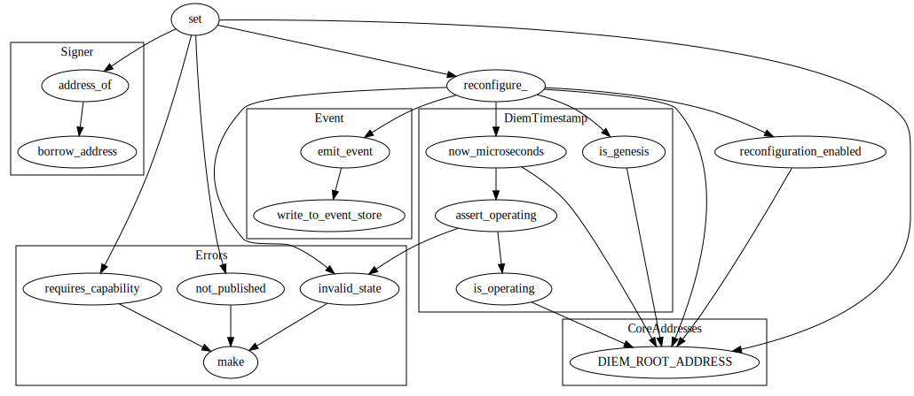
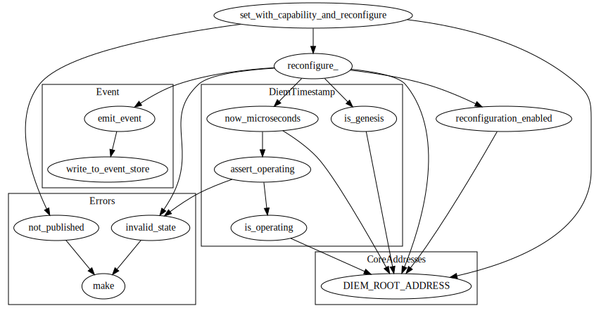
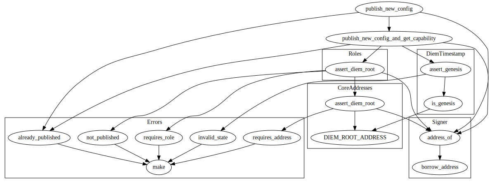
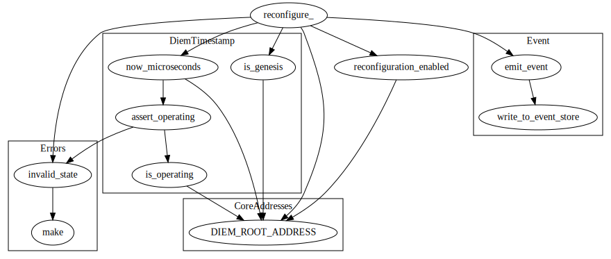

# Module `0x1::DiemConfig`

Publishes configuration information for validators, and issues reconfiguration events
to synchronize configuration changes for the validators.

-  [Resource `DiemConfig`](#0x1_DiemConfig_DiemConfig)
-  [Struct `NewEpochEvent`](#0x1_DiemConfig_NewEpochEvent)
-  [Resource `Configuration`](#0x1_DiemConfig_Configuration)
-  [Resource `ModifyConfigCapability`](#0x1_DiemConfig_ModifyConfigCapability)
-  [Resource `DisableReconfiguration`](#0x1_DiemConfig_DisableReconfiguration)
-  [Constants](#@Constants_0)
-  [Function `initialize`](#0x1_DiemConfig_initialize)
-  [Function `get`](#0x1_DiemConfig_get)
-  [Function `set`](#0x1_DiemConfig_set)
-  [Function `set_with_capability_and_reconfigure`](#0x1_DiemConfig_set_with_capability_and_reconfigure)
-  [Function `disable_reconfiguration`](#0x1_DiemConfig_disable_reconfiguration)
-  [Function `enable_reconfiguration`](#0x1_DiemConfig_enable_reconfiguration)
-  [Function `reconfiguration_enabled`](#0x1_DiemConfig_reconfiguration_enabled)
-  [Function `publish_new_config_and_get_capability`](#0x1_DiemConfig_publish_new_config_and_get_capability)
-  [Function `publish_new_config`](#0x1_DiemConfig_publish_new_config)
-  [Function `reconfigure`](#0x1_DiemConfig_reconfigure)
-  [Function `reconfigure_`](#0x1_DiemConfig_reconfigure_)
-  [Function `emit_genesis_reconfiguration_event`](#0x1_DiemConfig_emit_genesis_reconfiguration_event)
-  [Module Specification](#@Module_Specification_1)
    -  [Initialization](#@Initialization_2)
    -  [Invariants](#@Invariants_3)
    -  [Helper Functions](#@Helper_Functions_4)

<pre><code><b>use</b> <a href="CoreAddresses.md#0x1_CoreAddresses">0x1::CoreAddresses</a>;
<b>use</b> <a href="DiemTimestamp.md#0x1_DiemTimestamp">0x1::DiemTimestamp</a>;
<b>use</b> <a href="../../../move-stdlib/docs/Errors.md#0x1_Errors">0x1::Errors</a>;
<b>use</b> <a href="../../../move-stdlib/docs/Event.md#0x1_Event">0x1::Event</a>;
<b>use</b> <a href="Roles.md#0x1_Roles">0x1::Roles</a>;
<b>use</b> <a href="../../../move-stdlib/docs/Signer.md#0x1_Signer">0x1::Signer</a>;
</code></pre>

Show all the modules that "DiemConfig" depends on directly or indirectly

Show all the modules that depend on "DiemConfig" directly or indirectly

## Resource `DiemConfig`

A generic singleton resource that holds a value of a specific type.

<pre><code><b>resource</b> <b>struct</b> <a href="DiemConfig.md#0x1_DiemConfig">DiemConfig</a>&lt;Config: <b>copyable</b>&gt;
</code></pre>

Fields

<dl>
<dt>
<code>payload: Config</code>
</dt>
<dd>
 Holds specific info for instance of <code>Config</code> type.
</dd>
</dl>

## Struct `NewEpochEvent`

Event that signals DiemBFT algorithm to start a new epoch,
with new configuration information. This is also called a
"reconfiguration event"

<pre><code><b>struct</b> <a href="DiemConfig.md#0x1_DiemConfig_NewEpochEvent">NewEpochEvent</a>
</code></pre>

Fields

<dl>
<dt>
<code>epoch: u64</code>
</dt>
<dd>

</dd>
</dl>

## Resource `Configuration`

Holds information about state of reconfiguration

<pre><code><b>resource</b> <b>struct</b> <a href="DiemConfig.md#0x1_DiemConfig_Configuration">Configuration</a>
</code></pre>

Fields

<dl>
<dt>
<code>epoch: u64</code>
</dt>
<dd>
 Epoch number
</dd>
<dt>
<code>last_reconfiguration_time: u64</code>
</dt>
<dd>
 Time of last reconfiguration. Only changes on reconfiguration events.
</dd>
<dt>
<code>events: <a href="../../../move-stdlib/docs/Event.md#0x1_Event_EventHandle">Event::EventHandle</a>&lt;<a href="DiemConfig.md#0x1_DiemConfig_NewEpochEvent">DiemConfig::NewEpochEvent</a>&gt;</code>
</dt>
<dd>
 Event handle for reconfiguration events
</dd>
</dl>

## Resource `ModifyConfigCapability`

Accounts with this privilege can modify DiemConfig<TypeName> under Diem root address.

<pre><code><b>resource</b> <b>struct</b> <a href="DiemConfig.md#0x1_DiemConfig_ModifyConfigCapability">ModifyConfigCapability</a>&lt;TypeName&gt;
</code></pre>

Fields

<dl>
<dt>
<code>dummy_field: bool</code>
</dt>
<dd>

</dd>
</dl>

## Resource `DisableReconfiguration`

Reconfiguration disabled if this resource occurs under LibraRoot.

<pre><code><b>resource</b> <b>struct</b> <a href="DiemConfig.md#0x1_DiemConfig_DisableReconfiguration">DisableReconfiguration</a>
</code></pre>

Fields

<dl>
<dt>
<code>dummy_field: bool</code>
</dt>
<dd>

</dd>
</dl>

## Constants

The largest possible u64 value

<pre><code><b>const</b> <a href="DiemConfig.md#0x1_DiemConfig_MAX_U64">MAX_U64</a>: u64 = 18446744073709551615;
</code></pre>

The <code><a href="DiemConfig.md#0x1_DiemConfig_Configuration">Configuration</a></code> resource is in an invalid state

<pre><code><b>const</b> <a href="DiemConfig.md#0x1_DiemConfig_ECONFIGURATION">ECONFIGURATION</a>: u64 = 0;
</code></pre>

A <code><a href="DiemConfig.md#0x1_DiemConfig">DiemConfig</a></code> resource is in an invalid state

<pre><code><b>const</b> <a href="DiemConfig.md#0x1_DiemConfig_EDIEM_CONFIG">EDIEM_CONFIG</a>: u64 = 1;
</code></pre>

An invalid block time was encountered.

<pre><code><b>const</b> <a href="DiemConfig.md#0x1_DiemConfig_EINVALID_BLOCK_TIME">EINVALID_BLOCK_TIME</a>: u64 = 3;
</code></pre>

A <code><a href="DiemConfig.md#0x1_DiemConfig_ModifyConfigCapability">ModifyConfigCapability</a></code> is in a different state than was expected

<pre><code><b>const</b> <a href="DiemConfig.md#0x1_DiemConfig_EMODIFY_CAPABILITY">EMODIFY_CAPABILITY</a>: u64 = 2;
</code></pre>

## Function `initialize`

Publishes <code><a href="DiemConfig.md#0x1_DiemConfig_Configuration">Configuration</a></code> resource. Can only be invoked by Diem root, and only a single time in Genesis.

<pre><code><b>public</b> <b>fun</b> <a href="DiemConfig.md#0x1_DiemConfig_initialize">initialize</a>(dr_account: &signer)
</code></pre>

Implementation

<pre><code><b>public</b> <b>fun</b> <a href="DiemConfig.md#0x1_DiemConfig_initialize">initialize</a>(
    dr_account: &signer,
) {
    <a href="DiemTimestamp.md#0x1_DiemTimestamp_assert_genesis">DiemTimestamp::assert_genesis</a>();
    <a href="CoreAddresses.md#0x1_CoreAddresses_assert_diem_root">CoreAddresses::assert_diem_root</a>(dr_account);
    <b>assert</b>(!<b>exists</b>&lt;<a href="DiemConfig.md#0x1_DiemConfig_Configuration">Configuration</a>&gt;(<a href="CoreAddresses.md#0x1_CoreAddresses_DIEM_ROOT_ADDRESS">CoreAddresses::DIEM_ROOT_ADDRESS</a>()), <a href="../../../move-stdlib/docs/Errors.md#0x1_Errors_already_published">Errors::already_published</a>(<a href="DiemConfig.md#0x1_DiemConfig_ECONFIGURATION">ECONFIGURATION</a>));
    move_to&lt;<a href="DiemConfig.md#0x1_DiemConfig_Configuration">Configuration</a>&gt;(
        dr_account,
        <a href="DiemConfig.md#0x1_DiemConfig_Configuration">Configuration</a> {
            epoch: 0,
            last_reconfiguration_time: 0,
            events: <a href="../../../move-stdlib/docs/Event.md#0x1_Event_new_event_handle">Event::new_event_handle</a>&lt;<a href="DiemConfig.md#0x1_DiemConfig_NewEpochEvent">NewEpochEvent</a>&gt;(dr_account),
        }
    );
}
</code></pre>

Specification

<pre><code><b>pragma</b> opaque;
<b>include</b> <a href="DiemConfig.md#0x1_DiemConfig_InitializeAbortsIf">InitializeAbortsIf</a>;
<b>include</b> <a href="DiemConfig.md#0x1_DiemConfig_InitializeEnsures">InitializeEnsures</a>;
<b>modifies</b> <b>global</b>&lt;<a href="DiemConfig.md#0x1_DiemConfig_Configuration">Configuration</a>&gt;(<a href="CoreAddresses.md#0x1_CoreAddresses_DIEM_ROOT_ADDRESS">CoreAddresses::DIEM_ROOT_ADDRESS</a>());
<b>modifies</b> <b>global</b>&lt;<a href="../../../move-stdlib/docs/Event.md#0x1_Event_EventHandleGenerator">Event::EventHandleGenerator</a>&gt;(<a href="../../../move-stdlib/docs/Signer.md#0x1_Signer_spec_address_of">Signer::spec_address_of</a>(dr_account));
</code></pre>

<pre><code><b>schema</b> <a href="DiemConfig.md#0x1_DiemConfig_InitializeAbortsIf">InitializeAbortsIf</a> {
    dr_account: signer;
    <b>include</b> <a href="DiemTimestamp.md#0x1_DiemTimestamp_AbortsIfNotGenesis">DiemTimestamp::AbortsIfNotGenesis</a>;
    <b>include</b> <a href="CoreAddresses.md#0x1_CoreAddresses_AbortsIfNotDiemRoot">CoreAddresses::AbortsIfNotDiemRoot</a>{account: dr_account};
    <b>aborts_if</b> <a href="DiemConfig.md#0x1_DiemConfig_spec_has_config">spec_has_config</a>() <b>with</b> <a href="../../../move-stdlib/docs/Errors.md#0x1_Errors_ALREADY_PUBLISHED">Errors::ALREADY_PUBLISHED</a>;
}
</code></pre>

<pre><code><b>schema</b> <a href="DiemConfig.md#0x1_DiemConfig_InitializeEnsures">InitializeEnsures</a> {
    <b>ensures</b> <a href="DiemConfig.md#0x1_DiemConfig_spec_has_config">spec_has_config</a>();
    
    <b>let</b> new_config = <b>global</b>&lt;<a href="DiemConfig.md#0x1_DiemConfig_Configuration">Configuration</a>&gt;(<a href="CoreAddresses.md#0x1_CoreAddresses_DIEM_ROOT_ADDRESS">CoreAddresses::DIEM_ROOT_ADDRESS</a>());
    <b>ensures</b> new_config.epoch == 0;
    <b>ensures</b> new_config.last_reconfiguration_time == 0;
}
</code></pre>

Show all the functions that "initialize" calls

## Function `get`

Returns a copy of <code>Config</code> value stored under <code>addr</code>.

<pre><code><b>public</b> <b>fun</b> <a href="DiemConfig.md#0x1_DiemConfig_get">get</a>&lt;Config: <b>copyable</b>&gt;(): Config
</code></pre>

Implementation

<pre><code><b>public</b> <b>fun</b> <a href="DiemConfig.md#0x1_DiemConfig_get">get</a>&lt;Config: <b>copy</b> + drop + store&gt;(): Config
<b>acquires</b> <a href="DiemConfig.md#0x1_DiemConfig">DiemConfig</a> {
    <b>let</b> addr = <a href="CoreAddresses.md#0x1_CoreAddresses_DIEM_ROOT_ADDRESS">CoreAddresses::DIEM_ROOT_ADDRESS</a>();
    <b>assert</b>(<b>exists</b>&lt;<a href="DiemConfig.md#0x1_DiemConfig">DiemConfig</a>&lt;Config&gt;&gt;(addr), <a href="../../../move-stdlib/docs/Errors.md#0x1_Errors_not_published">Errors::not_published</a>(<a href="DiemConfig.md#0x1_DiemConfig_EDIEM_CONFIG">EDIEM_CONFIG</a>));
    *&borrow_global&lt;<a href="DiemConfig.md#0x1_DiemConfig">DiemConfig</a>&lt;Config&gt;&gt;(addr).payload
}
</code></pre>

Specification

<pre><code><b>pragma</b> opaque;
<b>include</b> <a href="DiemConfig.md#0x1_DiemConfig_AbortsIfNotPublished">AbortsIfNotPublished</a>&lt;Config&gt;;
<b>ensures</b> result == <a href="DiemConfig.md#0x1_DiemConfig_get">get</a>&lt;Config&gt;();
</code></pre>

<pre><code><b>schema</b> <a href="DiemConfig.md#0x1_DiemConfig_AbortsIfNotPublished">AbortsIfNotPublished</a>&lt;Config&gt; {
    <b>aborts_if</b> !<b>exists</b>&lt;<a href="DiemConfig.md#0x1_DiemConfig">DiemConfig</a>&lt;Config&gt;&gt;(<a href="CoreAddresses.md#0x1_CoreAddresses_DIEM_ROOT_ADDRESS">CoreAddresses::DIEM_ROOT_ADDRESS</a>()) <b>with</b> <a href="../../../move-stdlib/docs/Errors.md#0x1_Errors_NOT_PUBLISHED">Errors::NOT_PUBLISHED</a>;
}
</code></pre>

Show all the functions that "get" calls

## Function `set`

Set a config item to a new value with the default capability stored under config address and trigger a
reconfiguration. This function requires that the signer have a <code><a href="DiemConfig.md#0x1_DiemConfig_ModifyConfigCapability">ModifyConfigCapability</a>&lt;Config&gt;</code>
resource published under it.

<pre><code><b>public</b> <b>fun</b> <a href="DiemConfig.md#0x1_DiemConfig_set">set</a>&lt;Config: <b>copyable</b>&gt;(account: &signer, payload: Config)
</code></pre>

Implementation

<pre><code><b>public</b> <b>fun</b> <a href="DiemConfig.md#0x1_DiemConfig_set">set</a>&lt;Config: <b>copy</b> + drop + store&gt;(account: &signer, payload: Config)
<b>acquires</b> <a href="DiemConfig.md#0x1_DiemConfig">DiemConfig</a>, <a href="DiemConfig.md#0x1_DiemConfig_Configuration">Configuration</a> {
    <b>let</b> signer_address = <a href="../../../move-stdlib/docs/Signer.md#0x1_Signer_address_of">Signer::address_of</a>(account);
    // Next should always be <b>true</b> <b>if</b> properly initialized.
    <b>assert</b>(<b>exists</b>&lt;<a href="DiemConfig.md#0x1_DiemConfig_ModifyConfigCapability">ModifyConfigCapability</a>&lt;Config&gt;&gt;(signer_address), <a href="../../../move-stdlib/docs/Errors.md#0x1_Errors_requires_capability">Errors::requires_capability</a>(<a href="DiemConfig.md#0x1_DiemConfig_EMODIFY_CAPABILITY">EMODIFY_CAPABILITY</a>));

    <b>let</b> addr = <a href="CoreAddresses.md#0x1_CoreAddresses_DIEM_ROOT_ADDRESS">CoreAddresses::DIEM_ROOT_ADDRESS</a>();
    <b>assert</b>(<b>exists</b>&lt;<a href="DiemConfig.md#0x1_DiemConfig">DiemConfig</a>&lt;Config&gt;&gt;(addr), <a href="../../../move-stdlib/docs/Errors.md#0x1_Errors_not_published">Errors::not_published</a>(<a href="DiemConfig.md#0x1_DiemConfig_EDIEM_CONFIG">EDIEM_CONFIG</a>));
    <b>let</b> config = borrow_global_mut&lt;<a href="DiemConfig.md#0x1_DiemConfig">DiemConfig</a>&lt;Config&gt;&gt;(addr);
    config.payload = payload;

    <a href="DiemConfig.md#0x1_DiemConfig_reconfigure_">reconfigure_</a>();
}
</code></pre>

Specification

TODO: turned off verification until we solve the
generic type/specific invariant issue

<pre><code><b>pragma</b> opaque, verify = <b>false</b>;
<b>modifies</b> <b>global</b>&lt;<a href="DiemConfig.md#0x1_DiemConfig_Configuration">Configuration</a>&gt;(<a href="CoreAddresses.md#0x1_CoreAddresses_DIEM_ROOT_ADDRESS">CoreAddresses::DIEM_ROOT_ADDRESS</a>());
<b>modifies</b> <b>global</b>&lt;<a href="DiemConfig.md#0x1_DiemConfig">DiemConfig</a>&lt;Config&gt;&gt;(<a href="CoreAddresses.md#0x1_CoreAddresses_DIEM_ROOT_ADDRESS">CoreAddresses::DIEM_ROOT_ADDRESS</a>());
<b>include</b> <a href="DiemConfig.md#0x1_DiemConfig_SetAbortsIf">SetAbortsIf</a>&lt;Config&gt;;
<b>include</b> <a href="DiemConfig.md#0x1_DiemConfig_SetEnsures">SetEnsures</a>&lt;Config&gt;;
</code></pre>

<pre><code><b>schema</b> <a href="DiemConfig.md#0x1_DiemConfig_SetAbortsIf">SetAbortsIf</a>&lt;Config&gt; {
    account: signer;
    <b>include</b> <a href="DiemConfig.md#0x1_DiemConfig_AbortsIfNotModifiable">AbortsIfNotModifiable</a>&lt;Config&gt;;
    <b>include</b> <a href="DiemConfig.md#0x1_DiemConfig_AbortsIfNotPublished">AbortsIfNotPublished</a>&lt;Config&gt;;
    <b>include</b> <a href="DiemConfig.md#0x1_DiemConfig_ReconfigureAbortsIf">ReconfigureAbortsIf</a>;
}
</code></pre>

<pre><code><b>schema</b> <a href="DiemConfig.md#0x1_DiemConfig_AbortsIfNotModifiable">AbortsIfNotModifiable</a>&lt;Config&gt; {
    account: signer;
    <b>aborts_if</b> !<b>exists</b>&lt;<a href="DiemConfig.md#0x1_DiemConfig_ModifyConfigCapability">ModifyConfigCapability</a>&lt;Config&gt;&gt;(<a href="../../../move-stdlib/docs/Signer.md#0x1_Signer_spec_address_of">Signer::spec_address_of</a>(account))
        <b>with</b> <a href="../../../move-stdlib/docs/Errors.md#0x1_Errors_REQUIRES_CAPABILITY">Errors::REQUIRES_CAPABILITY</a>;
}
</code></pre>

<pre><code><b>schema</b> <a href="DiemConfig.md#0x1_DiemConfig_SetEnsures">SetEnsures</a>&lt;Config&gt; {
    payload: Config;
    <b>ensures</b> <a href="DiemConfig.md#0x1_DiemConfig_spec_is_published">spec_is_published</a>&lt;Config&gt;();
    <b>ensures</b> <a href="DiemConfig.md#0x1_DiemConfig_get">get</a>&lt;Config&gt;() == payload;
    <b>ensures</b> <b>old</b>(<a href="DiemConfig.md#0x1_DiemConfig_spec_has_config">spec_has_config</a>()) == <a href="DiemConfig.md#0x1_DiemConfig_spec_has_config">spec_has_config</a>();
}
</code></pre>

Show all the functions that "set" calls

## Function `set_with_capability_and_reconfigure`

Set a config item to a new value and trigger a reconfiguration. This function
requires a reference to a <code><a href="DiemConfig.md#0x1_DiemConfig_ModifyConfigCapability">ModifyConfigCapability</a></code>, which is returned when the
config is published using <code>publish_new_config_and_get_capability</code>.
It is called by <code><a href="DiemSystem.md#0x1_DiemSystem_update_config_and_reconfigure">DiemSystem::update_config_and_reconfigure</a></code>, which allows
validator operators to change the validator set.  All other config changes require
a Diem root signer.

<pre><code><b>public</b> <b>fun</b> <a href="DiemConfig.md#0x1_DiemConfig_set_with_capability_and_reconfigure">set_with_capability_and_reconfigure</a>&lt;Config: <b>copyable</b>&gt;(_cap: &<a href="DiemConfig.md#0x1_DiemConfig_ModifyConfigCapability">DiemConfig::ModifyConfigCapability</a>&lt;Config&gt;, payload: Config)
</code></pre>

Implementation

<pre><code><b>public</b> <b>fun</b> <a href="DiemConfig.md#0x1_DiemConfig_set_with_capability_and_reconfigure">set_with_capability_and_reconfigure</a>&lt;Config: <b>copy</b> + drop + store&gt;(
    _cap: &<a href="DiemConfig.md#0x1_DiemConfig_ModifyConfigCapability">ModifyConfigCapability</a>&lt;Config&gt;,
    payload: Config
) <b>acquires</b> <a href="DiemConfig.md#0x1_DiemConfig">DiemConfig</a>, <a href="DiemConfig.md#0x1_DiemConfig_Configuration">Configuration</a> {
    <b>let</b> addr = <a href="CoreAddresses.md#0x1_CoreAddresses_DIEM_ROOT_ADDRESS">CoreAddresses::DIEM_ROOT_ADDRESS</a>();
    <b>assert</b>(<b>exists</b>&lt;<a href="DiemConfig.md#0x1_DiemConfig">DiemConfig</a>&lt;Config&gt;&gt;(addr), <a href="../../../move-stdlib/docs/Errors.md#0x1_Errors_not_published">Errors::not_published</a>(<a href="DiemConfig.md#0x1_DiemConfig_EDIEM_CONFIG">EDIEM_CONFIG</a>));
    <b>let</b> config = borrow_global_mut&lt;<a href="DiemConfig.md#0x1_DiemConfig">DiemConfig</a>&lt;Config&gt;&gt;(addr);
    config.payload = payload;
    <a href="DiemConfig.md#0x1_DiemConfig_reconfigure_">reconfigure_</a>();
}
</code></pre>

Specification

TODO: turned off verification until we solve the
generic type/specific invariant issue

<pre><code><b>pragma</b> opaque, verify = <b>false</b>;
<b>modifies</b> <b>global</b>&lt;<a href="DiemConfig.md#0x1_DiemConfig_Configuration">Configuration</a>&gt;(<a href="CoreAddresses.md#0x1_CoreAddresses_DIEM_ROOT_ADDRESS">CoreAddresses::DIEM_ROOT_ADDRESS</a>());
<b>include</b> <a href="DiemConfig.md#0x1_DiemConfig_AbortsIfNotPublished">AbortsIfNotPublished</a>&lt;Config&gt;;
<b>include</b> <a href="DiemConfig.md#0x1_DiemConfig_ReconfigureAbortsIf">ReconfigureAbortsIf</a>;
<b>modifies</b> <b>global</b>&lt;<a href="DiemConfig.md#0x1_DiemConfig">DiemConfig</a>&lt;Config&gt;&gt;(<a href="CoreAddresses.md#0x1_CoreAddresses_DIEM_ROOT_ADDRESS">CoreAddresses::DIEM_ROOT_ADDRESS</a>());
<b>include</b> <a href="DiemConfig.md#0x1_DiemConfig_SetEnsures">SetEnsures</a>&lt;Config&gt;;
<b>include</b> <a href="DiemConfig.md#0x1_DiemConfig_ReconfigureEmits">ReconfigureEmits</a>;
</code></pre>

Show all the functions that "set_with_capability_and_reconfigure" calls

## Function `disable_reconfiguration`

Private function to temporarily halt reconfiguration.
This function should only be used for offline WriteSet generation purpose and should never be invoked on chain.

<pre><code><b>fun</b> <a href="DiemConfig.md#0x1_DiemConfig_disable_reconfiguration">disable_reconfiguration</a>(dr_account: &signer)
</code></pre>

Implementation

<pre><code><b>fun</b> <a href="DiemConfig.md#0x1_DiemConfig_disable_reconfiguration">disable_reconfiguration</a>(dr_account: &signer) {
    <b>assert</b>(
        <a href="../../../move-stdlib/docs/Signer.md#0x1_Signer_address_of">Signer::address_of</a>(dr_account) == <a href="CoreAddresses.md#0x1_CoreAddresses_DIEM_ROOT_ADDRESS">CoreAddresses::DIEM_ROOT_ADDRESS</a>(),
        <a href="../../../move-stdlib/docs/Errors.md#0x1_Errors_requires_address">Errors::requires_address</a>(<a href="DiemConfig.md#0x1_DiemConfig_EDIEM_CONFIG">EDIEM_CONFIG</a>)
    );
    <a href="Roles.md#0x1_Roles_assert_diem_root">Roles::assert_diem_root</a>(dr_account);
    <b>assert</b>(<a href="DiemConfig.md#0x1_DiemConfig_reconfiguration_enabled">reconfiguration_enabled</a>(), <a href="../../../move-stdlib/docs/Errors.md#0x1_Errors_invalid_state">Errors::invalid_state</a>(<a href="DiemConfig.md#0x1_DiemConfig_ECONFIGURATION">ECONFIGURATION</a>));
    move_to(dr_account, <a href="DiemConfig.md#0x1_DiemConfig_DisableReconfiguration">DisableReconfiguration</a> {} )
}
</code></pre>

Show all the functions that "disable_reconfiguration" calls

## Function `enable_reconfiguration`

Private function to resume reconfiguration.
This function should only be used for offline WriteSet generation purpose and should never be invoked on chain.

<pre><code><b>fun</b> <a href="DiemConfig.md#0x1_DiemConfig_enable_reconfiguration">enable_reconfiguration</a>(dr_account: &signer)
</code></pre>

Implementation

<pre><code><b>fun</b> <a href="DiemConfig.md#0x1_DiemConfig_enable_reconfiguration">enable_reconfiguration</a>(dr_account: &signer) <b>acquires</b> <a href="DiemConfig.md#0x1_DiemConfig_DisableReconfiguration">DisableReconfiguration</a> {
    <b>assert</b>(
        <a href="../../../move-stdlib/docs/Signer.md#0x1_Signer_address_of">Signer::address_of</a>(dr_account) == <a href="CoreAddresses.md#0x1_CoreAddresses_DIEM_ROOT_ADDRESS">CoreAddresses::DIEM_ROOT_ADDRESS</a>(),
        <a href="../../../move-stdlib/docs/Errors.md#0x1_Errors_requires_address">Errors::requires_address</a>(<a href="DiemConfig.md#0x1_DiemConfig_EDIEM_CONFIG">EDIEM_CONFIG</a>)
    );
    <a href="Roles.md#0x1_Roles_assert_diem_root">Roles::assert_diem_root</a>(dr_account);

    <b>assert</b>(!<a href="DiemConfig.md#0x1_DiemConfig_reconfiguration_enabled">reconfiguration_enabled</a>(), <a href="../../../move-stdlib/docs/Errors.md#0x1_Errors_invalid_state">Errors::invalid_state</a>(<a href="DiemConfig.md#0x1_DiemConfig_ECONFIGURATION">ECONFIGURATION</a>));
    <a href="DiemConfig.md#0x1_DiemConfig_DisableReconfiguration">DisableReconfiguration</a> {} = move_from&lt;<a href="DiemConfig.md#0x1_DiemConfig_DisableReconfiguration">DisableReconfiguration</a>&gt;(<a href="../../../move-stdlib/docs/Signer.md#0x1_Signer_address_of">Signer::address_of</a>(dr_account));
}
</code></pre>

Show all the functions that "enable_reconfiguration" calls

## Function `reconfiguration_enabled`

<pre><code><b>fun</b> <a href="DiemConfig.md#0x1_DiemConfig_reconfiguration_enabled">reconfiguration_enabled</a>(): bool
</code></pre>

Implementation

<pre><code><b>fun</b> <a href="DiemConfig.md#0x1_DiemConfig_reconfiguration_enabled">reconfiguration_enabled</a>(): bool {
    !<b>exists</b>&lt;<a href="DiemConfig.md#0x1_DiemConfig_DisableReconfiguration">DisableReconfiguration</a>&gt;(<a href="CoreAddresses.md#0x1_CoreAddresses_DIEM_ROOT_ADDRESS">CoreAddresses::DIEM_ROOT_ADDRESS</a>())
}
</code></pre>

Show all the functions that "reconfiguration_enabled" calls

## Function `publish_new_config_and_get_capability`

Publishes a new config.
The caller will use the returned ModifyConfigCapability to specify the access control
policy for who can modify the config.
Does not trigger a reconfiguration.

<pre><code><b>public</b> <b>fun</b> <a href="DiemConfig.md#0x1_DiemConfig_publish_new_config_and_get_capability">publish_new_config_and_get_capability</a>&lt;Config: <b>copyable</b>&gt;(dr_account: &signer, payload: Config): <a href="DiemConfig.md#0x1_DiemConfig_ModifyConfigCapability">DiemConfig::ModifyConfigCapability</a>&lt;Config&gt;
</code></pre>

Implementation

<pre><code><b>public</b> <b>fun</b> <a href="DiemConfig.md#0x1_DiemConfig_publish_new_config_and_get_capability">publish_new_config_and_get_capability</a>&lt;Config: <b>copy</b> + drop + store&gt;(
    dr_account: &signer,
    payload: Config,
): <a href="DiemConfig.md#0x1_DiemConfig_ModifyConfigCapability">ModifyConfigCapability</a>&lt;Config&gt; {
    <a href="DiemTimestamp.md#0x1_DiemTimestamp_assert_genesis">DiemTimestamp::assert_genesis</a>();
    <a href="Roles.md#0x1_Roles_assert_diem_root">Roles::assert_diem_root</a>(dr_account);
    <b>assert</b>(
        !<b>exists</b>&lt;<a href="DiemConfig.md#0x1_DiemConfig">DiemConfig</a>&lt;Config&gt;&gt;(<a href="../../../move-stdlib/docs/Signer.md#0x1_Signer_address_of">Signer::address_of</a>(dr_account)),
        <a href="../../../move-stdlib/docs/Errors.md#0x1_Errors_already_published">Errors::already_published</a>(<a href="DiemConfig.md#0x1_DiemConfig_EDIEM_CONFIG">EDIEM_CONFIG</a>)
    );
    move_to(dr_account, <a href="DiemConfig.md#0x1_DiemConfig">DiemConfig</a> { payload });
    <a href="DiemConfig.md#0x1_DiemConfig_ModifyConfigCapability">ModifyConfigCapability</a>&lt;Config&gt; {}
}
</code></pre>

Specification

TODO: turned off verification until we solve the
generic type/specific invariant issue

<pre><code><b>pragma</b> opaque, verify = <b>false</b>;
<b>modifies</b> <b>global</b>&lt;<a href="DiemConfig.md#0x1_DiemConfig">DiemConfig</a>&lt;Config&gt;&gt;(<a href="CoreAddresses.md#0x1_CoreAddresses_DIEM_ROOT_ADDRESS">CoreAddresses::DIEM_ROOT_ADDRESS</a>());
<b>include</b> <a href="DiemTimestamp.md#0x1_DiemTimestamp_AbortsIfNotGenesis">DiemTimestamp::AbortsIfNotGenesis</a>;
<b>include</b> <a href="Roles.md#0x1_Roles_AbortsIfNotDiemRoot">Roles::AbortsIfNotDiemRoot</a>{account: dr_account};
<b>include</b> <a href="DiemConfig.md#0x1_DiemConfig_AbortsIfPublished">AbortsIfPublished</a>&lt;Config&gt;;
<b>include</b> <a href="DiemConfig.md#0x1_DiemConfig_SetEnsures">SetEnsures</a>&lt;Config&gt;;
</code></pre>

<pre><code><b>schema</b> <a href="DiemConfig.md#0x1_DiemConfig_AbortsIfPublished">AbortsIfPublished</a>&lt;Config&gt; {
    <b>aborts_if</b> <b>exists</b>&lt;<a href="DiemConfig.md#0x1_DiemConfig">DiemConfig</a>&lt;Config&gt;&gt;(<a href="CoreAddresses.md#0x1_CoreAddresses_DIEM_ROOT_ADDRESS">CoreAddresses::DIEM_ROOT_ADDRESS</a>()) <b>with</b> <a href="../../../move-stdlib/docs/Errors.md#0x1_Errors_ALREADY_PUBLISHED">Errors::ALREADY_PUBLISHED</a>;
}
</code></pre>

Show all the functions that "publish_new_config_and_get_capability" calls

## Function `publish_new_config`

Publish a new config item. Only Diem root can modify such config.
Publishes the capability to modify this config under the Diem root account.
Does not trigger a reconfiguration.

<pre><code><b>public</b> <b>fun</b> <a href="DiemConfig.md#0x1_DiemConfig_publish_new_config">publish_new_config</a>&lt;Config: <b>copyable</b>&gt;(dr_account: &signer, payload: Config)
</code></pre>

Implementation

<pre><code><b>public</b> <b>fun</b> <a href="DiemConfig.md#0x1_DiemConfig_publish_new_config">publish_new_config</a>&lt;Config: <b>copy</b> + drop + store&gt;(
    dr_account: &signer,
    payload: Config
) {
    <b>let</b> capability = <a href="DiemConfig.md#0x1_DiemConfig_publish_new_config_and_get_capability">publish_new_config_and_get_capability</a>&lt;Config&gt;(dr_account, payload);
    <b>assert</b>(
        !<b>exists</b>&lt;<a href="DiemConfig.md#0x1_DiemConfig_ModifyConfigCapability">ModifyConfigCapability</a>&lt;Config&gt;&gt;(<a href="../../../move-stdlib/docs/Signer.md#0x1_Signer_address_of">Signer::address_of</a>(dr_account)),
        <a href="../../../move-stdlib/docs/Errors.md#0x1_Errors_already_published">Errors::already_published</a>(<a href="DiemConfig.md#0x1_DiemConfig_EMODIFY_CAPABILITY">EMODIFY_CAPABILITY</a>)
    );
    move_to(dr_account, capability);
}
</code></pre>

Specification

<pre><code><b>pragma</b> opaque;
<b>modifies</b> <b>global</b>&lt;<a href="DiemConfig.md#0x1_DiemConfig">DiemConfig</a>&lt;Config&gt;&gt;(<a href="CoreAddresses.md#0x1_CoreAddresses_DIEM_ROOT_ADDRESS">CoreAddresses::DIEM_ROOT_ADDRESS</a>());
<b>modifies</b> <b>global</b>&lt;<a href="DiemConfig.md#0x1_DiemConfig_ModifyConfigCapability">ModifyConfigCapability</a>&lt;Config&gt;&gt;(<a href="CoreAddresses.md#0x1_CoreAddresses_DIEM_ROOT_ADDRESS">CoreAddresses::DIEM_ROOT_ADDRESS</a>());
<b>include</b> <a href="DiemConfig.md#0x1_DiemConfig_PublishNewConfigAbortsIf">PublishNewConfigAbortsIf</a>&lt;Config&gt;;
<b>include</b> <a href="DiemConfig.md#0x1_DiemConfig_PublishNewConfigEnsures">PublishNewConfigEnsures</a>&lt;Config&gt;;
</code></pre>

<pre><code><b>schema</b> <a href="DiemConfig.md#0x1_DiemConfig_PublishNewConfigAbortsIf">PublishNewConfigAbortsIf</a>&lt;Config&gt; {
    dr_account: signer;
    <b>include</b> <a href="DiemTimestamp.md#0x1_DiemTimestamp_AbortsIfNotGenesis">DiemTimestamp::AbortsIfNotGenesis</a>;
    <b>include</b> <a href="Roles.md#0x1_Roles_AbortsIfNotDiemRoot">Roles::AbortsIfNotDiemRoot</a>{account: dr_account};
    <b>aborts_if</b> <a href="DiemConfig.md#0x1_DiemConfig_spec_is_published">spec_is_published</a>&lt;Config&gt;();
    <b>aborts_if</b> <b>exists</b>&lt;<a href="DiemConfig.md#0x1_DiemConfig_ModifyConfigCapability">ModifyConfigCapability</a>&lt;Config&gt;&gt;(<a href="../../../move-stdlib/docs/Signer.md#0x1_Signer_spec_address_of">Signer::spec_address_of</a>(dr_account));
}
</code></pre>

<pre><code><b>schema</b> <a href="DiemConfig.md#0x1_DiemConfig_PublishNewConfigEnsures">PublishNewConfigEnsures</a>&lt;Config&gt; {
    dr_account: signer;
    payload: Config;
    <b>include</b> <a href="DiemConfig.md#0x1_DiemConfig_SetEnsures">SetEnsures</a>&lt;Config&gt;;
    <b>ensures</b> <b>exists</b>&lt;<a href="DiemConfig.md#0x1_DiemConfig_ModifyConfigCapability">ModifyConfigCapability</a>&lt;Config&gt;&gt;(<a href="../../../move-stdlib/docs/Signer.md#0x1_Signer_spec_address_of">Signer::spec_address_of</a>(dr_account));
}
</code></pre>

Show all the functions that "publish_new_config" calls

## Function `reconfigure`

Signal validators to start using new configuration. Must be called by Diem root.

<pre><code><b>public</b> <b>fun</b> <a href="DiemConfig.md#0x1_DiemConfig_reconfigure">reconfigure</a>(dr_account: &signer)
</code></pre>

Implementation

<pre><code><b>public</b> <b>fun</b> <a href="DiemConfig.md#0x1_DiemConfig_reconfigure">reconfigure</a>(
    dr_account: &signer,
) <b>acquires</b> <a href="DiemConfig.md#0x1_DiemConfig_Configuration">Configuration</a> {
    <a href="Roles.md#0x1_Roles_assert_diem_root">Roles::assert_diem_root</a>(dr_account);
    <a href="DiemConfig.md#0x1_DiemConfig_reconfigure_">reconfigure_</a>();
}
</code></pre>

Specification

<pre><code><b>pragma</b> opaque;
<b>modifies</b> <b>global</b>&lt;<a href="DiemConfig.md#0x1_DiemConfig_Configuration">Configuration</a>&gt;(<a href="CoreAddresses.md#0x1_CoreAddresses_DIEM_ROOT_ADDRESS">CoreAddresses::DIEM_ROOT_ADDRESS</a>());
<b>include</b> <a href="Roles.md#0x1_Roles_AbortsIfNotDiemRoot">Roles::AbortsIfNotDiemRoot</a>{account: dr_account};
<b>include</b> <a href="DiemConfig.md#0x1_DiemConfig_ReconfigureAbortsIf">ReconfigureAbortsIf</a>;
</code></pre>

Show all the functions that "reconfigure" calls

## Function `reconfigure_`

Private function to do reconfiguration.  Updates reconfiguration status resource
<code><a href="DiemConfig.md#0x1_DiemConfig_Configuration">Configuration</a></code> and emits a <code><a href="DiemConfig.md#0x1_DiemConfig_NewEpochEvent">NewEpochEvent</a></code>

<pre><code><b>fun</b> <a href="DiemConfig.md#0x1_DiemConfig_reconfigure_">reconfigure_</a>()
</code></pre>

Implementation

<pre><code><b>fun</b> <a href="DiemConfig.md#0x1_DiemConfig_reconfigure_">reconfigure_</a>() <b>acquires</b> <a href="DiemConfig.md#0x1_DiemConfig_Configuration">Configuration</a> {
    // Do not do anything <b>if</b> genesis has not finished.
    <b>if</b> (<a href="DiemTimestamp.md#0x1_DiemTimestamp_is_genesis">DiemTimestamp::is_genesis</a>() || <a href="DiemTimestamp.md#0x1_DiemTimestamp_now_microseconds">DiemTimestamp::now_microseconds</a>() == 0 || !<a href="DiemConfig.md#0x1_DiemConfig_reconfiguration_enabled">reconfiguration_enabled</a>()) {
        <b>return</b> ()
    };

    <b>let</b> config_ref = borrow_global_mut&lt;<a href="DiemConfig.md#0x1_DiemConfig_Configuration">Configuration</a>&gt;(<a href="CoreAddresses.md#0x1_CoreAddresses_DIEM_ROOT_ADDRESS">CoreAddresses::DIEM_ROOT_ADDRESS</a>());
    <b>let</b> current_time = <a href="DiemTimestamp.md#0x1_DiemTimestamp_now_microseconds">DiemTimestamp::now_microseconds</a>();

    // Do not do anything <b>if</b> a reconfiguration event is already emitted within this transaction.
    //
    // This is OK because:
    // - The time changes in every non-empty block
    // - A block automatically ends after a transaction that emits a reconfiguration event, which is guaranteed by
    //   DiemVM <b>spec</b> that all transactions comming after a reconfiguration transaction will be returned <b>as</b> Retry
    //   status.
    // - Each transaction must emit at most one reconfiguration event
    //
    // Thus, this check <b>ensures</b> that a transaction that does multiple "reconfiguration required" actions emits only
    // one reconfiguration event.
    //
    <b>if</b> (current_time == config_ref.last_reconfiguration_time) {
        <b>return</b>
    };

    <b>assert</b>(current_time &gt; config_ref.last_reconfiguration_time, <a href="../../../move-stdlib/docs/Errors.md#0x1_Errors_invalid_state">Errors::invalid_state</a>(<a href="DiemConfig.md#0x1_DiemConfig_EINVALID_BLOCK_TIME">EINVALID_BLOCK_TIME</a>));
    config_ref.last_reconfiguration_time = current_time;
    config_ref.epoch = config_ref.epoch + 1;

    <a href="../../../move-stdlib/docs/Event.md#0x1_Event_emit_event">Event::emit_event</a>&lt;<a href="DiemConfig.md#0x1_DiemConfig_NewEpochEvent">NewEpochEvent</a>&gt;(
        &<b>mut</b> config_ref.events,
        <a href="DiemConfig.md#0x1_DiemConfig_NewEpochEvent">NewEpochEvent</a> {
            epoch: config_ref.epoch,
        },
    );
}
</code></pre>

Specification

<pre><code><b>pragma</b> opaque;
<b>modifies</b> <b>global</b>&lt;<a href="DiemConfig.md#0x1_DiemConfig_Configuration">Configuration</a>&gt;(<a href="CoreAddresses.md#0x1_CoreAddresses_DIEM_ROOT_ADDRESS">CoreAddresses::DIEM_ROOT_ADDRESS</a>());
<b>ensures</b> <b>old</b>(<a href="DiemConfig.md#0x1_DiemConfig_spec_has_config">spec_has_config</a>()) == <a href="DiemConfig.md#0x1_DiemConfig_spec_has_config">spec_has_config</a>();

<b>let</b> config = <b>global</b>&lt;<a href="DiemConfig.md#0x1_DiemConfig_Configuration">Configuration</a>&gt;(<a href="CoreAddresses.md#0x1_CoreAddresses_DIEM_ROOT_ADDRESS">CoreAddresses::DIEM_ROOT_ADDRESS</a>());

<b>let</b> now = <a href="DiemTimestamp.md#0x1_DiemTimestamp_spec_now_microseconds">DiemTimestamp::spec_now_microseconds</a>();

<b>let</b> epoch = config.epoch;
<b>include</b> !<a href="DiemConfig.md#0x1_DiemConfig_spec_reconfigure_omitted">spec_reconfigure_omitted</a>() || (config.last_reconfiguration_time == now)
    ==&gt; <a href="DiemConfig.md#0x1_DiemConfig_InternalReconfigureAbortsIf">InternalReconfigureAbortsIf</a> && <a href="DiemConfig.md#0x1_DiemConfig_ReconfigureAbortsIf">ReconfigureAbortsIf</a>;
<b>ensures</b> <a href="DiemConfig.md#0x1_DiemConfig_spec_reconfigure_omitted">spec_reconfigure_omitted</a>() || (<b>old</b>(config).last_reconfiguration_time == now)
    ==&gt; config == <b>old</b>(config);
<b>ensures</b> !(<a href="DiemConfig.md#0x1_DiemConfig_spec_reconfigure_omitted">spec_reconfigure_omitted</a>() || (config.last_reconfiguration_time == now))
    ==&gt; config ==
        update_field(
        update_field(<b>old</b>(config),
            epoch, <b>old</b>(config.epoch) + 1),
            last_reconfiguration_time, now);
<b>include</b> <a href="DiemConfig.md#0x1_DiemConfig_ReconfigureEmits">ReconfigureEmits</a>;
</code></pre>

The following schema describes aborts conditions which we do not want to be propagated to the verification
of callers, and which are therefore marked as <code>concrete</code> to be only verified against the implementation.
These conditions are unlikely to happen in reality, and excluding them avoids formal noise.

<pre><code><b>schema</b> <a href="DiemConfig.md#0x1_DiemConfig_InternalReconfigureAbortsIf">InternalReconfigureAbortsIf</a> {
    <b>let</b> config = <b>global</b>&lt;<a href="DiemConfig.md#0x1_DiemConfig_Configuration">Configuration</a>&gt;(<a href="CoreAddresses.md#0x1_CoreAddresses_DIEM_ROOT_ADDRESS">CoreAddresses::DIEM_ROOT_ADDRESS</a>());
    
    <b>let</b> current_time = <a href="DiemTimestamp.md#0x1_DiemTimestamp_spec_now_microseconds">DiemTimestamp::spec_now_microseconds</a>();
    <b>aborts_if</b> [concrete] current_time &lt; config.last_reconfiguration_time <b>with</b> <a href="../../../move-stdlib/docs/Errors.md#0x1_Errors_INVALID_STATE">Errors::INVALID_STATE</a>;
    <b>aborts_if</b> [concrete] config.epoch == <a href="DiemConfig.md#0x1_DiemConfig_MAX_U64">MAX_U64</a>
        && current_time != config.last_reconfiguration_time <b>with</b> EXECUTION_FAILURE;
}
</code></pre>

This schema is to be used by callers of <code>reconfigure</code>

<pre><code><b>schema</b> <a href="DiemConfig.md#0x1_DiemConfig_ReconfigureAbortsIf">ReconfigureAbortsIf</a> {
    <b>let</b> config = <b>global</b>&lt;<a href="DiemConfig.md#0x1_DiemConfig_Configuration">Configuration</a>&gt;(<a href="CoreAddresses.md#0x1_CoreAddresses_DIEM_ROOT_ADDRESS">CoreAddresses::DIEM_ROOT_ADDRESS</a>());
    
    <b>let</b> current_time = <a href="DiemTimestamp.md#0x1_DiemTimestamp_spec_now_microseconds">DiemTimestamp::spec_now_microseconds</a>();
    <b>aborts_if</b> <a href="DiemTimestamp.md#0x1_DiemTimestamp_is_operating">DiemTimestamp::is_operating</a>()
        && <a href="DiemConfig.md#0x1_DiemConfig_reconfiguration_enabled">reconfiguration_enabled</a>()
        && <a href="DiemTimestamp.md#0x1_DiemTimestamp_spec_now_microseconds">DiemTimestamp::spec_now_microseconds</a>() &gt; 0
        && config.epoch &lt; <a href="DiemConfig.md#0x1_DiemConfig_MAX_U64">MAX_U64</a>
        && current_time &lt; config.last_reconfiguration_time
            <b>with</b> <a href="../../../move-stdlib/docs/Errors.md#0x1_Errors_INVALID_STATE">Errors::INVALID_STATE</a>;
}
</code></pre>

<pre><code><b>schema</b> <a href="DiemConfig.md#0x1_DiemConfig_ReconfigureEmits">ReconfigureEmits</a> {
    <b>let</b> config = <b>global</b>&lt;<a href="DiemConfig.md#0x1_DiemConfig_Configuration">Configuration</a>&gt;(<a href="CoreAddresses.md#0x1_CoreAddresses_DIEM_ROOT_ADDRESS">CoreAddresses::DIEM_ROOT_ADDRESS</a>());
    
    <b>let</b> now = <a href="DiemTimestamp.md#0x1_DiemTimestamp_spec_now_microseconds">DiemTimestamp::spec_now_microseconds</a>();
    
    <b>let</b> msg = <a href="DiemConfig.md#0x1_DiemConfig_NewEpochEvent">NewEpochEvent</a> {
        epoch: config.epoch,
    };
    
    <b>let</b> handle = config.events;
    emits msg <b>to</b> handle <b>if</b> (!<a href="DiemConfig.md#0x1_DiemConfig_spec_reconfigure_omitted">spec_reconfigure_omitted</a>() && now != <b>old</b>(config).last_reconfiguration_time);
}
</code></pre>

Show all the functions that "reconfigure_" calls

## Function `emit_genesis_reconfiguration_event`

Emit a <code><a href="DiemConfig.md#0x1_DiemConfig_NewEpochEvent">NewEpochEvent</a></code> event. This function will be invoked by genesis directly to generate the very first
reconfiguration event.

<pre><code><b>fun</b> <a href="DiemConfig.md#0x1_DiemConfig_emit_genesis_reconfiguration_event">emit_genesis_reconfiguration_event</a>()
</code></pre>

Implementation

<pre><code><b>fun</b> <a href="DiemConfig.md#0x1_DiemConfig_emit_genesis_reconfiguration_event">emit_genesis_reconfiguration_event</a>() <b>acquires</b> <a href="DiemConfig.md#0x1_DiemConfig_Configuration">Configuration</a> {
    <b>assert</b>(<b>exists</b>&lt;<a href="DiemConfig.md#0x1_DiemConfig_Configuration">Configuration</a>&gt;(<a href="CoreAddresses.md#0x1_CoreAddresses_DIEM_ROOT_ADDRESS">CoreAddresses::DIEM_ROOT_ADDRESS</a>()), <a href="../../../move-stdlib/docs/Errors.md#0x1_Errors_not_published">Errors::not_published</a>(<a href="DiemConfig.md#0x1_DiemConfig_ECONFIGURATION">ECONFIGURATION</a>));
    <b>let</b> config_ref = borrow_global_mut&lt;<a href="DiemConfig.md#0x1_DiemConfig_Configuration">Configuration</a>&gt;(<a href="CoreAddresses.md#0x1_CoreAddresses_DIEM_ROOT_ADDRESS">CoreAddresses::DIEM_ROOT_ADDRESS</a>());
    <b>assert</b>(config_ref.epoch == 0 && config_ref.last_reconfiguration_time == 0, <a href="../../../move-stdlib/docs/Errors.md#0x1_Errors_invalid_state">Errors::invalid_state</a>(<a href="DiemConfig.md#0x1_DiemConfig_ECONFIGURATION">ECONFIGURATION</a>));
    config_ref.epoch = 1;

    <a href="../../../move-stdlib/docs/Event.md#0x1_Event_emit_event">Event::emit_event</a>&lt;<a href="DiemConfig.md#0x1_DiemConfig_NewEpochEvent">NewEpochEvent</a>&gt;(
        &<b>mut</b> config_ref.events,
        <a href="DiemConfig.md#0x1_DiemConfig_NewEpochEvent">NewEpochEvent</a> {
            epoch: config_ref.epoch,
        },
    );
}
</code></pre>

Specification

<pre><code><b>let</b> config = <b>global</b>&lt;<a href="DiemConfig.md#0x1_DiemConfig_Configuration">Configuration</a>&gt;(<a href="CoreAddresses.md#0x1_CoreAddresses_DIEM_ROOT_ADDRESS">CoreAddresses::DIEM_ROOT_ADDRESS</a>());

<b>let</b> handle = config.events;

<b>let</b> msg = <a href="DiemConfig.md#0x1_DiemConfig_NewEpochEvent">NewEpochEvent</a> {
        epoch: config.epoch,
};
emits msg <b>to</b> handle;
</code></pre>

Show all the functions that "emit_genesis_reconfiguration_event" calls

## Module Specification

<pre><code><b>define</b> <a href="DiemConfig.md#0x1_DiemConfig_spec_reconfigure_omitted">spec_reconfigure_omitted</a>(): bool {
  <a href="DiemTimestamp.md#0x1_DiemTimestamp_is_genesis">DiemTimestamp::is_genesis</a>() || <a href="DiemTimestamp.md#0x1_DiemTimestamp_spec_now_microseconds">DiemTimestamp::spec_now_microseconds</a>() == 0 || !<a href="DiemConfig.md#0x1_DiemConfig_reconfiguration_enabled">reconfiguration_enabled</a>()
}
</code></pre>

### Initialization

After genesis, the <code><a href="DiemConfig.md#0x1_DiemConfig_Configuration">Configuration</a></code> is published.

<pre><code><b>invariant</b> [<b>global</b>] <a href="DiemTimestamp.md#0x1_DiemTimestamp_is_operating">DiemTimestamp::is_operating</a>() ==&gt; <a href="DiemConfig.md#0x1_DiemConfig_spec_has_config">spec_has_config</a>();
</code></pre>

### Invariants

Configurations are only stored at the diem root address.

<pre><code><b>invariant</b> [<b>global</b>]
    <b>forall</b> config_address: address, config_type: type <b>where</b> <b>exists</b>&lt;<a href="DiemConfig.md#0x1_DiemConfig">DiemConfig</a>&lt;config_type&gt;&gt;(config_address):
        config_address == <a href="CoreAddresses.md#0x1_CoreAddresses_DIEM_ROOT_ADDRESS">CoreAddresses::DIEM_ROOT_ADDRESS</a>();
</code></pre>

After genesis, no new configurations are added.

<pre><code><b>invariant</b> <b>update</b> [<b>global</b>]
    <a href="DiemTimestamp.md#0x1_DiemTimestamp_is_operating">DiemTimestamp::is_operating</a>() ==&gt;
        (<b>forall</b> config_type: type <b>where</b> <a href="DiemConfig.md#0x1_DiemConfig_spec_is_published">spec_is_published</a>&lt;config_type&gt;(): <b>old</b>(<a href="DiemConfig.md#0x1_DiemConfig_spec_is_published">spec_is_published</a>&lt;config_type&gt;()));
</code></pre>

Published configurations are persistent.

<pre><code><b>invariant</b> <b>update</b> [<b>global</b>]
    (<b>forall</b> config_type: type <b>where</b> <b>old</b>(<a href="DiemConfig.md#0x1_DiemConfig_spec_is_published">spec_is_published</a>&lt;config_type&gt;()): <a href="DiemConfig.md#0x1_DiemConfig_spec_is_published">spec_is_published</a>&lt;config_type&gt;());
</code></pre>

If <code><a href="DiemConfig.md#0x1_DiemConfig_ModifyConfigCapability">ModifyConfigCapability</a>&lt;Config&gt;</code> is published, it is persistent.

<pre><code><b>invariant</b> <b>update</b> [<b>global</b>] <b>forall</b> config_type: type
    <b>where</b> <b>old</b>(<b>exists</b>&lt;<a href="DiemConfig.md#0x1_DiemConfig_ModifyConfigCapability">ModifyConfigCapability</a>&lt;config_type&gt;&gt;(<a href="CoreAddresses.md#0x1_CoreAddresses_DIEM_ROOT_ADDRESS">CoreAddresses::DIEM_ROOT_ADDRESS</a>())):
        <b>exists</b>&lt;<a href="DiemConfig.md#0x1_DiemConfig_ModifyConfigCapability">ModifyConfigCapability</a>&lt;config_type&gt;&gt;(<a href="CoreAddresses.md#0x1_CoreAddresses_DIEM_ROOT_ADDRESS">CoreAddresses::DIEM_ROOT_ADDRESS</a>());
</code></pre>

### Helper Functions

<pre><code><b>define</b> <a href="DiemConfig.md#0x1_DiemConfig_spec_has_config">spec_has_config</a>(): bool {
    <b>exists</b>&lt;<a href="DiemConfig.md#0x1_DiemConfig_Configuration">Configuration</a>&gt;(<a href="CoreAddresses.md#0x1_CoreAddresses_DIEM_ROOT_ADDRESS">CoreAddresses::DIEM_ROOT_ADDRESS</a>())
}

<b>define</b> <a href="DiemConfig.md#0x1_DiemConfig_spec_is_published">spec_is_published</a>&lt;Config&gt;(): bool {
    <b>exists</b>&lt;<a href="DiemConfig.md#0x1_DiemConfig">DiemConfig</a>&lt;Config&gt;&gt;(<a href="CoreAddresses.md#0x1_CoreAddresses_DIEM_ROOT_ADDRESS">CoreAddresses::DIEM_ROOT_ADDRESS</a>())
}

<b>define</b> <a href="DiemConfig.md#0x1_DiemConfig_spec_get_config">spec_get_config</a>&lt;Config&gt;(): Config {
    <b>global</b>&lt;<a href="DiemConfig.md#0x1_DiemConfig">DiemConfig</a>&lt;Config&gt;&gt;(<a href="CoreAddresses.md#0x1_CoreAddresses_DIEM_ROOT_ADDRESS">CoreAddresses::DIEM_ROOT_ADDRESS</a>()).payload
}
</code></pre>

[//]: # ("File containing references which can be used from documentation")
[ACCESS_CONTROL]: https://github.com/diem/dip/blob/main/dips/dip-2.md
[ROLE]: https://github.com/diem/dip/blob/main/dips/dip-2.md#roles
[PERMISSION]: https://github.com/diem/dip/blob/main/dips/dip-2.md#permissions
