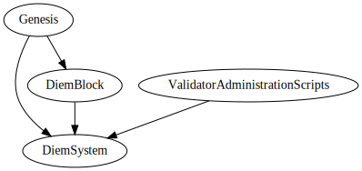
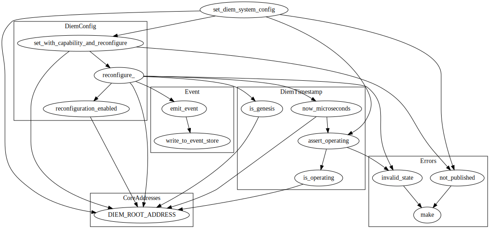
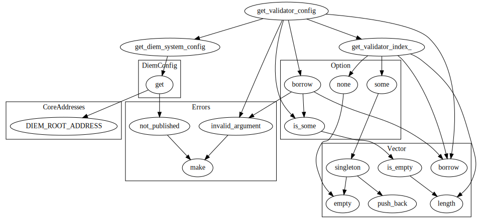
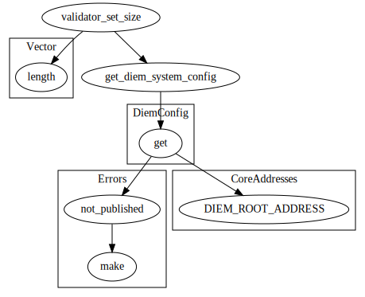
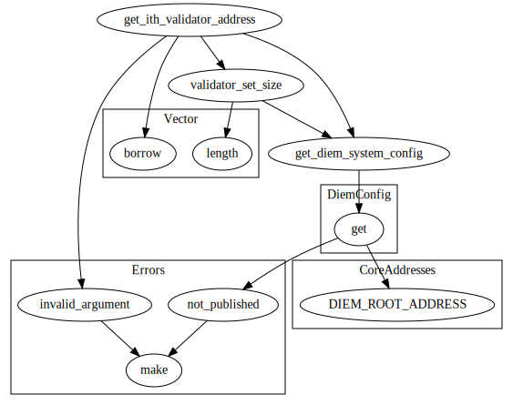
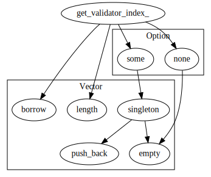
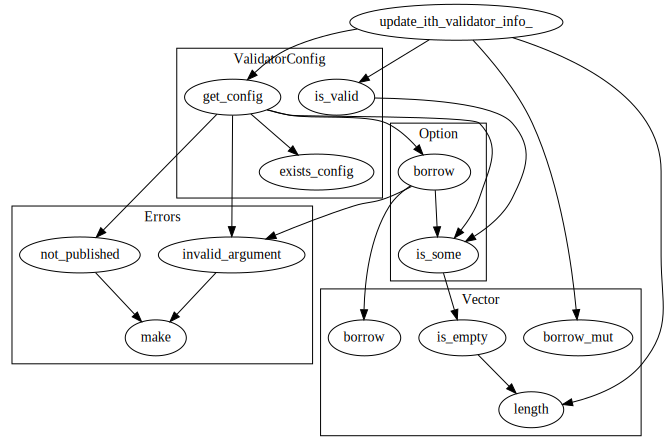

# Module `0x1::DiemSystem`

Maintains information about the set of validators used during consensus.
Provides functions to add, remove, and update validators in the
validator set.

> Note: When trying to understand this code, it's important to know that "config"
and "configuration" are used for several distinct concepts.

-  [Struct `ValidatorInfo`](#0x1_DiemSystem_ValidatorInfo)
-  [Resource `CapabilityHolder`](#0x1_DiemSystem_CapabilityHolder)
-  [Struct `DiemSystem`](#0x1_DiemSystem_DiemSystem)
-  [Constants](#@Constants_0)
-  [Function `initialize_validator_set`](#0x1_DiemSystem_initialize_validator_set)
-  [Function `set_diem_system_config`](#0x1_DiemSystem_set_diem_system_config)
-  [Function `add_validator`](#0x1_DiemSystem_add_validator)
-  [Function `remove_validator`](#0x1_DiemSystem_remove_validator)
-  [Function `update_config_and_reconfigure`](#0x1_DiemSystem_update_config_and_reconfigure)
-  [Function `get_diem_system_config`](#0x1_DiemSystem_get_diem_system_config)
-  [Function `is_validator`](#0x1_DiemSystem_is_validator)
-  [Function `get_validator_config`](#0x1_DiemSystem_get_validator_config)
-  [Function `validator_set_size`](#0x1_DiemSystem_validator_set_size)
-  [Function `get_ith_validator_address`](#0x1_DiemSystem_get_ith_validator_address)
-  [Function `get_validator_index_`](#0x1_DiemSystem_get_validator_index_)
-  [Function `update_ith_validator_info_`](#0x1_DiemSystem_update_ith_validator_info_)
-  [Function `is_validator_`](#0x1_DiemSystem_is_validator_)
-  [Module Specification](#@Module_Specification_1)
    -  [Initialization](#@Initialization_2)
    -  [Access Control](#@Access_Control_3)
    -  [Helper Functions](#@Helper_Functions_4)

<pre><code><b>use</b> <a href="CoreAddresses.md#0x1_CoreAddresses">0x1::CoreAddresses</a>;
<b>use</b> <a href="DiemConfig.md#0x1_DiemConfig">0x1::DiemConfig</a>;
<b>use</b> <a href="DiemTimestamp.md#0x1_DiemTimestamp">0x1::DiemTimestamp</a>;
<b>use</b> <a href="../../../move-stdlib/docs/Errors.md#0x1_Errors">0x1::Errors</a>;
<b>use</b> <a href="../../../move-stdlib/docs/Option.md#0x1_Option">0x1::Option</a>;
<b>use</b> <a href="Roles.md#0x1_Roles">0x1::Roles</a>;
<b>use</b> <a href="../../../move-stdlib/docs/Signer.md#0x1_Signer">0x1::Signer</a>;
<b>use</b> <a href="ValidatorConfig.md#0x1_ValidatorConfig">0x1::ValidatorConfig</a>;
<b>use</b> <a href="../../../move-stdlib/docs/Vector.md#0x1_Vector">0x1::Vector</a>;
</code></pre>

Show all the modules that "DiemSystem" depends on directly or indirectly

Show all the modules that depend on "DiemSystem" directly or indirectly

## Struct `ValidatorInfo`

Information about a Validator Owner.

<pre><code><b>struct</b> <a href="DiemSystem.md#0x1_DiemSystem_ValidatorInfo">ValidatorInfo</a>
</code></pre>

Fields

<dl>
<dt>
<code>addr: address</code>
</dt>
<dd>
 The address (account) of the Validator Owner
</dd>
<dt>
<code>consensus_voting_power: u64</code>
</dt>
<dd>
 The voting power of the Validator Owner (currently always 1).
</dd>
<dt>
<code>config: <a href="ValidatorConfig.md#0x1_ValidatorConfig_Config">ValidatorConfig::Config</a></code>
</dt>
<dd>
 Configuration information about the Validator, such as the
 Validator Operator, human name, and info such as consensus key
 and network addresses.
</dd>
<dt>
<code>last_config_update_time: u64</code>
</dt>
<dd>
 The time of last reconfiguration invoked by this validator
 in microseconds
</dd>
</dl>

## Resource `CapabilityHolder`

Enables a scheme that restricts the DiemSystem config
in DiemConfig from being modified by any other module.  Only
code in this module can get a reference to the ModifyConfigCapability<DiemSystem>,
which is required by <code><a href="DiemConfig.md#0x1_DiemConfig_set_with_capability_and_reconfigure">DiemConfig::set_with_capability_and_reconfigure</a></code> to
modify the DiemSystem config. This is only needed by <code>update_config_and_reconfigure</code>.
Only Diem root can add or remove a validator from the validator set, so the
capability is not needed for access control in those functions.

<pre><code><b>resource</b> <b>struct</b> <a href="DiemSystem.md#0x1_DiemSystem_CapabilityHolder">CapabilityHolder</a>
</code></pre>

Fields

<dl>
<dt>
<code>cap: <a href="DiemConfig.md#0x1_DiemConfig_ModifyConfigCapability">DiemConfig::ModifyConfigCapability</a>&lt;<a href="DiemSystem.md#0x1_DiemSystem_DiemSystem">DiemSystem::DiemSystem</a>&gt;</code>
</dt>
<dd>
 Holds a capability returned by <code><a href="DiemConfig.md#0x1_DiemConfig_publish_new_config_and_get_capability">DiemConfig::publish_new_config_and_get_capability</a></code>
 which is called in <code>initialize_validator_set</code>.
</dd>
</dl>

## Struct `DiemSystem`

The DiemSystem struct stores the validator set and crypto scheme in
DiemConfig. The DiemSystem struct is stored by DiemConfig, which publishes a
DiemConfig<DiemSystem> resource.

<pre><code><b>struct</b> <a href="DiemSystem.md#0x1_DiemSystem">DiemSystem</a>
</code></pre>

Fields

<dl>
<dt>
<code>scheme: u8</code>
</dt>
<dd>
 The current consensus crypto scheme.
</dd>
<dt>
<code>validators: vector&lt;<a href="DiemSystem.md#0x1_DiemSystem_ValidatorInfo">DiemSystem::ValidatorInfo</a>&gt;</code>
</dt>
<dd>
 The current validator set.
</dd>
</dl>

Specification

Members of <code>validators</code> vector (the validator set) have unique addresses.

<pre><code><b>invariant</b>
    <b>forall</b> i in 0..len(validators), j in 0..len(validators):
        validators[i].addr == validators[j].addr ==&gt; i == j;
</code></pre>

## Constants

The validator operator is not the operator for the specified validator

<pre><code><b>const</b> <a href="DiemSystem.md#0x1_DiemSystem_EINVALID_TRANSACTION_SENDER">EINVALID_TRANSACTION_SENDER</a>: u64 = 4;
</code></pre>

Tried to add a validator to the validator set that was already in it

<pre><code><b>const</b> <a href="DiemSystem.md#0x1_DiemSystem_EALREADY_A_VALIDATOR">EALREADY_A_VALIDATOR</a>: u64 = 2;
</code></pre>

The <code><a href="DiemSystem.md#0x1_DiemSystem_CapabilityHolder">CapabilityHolder</a></code> resource was not in the required state

<pre><code><b>const</b> <a href="DiemSystem.md#0x1_DiemSystem_ECAPABILITY_HOLDER">ECAPABILITY_HOLDER</a>: u64 = 0;
</code></pre>

Rate limited when trying to update config

<pre><code><b>const</b> <a href="DiemSystem.md#0x1_DiemSystem_ECONFIG_UPDATE_RATE_LIMITED">ECONFIG_UPDATE_RATE_LIMITED</a>: u64 = 6;
</code></pre>

Tried to add a validator with an invalid state to the validator set

<pre><code><b>const</b> <a href="DiemSystem.md#0x1_DiemSystem_EINVALID_PROSPECTIVE_VALIDATOR">EINVALID_PROSPECTIVE_VALIDATOR</a>: u64 = 1;
</code></pre>

Validator set already at maximum allowed size

<pre><code><b>const</b> <a href="DiemSystem.md#0x1_DiemSystem_EMAX_VALIDATORS">EMAX_VALIDATORS</a>: u64 = 7;
</code></pre>

An operation was attempted on an address not in the vaidator set

<pre><code><b>const</b> <a href="DiemSystem.md#0x1_DiemSystem_ENOT_AN_ACTIVE_VALIDATOR">ENOT_AN_ACTIVE_VALIDATOR</a>: u64 = 3;
</code></pre>

An out of bounds index for the validator set was encountered

<pre><code><b>const</b> <a href="DiemSystem.md#0x1_DiemSystem_EVALIDATOR_INDEX">EVALIDATOR_INDEX</a>: u64 = 5;
</code></pre>

Number of microseconds in 5 minutes

<pre><code><b>const</b> <a href="DiemSystem.md#0x1_DiemSystem_FIVE_MINUTES">FIVE_MINUTES</a>: u64 = 300000000;
</code></pre>

The maximum number of allowed validators in the validator set

<pre><code><b>const</b> <a href="DiemSystem.md#0x1_DiemSystem_MAX_VALIDATORS">MAX_VALIDATORS</a>: u64 = 256;
</code></pre>

## Function `initialize_validator_set`

Publishes the DiemConfig for the DiemSystem struct, which contains the current
validator set. Also publishes the <code><a href="DiemSystem.md#0x1_DiemSystem_CapabilityHolder">CapabilityHolder</a></code> with the
ModifyConfigCapability<DiemSystem> returned by the publish function, which allows
code in this module to change DiemSystem config (including the validator set).
Must be invoked by the Diem root a single time in Genesis.

<pre><code><b>public</b> <b>fun</b> <a href="DiemSystem.md#0x1_DiemSystem_initialize_validator_set">initialize_validator_set</a>(dr_account: &signer)
</code></pre>

Implementation

<pre><code><b>public</b> <b>fun</b> <a href="DiemSystem.md#0x1_DiemSystem_initialize_validator_set">initialize_validator_set</a>(
    dr_account: &signer,
) {
    <a href="DiemTimestamp.md#0x1_DiemTimestamp_assert_genesis">DiemTimestamp::assert_genesis</a>();
    <a href="Roles.md#0x1_Roles_assert_diem_root">Roles::assert_diem_root</a>(dr_account);

    <b>let</b> cap = <a href="DiemConfig.md#0x1_DiemConfig_publish_new_config_and_get_capability">DiemConfig::publish_new_config_and_get_capability</a>&lt;<a href="DiemSystem.md#0x1_DiemSystem">DiemSystem</a>&gt;(
        dr_account,
        <a href="DiemSystem.md#0x1_DiemSystem">DiemSystem</a> {
            scheme: 0,
            validators: <a href="../../../move-stdlib/docs/Vector.md#0x1_Vector_empty">Vector::empty</a>(),
        },
    );
    <b>assert</b>(
        !<b>exists</b>&lt;<a href="DiemSystem.md#0x1_DiemSystem_CapabilityHolder">CapabilityHolder</a>&gt;(<a href="CoreAddresses.md#0x1_CoreAddresses_DIEM_ROOT_ADDRESS">CoreAddresses::DIEM_ROOT_ADDRESS</a>()),
        <a href="../../../move-stdlib/docs/Errors.md#0x1_Errors_already_published">Errors::already_published</a>(<a href="DiemSystem.md#0x1_DiemSystem_ECAPABILITY_HOLDER">ECAPABILITY_HOLDER</a>)
    );
    move_to(dr_account, <a href="DiemSystem.md#0x1_DiemSystem_CapabilityHolder">CapabilityHolder</a> { cap })
}
</code></pre>

Specification

<pre><code><b>modifies</b> <b>global</b>&lt;<a href="DiemConfig.md#0x1_DiemConfig_DiemConfig">DiemConfig::DiemConfig</a>&lt;<a href="DiemSystem.md#0x1_DiemSystem">DiemSystem</a>&gt;&gt;(<a href="CoreAddresses.md#0x1_CoreAddresses_DIEM_ROOT_ADDRESS">CoreAddresses::DIEM_ROOT_ADDRESS</a>());
<b>include</b> <a href="DiemTimestamp.md#0x1_DiemTimestamp_AbortsIfNotGenesis">DiemTimestamp::AbortsIfNotGenesis</a>;
<b>include</b> <a href="Roles.md#0x1_Roles_AbortsIfNotDiemRoot">Roles::AbortsIfNotDiemRoot</a>{account: dr_account};

<b>let</b> dr_addr = <a href="../../../move-stdlib/docs/Signer.md#0x1_Signer_spec_address_of">Signer::spec_address_of</a>(dr_account);
<b>aborts_if</b> <a href="DiemConfig.md#0x1_DiemConfig_spec_is_published">DiemConfig::spec_is_published</a>&lt;<a href="DiemSystem.md#0x1_DiemSystem">DiemSystem</a>&gt;() <b>with</b> <a href="../../../move-stdlib/docs/Errors.md#0x1_Errors_ALREADY_PUBLISHED">Errors::ALREADY_PUBLISHED</a>;
<b>aborts_if</b> <b>exists</b>&lt;<a href="DiemSystem.md#0x1_DiemSystem_CapabilityHolder">CapabilityHolder</a>&gt;(dr_addr) <b>with</b> <a href="../../../move-stdlib/docs/Errors.md#0x1_Errors_ALREADY_PUBLISHED">Errors::ALREADY_PUBLISHED</a>;
<b>ensures</b> <b>exists</b>&lt;<a href="DiemSystem.md#0x1_DiemSystem_CapabilityHolder">CapabilityHolder</a>&gt;(dr_addr);
<b>ensures</b> <a href="DiemConfig.md#0x1_DiemConfig_spec_is_published">DiemConfig::spec_is_published</a>&lt;<a href="DiemSystem.md#0x1_DiemSystem">DiemSystem</a>&gt;();
<b>ensures</b> len(<a href="DiemSystem.md#0x1_DiemSystem_spec_get_validators">spec_get_validators</a>()) == 0;
</code></pre>

Show all the functions that "initialize_validator_set" calls

## Function `set_diem_system_config`

Copies a DiemSystem struct into the DiemConfig<DiemSystem> resource
Called by the add, remove, and update functions.

<pre><code><b>fun</b> <a href="DiemSystem.md#0x1_DiemSystem_set_diem_system_config">set_diem_system_config</a>(value: <a href="DiemSystem.md#0x1_DiemSystem_DiemSystem">DiemSystem::DiemSystem</a>)
</code></pre>

Implementation

<pre><code><b>fun</b> <a href="DiemSystem.md#0x1_DiemSystem_set_diem_system_config">set_diem_system_config</a>(value: <a href="DiemSystem.md#0x1_DiemSystem">DiemSystem</a>) <b>acquires</b> <a href="DiemSystem.md#0x1_DiemSystem_CapabilityHolder">CapabilityHolder</a> {
    <a href="DiemTimestamp.md#0x1_DiemTimestamp_assert_operating">DiemTimestamp::assert_operating</a>();
    <b>assert</b>(
        <b>exists</b>&lt;<a href="DiemSystem.md#0x1_DiemSystem_CapabilityHolder">CapabilityHolder</a>&gt;(<a href="CoreAddresses.md#0x1_CoreAddresses_DIEM_ROOT_ADDRESS">CoreAddresses::DIEM_ROOT_ADDRESS</a>()),
        <a href="../../../move-stdlib/docs/Errors.md#0x1_Errors_not_published">Errors::not_published</a>(<a href="DiemSystem.md#0x1_DiemSystem_ECAPABILITY_HOLDER">ECAPABILITY_HOLDER</a>)
    );
    // Updates the <a href="DiemConfig.md#0x1_DiemConfig">DiemConfig</a>&lt;<a href="DiemSystem.md#0x1_DiemSystem">DiemSystem</a>&gt; and emits a reconfigure event.
    <a href="DiemConfig.md#0x1_DiemConfig_set_with_capability_and_reconfigure">DiemConfig::set_with_capability_and_reconfigure</a>&lt;<a href="DiemSystem.md#0x1_DiemSystem">DiemSystem</a>&gt;(
        &borrow_global&lt;<a href="DiemSystem.md#0x1_DiemSystem_CapabilityHolder">CapabilityHolder</a>&gt;(<a href="CoreAddresses.md#0x1_CoreAddresses_DIEM_ROOT_ADDRESS">CoreAddresses::DIEM_ROOT_ADDRESS</a>()).cap,
        value
    )
}
</code></pre>

Specification

<pre><code><b>pragma</b> opaque;
<b>modifies</b> <b>global</b>&lt;<a href="DiemConfig.md#0x1_DiemConfig_DiemConfig">DiemConfig::DiemConfig</a>&lt;<a href="DiemSystem.md#0x1_DiemSystem">DiemSystem</a>&gt;&gt;(<a href="CoreAddresses.md#0x1_CoreAddresses_DIEM_ROOT_ADDRESS">CoreAddresses::DIEM_ROOT_ADDRESS</a>());
<b>modifies</b> <b>global</b>&lt;<a href="DiemConfig.md#0x1_DiemConfig_Configuration">DiemConfig::Configuration</a>&gt;(<a href="CoreAddresses.md#0x1_CoreAddresses_DIEM_ROOT_ADDRESS">CoreAddresses::DIEM_ROOT_ADDRESS</a>());
<b>include</b> <a href="DiemTimestamp.md#0x1_DiemTimestamp_AbortsIfNotOperating">DiemTimestamp::AbortsIfNotOperating</a>;
<b>include</b> <a href="DiemConfig.md#0x1_DiemConfig_ReconfigureAbortsIf">DiemConfig::ReconfigureAbortsIf</a>;
</code></pre>

<code>payload</code> is the only field of DiemConfig, so next completely specifies it.

<pre><code><b>ensures</b> <b>global</b>&lt;<a href="DiemConfig.md#0x1_DiemConfig_DiemConfig">DiemConfig::DiemConfig</a>&lt;<a href="DiemSystem.md#0x1_DiemSystem">DiemSystem</a>&gt;&gt;(<a href="CoreAddresses.md#0x1_CoreAddresses_DIEM_ROOT_ADDRESS">CoreAddresses::DIEM_ROOT_ADDRESS</a>()).payload == value;
<b>include</b> <a href="DiemConfig.md#0x1_DiemConfig_ReconfigureEmits">DiemConfig::ReconfigureEmits</a>;
</code></pre>

Show all the functions that "set_diem_system_config" calls

## Function `add_validator`

Adds a new validator to the validator set.

<pre><code><b>public</b> <b>fun</b> <a href="DiemSystem.md#0x1_DiemSystem_add_validator">add_validator</a>(dr_account: &signer, validator_addr: address)
</code></pre>

Implementation

<pre><code><b>public</b> <b>fun</b> <a href="DiemSystem.md#0x1_DiemSystem_add_validator">add_validator</a>(
    dr_account: &signer,
    validator_addr: address
) <b>acquires</b> <a href="DiemSystem.md#0x1_DiemSystem_CapabilityHolder">CapabilityHolder</a> {

    <a href="DiemTimestamp.md#0x1_DiemTimestamp_assert_operating">DiemTimestamp::assert_operating</a>();
    <a href="Roles.md#0x1_Roles_assert_diem_root">Roles::assert_diem_root</a>(dr_account);
    // A prospective validator must have a validator config <b>resource</b>
    <b>assert</b>(<a href="ValidatorConfig.md#0x1_ValidatorConfig_is_valid">ValidatorConfig::is_valid</a>(validator_addr), <a href="../../../move-stdlib/docs/Errors.md#0x1_Errors_invalid_argument">Errors::invalid_argument</a>(<a href="DiemSystem.md#0x1_DiemSystem_EINVALID_PROSPECTIVE_VALIDATOR">EINVALID_PROSPECTIVE_VALIDATOR</a>));

    // Bound the validator set size
    <b>assert</b>(
        <a href="DiemSystem.md#0x1_DiemSystem_validator_set_size">validator_set_size</a>() &lt; <a href="DiemSystem.md#0x1_DiemSystem_MAX_VALIDATORS">MAX_VALIDATORS</a>,
        <a href="../../../move-stdlib/docs/Errors.md#0x1_Errors_limit_exceeded">Errors::limit_exceeded</a>(<a href="DiemSystem.md#0x1_DiemSystem_EMAX_VALIDATORS">EMAX_VALIDATORS</a>)
    );

    <b>let</b> diem_system_config = <a href="DiemSystem.md#0x1_DiemSystem_get_diem_system_config">get_diem_system_config</a>();

    // Ensure that this address is not already a validator
    <b>assert</b>(
        !<a href="DiemSystem.md#0x1_DiemSystem_is_validator_">is_validator_</a>(validator_addr, &diem_system_config.validators),
        <a href="../../../move-stdlib/docs/Errors.md#0x1_Errors_invalid_argument">Errors::invalid_argument</a>(<a href="DiemSystem.md#0x1_DiemSystem_EALREADY_A_VALIDATOR">EALREADY_A_VALIDATOR</a>)
    );

    // it is guaranteed that the config is non-empty
    <b>let</b> config = <a href="ValidatorConfig.md#0x1_ValidatorConfig_get_config">ValidatorConfig::get_config</a>(validator_addr);
    <a href="../../../move-stdlib/docs/Vector.md#0x1_Vector_push_back">Vector::push_back</a>(&<b>mut</b> diem_system_config.validators, <a href="DiemSystem.md#0x1_DiemSystem_ValidatorInfo">ValidatorInfo</a> {
        addr: validator_addr,
        config, // <b>copy</b> the config over <b>to</b> ValidatorSet
        consensus_voting_power: 1,
        last_config_update_time: <a href="DiemTimestamp.md#0x1_DiemTimestamp_now_microseconds">DiemTimestamp::now_microseconds</a>(),
    });

    <a href="DiemSystem.md#0x1_DiemSystem_set_diem_system_config">set_diem_system_config</a>(diem_system_config);
}
</code></pre>

Specification

<pre><code><b>modifies</b> <b>global</b>&lt;<a href="DiemConfig.md#0x1_DiemConfig_DiemConfig">DiemConfig::DiemConfig</a>&lt;<a href="DiemSystem.md#0x1_DiemSystem">DiemSystem</a>&gt;&gt;(<a href="CoreAddresses.md#0x1_CoreAddresses_DIEM_ROOT_ADDRESS">CoreAddresses::DIEM_ROOT_ADDRESS</a>());
<b>include</b> <a href="DiemSystem.md#0x1_DiemSystem_AddValidatorAbortsIf">AddValidatorAbortsIf</a>;
<b>include</b> <a href="DiemSystem.md#0x1_DiemSystem_AddValidatorEnsures">AddValidatorEnsures</a>;
<b>include</b> <a href="DiemConfig.md#0x1_DiemConfig_ReconfigureEmits">DiemConfig::ReconfigureEmits</a>;
</code></pre>

<pre><code><b>schema</b> <a href="DiemSystem.md#0x1_DiemSystem_AddValidatorAbortsIf">AddValidatorAbortsIf</a> {
    dr_account: signer;
    validator_addr: address;
    <b>aborts_if</b> <a href="DiemSystem.md#0x1_DiemSystem_validator_set_size">validator_set_size</a>() &gt;= <a href="DiemSystem.md#0x1_DiemSystem_MAX_VALIDATORS">MAX_VALIDATORS</a> <b>with</b> <a href="../../../move-stdlib/docs/Errors.md#0x1_Errors_LIMIT_EXCEEDED">Errors::LIMIT_EXCEEDED</a>;
    <b>include</b> <a href="DiemTimestamp.md#0x1_DiemTimestamp_AbortsIfNotOperating">DiemTimestamp::AbortsIfNotOperating</a>;
    <b>include</b> <a href="Roles.md#0x1_Roles_AbortsIfNotDiemRoot">Roles::AbortsIfNotDiemRoot</a>{account: dr_account};
    <b>include</b> <a href="DiemConfig.md#0x1_DiemConfig_ReconfigureAbortsIf">DiemConfig::ReconfigureAbortsIf</a>;
    <b>aborts_if</b> !<a href="ValidatorConfig.md#0x1_ValidatorConfig_is_valid">ValidatorConfig::is_valid</a>(validator_addr) <b>with</b> <a href="../../../move-stdlib/docs/Errors.md#0x1_Errors_INVALID_ARGUMENT">Errors::INVALID_ARGUMENT</a>;
    <b>aborts_if</b> <a href="DiemSystem.md#0x1_DiemSystem_spec_is_validator">spec_is_validator</a>(validator_addr) <b>with</b> <a href="../../../move-stdlib/docs/Errors.md#0x1_Errors_INVALID_ARGUMENT">Errors::INVALID_ARGUMENT</a>;
}
</code></pre>

<pre><code><b>schema</b> <a href="DiemSystem.md#0x1_DiemSystem_AddValidatorEnsures">AddValidatorEnsures</a> {
    validator_addr: address;
}
</code></pre>

DIP-6 property: validator has validator role. The code does not check this explicitly,
but it is implied by the <code><b>assert</b> <a href="ValidatorConfig.md#0x1_ValidatorConfig_is_valid">ValidatorConfig::is_valid</a></code>, since there
is an invariant (in ValidatorConfig) that a an address with a published ValidatorConfig has
a ValidatorRole

<pre><code><b>schema</b> <a href="DiemSystem.md#0x1_DiemSystem_AddValidatorEnsures">AddValidatorEnsures</a> {
    <b>ensures</b> <a href="Roles.md#0x1_Roles_spec_has_validator_role_addr">Roles::spec_has_validator_role_addr</a>(validator_addr);
    <b>ensures</b> <a href="ValidatorConfig.md#0x1_ValidatorConfig_is_valid">ValidatorConfig::is_valid</a>(validator_addr);
    <b>ensures</b> <a href="DiemSystem.md#0x1_DiemSystem_spec_is_validator">spec_is_validator</a>(validator_addr);
    
    <b>let</b> vs = <a href="DiemSystem.md#0x1_DiemSystem_spec_get_validators">spec_get_validators</a>();
    <b>ensures</b> <a href="../../../move-stdlib/docs/Vector.md#0x1_Vector_eq_push_back">Vector::eq_push_back</a>(vs,
                                 <b>old</b>(vs),
                                 <a href="DiemSystem.md#0x1_DiemSystem_ValidatorInfo">ValidatorInfo</a> {
                                     addr: validator_addr,
                                     config: <a href="ValidatorConfig.md#0x1_ValidatorConfig_spec_get_config">ValidatorConfig::spec_get_config</a>(validator_addr),
                                     consensus_voting_power: 1,
                                     last_config_update_time: <a href="DiemTimestamp.md#0x1_DiemTimestamp_spec_now_microseconds">DiemTimestamp::spec_now_microseconds</a>(),
                                  }
                               );
}
</code></pre>

Show all the functions that "add_validator" calls

## Function `remove_validator`

Removes a validator, aborts unless called by diem root account

<pre><code><b>public</b> <b>fun</b> <a href="DiemSystem.md#0x1_DiemSystem_remove_validator">remove_validator</a>(dr_account: &signer, validator_addr: address)
</code></pre>

Implementation

<pre><code><b>public</b> <b>fun</b> <a href="DiemSystem.md#0x1_DiemSystem_remove_validator">remove_validator</a>(
    dr_account: &signer,
    validator_addr: address
) <b>acquires</b> <a href="DiemSystem.md#0x1_DiemSystem_CapabilityHolder">CapabilityHolder</a> {
    <a href="DiemTimestamp.md#0x1_DiemTimestamp_assert_operating">DiemTimestamp::assert_operating</a>();
    <a href="Roles.md#0x1_Roles_assert_diem_root">Roles::assert_diem_root</a>(dr_account);
    <b>let</b> diem_system_config = <a href="DiemSystem.md#0x1_DiemSystem_get_diem_system_config">get_diem_system_config</a>();
    // Ensure that this address is an active validator
    <b>let</b> to_remove_index_vec = <a href="DiemSystem.md#0x1_DiemSystem_get_validator_index_">get_validator_index_</a>(&diem_system_config.validators, validator_addr);
    <b>assert</b>(<a href="../../../move-stdlib/docs/Option.md#0x1_Option_is_some">Option::is_some</a>(&to_remove_index_vec), <a href="../../../move-stdlib/docs/Errors.md#0x1_Errors_invalid_argument">Errors::invalid_argument</a>(<a href="DiemSystem.md#0x1_DiemSystem_ENOT_AN_ACTIVE_VALIDATOR">ENOT_AN_ACTIVE_VALIDATOR</a>));
    <b>let</b> to_remove_index = *<a href="../../../move-stdlib/docs/Option.md#0x1_Option_borrow">Option::borrow</a>(&to_remove_index_vec);
    // Remove corresponding <a href="DiemSystem.md#0x1_DiemSystem_ValidatorInfo">ValidatorInfo</a> from the validator set
    _  = <a href="../../../move-stdlib/docs/Vector.md#0x1_Vector_swap_remove">Vector::swap_remove</a>(&<b>mut</b> diem_system_config.validators, to_remove_index);

    <a href="DiemSystem.md#0x1_DiemSystem_set_diem_system_config">set_diem_system_config</a>(diem_system_config);
}
</code></pre>

Specification

<pre><code><b>modifies</b> <b>global</b>&lt;<a href="DiemConfig.md#0x1_DiemConfig_DiemConfig">DiemConfig::DiemConfig</a>&lt;<a href="DiemSystem.md#0x1_DiemSystem">DiemSystem</a>&gt;&gt;(<a href="CoreAddresses.md#0x1_CoreAddresses_DIEM_ROOT_ADDRESS">CoreAddresses::DIEM_ROOT_ADDRESS</a>());
<b>include</b> <a href="DiemSystem.md#0x1_DiemSystem_RemoveValidatorAbortsIf">RemoveValidatorAbortsIf</a>;
<b>include</b> <a href="DiemSystem.md#0x1_DiemSystem_RemoveValidatorEnsures">RemoveValidatorEnsures</a>;
<b>include</b> <a href="DiemConfig.md#0x1_DiemConfig_ReconfigureEmits">DiemConfig::ReconfigureEmits</a>;
</code></pre>

<pre><code><b>schema</b> <a href="DiemSystem.md#0x1_DiemSystem_RemoveValidatorAbortsIf">RemoveValidatorAbortsIf</a> {
    dr_account: signer;
    validator_addr: address;
    <b>include</b> <a href="Roles.md#0x1_Roles_AbortsIfNotDiemRoot">Roles::AbortsIfNotDiemRoot</a>{account: dr_account};
    <b>include</b> <a href="DiemTimestamp.md#0x1_DiemTimestamp_AbortsIfNotOperating">DiemTimestamp::AbortsIfNotOperating</a>;
    <b>include</b> <a href="DiemConfig.md#0x1_DiemConfig_ReconfigureAbortsIf">DiemConfig::ReconfigureAbortsIf</a>;
    <b>aborts_if</b> !<a href="DiemSystem.md#0x1_DiemSystem_spec_is_validator">spec_is_validator</a>(validator_addr) <b>with</b> <a href="../../../move-stdlib/docs/Errors.md#0x1_Errors_INVALID_ARGUMENT">Errors::INVALID_ARGUMENT</a>;
}
</code></pre>

<pre><code><b>schema</b> <a href="DiemSystem.md#0x1_DiemSystem_RemoveValidatorEnsures">RemoveValidatorEnsures</a> {
    validator_addr: address;
    
    <b>let</b> vs = <a href="DiemSystem.md#0x1_DiemSystem_spec_get_validators">spec_get_validators</a>();
    <b>ensures</b> <b>forall</b> vi in vs <b>where</b> vi.addr != validator_addr: <b>exists</b> ovi in <b>old</b>(vs): vi == ovi;
}
</code></pre>

Removed validator is no longer a validator.  Depends on no other entries for same address
in validator_set

<pre><code><b>schema</b> <a href="DiemSystem.md#0x1_DiemSystem_RemoveValidatorEnsures">RemoveValidatorEnsures</a> {
    <b>ensures</b> !<a href="DiemSystem.md#0x1_DiemSystem_spec_is_validator">spec_is_validator</a>(validator_addr);
}
</code></pre>

Show all the functions that "remove_validator" calls

## Function `update_config_and_reconfigure`

Copy the information from ValidatorConfig into the validator set.
This function makes no changes to the size or the members of the set.
If the config in the ValidatorSet changes, it stores the new DiemSystem
and emits a reconfigurationevent.

<pre><code><b>public</b> <b>fun</b> <a href="DiemSystem.md#0x1_DiemSystem_update_config_and_reconfigure">update_config_and_reconfigure</a>(validator_operator_account: &signer, validator_addr: address)
</code></pre>

Implementation

<pre><code><b>public</b> <b>fun</b> <a href="DiemSystem.md#0x1_DiemSystem_update_config_and_reconfigure">update_config_and_reconfigure</a>(
    validator_operator_account: &signer,
    validator_addr: address,
) <b>acquires</b> <a href="DiemSystem.md#0x1_DiemSystem_CapabilityHolder">CapabilityHolder</a> {
    <a href="DiemTimestamp.md#0x1_DiemTimestamp_assert_operating">DiemTimestamp::assert_operating</a>();
    <a href="Roles.md#0x1_Roles_assert_validator_operator">Roles::assert_validator_operator</a>(validator_operator_account);
    <b>assert</b>(
        <a href="ValidatorConfig.md#0x1_ValidatorConfig_get_operator">ValidatorConfig::get_operator</a>(validator_addr) == <a href="../../../move-stdlib/docs/Signer.md#0x1_Signer_address_of">Signer::address_of</a>(validator_operator_account),
        <a href="../../../move-stdlib/docs/Errors.md#0x1_Errors_invalid_argument">Errors::invalid_argument</a>(<a href="DiemSystem.md#0x1_DiemSystem_EINVALID_TRANSACTION_SENDER">EINVALID_TRANSACTION_SENDER</a>)
    );
    <b>let</b> diem_system_config = <a href="DiemSystem.md#0x1_DiemSystem_get_diem_system_config">get_diem_system_config</a>();
    <b>let</b> to_update_index_vec = <a href="DiemSystem.md#0x1_DiemSystem_get_validator_index_">get_validator_index_</a>(&diem_system_config.validators, validator_addr);
    <b>assert</b>(<a href="../../../move-stdlib/docs/Option.md#0x1_Option_is_some">Option::is_some</a>(&to_update_index_vec), <a href="../../../move-stdlib/docs/Errors.md#0x1_Errors_invalid_argument">Errors::invalid_argument</a>(<a href="DiemSystem.md#0x1_DiemSystem_ENOT_AN_ACTIVE_VALIDATOR">ENOT_AN_ACTIVE_VALIDATOR</a>));
    <b>let</b> to_update_index = *<a href="../../../move-stdlib/docs/Option.md#0x1_Option_borrow">Option::borrow</a>(&to_update_index_vec);
    <b>let</b> is_validator_info_updated = <a href="DiemSystem.md#0x1_DiemSystem_update_ith_validator_info_">update_ith_validator_info_</a>(&<b>mut</b> diem_system_config.validators, to_update_index);
    <b>if</b> (is_validator_info_updated) {
        <b>let</b> validator_info = <a href="../../../move-stdlib/docs/Vector.md#0x1_Vector_borrow_mut">Vector::borrow_mut</a>(&<b>mut</b> diem_system_config.validators, to_update_index);
        <b>assert</b>(<a href="DiemTimestamp.md#0x1_DiemTimestamp_now_microseconds">DiemTimestamp::now_microseconds</a>() &gt;
               validator_info.last_config_update_time + <a href="DiemSystem.md#0x1_DiemSystem_FIVE_MINUTES">FIVE_MINUTES</a>,
               <a href="DiemSystem.md#0x1_DiemSystem_ECONFIG_UPDATE_RATE_LIMITED">ECONFIG_UPDATE_RATE_LIMITED</a>);
        validator_info.last_config_update_time = <a href="DiemTimestamp.md#0x1_DiemTimestamp_now_microseconds">DiemTimestamp::now_microseconds</a>();
        <a href="DiemSystem.md#0x1_DiemSystem_set_diem_system_config">set_diem_system_config</a>(diem_system_config);
    }
}
</code></pre>

Specification

<pre><code><b>pragma</b> opaque;
<b>pragma</b> verify = <b>false</b>;
<b>modifies</b> <b>global</b>&lt;<a href="DiemConfig.md#0x1_DiemConfig_Configuration">DiemConfig::Configuration</a>&gt;(<a href="CoreAddresses.md#0x1_CoreAddresses_DIEM_ROOT_ADDRESS">CoreAddresses::DIEM_ROOT_ADDRESS</a>());
<b>modifies</b> <b>global</b>&lt;<a href="DiemConfig.md#0x1_DiemConfig_DiemConfig">DiemConfig::DiemConfig</a>&lt;<a href="DiemSystem.md#0x1_DiemSystem">DiemSystem</a>&gt;&gt;(<a href="CoreAddresses.md#0x1_CoreAddresses_DIEM_ROOT_ADDRESS">CoreAddresses::DIEM_ROOT_ADDRESS</a>());
<b>include</b> <a href="ValidatorConfig.md#0x1_ValidatorConfig_AbortsIfGetOperator">ValidatorConfig::AbortsIfGetOperator</a>{addr: validator_addr};
<b>include</b> <a href="DiemSystem.md#0x1_DiemSystem_UpdateConfigAndReconfigureAbortsIf">UpdateConfigAndReconfigureAbortsIf</a>;
<b>include</b> <a href="DiemSystem.md#0x1_DiemSystem_UpdateConfigAndReconfigureEnsures">UpdateConfigAndReconfigureEnsures</a>;

<b>let</b> is_validator_info_updated =
    <a href="ValidatorConfig.md#0x1_ValidatorConfig_is_valid">ValidatorConfig::is_valid</a>(validator_addr) &&
    (<b>exists</b> v_info in <a href="DiemSystem.md#0x1_DiemSystem_spec_get_validators">spec_get_validators</a>():
        v_info.addr == validator_addr
        && v_info.config != <a href="ValidatorConfig.md#0x1_ValidatorConfig_spec_get_config">ValidatorConfig::spec_get_config</a>(validator_addr));
<b>include</b> is_validator_info_updated ==&gt; <a href="DiemConfig.md#0x1_DiemConfig_ReconfigureAbortsIf">DiemConfig::ReconfigureAbortsIf</a>;
</code></pre>

<pre><code><b>schema</b> <a href="DiemSystem.md#0x1_DiemSystem_UpdateConfigAndReconfigureAbortsIf">UpdateConfigAndReconfigureAbortsIf</a> {
    validator_addr: address;
    validator_operator_account: signer;
    
    <b>let</b> validator_operator_addr = <a href="../../../move-stdlib/docs/Signer.md#0x1_Signer_address_of">Signer::address_of</a>(validator_operator_account);
    <b>include</b> <a href="DiemTimestamp.md#0x1_DiemTimestamp_AbortsIfNotOperating">DiemTimestamp::AbortsIfNotOperating</a>;
}
</code></pre>

Must abort if the signer does not have the ValidatorOperator role [[H14]][PERMISSION].

<pre><code><b>schema</b> <a href="DiemSystem.md#0x1_DiemSystem_UpdateConfigAndReconfigureAbortsIf">UpdateConfigAndReconfigureAbortsIf</a> {
    <b>include</b> <a href="Roles.md#0x1_Roles_AbortsIfNotValidatorOperator">Roles::AbortsIfNotValidatorOperator</a>{validator_operator_addr: validator_operator_addr};
    <b>include</b> <a href="ValidatorConfig.md#0x1_ValidatorConfig_AbortsIfNoValidatorConfig">ValidatorConfig::AbortsIfNoValidatorConfig</a>{addr: validator_addr};
    <b>aborts_if</b> <a href="ValidatorConfig.md#0x1_ValidatorConfig_get_operator">ValidatorConfig::get_operator</a>(validator_addr) != validator_operator_addr
        <b>with</b> <a href="../../../move-stdlib/docs/Errors.md#0x1_Errors_INVALID_ARGUMENT">Errors::INVALID_ARGUMENT</a>;
    <b>aborts_if</b> !<a href="DiemSystem.md#0x1_DiemSystem_spec_is_validator">spec_is_validator</a>(validator_addr) <b>with</b> <a href="../../../move-stdlib/docs/Errors.md#0x1_Errors_INVALID_ARGUMENT">Errors::INVALID_ARGUMENT</a>;
}
</code></pre>

Does not change the length of the validator set, only changes ValidatorInfo
for validator_addr, and doesn't change any addresses.

<pre><code><b>schema</b> <a href="DiemSystem.md#0x1_DiemSystem_UpdateConfigAndReconfigureEnsures">UpdateConfigAndReconfigureEnsures</a> {
    validator_addr: address;
    
    <b>let</b> vs = <a href="DiemSystem.md#0x1_DiemSystem_spec_get_validators">spec_get_validators</a>();
    <b>ensures</b> len(vs) == len(<b>old</b>(vs));
}
</code></pre>

No addresses change in the validator set

<pre><code><b>schema</b> <a href="DiemSystem.md#0x1_DiemSystem_UpdateConfigAndReconfigureEnsures">UpdateConfigAndReconfigureEnsures</a> {
    <b>ensures</b> <b>forall</b> i in 0..len(vs): vs[i].addr == <b>old</b>(vs)[i].addr;
}
</code></pre>

If the <code><a href="DiemSystem.md#0x1_DiemSystem_ValidatorInfo">ValidatorInfo</a></code> address is not the one we're changing, the info does not change.

<pre><code><b>schema</b> <a href="DiemSystem.md#0x1_DiemSystem_UpdateConfigAndReconfigureEnsures">UpdateConfigAndReconfigureEnsures</a> {
    <b>ensures</b> <b>forall</b> i in 0..len(vs) <b>where</b> <b>old</b>(vs)[i].addr != validator_addr:
                     vs[i] == <b>old</b>(vs)[i];
}
</code></pre>

It updates the correct entry in the correct way

<pre><code><b>schema</b> <a href="DiemSystem.md#0x1_DiemSystem_UpdateConfigAndReconfigureEnsures">UpdateConfigAndReconfigureEnsures</a> {
    <b>ensures</b> <b>forall</b> i in 0..len(vs): vs[i].config == <b>old</b>(vs[i].config) ||
                (<b>old</b>(vs)[i].addr == validator_addr &&
                vs[i].config == <a href="ValidatorConfig.md#0x1_ValidatorConfig_get_config">ValidatorConfig::get_config</a>(validator_addr));
}
</code></pre>

DIP-6 property

<pre><code><b>schema</b> <a href="DiemSystem.md#0x1_DiemSystem_UpdateConfigAndReconfigureEnsures">UpdateConfigAndReconfigureEnsures</a> {
    <b>ensures</b> <a href="Roles.md#0x1_Roles_spec_has_validator_role_addr">Roles::spec_has_validator_role_addr</a>(validator_addr);
}
</code></pre>

<pre><code><b>schema</b> <a href="DiemSystem.md#0x1_DiemSystem_UpdateConfigAndReconfigureEmits">UpdateConfigAndReconfigureEmits</a> {
    validator_addr: address;
    
    <b>let</b> is_validator_info_updated =
        <a href="ValidatorConfig.md#0x1_ValidatorConfig_is_valid">ValidatorConfig::is_valid</a>(validator_addr) &&
        (<b>exists</b> v_info in <a href="DiemSystem.md#0x1_DiemSystem_spec_get_validators">spec_get_validators</a>():
            v_info.addr == validator_addr
            && v_info.config != <a href="ValidatorConfig.md#0x1_ValidatorConfig_spec_get_config">ValidatorConfig::spec_get_config</a>(validator_addr));
    <b>include</b> is_validator_info_updated ==&gt; <a href="DiemConfig.md#0x1_DiemConfig_ReconfigureEmits">DiemConfig::ReconfigureEmits</a>;
}
</code></pre>

Show all the functions that "update_config_and_reconfigure" calls

## Function `get_diem_system_config`

Get the DiemSystem configuration from DiemConfig

<pre><code><b>public</b> <b>fun</b> <a href="DiemSystem.md#0x1_DiemSystem_get_diem_system_config">get_diem_system_config</a>(): <a href="DiemSystem.md#0x1_DiemSystem_DiemSystem">DiemSystem::DiemSystem</a>
</code></pre>

Implementation

<pre><code><b>public</b> <b>fun</b> <a href="DiemSystem.md#0x1_DiemSystem_get_diem_system_config">get_diem_system_config</a>(): <a href="DiemSystem.md#0x1_DiemSystem">DiemSystem</a> {
    <a href="DiemConfig.md#0x1_DiemConfig_get">DiemConfig::get</a>&lt;<a href="DiemSystem.md#0x1_DiemSystem">DiemSystem</a>&gt;()
}
</code></pre>

Specification

<pre><code><b>pragma</b> opaque;
<b>include</b> <a href="DiemConfig.md#0x1_DiemConfig_AbortsIfNotPublished">DiemConfig::AbortsIfNotPublished</a>&lt;<a href="DiemSystem.md#0x1_DiemSystem">DiemSystem</a>&gt;;
<b>ensures</b> result == <a href="DiemConfig.md#0x1_DiemConfig_get">DiemConfig::get</a>&lt;<a href="DiemSystem.md#0x1_DiemSystem">DiemSystem</a>&gt;();
</code></pre>

Show all the functions that "get_diem_system_config" calls

## Function `is_validator`

Return true if <code>addr</code> is in the current validator set

<pre><code><b>public</b> <b>fun</b> <a href="DiemSystem.md#0x1_DiemSystem_is_validator">is_validator</a>(addr: address): bool
</code></pre>

Implementation

<pre><code><b>public</b> <b>fun</b> <a href="DiemSystem.md#0x1_DiemSystem_is_validator">is_validator</a>(addr: address): bool {
    <a href="DiemSystem.md#0x1_DiemSystem_is_validator_">is_validator_</a>(addr, &<a href="DiemSystem.md#0x1_DiemSystem_get_diem_system_config">get_diem_system_config</a>().validators)
}
</code></pre>

Specification

<pre><code><b>pragma</b> opaque;
<b>include</b> <a href="DiemConfig.md#0x1_DiemConfig_AbortsIfNotPublished">DiemConfig::AbortsIfNotPublished</a>&lt;<a href="DiemSystem.md#0x1_DiemSystem">DiemSystem</a>&gt;;
<b>ensures</b> result == <a href="DiemSystem.md#0x1_DiemSystem_spec_is_validator">spec_is_validator</a>(addr);
</code></pre>

<pre><code><b>define</b> <a href="DiemSystem.md#0x1_DiemSystem_spec_is_validator">spec_is_validator</a>(addr: address): bool {
   <b>exists</b> v in <a href="DiemSystem.md#0x1_DiemSystem_spec_get_validators">spec_get_validators</a>(): v.addr == addr
}
</code></pre>

Show all the functions that "is_validator" calls

## Function `get_validator_config`

Returns validator config. Aborts if <code>addr</code> is not in the validator set.

<pre><code><b>public</b> <b>fun</b> <a href="DiemSystem.md#0x1_DiemSystem_get_validator_config">get_validator_config</a>(addr: address): <a href="ValidatorConfig.md#0x1_ValidatorConfig_Config">ValidatorConfig::Config</a>
</code></pre>

Implementation

<pre><code><b>public</b> <b>fun</b> <a href="DiemSystem.md#0x1_DiemSystem_get_validator_config">get_validator_config</a>(addr: address): <a href="ValidatorConfig.md#0x1_ValidatorConfig_Config">ValidatorConfig::Config</a> {
    <b>let</b> diem_system_config = <a href="DiemSystem.md#0x1_DiemSystem_get_diem_system_config">get_diem_system_config</a>();
    <b>let</b> validator_index_vec = <a href="DiemSystem.md#0x1_DiemSystem_get_validator_index_">get_validator_index_</a>(&diem_system_config.validators, addr);
    <b>assert</b>(<a href="../../../move-stdlib/docs/Option.md#0x1_Option_is_some">Option::is_some</a>(&validator_index_vec), <a href="../../../move-stdlib/docs/Errors.md#0x1_Errors_invalid_argument">Errors::invalid_argument</a>(<a href="DiemSystem.md#0x1_DiemSystem_ENOT_AN_ACTIVE_VALIDATOR">ENOT_AN_ACTIVE_VALIDATOR</a>));
    *&(<a href="../../../move-stdlib/docs/Vector.md#0x1_Vector_borrow">Vector::borrow</a>(&diem_system_config.validators, *<a href="../../../move-stdlib/docs/Option.md#0x1_Option_borrow">Option::borrow</a>(&validator_index_vec))).config
}
</code></pre>

Specification

<pre><code><b>pragma</b> opaque;
<b>include</b> <a href="DiemConfig.md#0x1_DiemConfig_AbortsIfNotPublished">DiemConfig::AbortsIfNotPublished</a>&lt;<a href="DiemSystem.md#0x1_DiemSystem">DiemSystem</a>&gt;;
<b>aborts_if</b> !<a href="DiemSystem.md#0x1_DiemSystem_spec_is_validator">spec_is_validator</a>(addr) <b>with</b> <a href="../../../move-stdlib/docs/Errors.md#0x1_Errors_INVALID_ARGUMENT">Errors::INVALID_ARGUMENT</a>;
<b>ensures</b>
    <b>exists</b> info in <a href="DiemConfig.md#0x1_DiemConfig_get">DiemConfig::get</a>&lt;<a href="DiemSystem.md#0x1_DiemSystem">DiemSystem</a>&gt;().validators <b>where</b> info.addr == addr:
        result == info.config;
</code></pre>

Show all the functions that "get_validator_config" calls

## Function `validator_set_size`

Return the size of the current validator set

<pre><code><b>public</b> <b>fun</b> <a href="DiemSystem.md#0x1_DiemSystem_validator_set_size">validator_set_size</a>(): u64
</code></pre>

Implementation

<pre><code><b>public</b> <b>fun</b> <a href="DiemSystem.md#0x1_DiemSystem_validator_set_size">validator_set_size</a>(): u64 {
    <a href="../../../move-stdlib/docs/Vector.md#0x1_Vector_length">Vector::length</a>(&<a href="DiemSystem.md#0x1_DiemSystem_get_diem_system_config">get_diem_system_config</a>().validators)
}
</code></pre>

Specification

<pre><code><b>pragma</b> opaque;
<b>include</b> <a href="DiemConfig.md#0x1_DiemConfig_AbortsIfNotPublished">DiemConfig::AbortsIfNotPublished</a>&lt;<a href="DiemSystem.md#0x1_DiemSystem">DiemSystem</a>&gt;;
<b>ensures</b> result == len(<a href="DiemSystem.md#0x1_DiemSystem_spec_get_validators">spec_get_validators</a>());
</code></pre>

Show all the functions that "validator_set_size" calls

## Function `get_ith_validator_address`

Get the <code>i</code>'th validator address in the validator set.

<pre><code><b>public</b> <b>fun</b> <a href="DiemSystem.md#0x1_DiemSystem_get_ith_validator_address">get_ith_validator_address</a>(i: u64): address
</code></pre>

Implementation

<pre><code><b>public</b> <b>fun</b> <a href="DiemSystem.md#0x1_DiemSystem_get_ith_validator_address">get_ith_validator_address</a>(i: u64): address {
    <b>assert</b>(i &lt; <a href="DiemSystem.md#0x1_DiemSystem_validator_set_size">validator_set_size</a>(), <a href="../../../move-stdlib/docs/Errors.md#0x1_Errors_invalid_argument">Errors::invalid_argument</a>(<a href="DiemSystem.md#0x1_DiemSystem_EVALIDATOR_INDEX">EVALIDATOR_INDEX</a>));
    <a href="../../../move-stdlib/docs/Vector.md#0x1_Vector_borrow">Vector::borrow</a>(&<a href="DiemSystem.md#0x1_DiemSystem_get_diem_system_config">get_diem_system_config</a>().validators, i).addr
}
</code></pre>

Specification

<pre><code><b>pragma</b> opaque;
<b>include</b> <a href="DiemConfig.md#0x1_DiemConfig_AbortsIfNotPublished">DiemConfig::AbortsIfNotPublished</a>&lt;<a href="DiemSystem.md#0x1_DiemSystem">DiemSystem</a>&gt;;
<b>aborts_if</b> i &gt;= len(<a href="DiemSystem.md#0x1_DiemSystem_spec_get_validators">spec_get_validators</a>()) <b>with</b> <a href="../../../move-stdlib/docs/Errors.md#0x1_Errors_INVALID_ARGUMENT">Errors::INVALID_ARGUMENT</a>;
<b>ensures</b> result == <a href="DiemSystem.md#0x1_DiemSystem_spec_get_validators">spec_get_validators</a>()[i].addr;
</code></pre>

Show all the functions that "get_ith_validator_address" calls

## Function `get_validator_index_`

Get the index of the validator by address in the <code>validators</code> vector
It has a loop, so there are spec blocks in the code to assert loop invariants.

<pre><code><b>fun</b> <a href="DiemSystem.md#0x1_DiemSystem_get_validator_index_">get_validator_index_</a>(validators: &vector&lt;<a href="DiemSystem.md#0x1_DiemSystem_ValidatorInfo">DiemSystem::ValidatorInfo</a>&gt;, addr: address): <a href="../../../move-stdlib/docs/Option.md#0x1_Option_Option">Option::Option</a>&lt;u64&gt;
</code></pre>

Implementation

<pre><code><b>fun</b> <a href="DiemSystem.md#0x1_DiemSystem_get_validator_index_">get_validator_index_</a>(validators: &vector&lt;<a href="DiemSystem.md#0x1_DiemSystem_ValidatorInfo">ValidatorInfo</a>&gt;, addr: address): <a href="../../../move-stdlib/docs/Option.md#0x1_Option">Option</a>&lt;u64&gt; {
    <b>let</b> size = <a href="../../../move-stdlib/docs/Vector.md#0x1_Vector_length">Vector::length</a>(validators);
    <b>let</b> i = 0;
    <b>while</b> ({
        <b>spec</b> {
            <b>assert</b> i &lt;= size;
            <b>assert</b> <b>forall</b> j in 0..i: validators[j].addr != addr;
        };
        (i &lt; size)
    })
    {
        <b>let</b> validator_info_ref = <a href="../../../move-stdlib/docs/Vector.md#0x1_Vector_borrow">Vector::borrow</a>(validators, i);
        <b>if</b> (validator_info_ref.addr == addr) {
            <b>spec</b> {
                <b>assert</b> validators[i].addr == addr;
            };
            <b>return</b> <a href="../../../move-stdlib/docs/Option.md#0x1_Option_some">Option::some</a>(i)
        };
        i = i + 1;
    };
    <b>spec</b> {
        <b>assert</b> i == size;
        <b>assert</b> <b>forall</b> j in 0..size: validators[j].addr != addr;
    };
    <b>return</b> <a href="../../../move-stdlib/docs/Option.md#0x1_Option_none">Option::none</a>()
}
</code></pre>

Specification

<pre><code><b>pragma</b> opaque;
<b>aborts_if</b> <b>false</b>;

<b>let</b> size = len(validators);
</code></pre>

If <code>addr</code> is not in validator set, returns none.

<pre><code><b>ensures</b> (<b>forall</b> i in 0..size: validators[i].addr != addr) ==&gt; <a href="../../../move-stdlib/docs/Option.md#0x1_Option_is_none">Option::is_none</a>(result);
</code></pre>

If <code>addr</code> is in validator set, return the least index of an entry with that address.
The data invariant associated with the DiemSystem.validators that implies
that there is exactly one such address.

<pre><code><b>ensures</b>
    (<b>exists</b> i in 0..size: validators[i].addr == addr) ==&gt;
        <a href="../../../move-stdlib/docs/Option.md#0x1_Option_is_some">Option::is_some</a>(result)
        && {
                <b>let</b> at = <a href="../../../move-stdlib/docs/Option.md#0x1_Option_borrow">Option::borrow</a>(result);
                0 &lt;= at && at &lt; size && validators[at].addr == addr
            };
</code></pre>

Show all the functions that "get_validator_index_" calls

## Function `update_ith_validator_info_`

Updates *i*th validator info, if nothing changed, return false.
This function never aborts.

<pre><code><b>fun</b> <a href="DiemSystem.md#0x1_DiemSystem_update_ith_validator_info_">update_ith_validator_info_</a>(validators: &<b>mut</b> vector&lt;<a href="DiemSystem.md#0x1_DiemSystem_ValidatorInfo">DiemSystem::ValidatorInfo</a>&gt;, i: u64): bool
</code></pre>

Implementation

<pre><code><b>fun</b> <a href="DiemSystem.md#0x1_DiemSystem_update_ith_validator_info_">update_ith_validator_info_</a>(validators: &<b>mut</b> vector&lt;<a href="DiemSystem.md#0x1_DiemSystem_ValidatorInfo">ValidatorInfo</a>&gt;, i: u64): bool {
    <b>let</b> size = <a href="../../../move-stdlib/docs/Vector.md#0x1_Vector_length">Vector::length</a>(validators);
    // This provably cannot happen, but left it here for safety.
    <b>if</b> (i &gt;= size) {
        <b>return</b> <b>false</b>
    };
    <b>let</b> validator_info = <a href="../../../move-stdlib/docs/Vector.md#0x1_Vector_borrow_mut">Vector::borrow_mut</a>(validators, i);
    // "is_valid" below should always hold based on a <b>global</b> <b>invariant</b> later
    // in the file (which proves <b>if</b> we comment out some other specifications),
    // but it is left here for safety.
    <b>if</b> (!<a href="ValidatorConfig.md#0x1_ValidatorConfig_is_valid">ValidatorConfig::is_valid</a>(validator_info.addr)) {
        <b>return</b> <b>false</b>
    };
    <b>let</b> new_validator_config = <a href="ValidatorConfig.md#0x1_ValidatorConfig_get_config">ValidatorConfig::get_config</a>(validator_info.addr);
    // check <b>if</b> information is the same
    <b>let</b> config_ref = &<b>mut</b> validator_info.config;
    <b>if</b> (config_ref == &new_validator_config) {
        <b>return</b> <b>false</b>
    };
    *config_ref = new_validator_config;
    <b>true</b>
}
</code></pre>

Specification

<pre><code><b>pragma</b> opaque;
<b>aborts_if</b> <b>false</b>;

<b>let</b> new_validator_config = <a href="ValidatorConfig.md#0x1_ValidatorConfig_spec_get_config">ValidatorConfig::spec_get_config</a>(validators[i].addr);
</code></pre>

Prover is able to prove this because get_validator_index_ ensures it
in calling context.

<pre><code><b>requires</b> 0 &lt;= i && i &lt; len(validators);
</code></pre>

Somewhat simplified from the code because of properties guaranteed
by the calling context.

<pre><code><b>ensures</b>
    result ==
        (<a href="ValidatorConfig.md#0x1_ValidatorConfig_is_valid">ValidatorConfig::is_valid</a>(validators[i].addr) &&
         new_validator_config != <b>old</b>(validators[i].config));
</code></pre>

It only updates validators at index <code>i</code>, and updates the
<code>config</code> field to <code>new_validator_config</code>.

<pre><code><b>ensures</b>
    result ==&gt;
        validators == update_vector(
            <b>old</b>(validators),
            i,
            update_field(<b>old</b>(validators[i]), config, new_validator_config)
        );
</code></pre>

Does not change validators if result is false

<pre><code><b>ensures</b> !result ==&gt; validators == <b>old</b>(validators);
</code></pre>

Updates the ith validator entry (and nothing else), as appropriate.

<pre><code><b>ensures</b> validators == update_vector(<b>old</b>(validators), i, validators[i]);
</code></pre>

Needed these assertions to make "consensus voting power is always 1" invariant
prove (not sure why).

<pre><code><b>requires</b> <b>forall</b> i1 in 0..len(<a href="DiemSystem.md#0x1_DiemSystem_spec_get_validators">spec_get_validators</a>()):
   <a href="DiemSystem.md#0x1_DiemSystem_spec_get_validators">spec_get_validators</a>()[i1].consensus_voting_power == 1;
<b>ensures</b> <b>forall</b> i1 in 0..len(<a href="DiemSystem.md#0x1_DiemSystem_spec_get_validators">spec_get_validators</a>()):
   <a href="DiemSystem.md#0x1_DiemSystem_spec_get_validators">spec_get_validators</a>()[i1].consensus_voting_power == 1;
</code></pre>

Show all the functions that "update_ith_validator_info_" calls

## Function `is_validator_`

Private function checks for membership of <code>addr</code> in validator set.

<pre><code><b>fun</b> <a href="DiemSystem.md#0x1_DiemSystem_is_validator_">is_validator_</a>(addr: address, validators_vec_ref: &vector&lt;<a href="DiemSystem.md#0x1_DiemSystem_ValidatorInfo">DiemSystem::ValidatorInfo</a>&gt;): bool
</code></pre>

Implementation

<pre><code><b>fun</b> <a href="DiemSystem.md#0x1_DiemSystem_is_validator_">is_validator_</a>(addr: address, validators_vec_ref: &vector&lt;<a href="DiemSystem.md#0x1_DiemSystem_ValidatorInfo">ValidatorInfo</a>&gt;): bool {
    <a href="../../../move-stdlib/docs/Option.md#0x1_Option_is_some">Option::is_some</a>(&<a href="DiemSystem.md#0x1_DiemSystem_get_validator_index_">get_validator_index_</a>(validators_vec_ref, addr))
}
</code></pre>

Specification

<pre><code><b>pragma</b> opaque;
<b>aborts_if</b> <b>false</b>;
<b>ensures</b> result == (<b>exists</b> v in validators_vec_ref: v.addr == addr);
</code></pre>

Show all the functions that "is_validator_" calls

## Module Specification

### Initialization

After genesis, the <code><a href="DiemSystem.md#0x1_DiemSystem">DiemSystem</a></code> configuration is published, as well as the capability
which grants the right to modify it to certain functions in this module.

<pre><code><b>invariant</b> [<b>global</b>] <a href="DiemTimestamp.md#0x1_DiemTimestamp_is_operating">DiemTimestamp::is_operating</a>() ==&gt;
    <a href="DiemConfig.md#0x1_DiemConfig_spec_is_published">DiemConfig::spec_is_published</a>&lt;<a href="DiemSystem.md#0x1_DiemSystem">DiemSystem</a>&gt;() &&
    <b>exists</b>&lt;<a href="DiemSystem.md#0x1_DiemSystem_CapabilityHolder">CapabilityHolder</a>&gt;(<a href="CoreAddresses.md#0x1_CoreAddresses_DIEM_ROOT_ADDRESS">CoreAddresses::DIEM_ROOT_ADDRESS</a>());
</code></pre>

### Access Control

Access control requirements for validator set are a bit more complicated than
many parts of the framework because of <code>update_config_and_reconfigure</code>.
That function updates the validator info (e.g., the network address) for a
particular Validator Owner, but only if the signer is the Operator for that owner.
Therefore, we must ensure that the information for other validators in the
validator set are not changed, which is specified locally for
<code>update_config_and_reconfigure</code>.

The permission "{Add, Remove} Validator" is granted to DiemRoot [[H13]][PERMISSION].

<pre><code><b>apply</b> <a href="Roles.md#0x1_Roles_AbortsIfNotDiemRoot">Roles::AbortsIfNotDiemRoot</a>{account: dr_account} <b>to</b> add_validator, remove_validator;
</code></pre>

<pre><code><b>schema</b> <a href="DiemSystem.md#0x1_DiemSystem_ValidatorSetConfigRemainsSame">ValidatorSetConfigRemainsSame</a> {
    <b>ensures</b> <a href="DiemSystem.md#0x1_DiemSystem_spec_get_validators">spec_get_validators</a>() == <b>old</b>(<a href="DiemSystem.md#0x1_DiemSystem_spec_get_validators">spec_get_validators</a>());
}
</code></pre>

Only {add, remove} validator [[H13]][PERMISSION] and update_config_and_reconfigure
[[H14]][PERMISSION] may change the set of validators in the configuration.
<code>set_diem_system_config</code> is a private function which is only called by other
functions in the "except" list. <code>initialize_validator_set</code> is only called in
Genesis.

<pre><code><b>apply</b> <a href="DiemSystem.md#0x1_DiemSystem_ValidatorSetConfigRemainsSame">ValidatorSetConfigRemainsSame</a> <b>to</b> *, *&lt;T&gt;
   <b>except</b> add_validator, remove_validator, update_config_and_reconfigure,
       initialize_validator_set, set_diem_system_config;
</code></pre>

### Helper Functions

Fetches the currently published validator set from the published DiemConfig<DiemSystem>
resource.

<pre><code><b>define</b> <a href="DiemSystem.md#0x1_DiemSystem_spec_get_validators">spec_get_validators</a>(): vector&lt;<a href="DiemSystem.md#0x1_DiemSystem_ValidatorInfo">ValidatorInfo</a>&gt; {
   <a href="DiemConfig.md#0x1_DiemConfig_get">DiemConfig::get</a>&lt;<a href="DiemSystem.md#0x1_DiemSystem">DiemSystem</a>&gt;().validators
}
</code></pre>

Every validator has a published ValidatorConfig whose config option is "some"
(meaning of ValidatorConfig::is_valid).
> Unfortunately, this times out for unknown reasons (it doesn't seem to be hard),
so it is deactivated.
The Prover can prove it if the uniqueness invariant for the DiemSystem resource
is commented out, along with aborts for update_config_and_reconfigure and everything
else that breaks (e.g., there is an ensures in remove_validator that has to be
commented out)

<pre><code><b>invariant</b> [deactivated, <b>global</b>] <b>forall</b> i1 in 0..len(<a href="DiemSystem.md#0x1_DiemSystem_spec_get_validators">spec_get_validators</a>()):
    <a href="ValidatorConfig.md#0x1_ValidatorConfig_is_valid">ValidatorConfig::is_valid</a>(<a href="DiemSystem.md#0x1_DiemSystem_spec_get_validators">spec_get_validators</a>()[i1].addr);
</code></pre>

Every validator in the validator set has a validator role.
> Note: Verification of DiemSystem seems to be very sensitive, and will
often time out after small changes.  Disabling this property
(with [deactivate, global]) is sometimes a quick temporary fix.

<pre><code><b>invariant</b> [<b>global</b>] <b>forall</b> i1 in 0..len(<a href="DiemSystem.md#0x1_DiemSystem_spec_get_validators">spec_get_validators</a>()):
    <a href="Roles.md#0x1_Roles_spec_has_validator_role_addr">Roles::spec_has_validator_role_addr</a>(<a href="DiemSystem.md#0x1_DiemSystem_spec_get_validators">spec_get_validators</a>()[i1].addr);
</code></pre>

<code>Consensus_voting_power</code> is always 1. In future implementations, this
field may have different values in which case this property will have to
change. It's here currently because and accidental or illicit change
to the voting power of a validator could defeat the Byzantine fault tolerance
of DiemBFT.

<pre><code><b>invariant</b> [<b>global</b>] <b>forall</b> i1 in 0..len(<a href="DiemSystem.md#0x1_DiemSystem_spec_get_validators">spec_get_validators</a>()):
    <a href="DiemSystem.md#0x1_DiemSystem_spec_get_validators">spec_get_validators</a>()[i1].consensus_voting_power == 1;
</code></pre>

[//]: # ("File containing references which can be used from documentation")
[ACCESS_CONTROL]: https://github.com/diem/dip/blob/main/dips/dip-2.md
[ROLE]: https://github.com/diem/dip/blob/main/dips/dip-2.md#roles
[PERMISSION]: https://github.com/diem/dip/blob/main/dips/dip-2.md#permissions
