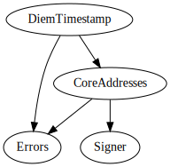
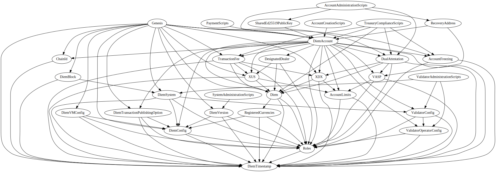
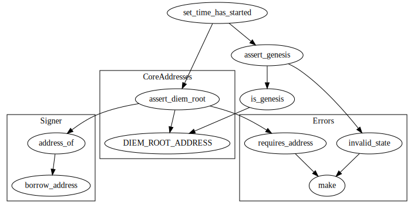
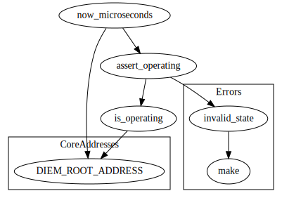
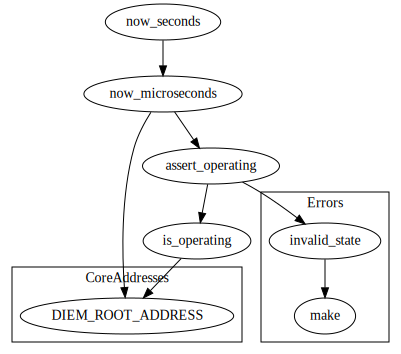
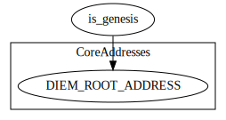
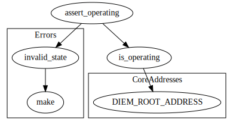

# Module `0x1::DiemTimestamp`

This module keeps a global wall clock that stores the current Unix time in microseconds.
It interacts with the other modules in the following ways:

* Genesis: to initialize the timestamp
* VASP: to keep track of when credentials expire
* DiemSystem, DiemAccount, DiemConfig: to check if the current state is in the genesis state
* DiemBlock: to reach consensus on the global wall clock time
* AccountLimits: to limit the time of account limits

This module moreover enables code to assert that it is running in genesis (<code><a href="DiemTimestamp.md#0x1_DiemTimestamp_assert_genesis">Self::assert_genesis</a></code>) or after
genesis (<code><a href="DiemTimestamp.md#0x1_DiemTimestamp_assert_operating">Self::assert_operating</a></code>). These are essentially distinct states of the system. Specifically,
if <code><a href="DiemTimestamp.md#0x1_DiemTimestamp_assert_operating">Self::assert_operating</a></code> succeeds, assumptions about invariants over the global state can be made
which reflect that the system has been successfully initialized.

-  [Resource `CurrentTimeMicroseconds`](#0x1_DiemTimestamp_CurrentTimeMicroseconds)
-  [Constants](#@Constants_0)
-  [Function `set_time_has_started`](#0x1_DiemTimestamp_set_time_has_started)
-  [Function `update_global_time`](#0x1_DiemTimestamp_update_global_time)
-  [Function `now_microseconds`](#0x1_DiemTimestamp_now_microseconds)
-  [Function `now_seconds`](#0x1_DiemTimestamp_now_seconds)
-  [Function `is_genesis`](#0x1_DiemTimestamp_is_genesis)
-  [Function `assert_genesis`](#0x1_DiemTimestamp_assert_genesis)
-  [Function `is_operating`](#0x1_DiemTimestamp_is_operating)
-  [Function `assert_operating`](#0x1_DiemTimestamp_assert_operating)
-  [Module Specification](#@Module_Specification_1)

<pre><code><b>use</b> <a href="CoreAddresses.md#0x1_CoreAddresses">0x1::CoreAddresses</a>;
<b>use</b> <a href="../../../move-stdlib/docs/Errors.md#0x1_Errors">0x1::Errors</a>;
</code></pre>

Show all the modules that "DiemTimestamp" depends on directly or indirectly

Show all the modules that depend on "DiemTimestamp" directly or indirectly

## Resource `CurrentTimeMicroseconds`

A singleton resource holding the current Unix time in microseconds

<pre><code><b>resource</b> <b>struct</b> <a href="DiemTimestamp.md#0x1_DiemTimestamp_CurrentTimeMicroseconds">CurrentTimeMicroseconds</a>
</code></pre>

Fields

<dl>
<dt>
<code>microseconds: u64</code>
</dt>
<dd>

</dd>
</dl>

## Constants

The blockchain is not in the genesis state anymore

<pre><code><b>const</b> <a href="DiemTimestamp.md#0x1_DiemTimestamp_ENOT_GENESIS">ENOT_GENESIS</a>: u64 = 0;
</code></pre>

The blockchain is not in an operating state yet

<pre><code><b>const</b> <a href="DiemTimestamp.md#0x1_DiemTimestamp_ENOT_OPERATING">ENOT_OPERATING</a>: u64 = 1;
</code></pre>

An invalid timestamp was provided

<pre><code><b>const</b> <a href="DiemTimestamp.md#0x1_DiemTimestamp_ETIMESTAMP">ETIMESTAMP</a>: u64 = 2;
</code></pre>

Conversion factor between seconds and microseconds

<pre><code><b>const</b> <a href="DiemTimestamp.md#0x1_DiemTimestamp_MICRO_CONVERSION_FACTOR">MICRO_CONVERSION_FACTOR</a>: u64 = 1000000;
</code></pre>

## Function `set_time_has_started`

Marks that time has started and genesis has finished. This can only be called from genesis and with the root
account.

<pre><code><b>public</b> <b>fun</b> <a href="DiemTimestamp.md#0x1_DiemTimestamp_set_time_has_started">set_time_has_started</a>(dr_account: &signer)
</code></pre>

Implementation

<pre><code><b>public</b> <b>fun</b> <a href="DiemTimestamp.md#0x1_DiemTimestamp_set_time_has_started">set_time_has_started</a>(dr_account: &signer) {
    <a href="DiemTimestamp.md#0x1_DiemTimestamp_assert_genesis">assert_genesis</a>();
    <a href="CoreAddresses.md#0x1_CoreAddresses_assert_diem_root">CoreAddresses::assert_diem_root</a>(dr_account);
    <b>let</b> timer = <a href="DiemTimestamp.md#0x1_DiemTimestamp_CurrentTimeMicroseconds">CurrentTimeMicroseconds</a> { microseconds: 0 };
    move_to(dr_account, timer);
}
</code></pre>

Specification

The friend of this function is <code><a href="Genesis.md#0x1_Genesis_initialize">Genesis::initialize</a></code> which means that
this function can't be verified on its own and has to be verified in
context of Genesis execution.
After time has started, all invariants guarded by <code><a href="DiemTimestamp.md#0x1_DiemTimestamp_is_operating">DiemTimestamp::is_operating</a></code>
will become activated and need to hold.

<pre><code><b>pragma</b> <b>friend</b> = <a href="Genesis.md#0x1_Genesis_initialize">0x1::Genesis::initialize</a>;
<b>include</b> <a href="DiemTimestamp.md#0x1_DiemTimestamp_AbortsIfNotGenesis">AbortsIfNotGenesis</a>;
<b>include</b> <a href="CoreAddresses.md#0x1_CoreAddresses_AbortsIfNotDiemRoot">CoreAddresses::AbortsIfNotDiemRoot</a>{account: dr_account};
<b>ensures</b> <a href="DiemTimestamp.md#0x1_DiemTimestamp_is_operating">is_operating</a>();
</code></pre>

Show all the functions that "set_time_has_started" calls

## Function `update_global_time`

Updates the wall clock time by consensus. Requires VM privilege and will be invoked during block prologue.

<pre><code><b>public</b> <b>fun</b> <a href="DiemTimestamp.md#0x1_DiemTimestamp_update_global_time">update_global_time</a>(account: &signer, proposer: address, timestamp: u64)
</code></pre>

Implementation

<pre><code><b>public</b> <b>fun</b> <a href="DiemTimestamp.md#0x1_DiemTimestamp_update_global_time">update_global_time</a>(
    account: &signer,
    proposer: address,
    timestamp: u64
) <b>acquires</b> <a href="DiemTimestamp.md#0x1_DiemTimestamp_CurrentTimeMicroseconds">CurrentTimeMicroseconds</a> {
    <a href="DiemTimestamp.md#0x1_DiemTimestamp_assert_operating">assert_operating</a>();
    // Can only be invoked by DiemVM signer.
    <a href="CoreAddresses.md#0x1_CoreAddresses_assert_vm">CoreAddresses::assert_vm</a>(account);

    <b>let</b> global_timer = borrow_global_mut&lt;<a href="DiemTimestamp.md#0x1_DiemTimestamp_CurrentTimeMicroseconds">CurrentTimeMicroseconds</a>&gt;(<a href="CoreAddresses.md#0x1_CoreAddresses_DIEM_ROOT_ADDRESS">CoreAddresses::DIEM_ROOT_ADDRESS</a>());
    <b>let</b> now = global_timer.microseconds;
    <b>if</b> (proposer == <a href="CoreAddresses.md#0x1_CoreAddresses_VM_RESERVED_ADDRESS">CoreAddresses::VM_RESERVED_ADDRESS</a>()) {
        // NIL block <b>with</b> null address <b>as</b> proposer. Timestamp must be equal.
        <b>assert</b>(now == timestamp, <a href="../../../move-stdlib/docs/Errors.md#0x1_Errors_invalid_argument">Errors::invalid_argument</a>(<a href="DiemTimestamp.md#0x1_DiemTimestamp_ETIMESTAMP">ETIMESTAMP</a>));
    } <b>else</b> {
        // Normal block. Time must advance
        <b>assert</b>(now &lt; timestamp, <a href="../../../move-stdlib/docs/Errors.md#0x1_Errors_invalid_argument">Errors::invalid_argument</a>(<a href="DiemTimestamp.md#0x1_DiemTimestamp_ETIMESTAMP">ETIMESTAMP</a>));
    };
    global_timer.microseconds = timestamp;
}
</code></pre>

Specification

<pre><code><b>pragma</b> opaque;
<b>modifies</b> <b>global</b>&lt;<a href="DiemTimestamp.md#0x1_DiemTimestamp_CurrentTimeMicroseconds">CurrentTimeMicroseconds</a>&gt;(<a href="CoreAddresses.md#0x1_CoreAddresses_DIEM_ROOT_ADDRESS">CoreAddresses::DIEM_ROOT_ADDRESS</a>());

<b>let</b> now = <a href="DiemTimestamp.md#0x1_DiemTimestamp_spec_now_microseconds">spec_now_microseconds</a>();
</code></pre>

Conditions unique for abstract and concrete version of this function.

<pre><code><b>include</b> <a href="DiemTimestamp.md#0x1_DiemTimestamp_AbortsIfNotOperating">AbortsIfNotOperating</a>;
<b>include</b> <a href="CoreAddresses.md#0x1_CoreAddresses_AbortsIfNotVM">CoreAddresses::AbortsIfNotVM</a>;
<b>ensures</b> now == timestamp;
</code></pre>

Conditions we only check for the implementation, but do not pass to the caller.

<pre><code><b>aborts_if</b> [concrete]
    (<b>if</b> (proposer == <a href="CoreAddresses.md#0x1_CoreAddresses_VM_RESERVED_ADDRESS">CoreAddresses::VM_RESERVED_ADDRESS</a>()) {
        now != timestamp // Refers <b>to</b> the now in the pre state
     } <b>else</b>  {
        now &gt;= timestamp
     }
    )
    <b>with</b> <a href="../../../move-stdlib/docs/Errors.md#0x1_Errors_INVALID_ARGUMENT">Errors::INVALID_ARGUMENT</a>;
</code></pre>

Show all the functions that "update_global_time" calls

## Function `now_microseconds`

Gets the current time in microseconds.

<pre><code><b>public</b> <b>fun</b> <a href="DiemTimestamp.md#0x1_DiemTimestamp_now_microseconds">now_microseconds</a>(): u64
</code></pre>

Implementation

<pre><code><b>public</b> <b>fun</b> <a href="DiemTimestamp.md#0x1_DiemTimestamp_now_microseconds">now_microseconds</a>(): u64 <b>acquires</b> <a href="DiemTimestamp.md#0x1_DiemTimestamp_CurrentTimeMicroseconds">CurrentTimeMicroseconds</a> {
    <a href="DiemTimestamp.md#0x1_DiemTimestamp_assert_operating">assert_operating</a>();
    borrow_global&lt;<a href="DiemTimestamp.md#0x1_DiemTimestamp_CurrentTimeMicroseconds">CurrentTimeMicroseconds</a>&gt;(<a href="CoreAddresses.md#0x1_CoreAddresses_DIEM_ROOT_ADDRESS">CoreAddresses::DIEM_ROOT_ADDRESS</a>()).microseconds
}
</code></pre>

Specification

<pre><code><b>pragma</b> opaque;
<b>include</b> <a href="DiemTimestamp.md#0x1_DiemTimestamp_AbortsIfNotOperating">AbortsIfNotOperating</a>;
<b>ensures</b> result == <a href="DiemTimestamp.md#0x1_DiemTimestamp_spec_now_microseconds">spec_now_microseconds</a>();
</code></pre>

<pre><code><b>define</b> <a href="DiemTimestamp.md#0x1_DiemTimestamp_spec_now_microseconds">spec_now_microseconds</a>(): u64 {
   <b>global</b>&lt;<a href="DiemTimestamp.md#0x1_DiemTimestamp_CurrentTimeMicroseconds">CurrentTimeMicroseconds</a>&gt;(<a href="CoreAddresses.md#0x1_CoreAddresses_DIEM_ROOT_ADDRESS">CoreAddresses::DIEM_ROOT_ADDRESS</a>()).microseconds
}
</code></pre>

Show all the functions that "now_microseconds" calls

## Function `now_seconds`

Gets the current time in seconds.

<pre><code><b>public</b> <b>fun</b> <a href="DiemTimestamp.md#0x1_DiemTimestamp_now_seconds">now_seconds</a>(): u64
</code></pre>

Implementation

<pre><code><b>public</b> <b>fun</b> <a href="DiemTimestamp.md#0x1_DiemTimestamp_now_seconds">now_seconds</a>(): u64 <b>acquires</b> <a href="DiemTimestamp.md#0x1_DiemTimestamp_CurrentTimeMicroseconds">CurrentTimeMicroseconds</a> {
    <a href="DiemTimestamp.md#0x1_DiemTimestamp_now_microseconds">now_microseconds</a>() / <a href="DiemTimestamp.md#0x1_DiemTimestamp_MICRO_CONVERSION_FACTOR">MICRO_CONVERSION_FACTOR</a>
}
</code></pre>

Specification

<pre><code><b>pragma</b> opaque;
<b>include</b> <a href="DiemTimestamp.md#0x1_DiemTimestamp_AbortsIfNotOperating">AbortsIfNotOperating</a>;
<b>ensures</b> result == <a href="DiemTimestamp.md#0x1_DiemTimestamp_spec_now_microseconds">spec_now_microseconds</a>() /  <a href="DiemTimestamp.md#0x1_DiemTimestamp_MICRO_CONVERSION_FACTOR">MICRO_CONVERSION_FACTOR</a>;
</code></pre>

<pre><code><b>define</b> <a href="DiemTimestamp.md#0x1_DiemTimestamp_spec_now_seconds">spec_now_seconds</a>(): u64 {
   <b>global</b>&lt;<a href="DiemTimestamp.md#0x1_DiemTimestamp_CurrentTimeMicroseconds">CurrentTimeMicroseconds</a>&gt;(<a href="CoreAddresses.md#0x1_CoreAddresses_DIEM_ROOT_ADDRESS">CoreAddresses::DIEM_ROOT_ADDRESS</a>()).microseconds / <a href="DiemTimestamp.md#0x1_DiemTimestamp_MICRO_CONVERSION_FACTOR">MICRO_CONVERSION_FACTOR</a>
}
</code></pre>

Show all the functions that "now_seconds" calls

## Function `is_genesis`

Helper function to determine if Diem is in genesis state.

<pre><code><b>public</b> <b>fun</b> <a href="DiemTimestamp.md#0x1_DiemTimestamp_is_genesis">is_genesis</a>(): bool
</code></pre>

Implementation

<pre><code><b>public</b> <b>fun</b> <a href="DiemTimestamp.md#0x1_DiemTimestamp_is_genesis">is_genesis</a>(): bool {
    !<b>exists</b>&lt;<a href="DiemTimestamp.md#0x1_DiemTimestamp_CurrentTimeMicroseconds">CurrentTimeMicroseconds</a>&gt;(<a href="CoreAddresses.md#0x1_CoreAddresses_DIEM_ROOT_ADDRESS">CoreAddresses::DIEM_ROOT_ADDRESS</a>())
}
</code></pre>

Show all the functions that "is_genesis" calls

## Function `assert_genesis`

Helper function to assert genesis state.

<pre><code><b>public</b> <b>fun</b> <a href="DiemTimestamp.md#0x1_DiemTimestamp_assert_genesis">assert_genesis</a>()
</code></pre>

Implementation

<pre><code><b>public</b> <b>fun</b> <a href="DiemTimestamp.md#0x1_DiemTimestamp_assert_genesis">assert_genesis</a>() {
    <b>assert</b>(<a href="DiemTimestamp.md#0x1_DiemTimestamp_is_genesis">is_genesis</a>(), <a href="../../../move-stdlib/docs/Errors.md#0x1_Errors_invalid_state">Errors::invalid_state</a>(<a href="DiemTimestamp.md#0x1_DiemTimestamp_ENOT_GENESIS">ENOT_GENESIS</a>));
}
</code></pre>

Specification

<pre><code><b>pragma</b> opaque = <b>true</b>;
<b>include</b> <a href="DiemTimestamp.md#0x1_DiemTimestamp_AbortsIfNotGenesis">AbortsIfNotGenesis</a>;
</code></pre>

Helper schema to specify that a function aborts if not in genesis.

<pre><code><b>schema</b> <a href="DiemTimestamp.md#0x1_DiemTimestamp_AbortsIfNotGenesis">AbortsIfNotGenesis</a> {
    <b>aborts_if</b> !<a href="DiemTimestamp.md#0x1_DiemTimestamp_is_genesis">is_genesis</a>() <b>with</b> <a href="../../../move-stdlib/docs/Errors.md#0x1_Errors_INVALID_STATE">Errors::INVALID_STATE</a>;
}
</code></pre>

Show all the functions that "assert_genesis" calls

## Function `is_operating`

Helper function to determine if Diem is operating. This is the same as <code>!<a href="DiemTimestamp.md#0x1_DiemTimestamp_is_genesis">is_genesis</a>()</code> and is provided
for convenience. Testing <code><a href="DiemTimestamp.md#0x1_DiemTimestamp_is_operating">is_operating</a>()</code> is more frequent than <code><a href="DiemTimestamp.md#0x1_DiemTimestamp_is_genesis">is_genesis</a>()</code>.

<pre><code><b>public</b> <b>fun</b> <a href="DiemTimestamp.md#0x1_DiemTimestamp_is_operating">is_operating</a>(): bool
</code></pre>

Implementation

<pre><code><b>public</b> <b>fun</b> <a href="DiemTimestamp.md#0x1_DiemTimestamp_is_operating">is_operating</a>(): bool {
    <b>exists</b>&lt;<a href="DiemTimestamp.md#0x1_DiemTimestamp_CurrentTimeMicroseconds">CurrentTimeMicroseconds</a>&gt;(<a href="CoreAddresses.md#0x1_CoreAddresses_DIEM_ROOT_ADDRESS">CoreAddresses::DIEM_ROOT_ADDRESS</a>())
}
</code></pre>

Show all the functions that "is_operating" calls

## Function `assert_operating`

Helper function to assert operating (!genesis) state.

<pre><code><b>public</b> <b>fun</b> <a href="DiemTimestamp.md#0x1_DiemTimestamp_assert_operating">assert_operating</a>()
</code></pre>

Implementation

<pre><code><b>public</b> <b>fun</b> <a href="DiemTimestamp.md#0x1_DiemTimestamp_assert_operating">assert_operating</a>() {
    <b>assert</b>(<a href="DiemTimestamp.md#0x1_DiemTimestamp_is_operating">is_operating</a>(), <a href="../../../move-stdlib/docs/Errors.md#0x1_Errors_invalid_state">Errors::invalid_state</a>(<a href="DiemTimestamp.md#0x1_DiemTimestamp_ENOT_OPERATING">ENOT_OPERATING</a>));
}
</code></pre>

Specification

<pre><code><b>pragma</b> opaque = <b>true</b>;
<b>include</b> <a href="DiemTimestamp.md#0x1_DiemTimestamp_AbortsIfNotOperating">AbortsIfNotOperating</a>;
</code></pre>

Helper schema to specify that a function aborts if not operating.

<pre><code><b>schema</b> <a href="DiemTimestamp.md#0x1_DiemTimestamp_AbortsIfNotOperating">AbortsIfNotOperating</a> {
    <b>aborts_if</b> !<a href="DiemTimestamp.md#0x1_DiemTimestamp_is_operating">is_operating</a>() <b>with</b> <a href="../../../move-stdlib/docs/Errors.md#0x1_Errors_INVALID_STATE">Errors::INVALID_STATE</a>;
}
</code></pre>

Show all the functions that "assert_operating" calls

## Module Specification

After genesis, <code><a href="DiemTimestamp.md#0x1_DiemTimestamp_CurrentTimeMicroseconds">CurrentTimeMicroseconds</a></code> is published forever

<pre><code><b>invariant</b> [<b>global</b>] <a href="DiemTimestamp.md#0x1_DiemTimestamp_is_operating">is_operating</a>() ==&gt; <b>exists</b>&lt;<a href="DiemTimestamp.md#0x1_DiemTimestamp_CurrentTimeMicroseconds">CurrentTimeMicroseconds</a>&gt;(<a href="CoreAddresses.md#0x1_CoreAddresses_DIEM_ROOT_ADDRESS">CoreAddresses::DIEM_ROOT_ADDRESS</a>());
</code></pre>

After genesis, time progresses monotonically.

<pre><code><b>invariant</b> <b>update</b> [<b>global</b>]
    <b>old</b>(<a href="DiemTimestamp.md#0x1_DiemTimestamp_is_operating">is_operating</a>()) ==&gt; <b>old</b>(<a href="DiemTimestamp.md#0x1_DiemTimestamp_spec_now_microseconds">spec_now_microseconds</a>()) &lt;= <a href="DiemTimestamp.md#0x1_DiemTimestamp_spec_now_microseconds">spec_now_microseconds</a>();
</code></pre>

All functions which do not have an <code><b>aborts_if</b></code> specification in this module are implicitly declared
to never abort.

<pre><code><b>pragma</b> aborts_if_is_strict;
</code></pre>

[//]: # ("File containing references which can be used from documentation")
[ACCESS_CONTROL]: https://github.com/diem/dip/blob/main/dips/dip-2.md
[ROLE]: https://github.com/diem/dip/blob/main/dips/dip-2.md#roles
[PERMISSION]: https://github.com/diem/dip/blob/main/dips/dip-2.md#permissions
