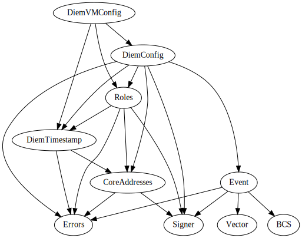

# Module `0x1::DiemVMConfig`

This module defines structs and methods to initialize VM configurations,
including different costs of running the VM.

-  [Struct `DiemVMConfig`](#0x1_DiemVMConfig_DiemVMConfig)
-  [Struct `GasSchedule`](#0x1_DiemVMConfig_GasSchedule)
-  [Struct `GasConstants`](#0x1_DiemVMConfig_GasConstants)
-  [Function `initialize`](#0x1_DiemVMConfig_initialize)
-  [Module Specification](#@Module_Specification_0)
    -  [Initialization](#@Initialization_1)
    -  [Access Control](#@Access_Control_2)

<pre><code><b>use</b> <a href="DiemConfig.md#0x1_DiemConfig">0x1::DiemConfig</a>;
<b>use</b> <a href="DiemTimestamp.md#0x1_DiemTimestamp">0x1::DiemTimestamp</a>;
<b>use</b> <a href="Roles.md#0x1_Roles">0x1::Roles</a>;
</code></pre>

Show all the modules that "DiemVMConfig" depends on directly or indirectly

Show all the modules that depend on "DiemVMConfig" directly or indirectly

## Struct `DiemVMConfig`

The struct to hold config data needed to operate the DiemVM.

<pre><code><b>struct</b> <a href="DiemVMConfig.md#0x1_DiemVMConfig">DiemVMConfig</a>
</code></pre>

Fields

<dl>
<dt>
<code>gas_schedule: <a href="DiemVMConfig.md#0x1_DiemVMConfig_GasSchedule">DiemVMConfig::GasSchedule</a></code>
</dt>
<dd>
 Cost of running the VM.
</dd>
</dl>

## Struct `GasSchedule`

The gas schedule keeps two separate schedules for the gas:
* The instruction_schedule: This holds the gas for each bytecode instruction.
* The native_schedule: This holds the gas for used (per-byte operated over) for each native
function.
A couple notes:
1. In the case that an instruction is deleted from the bytecode, that part of the cost schedule
still needs to remain the same; once a slot in the table is taken by an instruction, that is its
slot for the rest of time (since that instruction could already exist in a module on-chain).
2. The initialization of the module will publish the instruction table to the diem root account
address, and will preload the vector with the gas schedule for instructions. The VM will then
load this into memory at the startup of each block.

<pre><code><b>struct</b> <a href="DiemVMConfig.md#0x1_DiemVMConfig_GasSchedule">GasSchedule</a>
</code></pre>

Fields

<dl>
<dt>
<code>instruction_schedule: vector&lt;u8&gt;</code>
</dt>
<dd>

</dd>
<dt>
<code>native_schedule: vector&lt;u8&gt;</code>
</dt>
<dd>

</dd>
<dt>
<code>gas_constants: <a href="DiemVMConfig.md#0x1_DiemVMConfig_GasConstants">DiemVMConfig::GasConstants</a></code>
</dt>
<dd>

</dd>
</dl>

## Struct `GasConstants`

<pre><code><b>struct</b> <a href="DiemVMConfig.md#0x1_DiemVMConfig_GasConstants">GasConstants</a>
</code></pre>

Fields

<dl>
<dt>
<code>global_memory_per_byte_cost: u64</code>
</dt>
<dd>
 The cost per-byte written to global storage.
</dd>
<dt>
<code>global_memory_per_byte_write_cost: u64</code>
</dt>
<dd>
 The cost per-byte written to storage.
</dd>
<dt>
<code>min_transaction_gas_units: u64</code>
</dt>
<dd>
 The flat minimum amount of gas required for any transaction.
 Charged at the start of execution.
</dd>
<dt>
<code>large_transaction_cutoff: u64</code>
</dt>
<dd>
 Any transaction over this size will be charged an additional amount per byte.
</dd>
<dt>
<code>intrinsic_gas_per_byte: u64</code>
</dt>
<dd>
 The units of gas that to be charged per byte over the <code>large_transaction_cutoff</code> in addition to
 <code>min_transaction_gas_units</code> for transactions whose size exceeds <code>large_transaction_cutoff</code>.
</dd>
<dt>
<code>maximum_number_of_gas_units: u64</code>
</dt>
<dd>
 ~5 microseconds should equal one unit of computational gas. We bound the maximum
 computational time of any given transaction at roughly 20 seconds. We want this number and
 <code>MAX_PRICE_PER_GAS_UNIT</code> to always satisfy the inequality that
 MAXIMUM_NUMBER_OF_GAS_UNITS * MAX_PRICE_PER_GAS_UNIT < min(u64::MAX, GasUnits<GasCarrier>::MAX)
 NB: The bound is set quite high since custom scripts aren't allowed except from predefined
 and vetted senders.
</dd>
<dt>
<code>min_price_per_gas_unit: u64</code>
</dt>
<dd>
 The minimum gas price that a transaction can be submitted with.
</dd>
<dt>
<code>max_price_per_gas_unit: u64</code>
</dt>
<dd>
 The maximum gas unit price that a transaction can be submitted with.
</dd>
<dt>
<code>max_transaction_size_in_bytes: u64</code>
</dt>
<dd>

</dd>
<dt>
<code>gas_unit_scaling_factor: u64</code>
</dt>
<dd>

</dd>
<dt>
<code>default_account_size: u64</code>
</dt>
<dd>

</dd>
</dl>

## Function `initialize`

Initialize the table under the diem root account

<pre><code><b>public</b> <b>fun</b> <a href="DiemVMConfig.md#0x1_DiemVMConfig_initialize">initialize</a>(dr_account: &signer, instruction_schedule: vector&lt;u8&gt;, native_schedule: vector&lt;u8&gt;)
</code></pre>

Implementation

<pre><code><b>public</b> <b>fun</b> <a href="DiemVMConfig.md#0x1_DiemVMConfig_initialize">initialize</a>(
    dr_account: &signer,
    instruction_schedule: vector&lt;u8&gt;,
    native_schedule: vector&lt;u8&gt;,
) {
    <a href="DiemTimestamp.md#0x1_DiemTimestamp_assert_genesis">DiemTimestamp::assert_genesis</a>();

    // The permission "UpdateVMConfig" is granted <b>to</b> DiemRoot [[H11]][PERMISSION].
    <a href="Roles.md#0x1_Roles_assert_diem_root">Roles::assert_diem_root</a>(dr_account);

    <b>let</b> gas_constants = <a href="DiemVMConfig.md#0x1_DiemVMConfig_GasConstants">GasConstants</a> {
        global_memory_per_byte_cost: 4,
        global_memory_per_byte_write_cost: 9,
        min_transaction_gas_units: 600,
        large_transaction_cutoff: 600,
        intrinsic_gas_per_byte: 8,
        maximum_number_of_gas_units: 4000000,
        min_price_per_gas_unit: 0,
        max_price_per_gas_unit: 10000,
        max_transaction_size_in_bytes: 4096,
        gas_unit_scaling_factor: 1000,
        default_account_size: 800,
    };

    <a href="DiemConfig.md#0x1_DiemConfig_publish_new_config">DiemConfig::publish_new_config</a>(
        dr_account,
        <a href="DiemVMConfig.md#0x1_DiemVMConfig">DiemVMConfig</a> {
            gas_schedule: <a href="DiemVMConfig.md#0x1_DiemVMConfig_GasSchedule">GasSchedule</a> {
                instruction_schedule,
                native_schedule,
                gas_constants,
            }
        },
    );
}
</code></pre>

Specification

<pre><code><b>let</b> gas_constants = <a href="DiemVMConfig.md#0x1_DiemVMConfig_GasConstants">GasConstants</a> {
    global_memory_per_byte_cost: 4,
    global_memory_per_byte_write_cost: 9,
    min_transaction_gas_units: 600,
    large_transaction_cutoff: 600,
    intrinsic_gas_per_byte: 8,
    maximum_number_of_gas_units: 4000000,
    min_price_per_gas_unit: 0,
    max_price_per_gas_unit: 10000,
    max_transaction_size_in_bytes: 4096,
    gas_unit_scaling_factor: 1000,
    default_account_size: 800,
};
</code></pre>

Must abort if the signer does not have the DiemRoot role [[H11]][PERMISSION].

<pre><code><b>include</b> <a href="Roles.md#0x1_Roles_AbortsIfNotDiemRoot">Roles::AbortsIfNotDiemRoot</a>{account: dr_account};
<b>include</b> <a href="DiemTimestamp.md#0x1_DiemTimestamp_AbortsIfNotGenesis">DiemTimestamp::AbortsIfNotGenesis</a>;
<b>include</b> <a href="DiemConfig.md#0x1_DiemConfig_PublishNewConfigAbortsIf">DiemConfig::PublishNewConfigAbortsIf</a>&lt;<a href="DiemVMConfig.md#0x1_DiemVMConfig">DiemVMConfig</a>&gt;;
<b>include</b> <a href="DiemConfig.md#0x1_DiemConfig_PublishNewConfigEnsures">DiemConfig::PublishNewConfigEnsures</a>&lt;<a href="DiemVMConfig.md#0x1_DiemVMConfig">DiemVMConfig</a>&gt; {
    payload: <a href="DiemVMConfig.md#0x1_DiemVMConfig">DiemVMConfig</a> {
        gas_schedule: <a href="DiemVMConfig.md#0x1_DiemVMConfig_GasSchedule">GasSchedule</a> {
            instruction_schedule,
            native_schedule,
            gas_constants,
        }
    }};
</code></pre>

Show all the functions that "initialize" calls

## Module Specification

### Initialization

<pre><code><b>invariant</b> [<b>global</b>] <a href="DiemTimestamp.md#0x1_DiemTimestamp_is_operating">DiemTimestamp::is_operating</a>() ==&gt; <a href="DiemConfig.md#0x1_DiemConfig_spec_is_published">DiemConfig::spec_is_published</a>&lt;<a href="DiemVMConfig.md#0x1_DiemVMConfig">DiemVMConfig</a>&gt;();
</code></pre>

### Access Control

Currently, no one can update DiemVMConfig [[H11]][PERMISSION]

<pre><code><b>schema</b> <a href="DiemVMConfig.md#0x1_DiemVMConfig_DiemVMConfigRemainsSame">DiemVMConfigRemainsSame</a> {
    <b>ensures</b> <b>old</b>(<a href="DiemConfig.md#0x1_DiemConfig_spec_is_published">DiemConfig::spec_is_published</a>&lt;<a href="DiemVMConfig.md#0x1_DiemVMConfig">DiemVMConfig</a>&gt;()) ==&gt;
        <b>global</b>&lt;<a href="DiemConfig.md#0x1_DiemConfig">DiemConfig</a>&lt;<a href="DiemVMConfig.md#0x1_DiemVMConfig">DiemVMConfig</a>&gt;&gt;(<a href="CoreAddresses.md#0x1_CoreAddresses_DIEM_ROOT_ADDRESS">CoreAddresses::DIEM_ROOT_ADDRESS</a>()) ==
            <b>old</b>(<b>global</b>&lt;<a href="DiemConfig.md#0x1_DiemConfig">DiemConfig</a>&lt;<a href="DiemVMConfig.md#0x1_DiemVMConfig">DiemVMConfig</a>&gt;&gt;(<a href="CoreAddresses.md#0x1_CoreAddresses_DIEM_ROOT_ADDRESS">CoreAddresses::DIEM_ROOT_ADDRESS</a>()));
}
</code></pre>

<pre><code><b>apply</b> <a href="DiemVMConfig.md#0x1_DiemVMConfig_DiemVMConfigRemainsSame">DiemVMConfigRemainsSame</a> <b>to</b> *;
</code></pre>

[//]: # ("File containing references which can be used from documentation")
[ACCESS_CONTROL]: https://github.com/diem/dip/blob/main/dips/dip-2.md
[ROLE]: https://github.com/diem/dip/blob/main/dips/dip-2.md#roles
[PERMISSION]: https://github.com/diem/dip/blob/main/dips/dip-2.md#permissions
