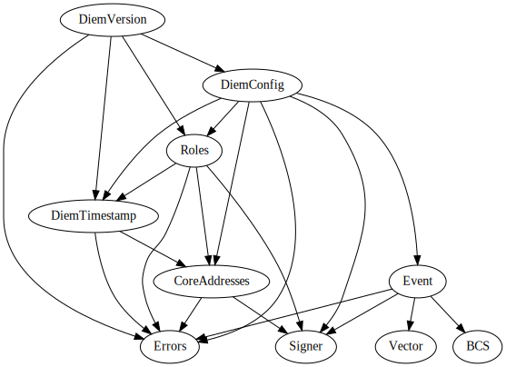
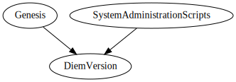

# Module `0x1::DiemVersion`

Maintains the version number for the Diem blockchain. The version is stored in a
DiemConfig, and may be updated by Diem root.

-  [Struct `DiemVersion`](#0x1_DiemVersion_DiemVersion)
-  [Constants](#@Constants_0)
-  [Function `initialize`](#0x1_DiemVersion_initialize)
-  [Function `set`](#0x1_DiemVersion_set)
-  [Module Specification](#@Module_Specification_1)
    -  [Initialization](#@Initialization_2)
    -  [Access Control](#@Access_Control_3)
    -  [Other Invariants](#@Other_Invariants_4)

<pre><code><b>use</b> <a href="DiemConfig.md#0x1_DiemConfig">0x1::DiemConfig</a>;
<b>use</b> <a href="DiemTimestamp.md#0x1_DiemTimestamp">0x1::DiemTimestamp</a>;
<b>use</b> <a href="../../../move-stdlib/docs/Errors.md#0x1_Errors">0x1::Errors</a>;
<b>use</b> <a href="Roles.md#0x1_Roles">0x1::Roles</a>;
</code></pre>

Show all the modules that "DiemVersion" depends on directly or indirectly

Show all the modules that depend on "DiemVersion" directly or indirectly

## Struct `DiemVersion`

<pre><code><b>struct</b> <a href="DiemVersion.md#0x1_DiemVersion">DiemVersion</a>
</code></pre>

Fields

<dl>
<dt>
<code>major: u64</code>
</dt>
<dd>

</dd>
</dl>

## Constants

Tried to set an invalid major version for the VM. Major versions must be strictly increasing

<pre><code><b>const</b> <a href="DiemVersion.md#0x1_DiemVersion_EINVALID_MAJOR_VERSION_NUMBER">EINVALID_MAJOR_VERSION_NUMBER</a>: u64 = 0;
</code></pre>

## Function `initialize`

Publishes the DiemVersion config. Must be called during Genesis.

<pre><code><b>public</b> <b>fun</b> <a href="DiemVersion.md#0x1_DiemVersion_initialize">initialize</a>(dr_account: &signer)
</code></pre>

Implementation

<pre><code><b>public</b> <b>fun</b> <a href="DiemVersion.md#0x1_DiemVersion_initialize">initialize</a>(
    dr_account: &signer,
) {
    <a href="DiemTimestamp.md#0x1_DiemTimestamp_assert_genesis">DiemTimestamp::assert_genesis</a>();
    <a href="Roles.md#0x1_Roles_assert_diem_root">Roles::assert_diem_root</a>(dr_account);
    <a href="DiemConfig.md#0x1_DiemConfig_publish_new_config">DiemConfig::publish_new_config</a>&lt;<a href="DiemVersion.md#0x1_DiemVersion">DiemVersion</a>&gt;(
        dr_account,
        <a href="DiemVersion.md#0x1_DiemVersion">DiemVersion</a> { major: 1 },
    );
}
</code></pre>

Specification

Must abort if the signer does not have the DiemRoot role [[H10]][PERMISSION].

<pre><code><b>include</b> <a href="Roles.md#0x1_Roles_AbortsIfNotDiemRoot">Roles::AbortsIfNotDiemRoot</a>{account: dr_account};
<b>include</b> <a href="DiemTimestamp.md#0x1_DiemTimestamp_AbortsIfNotGenesis">DiemTimestamp::AbortsIfNotGenesis</a>;
<b>include</b> <a href="DiemConfig.md#0x1_DiemConfig_PublishNewConfigAbortsIf">DiemConfig::PublishNewConfigAbortsIf</a>&lt;<a href="DiemVersion.md#0x1_DiemVersion">DiemVersion</a>&gt;;
<b>include</b> <a href="DiemConfig.md#0x1_DiemConfig_PublishNewConfigEnsures">DiemConfig::PublishNewConfigEnsures</a>&lt;<a href="DiemVersion.md#0x1_DiemVersion">DiemVersion</a>&gt;{payload: <a href="DiemVersion.md#0x1_DiemVersion">DiemVersion</a> { major: 1 }};
</code></pre>

Show all the functions that "initialize" calls

## Function `set`

Allows Diem root to update the major version to a larger version.

<pre><code><b>public</b> <b>fun</b> <a href="DiemVersion.md#0x1_DiemVersion_set">set</a>(dr_account: &signer, major: u64)
</code></pre>

Implementation

<pre><code><b>public</b> <b>fun</b> <a href="DiemVersion.md#0x1_DiemVersion_set">set</a>(dr_account: &signer, major: u64) {
    <a href="DiemTimestamp.md#0x1_DiemTimestamp_assert_operating">DiemTimestamp::assert_operating</a>();

    <a href="Roles.md#0x1_Roles_assert_diem_root">Roles::assert_diem_root</a>(dr_account);

    <b>let</b> old_config = <a href="DiemConfig.md#0x1_DiemConfig_get">DiemConfig::get</a>&lt;<a href="DiemVersion.md#0x1_DiemVersion">DiemVersion</a>&gt;();

    <b>assert</b>(
        old_config.major &lt; major,
        <a href="../../../move-stdlib/docs/Errors.md#0x1_Errors_invalid_argument">Errors::invalid_argument</a>(<a href="DiemVersion.md#0x1_DiemVersion_EINVALID_MAJOR_VERSION_NUMBER">EINVALID_MAJOR_VERSION_NUMBER</a>)
    );

    <a href="DiemConfig.md#0x1_DiemConfig_set">DiemConfig::set</a>&lt;<a href="DiemVersion.md#0x1_DiemVersion">DiemVersion</a>&gt;(
        dr_account,
        <a href="DiemVersion.md#0x1_DiemVersion">DiemVersion</a> { major }
    );
}
</code></pre>

Specification

Must abort if the signer does not have the DiemRoot role [[H10]][PERMISSION].

<pre><code><b>include</b> <a href="Roles.md#0x1_Roles_AbortsIfNotDiemRoot">Roles::AbortsIfNotDiemRoot</a>{account: dr_account};
<b>include</b> <a href="DiemTimestamp.md#0x1_DiemTimestamp_AbortsIfNotOperating">DiemTimestamp::AbortsIfNotOperating</a>;
<b>aborts_if</b> <a href="DiemConfig.md#0x1_DiemConfig_get">DiemConfig::get</a>&lt;<a href="DiemVersion.md#0x1_DiemVersion">DiemVersion</a>&gt;().major &gt;= major <b>with</b> <a href="../../../move-stdlib/docs/Errors.md#0x1_Errors_INVALID_ARGUMENT">Errors::INVALID_ARGUMENT</a>;
<b>include</b> <a href="DiemConfig.md#0x1_DiemConfig_SetAbortsIf">DiemConfig::SetAbortsIf</a>&lt;<a href="DiemVersion.md#0x1_DiemVersion">DiemVersion</a>&gt;{account: dr_account};
<b>include</b> <a href="DiemConfig.md#0x1_DiemConfig_SetEnsures">DiemConfig::SetEnsures</a>&lt;<a href="DiemVersion.md#0x1_DiemVersion">DiemVersion</a>&gt;{payload: <a href="DiemVersion.md#0x1_DiemVersion">DiemVersion</a> { major }};
</code></pre>

Show all the functions that "set" calls

## Module Specification

### Initialization

After genesis, version is published.

<pre><code><b>invariant</b> [<b>global</b>] <a href="DiemTimestamp.md#0x1_DiemTimestamp_is_operating">DiemTimestamp::is_operating</a>() ==&gt; <a href="DiemConfig.md#0x1_DiemConfig_spec_is_published">DiemConfig::spec_is_published</a>&lt;<a href="DiemVersion.md#0x1_DiemVersion">DiemVersion</a>&gt;();
</code></pre>

### Access Control

Only "set" can modify the DiemVersion config [[H10]][PERMISSION]

<pre><code><b>schema</b> <a href="DiemVersion.md#0x1_DiemVersion_DiemVersionRemainsSame">DiemVersionRemainsSame</a> {
    <b>ensures</b> <b>old</b>(<a href="DiemConfig.md#0x1_DiemConfig_spec_is_published">DiemConfig::spec_is_published</a>&lt;<a href="DiemVersion.md#0x1_DiemVersion">DiemVersion</a>&gt;()) ==&gt;
        <b>global</b>&lt;<a href="DiemConfig.md#0x1_DiemConfig">DiemConfig</a>&lt;<a href="DiemVersion.md#0x1_DiemVersion">DiemVersion</a>&gt;&gt;(<a href="CoreAddresses.md#0x1_CoreAddresses_DIEM_ROOT_ADDRESS">CoreAddresses::DIEM_ROOT_ADDRESS</a>()) ==
            <b>old</b>(<b>global</b>&lt;<a href="DiemConfig.md#0x1_DiemConfig">DiemConfig</a>&lt;<a href="DiemVersion.md#0x1_DiemVersion">DiemVersion</a>&gt;&gt;(<a href="CoreAddresses.md#0x1_CoreAddresses_DIEM_ROOT_ADDRESS">CoreAddresses::DIEM_ROOT_ADDRESS</a>()));
}
</code></pre>

<pre><code><b>apply</b> <a href="DiemVersion.md#0x1_DiemVersion_DiemVersionRemainsSame">DiemVersionRemainsSame</a> <b>to</b> * <b>except</b> set;
</code></pre>

The permission "UpdateDiemProtocolVersion" is granted to DiemRoot [[H10]][PERMISSION].

<pre><code><b>invariant</b> [<b>global</b>, isolated] <b>forall</b> addr: address <b>where</b> <b>exists</b>&lt;<a href="DiemConfig.md#0x1_DiemConfig">DiemConfig</a>&lt;<a href="DiemVersion.md#0x1_DiemVersion">DiemVersion</a>&gt;&gt;(addr):
    addr == <a href="CoreAddresses.md#0x1_CoreAddresses_DIEM_ROOT_ADDRESS">CoreAddresses::DIEM_ROOT_ADDRESS</a>();
</code></pre>

### Other Invariants

Version number never decreases

<pre><code><b>invariant</b> <b>update</b> [<b>global</b>, isolated]
    <b>old</b>(<a href="DiemConfig.md#0x1_DiemConfig_get">DiemConfig::get</a>&lt;<a href="DiemVersion.md#0x1_DiemVersion">DiemVersion</a>&gt;().major) &lt;= <a href="DiemConfig.md#0x1_DiemConfig_get">DiemConfig::get</a>&lt;<a href="DiemVersion.md#0x1_DiemVersion">DiemVersion</a>&gt;().major;
</code></pre>

[//]: # ("File containing references which can be used from documentation")
[ACCESS_CONTROL]: https://github.com/diem/dip/blob/main/dips/dip-2.md
[ROLE]: https://github.com/diem/dip/blob/main/dips/dip-2.md#roles
[PERMISSION]: https://github.com/diem/dip/blob/main/dips/dip-2.md#permissions
