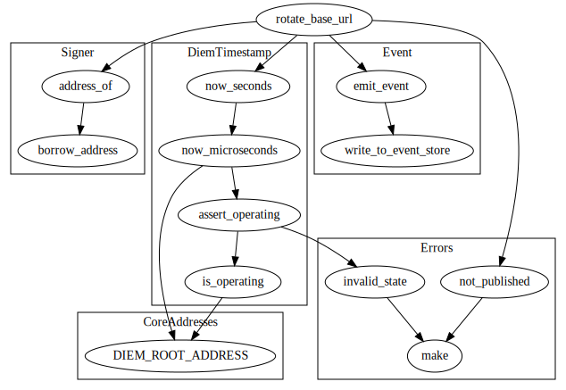
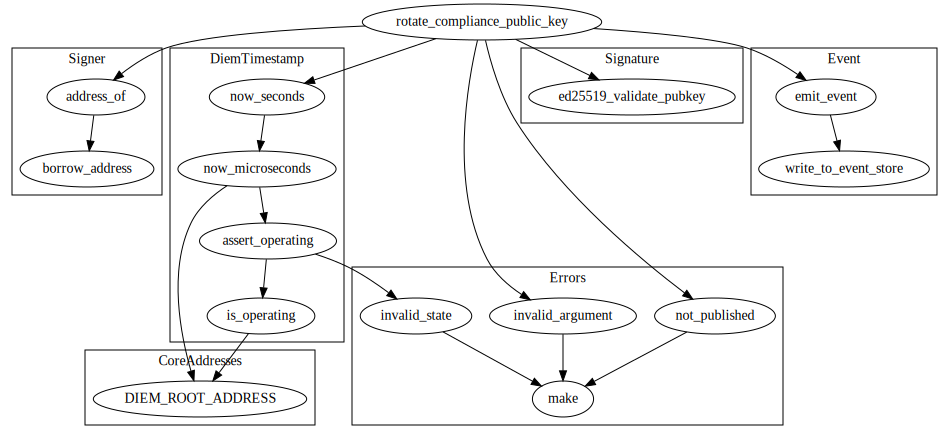
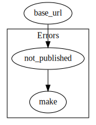
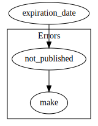
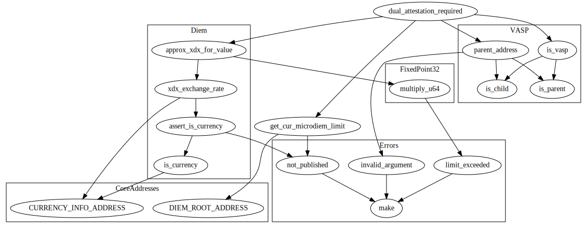
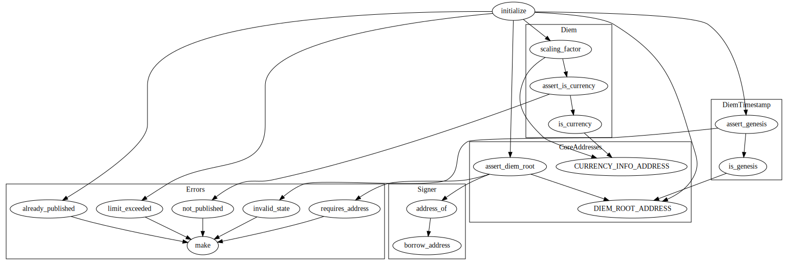
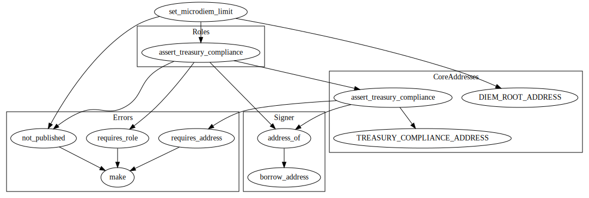

# Module `0x1::DualAttestation`

Module managing dual attestation.

-  [Resource `Credential`](#0x1_DualAttestation_Credential)
-  [Resource `Limit`](#0x1_DualAttestation_Limit)
-  [Struct `ComplianceKeyRotationEvent`](#0x1_DualAttestation_ComplianceKeyRotationEvent)
-  [Struct `BaseUrlRotationEvent`](#0x1_DualAttestation_BaseUrlRotationEvent)
-  [Constants](#@Constants_0)
-  [Function `publish_credential`](#0x1_DualAttestation_publish_credential)
-  [Function `rotate_base_url`](#0x1_DualAttestation_rotate_base_url)
-  [Function `rotate_compliance_public_key`](#0x1_DualAttestation_rotate_compliance_public_key)
-  [Function `human_name`](#0x1_DualAttestation_human_name)
-  [Function `base_url`](#0x1_DualAttestation_base_url)
-  [Function `compliance_public_key`](#0x1_DualAttestation_compliance_public_key)
-  [Function `expiration_date`](#0x1_DualAttestation_expiration_date)
-  [Function `credential_address`](#0x1_DualAttestation_credential_address)
-  [Function `dual_attestation_required`](#0x1_DualAttestation_dual_attestation_required)
-  [Function `dual_attestation_message`](#0x1_DualAttestation_dual_attestation_message)
-  [Function `assert_signature_is_valid`](#0x1_DualAttestation_assert_signature_is_valid)
-  [Function `assert_payment_ok`](#0x1_DualAttestation_assert_payment_ok)
-  [Function `initialize`](#0x1_DualAttestation_initialize)
-  [Function `get_cur_microdiem_limit`](#0x1_DualAttestation_get_cur_microdiem_limit)
-  [Function `set_microdiem_limit`](#0x1_DualAttestation_set_microdiem_limit)
-  [Module Specification](#@Module_Specification_1)
    -  [Initialization](#@Initialization_2)
    -  [Helper Functions](#@Helper_Functions_3)
    -  [Access Control](#@Access_Control_4)

<pre><code><b>use</b> <a href="../../../move-stdlib/docs/BCS.md#0x1_BCS">0x1::BCS</a>;
<b>use</b> <a href="CoreAddresses.md#0x1_CoreAddresses">0x1::CoreAddresses</a>;
<b>use</b> <a href="Diem.md#0x1_Diem">0x1::Diem</a>;
<b>use</b> <a href="DiemTimestamp.md#0x1_DiemTimestamp">0x1::DiemTimestamp</a>;
<b>use</b> <a href="../../../move-stdlib/docs/Errors.md#0x1_Errors">0x1::Errors</a>;
<b>use</b> <a href="../../../move-stdlib/docs/Event.md#0x1_Event">0x1::Event</a>;
<b>use</b> <a href="Roles.md#0x1_Roles">0x1::Roles</a>;
<b>use</b> <a href="Signature.md#0x1_Signature">0x1::Signature</a>;
<b>use</b> <a href="../../../move-stdlib/docs/Signer.md#0x1_Signer">0x1::Signer</a>;
<b>use</b> <a href="VASP.md#0x1_VASP">0x1::VASP</a>;
<b>use</b> <a href="../../../move-stdlib/docs/Vector.md#0x1_Vector">0x1::Vector</a>;
<b>use</b> <a href="XDX.md#0x1_XDX">0x1::XDX</a>;
</code></pre>

Show all the modules that "DualAttestation" depends on directly or indirectly

Show all the modules that depend on "DualAttestation" directly or indirectly

## Resource `Credential`

This resource holds an entity's globally unique name and all of the metadata it needs to
participate in off-chain protocols.

<pre><code><b>resource</b> <b>struct</b> <a href="DualAttestation.md#0x1_DualAttestation_Credential">Credential</a>
</code></pre>

Fields

<dl>
<dt>
<code>human_name: vector&lt;u8&gt;</code>
</dt>
<dd>
 The human readable name of this entity. Immutable.
</dd>
<dt>
<code>base_url: vector&lt;u8&gt;</code>
</dt>
<dd>
 The base_url holds the URL to be used for off-chain communication. This contains the
 entire URL (e.g. https://...). Mutable.
</dd>
<dt>
<code>compliance_public_key: vector&lt;u8&gt;</code>
</dt>
<dd>
 32 byte Ed25519 public key whose counterpart must be used to sign
 (1) the payment metadata for on-chain transactions that require dual attestation (e.g.,
     transactions subject to the travel rule)
 (2) information exchanged in the off-chain protocols (e.g., KYC info in the travel rule
     protocol)
 Note that this is different than <code>authentication_key</code> used in DiemAccount, which is
 a hash of a public key + signature scheme identifier, not a public key. Mutable.
</dd>
<dt>
<code>expiration_date: u64</code>
</dt>
<dd>
 Expiration date in microseconds from unix epoch. For V1, it is always set to
 U64_MAX. Mutable, but only by DiemRoot.
</dd>
<dt>
<code>compliance_key_rotation_events: <a href="../../../move-stdlib/docs/Event.md#0x1_Event_EventHandle">Event::EventHandle</a>&lt;<a href="DualAttestation.md#0x1_DualAttestation_ComplianceKeyRotationEvent">DualAttestation::ComplianceKeyRotationEvent</a>&gt;</code>
</dt>
<dd>
 Event handle for <code>compliance_public_key</code> rotation events. Emitted
 every time this <code>compliance_public_key</code> is rotated.
</dd>
<dt>
<code>base_url_rotation_events: <a href="../../../move-stdlib/docs/Event.md#0x1_Event_EventHandle">Event::EventHandle</a>&lt;<a href="DualAttestation.md#0x1_DualAttestation_BaseUrlRotationEvent">DualAttestation::BaseUrlRotationEvent</a>&gt;</code>
</dt>
<dd>
 Event handle for <code>base_url</code> rotation events. Emitted every time this <code>base_url</code> is rotated.
</dd>
</dl>

## Resource `Limit`

Struct to store the limit on-chain

<pre><code><b>resource</b> <b>struct</b> <a href="DualAttestation.md#0x1_DualAttestation_Limit">Limit</a>
</code></pre>

Fields

<dl>
<dt>
<code>micro_xdx_limit: u64</code>
</dt>
<dd>

</dd>
</dl>

## Struct `ComplianceKeyRotationEvent`

The message sent whenever the compliance public key for a <code><a href="DualAttestation.md#0x1_DualAttestation">DualAttestation</a></code> resource is rotated.

<pre><code><b>struct</b> <a href="DualAttestation.md#0x1_DualAttestation_ComplianceKeyRotationEvent">ComplianceKeyRotationEvent</a>
</code></pre>

Fields

<dl>
<dt>
<code>new_compliance_public_key: vector&lt;u8&gt;</code>
</dt>
<dd>
 The new <code>compliance_public_key</code> that is being used for dual attestation checking.
</dd>
<dt>
<code>time_rotated_seconds: u64</code>
</dt>
<dd>
 The time at which the <code>compliance_public_key</code> was rotated
</dd>
</dl>

## Struct `BaseUrlRotationEvent`

The message sent whenever the base url for a <code><a href="DualAttestation.md#0x1_DualAttestation">DualAttestation</a></code> resource is rotated.

<pre><code><b>struct</b> <a href="DualAttestation.md#0x1_DualAttestation_BaseUrlRotationEvent">BaseUrlRotationEvent</a>
</code></pre>

Fields

<dl>
<dt>
<code>new_base_url: vector&lt;u8&gt;</code>
</dt>
<dd>
 The new <code>base_url</code> that is being used for dual attestation checking
</dd>
<dt>
<code>time_rotated_seconds: u64</code>
</dt>
<dd>
 The time at which the <code>base_url</code> was rotated
</dd>
</dl>

## Constants

<pre><code><b>const</b> <a href="DualAttestation.md#0x1_DualAttestation_MAX_U64">MAX_U64</a>: u128 = 18446744073709551615;
</code></pre>

Suffix of every signed dual attestation message

<pre><code><b>const</b> <a href="DualAttestation.md#0x1_DualAttestation_DOMAIN_SEPARATOR">DOMAIN_SEPARATOR</a>: vector&lt;u8&gt; = [64, 64, 36, 36, 68, 73, 69, 77, 95, 65, 84, 84, 69, 83, 84, 36, 36, 64, 64];
</code></pre>

A credential is not or already published.

<pre><code><b>const</b> <a href="DualAttestation.md#0x1_DualAttestation_ECREDENTIAL">ECREDENTIAL</a>: u64 = 0;
</code></pre>

Signature does not match message and public key

<pre><code><b>const</b> <a href="DualAttestation.md#0x1_DualAttestation_EINVALID_METADATA_SIGNATURE">EINVALID_METADATA_SIGNATURE</a>: u64 = 4;
</code></pre>

Cannot parse this as an ed25519 public key

<pre><code><b>const</b> <a href="DualAttestation.md#0x1_DualAttestation_EINVALID_PUBLIC_KEY">EINVALID_PUBLIC_KEY</a>: u64 = 2;
</code></pre>

A limit is not or already published.

<pre><code><b>const</b> <a href="DualAttestation.md#0x1_DualAttestation_ELIMIT">ELIMIT</a>: u64 = 1;
</code></pre>

Cannot parse this as an ed25519 signature (e.g., != 64 bytes)

<pre><code><b>const</b> <a href="DualAttestation.md#0x1_DualAttestation_EMALFORMED_METADATA_SIGNATURE">EMALFORMED_METADATA_SIGNATURE</a>: u64 = 3;
</code></pre>

The recipient of a dual attestation payment needs to set a base URL

<pre><code><b>const</b> <a href="DualAttestation.md#0x1_DualAttestation_EPAYEE_BASE_URL_NOT_SET">EPAYEE_BASE_URL_NOT_SET</a>: u64 = 6;
</code></pre>

The recipient of a dual attestation payment needs to set a compliance public key

<pre><code><b>const</b> <a href="DualAttestation.md#0x1_DualAttestation_EPAYEE_COMPLIANCE_KEY_NOT_SET">EPAYEE_COMPLIANCE_KEY_NOT_SET</a>: u64 = 5;
</code></pre>

Value of the dual attestation limit at genesis

<pre><code><b>const</b> <a href="DualAttestation.md#0x1_DualAttestation_INITIAL_DUAL_ATTESTATION_LIMIT">INITIAL_DUAL_ATTESTATION_LIMIT</a>: u64 = 1000;
</code></pre>

A year in microseconds

<pre><code><b>const</b> <a href="DualAttestation.md#0x1_DualAttestation_ONE_YEAR">ONE_YEAR</a>: u64 = 31540000000000;
</code></pre>

<pre><code><b>const</b> <a href="DualAttestation.md#0x1_DualAttestation_U64_MAX">U64_MAX</a>: u64 = 18446744073709551615;
</code></pre>

## Function `publish_credential`

Publish a <code><a href="DualAttestation.md#0x1_DualAttestation_Credential">Credential</a></code> resource with name <code>human_name</code> under <code>created</code> with an empty
<code>base_url</code> and <code>compliance_public_key</code>. Before receiving any dual attestation payments,
the <code>created</code> account must send a transaction that invokes <code>rotate_base_url</code> and
<code>rotate_compliance_public_key</code> to set these fields to a valid URL/public key.

<pre><code><b>public</b> <b>fun</b> <a href="DualAttestation.md#0x1_DualAttestation_publish_credential">publish_credential</a>(created: &signer, creator: &signer, human_name: vector&lt;u8&gt;)
</code></pre>

Implementation

<pre><code><b>public</b> <b>fun</b> <a href="DualAttestation.md#0x1_DualAttestation_publish_credential">publish_credential</a>(
    created: &signer,
    creator: &signer,
    human_name: vector&lt;u8&gt;,
) {
    <a href="Roles.md#0x1_Roles_assert_parent_vasp_or_designated_dealer">Roles::assert_parent_vasp_or_designated_dealer</a>(created);
    <a href="Roles.md#0x1_Roles_assert_treasury_compliance">Roles::assert_treasury_compliance</a>(creator);
    <b>assert</b>(
        !<b>exists</b>&lt;<a href="DualAttestation.md#0x1_DualAttestation_Credential">Credential</a>&gt;(<a href="../../../move-stdlib/docs/Signer.md#0x1_Signer_address_of">Signer::address_of</a>(created)),
        <a href="../../../move-stdlib/docs/Errors.md#0x1_Errors_already_published">Errors::already_published</a>(<a href="DualAttestation.md#0x1_DualAttestation_ECREDENTIAL">ECREDENTIAL</a>)
    );
    move_to(created, <a href="DualAttestation.md#0x1_DualAttestation_Credential">Credential</a> {
        human_name,
        base_url: <a href="../../../move-stdlib/docs/Vector.md#0x1_Vector_empty">Vector::empty</a>(),
        compliance_public_key: <a href="../../../move-stdlib/docs/Vector.md#0x1_Vector_empty">Vector::empty</a>(),
        // For testnet and V1, so it should never expire. So set <b>to</b> u64::MAX
        expiration_date: <a href="DualAttestation.md#0x1_DualAttestation_U64_MAX">U64_MAX</a>,
        compliance_key_rotation_events: <a href="../../../move-stdlib/docs/Event.md#0x1_Event_new_event_handle">Event::new_event_handle</a>&lt;<a href="DualAttestation.md#0x1_DualAttestation_ComplianceKeyRotationEvent">ComplianceKeyRotationEvent</a>&gt;(created),
        base_url_rotation_events: <a href="../../../move-stdlib/docs/Event.md#0x1_Event_new_event_handle">Event::new_event_handle</a>&lt;<a href="DualAttestation.md#0x1_DualAttestation_BaseUrlRotationEvent">BaseUrlRotationEvent</a>&gt;(created),
    })
}
</code></pre>

Specification

The permission "RotateDualAttestationInfo" is granted to ParentVASP and DesignatedDealer [[H16]][PERMISSION].

<pre><code><b>include</b> <a href="Roles.md#0x1_Roles_AbortsIfNotParentVaspOrDesignatedDealer">Roles::AbortsIfNotParentVaspOrDesignatedDealer</a>{account: created};
<b>include</b> <a href="Roles.md#0x1_Roles_AbortsIfNotTreasuryCompliance">Roles::AbortsIfNotTreasuryCompliance</a>{account: creator};
<b>aborts_if</b> <a href="DualAttestation.md#0x1_DualAttestation_spec_has_credential">spec_has_credential</a>(<a href="../../../move-stdlib/docs/Signer.md#0x1_Signer_spec_address_of">Signer::spec_address_of</a>(created)) <b>with</b> <a href="../../../move-stdlib/docs/Errors.md#0x1_Errors_ALREADY_PUBLISHED">Errors::ALREADY_PUBLISHED</a>;
</code></pre>

<pre><code><b>define</b> <a href="DualAttestation.md#0x1_DualAttestation_spec_has_credential">spec_has_credential</a>(addr: address): bool {
   <b>exists</b>&lt;<a href="DualAttestation.md#0x1_DualAttestation_Credential">Credential</a>&gt;(addr)
}
</code></pre>

Show all the functions that "publish_credential" calls

## Function `rotate_base_url`

Rotate the base URL for <code>account</code> to <code>new_url</code>

<pre><code><b>public</b> <b>fun</b> <a href="DualAttestation.md#0x1_DualAttestation_rotate_base_url">rotate_base_url</a>(account: &signer, new_url: vector&lt;u8&gt;)
</code></pre>

Implementation

<pre><code><b>public</b> <b>fun</b> <a href="DualAttestation.md#0x1_DualAttestation_rotate_base_url">rotate_base_url</a>(account: &signer, new_url: vector&lt;u8&gt;) <b>acquires</b> <a href="DualAttestation.md#0x1_DualAttestation_Credential">Credential</a> {
    <b>let</b> addr = <a href="../../../move-stdlib/docs/Signer.md#0x1_Signer_address_of">Signer::address_of</a>(account);
    <b>assert</b>(<b>exists</b>&lt;<a href="DualAttestation.md#0x1_DualAttestation_Credential">Credential</a>&gt;(addr), <a href="../../../move-stdlib/docs/Errors.md#0x1_Errors_not_published">Errors::not_published</a>(<a href="DualAttestation.md#0x1_DualAttestation_ECREDENTIAL">ECREDENTIAL</a>));
    <b>let</b> credential = borrow_global_mut&lt;<a href="DualAttestation.md#0x1_DualAttestation_Credential">Credential</a>&gt;(addr);
    credential.base_url = <b>copy</b> new_url;
    <a href="../../../move-stdlib/docs/Event.md#0x1_Event_emit_event">Event::emit_event</a>(&<b>mut</b> credential.base_url_rotation_events, <a href="DualAttestation.md#0x1_DualAttestation_BaseUrlRotationEvent">BaseUrlRotationEvent</a> {
        new_base_url: new_url,
        time_rotated_seconds: <a href="DiemTimestamp.md#0x1_DiemTimestamp_now_seconds">DiemTimestamp::now_seconds</a>(),
    });
}
</code></pre>

Specification

<pre><code><b>include</b> <a href="DualAttestation.md#0x1_DualAttestation_RotateBaseUrlAbortsIf">RotateBaseUrlAbortsIf</a>;
<b>include</b> <a href="DualAttestation.md#0x1_DualAttestation_RotateBaseUrlEnsures">RotateBaseUrlEnsures</a>;
<b>include</b> <a href="DualAttestation.md#0x1_DualAttestation_RotateBaseUrlEmits">RotateBaseUrlEmits</a>;
</code></pre>

<pre><code><b>schema</b> <a href="DualAttestation.md#0x1_DualAttestation_RotateBaseUrlAbortsIf">RotateBaseUrlAbortsIf</a> {
    account: signer;
    
    <b>let</b> sender = <a href="../../../move-stdlib/docs/Signer.md#0x1_Signer_spec_address_of">Signer::spec_address_of</a>(account);
}
</code></pre>

Must abort if the account does not have the resource Credential [[H16]][PERMISSION].

<pre><code><b>schema</b> <a href="DualAttestation.md#0x1_DualAttestation_RotateBaseUrlAbortsIf">RotateBaseUrlAbortsIf</a> {
    <b>include</b> <a href="DualAttestation.md#0x1_DualAttestation_AbortsIfNoCredential">AbortsIfNoCredential</a>{addr: sender};
    <b>include</b> <a href="DiemTimestamp.md#0x1_DiemTimestamp_AbortsIfNotOperating">DiemTimestamp::AbortsIfNotOperating</a>;
}
</code></pre>

<pre><code><b>schema</b> <a href="DualAttestation.md#0x1_DualAttestation_AbortsIfNoCredential">AbortsIfNoCredential</a> {
    addr: address;
    <b>aborts_if</b> !<a href="DualAttestation.md#0x1_DualAttestation_spec_has_credential">spec_has_credential</a>(addr) <b>with</b> <a href="../../../move-stdlib/docs/Errors.md#0x1_Errors_NOT_PUBLISHED">Errors::NOT_PUBLISHED</a>;
}
</code></pre>

<pre><code><b>schema</b> <a href="DualAttestation.md#0x1_DualAttestation_RotateBaseUrlEnsures">RotateBaseUrlEnsures</a> {
    account: signer;
    new_url: vector&lt;u8&gt;;
    
    <b>let</b> sender = <a href="../../../move-stdlib/docs/Signer.md#0x1_Signer_spec_address_of">Signer::spec_address_of</a>(account);
    <b>ensures</b> <b>global</b>&lt;<a href="DualAttestation.md#0x1_DualAttestation_Credential">Credential</a>&gt;(sender).base_url == new_url;
}
</code></pre>

The sender can only rotate its own base url [[H16]][PERMISSION].

<pre><code><b>schema</b> <a href="DualAttestation.md#0x1_DualAttestation_RotateBaseUrlEnsures">RotateBaseUrlEnsures</a> {
    <b>ensures</b> <b>forall</b> addr1:address <b>where</b> addr1 != sender:
        <b>global</b>&lt;<a href="DualAttestation.md#0x1_DualAttestation_Credential">Credential</a>&gt;(addr1).base_url == <b>old</b>(<b>global</b>&lt;<a href="DualAttestation.md#0x1_DualAttestation_Credential">Credential</a>&gt;(addr1).base_url);
}
</code></pre>

<pre><code><b>schema</b> <a href="DualAttestation.md#0x1_DualAttestation_RotateBaseUrlEmits">RotateBaseUrlEmits</a> {
    account: signer;
    new_url: vector&lt;u8&gt;;
    
    <b>let</b> sender = <a href="../../../move-stdlib/docs/Signer.md#0x1_Signer_spec_address_of">Signer::spec_address_of</a>(account);
    
    <b>let</b> handle = <b>global</b>&lt;<a href="DualAttestation.md#0x1_DualAttestation_Credential">Credential</a>&gt;(sender).base_url_rotation_events;
    
    <b>let</b> msg = <a href="DualAttestation.md#0x1_DualAttestation_BaseUrlRotationEvent">BaseUrlRotationEvent</a> {
        new_base_url: new_url,
        time_rotated_seconds: <a href="DiemTimestamp.md#0x1_DiemTimestamp_spec_now_seconds">DiemTimestamp::spec_now_seconds</a>(),
    };
    emits msg <b>to</b> handle;
}
</code></pre>

Show all the functions that "rotate_base_url" calls

## Function `rotate_compliance_public_key`

Rotate the compliance public key for <code>account</code> to <code>new_key</code>.

<pre><code><b>public</b> <b>fun</b> <a href="DualAttestation.md#0x1_DualAttestation_rotate_compliance_public_key">rotate_compliance_public_key</a>(account: &signer, new_key: vector&lt;u8&gt;)
</code></pre>

Implementation

<pre><code><b>public</b> <b>fun</b> <a href="DualAttestation.md#0x1_DualAttestation_rotate_compliance_public_key">rotate_compliance_public_key</a>(
    account: &signer,
    new_key: vector&lt;u8&gt;,
) <b>acquires</b> <a href="DualAttestation.md#0x1_DualAttestation_Credential">Credential</a> {
    <b>let</b> addr = <a href="../../../move-stdlib/docs/Signer.md#0x1_Signer_address_of">Signer::address_of</a>(account);
    <b>assert</b>(<b>exists</b>&lt;<a href="DualAttestation.md#0x1_DualAttestation_Credential">Credential</a>&gt;(addr), <a href="../../../move-stdlib/docs/Errors.md#0x1_Errors_not_published">Errors::not_published</a>(<a href="DualAttestation.md#0x1_DualAttestation_ECREDENTIAL">ECREDENTIAL</a>));
    <b>assert</b>(<a href="Signature.md#0x1_Signature_ed25519_validate_pubkey">Signature::ed25519_validate_pubkey</a>(<b>copy</b> new_key), <a href="../../../move-stdlib/docs/Errors.md#0x1_Errors_invalid_argument">Errors::invalid_argument</a>(<a href="DualAttestation.md#0x1_DualAttestation_EINVALID_PUBLIC_KEY">EINVALID_PUBLIC_KEY</a>));
    <b>let</b> credential = borrow_global_mut&lt;<a href="DualAttestation.md#0x1_DualAttestation_Credential">Credential</a>&gt;(addr);
    credential.compliance_public_key = <b>copy</b> new_key;
    <a href="../../../move-stdlib/docs/Event.md#0x1_Event_emit_event">Event::emit_event</a>(&<b>mut</b> credential.compliance_key_rotation_events, <a href="DualAttestation.md#0x1_DualAttestation_ComplianceKeyRotationEvent">ComplianceKeyRotationEvent</a> {
        new_compliance_public_key: new_key,
        time_rotated_seconds: <a href="DiemTimestamp.md#0x1_DiemTimestamp_now_seconds">DiemTimestamp::now_seconds</a>(),
    });

}
</code></pre>

Specification

<pre><code><b>include</b> <a href="DualAttestation.md#0x1_DualAttestation_RotateCompliancePublicKeyAbortsIf">RotateCompliancePublicKeyAbortsIf</a>;
<b>include</b> <a href="DualAttestation.md#0x1_DualAttestation_RotateCompliancePublicKeyEnsures">RotateCompliancePublicKeyEnsures</a>;
<b>include</b> <a href="DualAttestation.md#0x1_DualAttestation_RotateCompliancePublicKeyEmits">RotateCompliancePublicKeyEmits</a>;
</code></pre>

<pre><code><b>schema</b> <a href="DualAttestation.md#0x1_DualAttestation_RotateCompliancePublicKeyAbortsIf">RotateCompliancePublicKeyAbortsIf</a> {
    account: signer;
    new_key: vector&lt;u8&gt;;
    
    <b>let</b> sender = <a href="../../../move-stdlib/docs/Signer.md#0x1_Signer_spec_address_of">Signer::spec_address_of</a>(account);
}
</code></pre>

Must abort if the account does not have the resource Credential [[H16]][PERMISSION].

<pre><code><b>schema</b> <a href="DualAttestation.md#0x1_DualAttestation_RotateCompliancePublicKeyAbortsIf">RotateCompliancePublicKeyAbortsIf</a> {
    <b>include</b> <a href="DualAttestation.md#0x1_DualAttestation_AbortsIfNoCredential">AbortsIfNoCredential</a>{addr: sender};
    <b>include</b> <a href="DiemTimestamp.md#0x1_DiemTimestamp_AbortsIfNotOperating">DiemTimestamp::AbortsIfNotOperating</a>;
    <b>aborts_if</b> !<a href="Signature.md#0x1_Signature_ed25519_validate_pubkey">Signature::ed25519_validate_pubkey</a>(new_key) <b>with</b> <a href="../../../move-stdlib/docs/Errors.md#0x1_Errors_INVALID_ARGUMENT">Errors::INVALID_ARGUMENT</a>;
}
</code></pre>

<pre><code><b>schema</b> <a href="DualAttestation.md#0x1_DualAttestation_RotateCompliancePublicKeyEnsures">RotateCompliancePublicKeyEnsures</a> {
    account: signer;
    new_key: vector&lt;u8&gt;;
    
    <b>let</b> sender = <a href="../../../move-stdlib/docs/Signer.md#0x1_Signer_spec_address_of">Signer::spec_address_of</a>(account);
    <b>ensures</b> <b>global</b>&lt;<a href="DualAttestation.md#0x1_DualAttestation_Credential">Credential</a>&gt;(sender).compliance_public_key == new_key;
}
</code></pre>

The sender only rotates its own compliance_public_key [[H16]][PERMISSION].

<pre><code><b>schema</b> <a href="DualAttestation.md#0x1_DualAttestation_RotateCompliancePublicKeyEnsures">RotateCompliancePublicKeyEnsures</a> {
    <b>ensures</b> <b>forall</b> addr1: address <b>where</b> addr1 != sender:
        <b>global</b>&lt;<a href="DualAttestation.md#0x1_DualAttestation_Credential">Credential</a>&gt;(addr1).compliance_public_key == <b>old</b>(<b>global</b>&lt;<a href="DualAttestation.md#0x1_DualAttestation_Credential">Credential</a>&gt;(addr1).compliance_public_key);
}
</code></pre>

<pre><code><b>schema</b> <a href="DualAttestation.md#0x1_DualAttestation_RotateCompliancePublicKeyEmits">RotateCompliancePublicKeyEmits</a> {
    account: signer;
    new_key: vector&lt;u8&gt;;
    
    <b>let</b> sender = <a href="../../../move-stdlib/docs/Signer.md#0x1_Signer_spec_address_of">Signer::spec_address_of</a>(account);
    
    <b>let</b> handle = <b>global</b>&lt;<a href="DualAttestation.md#0x1_DualAttestation_Credential">Credential</a>&gt;(sender).compliance_key_rotation_events;
    
    <b>let</b> msg = <a href="DualAttestation.md#0x1_DualAttestation_ComplianceKeyRotationEvent">ComplianceKeyRotationEvent</a> {
        new_compliance_public_key: new_key,
        time_rotated_seconds: <a href="DiemTimestamp.md#0x1_DiemTimestamp_spec_now_seconds">DiemTimestamp::spec_now_seconds</a>(),
    };
    emits msg <b>to</b> handle;
}
</code></pre>

Show all the functions that "rotate_compliance_public_key" calls

## Function `human_name`

Return the human-readable name for the VASP account.
Aborts if <code>addr</code> does not have a <code><a href="DualAttestation.md#0x1_DualAttestation_Credential">Credential</a></code> resource.

<pre><code><b>public</b> <b>fun</b> <a href="DualAttestation.md#0x1_DualAttestation_human_name">human_name</a>(addr: address): vector&lt;u8&gt;
</code></pre>

Implementation

<pre><code><b>public</b> <b>fun</b> <a href="DualAttestation.md#0x1_DualAttestation_human_name">human_name</a>(addr: address): vector&lt;u8&gt; <b>acquires</b> <a href="DualAttestation.md#0x1_DualAttestation_Credential">Credential</a> {
    <b>assert</b>(<b>exists</b>&lt;<a href="DualAttestation.md#0x1_DualAttestation_Credential">Credential</a>&gt;(addr), <a href="../../../move-stdlib/docs/Errors.md#0x1_Errors_not_published">Errors::not_published</a>(<a href="DualAttestation.md#0x1_DualAttestation_ECREDENTIAL">ECREDENTIAL</a>));
    *&borrow_global&lt;<a href="DualAttestation.md#0x1_DualAttestation_Credential">Credential</a>&gt;(addr).human_name
}
</code></pre>

Specification

<pre><code><b>pragma</b> opaque;
<b>include</b> <a href="DualAttestation.md#0x1_DualAttestation_AbortsIfNoCredential">AbortsIfNoCredential</a>;
<b>ensures</b> result == <b>global</b>&lt;<a href="DualAttestation.md#0x1_DualAttestation_Credential">Credential</a>&gt;(addr).human_name;
</code></pre>

Show all the functions that "human_name" calls

## Function `base_url`

Return the base URL for <code>addr</code>.
Aborts if <code>addr</code> does not have a <code><a href="DualAttestation.md#0x1_DualAttestation_Credential">Credential</a></code> resource.

<pre><code><b>public</b> <b>fun</b> <a href="DualAttestation.md#0x1_DualAttestation_base_url">base_url</a>(addr: address): vector&lt;u8&gt;
</code></pre>

Implementation

<pre><code><b>public</b> <b>fun</b> <a href="DualAttestation.md#0x1_DualAttestation_base_url">base_url</a>(addr: address): vector&lt;u8&gt; <b>acquires</b> <a href="DualAttestation.md#0x1_DualAttestation_Credential">Credential</a> {
    <b>assert</b>(<b>exists</b>&lt;<a href="DualAttestation.md#0x1_DualAttestation_Credential">Credential</a>&gt;(addr), <a href="../../../move-stdlib/docs/Errors.md#0x1_Errors_not_published">Errors::not_published</a>(<a href="DualAttestation.md#0x1_DualAttestation_ECREDENTIAL">ECREDENTIAL</a>));
    *&borrow_global&lt;<a href="DualAttestation.md#0x1_DualAttestation_Credential">Credential</a>&gt;(addr).base_url
}
</code></pre>

Specification

<pre><code><b>pragma</b> opaque;
<b>include</b> <a href="DualAttestation.md#0x1_DualAttestation_AbortsIfNoCredential">AbortsIfNoCredential</a>;
<b>ensures</b> result == <b>global</b>&lt;<a href="DualAttestation.md#0x1_DualAttestation_Credential">Credential</a>&gt;(addr).base_url;
</code></pre>

Spec version of <code><a href="DualAttestation.md#0x1_DualAttestation_base_url">Self::base_url</a></code>.

<pre><code><b>define</b> <a href="DualAttestation.md#0x1_DualAttestation_spec_base_url">spec_base_url</a>(addr: address): vector&lt;u8&gt; {
   <b>global</b>&lt;<a href="DualAttestation.md#0x1_DualAttestation_Credential">Credential</a>&gt;(addr).base_url
}
</code></pre>

Show all the functions that "base_url" calls

## Function `compliance_public_key`

Return the compliance public key for <code>addr</code>.
Aborts if <code>addr</code> does not have a <code><a href="DualAttestation.md#0x1_DualAttestation_Credential">Credential</a></code> resource.

<pre><code><b>public</b> <b>fun</b> <a href="DualAttestation.md#0x1_DualAttestation_compliance_public_key">compliance_public_key</a>(addr: address): vector&lt;u8&gt;
</code></pre>

Implementation

<pre><code><b>public</b> <b>fun</b> <a href="DualAttestation.md#0x1_DualAttestation_compliance_public_key">compliance_public_key</a>(addr: address): vector&lt;u8&gt; <b>acquires</b> <a href="DualAttestation.md#0x1_DualAttestation_Credential">Credential</a> {
    <b>assert</b>(<b>exists</b>&lt;<a href="DualAttestation.md#0x1_DualAttestation_Credential">Credential</a>&gt;(addr), <a href="../../../move-stdlib/docs/Errors.md#0x1_Errors_not_published">Errors::not_published</a>(<a href="DualAttestation.md#0x1_DualAttestation_ECREDENTIAL">ECREDENTIAL</a>));
    *&borrow_global&lt;<a href="DualAttestation.md#0x1_DualAttestation_Credential">Credential</a>&gt;(addr).compliance_public_key
}
</code></pre>

Specification

<pre><code><b>pragma</b> opaque;
<b>include</b> <a href="DualAttestation.md#0x1_DualAttestation_AbortsIfNoCredential">AbortsIfNoCredential</a>;
<b>ensures</b> result == <a href="DualAttestation.md#0x1_DualAttestation_spec_compliance_public_key">spec_compliance_public_key</a>(addr);
</code></pre>

Spec version of <code><a href="DualAttestation.md#0x1_DualAttestation_compliance_public_key">Self::compliance_public_key</a></code>.

<pre><code><b>define</b> <a href="DualAttestation.md#0x1_DualAttestation_spec_compliance_public_key">spec_compliance_public_key</a>(addr: address): vector&lt;u8&gt; {
   <b>global</b>&lt;<a href="DualAttestation.md#0x1_DualAttestation_Credential">Credential</a>&gt;(addr).compliance_public_key
}
</code></pre>

Show all the functions that "compliance_public_key" calls

## Function `expiration_date`

Return the expiration date <code>addr</code>
Aborts if <code>addr</code> does not have a <code><a href="DualAttestation.md#0x1_DualAttestation_Credential">Credential</a></code> resource.

<pre><code><b>public</b> <b>fun</b> <a href="DualAttestation.md#0x1_DualAttestation_expiration_date">expiration_date</a>(addr: address): u64
</code></pre>

Implementation

<pre><code><b>public</b> <b>fun</b> <a href="DualAttestation.md#0x1_DualAttestation_expiration_date">expiration_date</a>(addr: address): u64  <b>acquires</b> <a href="DualAttestation.md#0x1_DualAttestation_Credential">Credential</a> {
    <b>assert</b>(<b>exists</b>&lt;<a href="DualAttestation.md#0x1_DualAttestation_Credential">Credential</a>&gt;(addr), <a href="../../../move-stdlib/docs/Errors.md#0x1_Errors_not_published">Errors::not_published</a>(<a href="DualAttestation.md#0x1_DualAttestation_ECREDENTIAL">ECREDENTIAL</a>));
    *&borrow_global&lt;<a href="DualAttestation.md#0x1_DualAttestation_Credential">Credential</a>&gt;(addr).expiration_date
}
</code></pre>

Specification

<pre><code><b>pragma</b> opaque;
<b>include</b> <a href="DualAttestation.md#0x1_DualAttestation_AbortsIfNoCredential">AbortsIfNoCredential</a>;
<b>ensures</b> result == <b>global</b>&lt;<a href="DualAttestation.md#0x1_DualAttestation_Credential">Credential</a>&gt;(addr).expiration_date;
</code></pre>

Show all the functions that "expiration_date" calls

## Function `credential_address`

Return the address where the credentials for <code>addr</code> are stored

<pre><code><b>fun</b> <a href="DualAttestation.md#0x1_DualAttestation_credential_address">credential_address</a>(addr: address): address
</code></pre>

Implementation

<pre><code><b>fun</b> <a href="DualAttestation.md#0x1_DualAttestation_credential_address">credential_address</a>(addr: address): address {
    <b>if</b> (<a href="VASP.md#0x1_VASP_is_child">VASP::is_child</a>(addr)) <a href="VASP.md#0x1_VASP_parent_address">VASP::parent_address</a>(addr) <b>else</b> addr
}
</code></pre>

Specification

<pre><code><b>pragma</b> opaque;
<b>aborts_if</b> <b>false</b>;
<b>ensures</b> result == <a href="DualAttestation.md#0x1_DualAttestation_spec_credential_address">spec_credential_address</a>(addr);
</code></pre>

<pre><code><b>define</b> <a href="DualAttestation.md#0x1_DualAttestation_spec_credential_address">spec_credential_address</a>(addr: address): address {
   <b>if</b> (<a href="VASP.md#0x1_VASP_is_child">VASP::is_child</a>(addr)) {
       <a href="VASP.md#0x1_VASP_spec_parent_address">VASP::spec_parent_address</a>(addr)
   } <b>else</b> {
       addr
   }
}
</code></pre>

Show all the functions that "credential_address" calls

## Function `dual_attestation_required`

Helper which returns true if dual attestion is required for a deposit.

<pre><code><b>fun</b> <a href="DualAttestation.md#0x1_DualAttestation_dual_attestation_required">dual_attestation_required</a>&lt;Token&gt;(payer: address, payee: address, deposit_value: u64): bool
</code></pre>

Implementation

<pre><code><b>fun</b> <a href="DualAttestation.md#0x1_DualAttestation_dual_attestation_required">dual_attestation_required</a>&lt;Token: store&gt;(
    payer: address, payee: address, deposit_value: u64
): bool <b>acquires</b> <a href="DualAttestation.md#0x1_DualAttestation_Limit">Limit</a> {
    // travel rule applies for payments over a limit
    <b>let</b> travel_rule_limit_microdiem = <a href="DualAttestation.md#0x1_DualAttestation_get_cur_microdiem_limit">get_cur_microdiem_limit</a>();
    <b>let</b> approx_xdx_microdiem_value = <a href="Diem.md#0x1_Diem_approx_xdx_for_value">Diem::approx_xdx_for_value</a>&lt;Token&gt;(deposit_value);
    <b>let</b> above_limit = approx_xdx_microdiem_value &gt;= travel_rule_limit_microdiem;
    <b>if</b> (!above_limit) {
        <b>return</b> <b>false</b>
    };
    // self-deposits never require dual attestation
    <b>if</b> (payer == payee) {
        <b>return</b> <b>false</b>
    };
    // dual attestation is required <b>if</b> the amount is above the limit AND between distinct
    // VASPs
    <a href="VASP.md#0x1_VASP_is_vasp">VASP::is_vasp</a>(payer) && <a href="VASP.md#0x1_VASP_is_vasp">VASP::is_vasp</a>(payee) &&
        <a href="VASP.md#0x1_VASP_parent_address">VASP::parent_address</a>(payer) != <a href="VASP.md#0x1_VASP_parent_address">VASP::parent_address</a>(payee)
}
</code></pre>

Specification

<pre><code><b>pragma</b> opaque;
<b>include</b> <a href="DualAttestation.md#0x1_DualAttestation_DualAttestationRequiredAbortsIf">DualAttestationRequiredAbortsIf</a>&lt;Token&gt;;
<b>ensures</b> result == <a href="DualAttestation.md#0x1_DualAttestation_spec_dual_attestation_required">spec_dual_attestation_required</a>&lt;Token&gt;(payer, payee, deposit_value);
</code></pre>

<pre><code><b>schema</b> <a href="DualAttestation.md#0x1_DualAttestation_DualAttestationRequiredAbortsIf">DualAttestationRequiredAbortsIf</a>&lt;Token&gt; {
    deposit_value: num;
    <b>include</b> <a href="Diem.md#0x1_Diem_ApproxXdmForValueAbortsIf">Diem::ApproxXdmForValueAbortsIf</a>&lt;Token&gt;{from_value: deposit_value};
    <b>aborts_if</b> !<a href="DualAttestation.md#0x1_DualAttestation_spec_is_published">spec_is_published</a>() <b>with</b> <a href="../../../move-stdlib/docs/Errors.md#0x1_Errors_NOT_PUBLISHED">Errors::NOT_PUBLISHED</a>;
}
</code></pre>

<pre><code><b>define</b> <a href="DualAttestation.md#0x1_DualAttestation_spec_is_inter_vasp">spec_is_inter_vasp</a>(payer: address, payee: address): bool {
   <a href="VASP.md#0x1_VASP_is_vasp">VASP::is_vasp</a>(payer) && <a href="VASP.md#0x1_VASP_is_vasp">VASP::is_vasp</a>(payee)
       && <a href="VASP.md#0x1_VASP_spec_parent_address">VASP::spec_parent_address</a>(payer) != <a href="VASP.md#0x1_VASP_spec_parent_address">VASP::spec_parent_address</a>(payee)
}
</code></pre>

Helper functions which simulates <code><a href="DualAttestation.md#0x1_DualAttestation_dual_attestation_required">Self::dual_attestation_required</a></code>.

<pre><code><b>define</b> <a href="DualAttestation.md#0x1_DualAttestation_spec_dual_attestation_required">spec_dual_attestation_required</a>&lt;Token&gt;(
   payer: address, payee: address, deposit_value: u64
): bool {
   <a href="Diem.md#0x1_Diem_spec_approx_xdx_for_value">Diem::spec_approx_xdx_for_value</a>&lt;Token&gt;(deposit_value)
               &gt;= <a href="DualAttestation.md#0x1_DualAttestation_spec_get_cur_microdiem_limit">spec_get_cur_microdiem_limit</a>() &&
   payer != payee &&
   <a href="DualAttestation.md#0x1_DualAttestation_spec_is_inter_vasp">spec_is_inter_vasp</a>(payer, payee)
}
</code></pre>

Show all the functions that "dual_attestation_required" calls

## Function `dual_attestation_message`

Helper to construct a message for dual attestation.
Message is <code>metadata</code> | <code>payer</code> | <code>amount</code> | <code><a href="DualAttestation.md#0x1_DualAttestation_DOMAIN_SEPARATOR">DOMAIN_SEPARATOR</a></code>.

<pre><code><b>fun</b> <a href="DualAttestation.md#0x1_DualAttestation_dual_attestation_message">dual_attestation_message</a>(payer: address, metadata: vector&lt;u8&gt;, deposit_value: u64): vector&lt;u8&gt;
</code></pre>

Implementation

<pre><code><b>fun</b> <a href="DualAttestation.md#0x1_DualAttestation_dual_attestation_message">dual_attestation_message</a>(
    payer: address, metadata: vector&lt;u8&gt;, deposit_value: u64
): vector&lt;u8&gt; {
    <b>let</b> message = metadata;
    <a href="../../../move-stdlib/docs/Vector.md#0x1_Vector_append">Vector::append</a>(&<b>mut</b> message, <a href="../../../move-stdlib/docs/BCS.md#0x1_BCS_to_bytes">BCS::to_bytes</a>(&payer));
    <a href="../../../move-stdlib/docs/Vector.md#0x1_Vector_append">Vector::append</a>(&<b>mut</b> message, <a href="../../../move-stdlib/docs/BCS.md#0x1_BCS_to_bytes">BCS::to_bytes</a>(&deposit_value));
    <a href="../../../move-stdlib/docs/Vector.md#0x1_Vector_append">Vector::append</a>(&<b>mut</b> message, <a href="DualAttestation.md#0x1_DualAttestation_DOMAIN_SEPARATOR">DOMAIN_SEPARATOR</a>);
    message
}
</code></pre>

Specification

Abstract from construction of message for the prover. Concatenation of results from <code><a href="../../../move-stdlib/docs/BCS.md#0x1_BCS_to_bytes">BCS::to_bytes</a></code>
are difficult to reason about, so we avoid doing it. This is possible because the actual value of this
message is not important for the verification problem, as long as the prover considers both
messages which fail verification and which do not.

<pre><code><b>pragma</b> opaque;
<b>aborts_if</b> <b>false</b>;
<b>ensures</b> [abstract] result == <a href="DualAttestation.md#0x1_DualAttestation_spec_dual_attestation_message">spec_dual_attestation_message</a>(payer, metadata, deposit_value);
</code></pre>

Uninterpreted function for <code><a href="DualAttestation.md#0x1_DualAttestation_dual_attestation_message">Self::dual_attestation_message</a></code>. The actual value does not matter for
the verification of callers.

<pre><code><b>define</b> <a href="DualAttestation.md#0x1_DualAttestation_spec_dual_attestation_message">spec_dual_attestation_message</a>(payer: address, metadata: vector&lt;u8&gt;, deposit_value: u64): vector&lt;u8&gt;;
</code></pre>

Show all the functions that "dual_attestation_message" calls

## Function `assert_signature_is_valid`

Helper function to check validity of a signature when dual attestion is required.

<pre><code><b>fun</b> <a href="DualAttestation.md#0x1_DualAttestation_assert_signature_is_valid">assert_signature_is_valid</a>(payer: address, payee: address, metadata_signature: vector&lt;u8&gt;, metadata: vector&lt;u8&gt;, deposit_value: u64)
</code></pre>

Implementation

<pre><code><b>fun</b> <a href="DualAttestation.md#0x1_DualAttestation_assert_signature_is_valid">assert_signature_is_valid</a>(
    payer: address,
    payee: address,
    metadata_signature: vector&lt;u8&gt;,
    metadata: vector&lt;u8&gt;,
    deposit_value: u64
) <b>acquires</b> <a href="DualAttestation.md#0x1_DualAttestation_Credential">Credential</a> {
    // sanity check of signature validity
    <b>assert</b>(
        <a href="../../../move-stdlib/docs/Vector.md#0x1_Vector_length">Vector::length</a>(&metadata_signature) == 64,
        <a href="../../../move-stdlib/docs/Errors.md#0x1_Errors_invalid_argument">Errors::invalid_argument</a>(<a href="DualAttestation.md#0x1_DualAttestation_EMALFORMED_METADATA_SIGNATURE">EMALFORMED_METADATA_SIGNATURE</a>)
    );
    // sanity check of payee compliance key validity
    <b>let</b> payee_compliance_key = <a href="DualAttestation.md#0x1_DualAttestation_compliance_public_key">compliance_public_key</a>(<a href="DualAttestation.md#0x1_DualAttestation_credential_address">credential_address</a>(payee));
    <b>assert</b>(
        !<a href="../../../move-stdlib/docs/Vector.md#0x1_Vector_is_empty">Vector::is_empty</a>(&payee_compliance_key),
        <a href="../../../move-stdlib/docs/Errors.md#0x1_Errors_invalid_state">Errors::invalid_state</a>(<a href="DualAttestation.md#0x1_DualAttestation_EPAYEE_COMPLIANCE_KEY_NOT_SET">EPAYEE_COMPLIANCE_KEY_NOT_SET</a>)
    );
    // sanity check of payee base URL validity
    <b>let</b> payee_base_url = <a href="DualAttestation.md#0x1_DualAttestation_base_url">base_url</a>(<a href="DualAttestation.md#0x1_DualAttestation_credential_address">credential_address</a>(payee));
    <b>assert</b>(
        !<a href="../../../move-stdlib/docs/Vector.md#0x1_Vector_is_empty">Vector::is_empty</a>(&payee_base_url),
        <a href="../../../move-stdlib/docs/Errors.md#0x1_Errors_invalid_state">Errors::invalid_state</a>(<a href="DualAttestation.md#0x1_DualAttestation_EPAYEE_BASE_URL_NOT_SET">EPAYEE_BASE_URL_NOT_SET</a>)
    );
    // cryptographic check of signature validity
    <b>let</b> message = <a href="DualAttestation.md#0x1_DualAttestation_dual_attestation_message">dual_attestation_message</a>(payer, metadata, deposit_value);
    <b>assert</b>(
        <a href="Signature.md#0x1_Signature_ed25519_verify">Signature::ed25519_verify</a>(metadata_signature, payee_compliance_key, message),
        <a href="../../../move-stdlib/docs/Errors.md#0x1_Errors_invalid_argument">Errors::invalid_argument</a>(<a href="DualAttestation.md#0x1_DualAttestation_EINVALID_METADATA_SIGNATURE">EINVALID_METADATA_SIGNATURE</a>),
    );
}
</code></pre>

Specification

<pre><code><b>pragma</b> opaque = <b>true</b>;
<b>include</b> <a href="DualAttestation.md#0x1_DualAttestation_AssertSignatureValidAbortsIf">AssertSignatureValidAbortsIf</a>;
</code></pre>

<pre><code><b>schema</b> <a href="DualAttestation.md#0x1_DualAttestation_AssertSignatureValidAbortsIf">AssertSignatureValidAbortsIf</a> {
    payer: address;
    payee: address;
    metadata_signature: vector&lt;u8&gt;;
    metadata: vector&lt;u8&gt;;
    deposit_value: u64;
    <b>include</b> <a href="DualAttestation.md#0x1_DualAttestation_AbortsIfNoCredential">AbortsIfNoCredential</a>{addr: <a href="DualAttestation.md#0x1_DualAttestation_spec_credential_address">spec_credential_address</a>(payee)};
    <b>aborts_if</b> <a href="../../../move-stdlib/docs/Vector.md#0x1_Vector_is_empty">Vector::is_empty</a>(<a href="DualAttestation.md#0x1_DualAttestation_spec_compliance_public_key">spec_compliance_public_key</a>(<a href="DualAttestation.md#0x1_DualAttestation_spec_credential_address">spec_credential_address</a>(payee))) <b>with</b> <a href="../../../move-stdlib/docs/Errors.md#0x1_Errors_INVALID_STATE">Errors::INVALID_STATE</a>;
    <b>aborts_if</b> <a href="../../../move-stdlib/docs/Vector.md#0x1_Vector_is_empty">Vector::is_empty</a>(<a href="DualAttestation.md#0x1_DualAttestation_spec_base_url">spec_base_url</a>(<a href="DualAttestation.md#0x1_DualAttestation_spec_credential_address">spec_credential_address</a>(payee))) <b>with</b> <a href="../../../move-stdlib/docs/Errors.md#0x1_Errors_INVALID_STATE">Errors::INVALID_STATE</a>;
    <b>aborts_if</b> !<a href="DualAttestation.md#0x1_DualAttestation_spec_signature_is_valid">spec_signature_is_valid</a>(payer, payee, metadata_signature, metadata, deposit_value)
        <b>with</b> <a href="../../../move-stdlib/docs/Errors.md#0x1_Errors_INVALID_ARGUMENT">Errors::INVALID_ARGUMENT</a>;
}
</code></pre>

Returns true if signature is valid.

<pre><code><b>define</b> <a href="DualAttestation.md#0x1_DualAttestation_spec_signature_is_valid">spec_signature_is_valid</a>(
   payer: address,
   payee: address,
   metadata_signature: vector&lt;u8&gt;,
   metadata: vector&lt;u8&gt;,
   deposit_value: u64
): bool {
   <b>let</b> payee_compliance_key = <a href="DualAttestation.md#0x1_DualAttestation_spec_compliance_public_key">spec_compliance_public_key</a>(<a href="DualAttestation.md#0x1_DualAttestation_spec_credential_address">spec_credential_address</a>(payee));
   len(metadata_signature) == 64 &&
       !<a href="../../../move-stdlib/docs/Vector.md#0x1_Vector_is_empty">Vector::is_empty</a>(payee_compliance_key) &&
       <a href="Signature.md#0x1_Signature_ed25519_verify">Signature::ed25519_verify</a>(
           metadata_signature,
           payee_compliance_key,
           <a href="DualAttestation.md#0x1_DualAttestation_spec_dual_attestation_message">spec_dual_attestation_message</a>(payer, metadata, deposit_value)
       )
}
</code></pre>

Show all the functions that "assert_signature_is_valid" calls

## Function `assert_payment_ok`

Public API for checking whether a payment of <code>value</code> coins of type <code>Currency</code>
from <code>payer</code> to <code>payee</code> has a valid dual attestation. This returns without aborting if
(1) dual attestation is not required for this payment, or
(2) dual attestation is required, and <code>metadata_signature</code> can be verified on the message
<code>metadata</code> | <code>payer</code> | <code>value</code> | <code><a href="DualAttestation.md#0x1_DualAttestation_DOMAIN_SEPARATOR">DOMAIN_SEPARATOR</a></code> using the <code>compliance_public_key</code>
published in <code>payee</code>'s <code><a href="DualAttestation.md#0x1_DualAttestation_Credential">Credential</a></code> resource
It aborts with an appropriate error code if dual attestation is required, but one or more of
the conditions in (2) is not met.

<pre><code><b>public</b> <b>fun</b> <a href="DualAttestation.md#0x1_DualAttestation_assert_payment_ok">assert_payment_ok</a>&lt;Currency&gt;(payer: address, payee: address, value: u64, metadata: vector&lt;u8&gt;, metadata_signature: vector&lt;u8&gt;)
</code></pre>

Implementation

<pre><code><b>public</b> <b>fun</b> <a href="DualAttestation.md#0x1_DualAttestation_assert_payment_ok">assert_payment_ok</a>&lt;Currency: store&gt;(
    payer: address,
    payee: address,
    value: u64,
    metadata: vector&lt;u8&gt;,
    metadata_signature: vector&lt;u8&gt;
) <b>acquires</b> <a href="DualAttestation.md#0x1_DualAttestation_Credential">Credential</a>, <a href="DualAttestation.md#0x1_DualAttestation_Limit">Limit</a> {
    <b>if</b> (!<a href="../../../move-stdlib/docs/Vector.md#0x1_Vector_is_empty">Vector::is_empty</a>(&metadata_signature) || // allow opt-in dual attestation
        <a href="DualAttestation.md#0x1_DualAttestation_dual_attestation_required">dual_attestation_required</a>&lt;Currency&gt;(payer, payee, value)
    ) {
      <a href="DualAttestation.md#0x1_DualAttestation_assert_signature_is_valid">assert_signature_is_valid</a>(payer, payee, metadata_signature, metadata, value)
    }
}
</code></pre>

Specification

<pre><code><b>pragma</b> opaque;
<b>include</b> <a href="DualAttestation.md#0x1_DualAttestation_AssertPaymentOkAbortsIf">AssertPaymentOkAbortsIf</a>&lt;Currency&gt;;
</code></pre>

<pre><code><b>schema</b> <a href="DualAttestation.md#0x1_DualAttestation_AssertPaymentOkAbortsIf">AssertPaymentOkAbortsIf</a>&lt;Currency&gt; {
    payer: address;
    payee: address;
    value: u64;
    metadata: vector&lt;u8&gt;;
    metadata_signature: vector&lt;u8&gt;;
    <b>include</b> len(metadata_signature) == 0 ==&gt; <a href="DualAttestation.md#0x1_DualAttestation_DualAttestationRequiredAbortsIf">DualAttestationRequiredAbortsIf</a>&lt;Currency&gt;{deposit_value: value};
    <b>include</b> (len(metadata_signature) != 0 || <a href="DualAttestation.md#0x1_DualAttestation_spec_dual_attestation_required">spec_dual_attestation_required</a>&lt;Currency&gt;(payer, payee, value))
        ==&gt; <a href="DualAttestation.md#0x1_DualAttestation_AssertSignatureValidAbortsIf">AssertSignatureValidAbortsIf</a>{deposit_value: value};
}
</code></pre>

Show all the functions that "assert_payment_ok" calls

## Function `initialize`

Travel rule limit set during genesis

<pre><code><b>public</b> <b>fun</b> <a href="DualAttestation.md#0x1_DualAttestation_initialize">initialize</a>(dr_account: &signer)
</code></pre>

Implementation

<pre><code><b>public</b> <b>fun</b> <a href="DualAttestation.md#0x1_DualAttestation_initialize">initialize</a>(dr_account: &signer) {
    <a href="DiemTimestamp.md#0x1_DiemTimestamp_assert_genesis">DiemTimestamp::assert_genesis</a>();
    <a href="CoreAddresses.md#0x1_CoreAddresses_assert_diem_root">CoreAddresses::assert_diem_root</a>(dr_account); // operational constraint.
    <b>assert</b>(!<b>exists</b>&lt;<a href="DualAttestation.md#0x1_DualAttestation_Limit">Limit</a>&gt;(<a href="CoreAddresses.md#0x1_CoreAddresses_DIEM_ROOT_ADDRESS">CoreAddresses::DIEM_ROOT_ADDRESS</a>()), <a href="../../../move-stdlib/docs/Errors.md#0x1_Errors_already_published">Errors::already_published</a>(<a href="DualAttestation.md#0x1_DualAttestation_ELIMIT">ELIMIT</a>));
    <b>let</b> initial_limit = (<a href="DualAttestation.md#0x1_DualAttestation_INITIAL_DUAL_ATTESTATION_LIMIT">INITIAL_DUAL_ATTESTATION_LIMIT</a> <b>as</b> u128) * (<a href="Diem.md#0x1_Diem_scaling_factor">Diem::scaling_factor</a>&lt;<a href="XDX.md#0x1_XDX">XDX</a>&gt;() <b>as</b> u128);
    <b>assert</b>(initial_limit &lt;= <a href="DualAttestation.md#0x1_DualAttestation_MAX_U64">MAX_U64</a>, <a href="../../../move-stdlib/docs/Errors.md#0x1_Errors_limit_exceeded">Errors::limit_exceeded</a>(<a href="DualAttestation.md#0x1_DualAttestation_ELIMIT">ELIMIT</a>));
    move_to(
        dr_account,
        <a href="DualAttestation.md#0x1_DualAttestation_Limit">Limit</a> {
            micro_xdx_limit: (initial_limit <b>as</b> u64)
        }
    )
}
</code></pre>

Specification

<pre><code><b>include</b> <a href="DiemTimestamp.md#0x1_DiemTimestamp_AbortsIfNotGenesis">DiemTimestamp::AbortsIfNotGenesis</a>;
<b>include</b> <a href="CoreAddresses.md#0x1_CoreAddresses_AbortsIfNotDiemRoot">CoreAddresses::AbortsIfNotDiemRoot</a>{account: dr_account};
<b>aborts_if</b> <b>exists</b>&lt;<a href="DualAttestation.md#0x1_DualAttestation_Limit">Limit</a>&gt;(<a href="CoreAddresses.md#0x1_CoreAddresses_DIEM_ROOT_ADDRESS">CoreAddresses::DIEM_ROOT_ADDRESS</a>()) <b>with</b> <a href="../../../move-stdlib/docs/Errors.md#0x1_Errors_ALREADY_PUBLISHED">Errors::ALREADY_PUBLISHED</a>;

<b>let</b> initial_limit = <a href="DualAttestation.md#0x1_DualAttestation_INITIAL_DUAL_ATTESTATION_LIMIT">INITIAL_DUAL_ATTESTATION_LIMIT</a> * <a href="Diem.md#0x1_Diem_spec_scaling_factor">Diem::spec_scaling_factor</a>&lt;<a href="XDX.md#0x1_XDX">XDX</a>&gt;();
<b>aborts_if</b> initial_limit &gt; <a href="DualAttestation.md#0x1_DualAttestation_MAX_U64">MAX_U64</a> <b>with</b> <a href="../../../move-stdlib/docs/Errors.md#0x1_Errors_LIMIT_EXCEEDED">Errors::LIMIT_EXCEEDED</a>;
<b>include</b> <a href="Diem.md#0x1_Diem_AbortsIfNoCurrency">Diem::AbortsIfNoCurrency</a>&lt;<a href="XDX.md#0x1_XDX">XDX</a>&gt;;
</code></pre>

Show all the functions that "initialize" calls

## Function `get_cur_microdiem_limit`

Return the current dual attestation limit in microdiem

<pre><code><b>public</b> <b>fun</b> <a href="DualAttestation.md#0x1_DualAttestation_get_cur_microdiem_limit">get_cur_microdiem_limit</a>(): u64
</code></pre>

Implementation

<pre><code><b>public</b> <b>fun</b> <a href="DualAttestation.md#0x1_DualAttestation_get_cur_microdiem_limit">get_cur_microdiem_limit</a>(): u64 <b>acquires</b> <a href="DualAttestation.md#0x1_DualAttestation_Limit">Limit</a> {
    <b>assert</b>(<b>exists</b>&lt;<a href="DualAttestation.md#0x1_DualAttestation_Limit">Limit</a>&gt;(<a href="CoreAddresses.md#0x1_CoreAddresses_DIEM_ROOT_ADDRESS">CoreAddresses::DIEM_ROOT_ADDRESS</a>()), <a href="../../../move-stdlib/docs/Errors.md#0x1_Errors_not_published">Errors::not_published</a>(<a href="DualAttestation.md#0x1_DualAttestation_ELIMIT">ELIMIT</a>));
    borrow_global&lt;<a href="DualAttestation.md#0x1_DualAttestation_Limit">Limit</a>&gt;(<a href="CoreAddresses.md#0x1_CoreAddresses_DIEM_ROOT_ADDRESS">CoreAddresses::DIEM_ROOT_ADDRESS</a>()).micro_xdx_limit
}
</code></pre>

Specification

<pre><code><b>pragma</b> opaque;
<b>aborts_if</b> !<a href="DualAttestation.md#0x1_DualAttestation_spec_is_published">spec_is_published</a>() <b>with</b> <a href="../../../move-stdlib/docs/Errors.md#0x1_Errors_NOT_PUBLISHED">Errors::NOT_PUBLISHED</a>;
<b>ensures</b> result == <a href="DualAttestation.md#0x1_DualAttestation_spec_get_cur_microdiem_limit">spec_get_cur_microdiem_limit</a>();
</code></pre>

Show all the functions that "get_cur_microdiem_limit" calls

## Function `set_microdiem_limit`

Set the dual attestation limit to <code>micro_diem_limit</code>.
Aborts if <code>tc_account</code> does not have the TreasuryCompliance role

<pre><code><b>public</b> <b>fun</b> <a href="DualAttestation.md#0x1_DualAttestation_set_microdiem_limit">set_microdiem_limit</a>(tc_account: &signer, micro_xdx_limit: u64)
</code></pre>

Implementation

<pre><code><b>public</b> <b>fun</b> <a href="DualAttestation.md#0x1_DualAttestation_set_microdiem_limit">set_microdiem_limit</a>(tc_account: &signer, micro_xdx_limit: u64) <b>acquires</b> <a href="DualAttestation.md#0x1_DualAttestation_Limit">Limit</a> {
    <a href="Roles.md#0x1_Roles_assert_treasury_compliance">Roles::assert_treasury_compliance</a>(tc_account);
    <b>assert</b>(<b>exists</b>&lt;<a href="DualAttestation.md#0x1_DualAttestation_Limit">Limit</a>&gt;(<a href="CoreAddresses.md#0x1_CoreAddresses_DIEM_ROOT_ADDRESS">CoreAddresses::DIEM_ROOT_ADDRESS</a>()), <a href="../../../move-stdlib/docs/Errors.md#0x1_Errors_not_published">Errors::not_published</a>(<a href="DualAttestation.md#0x1_DualAttestation_ELIMIT">ELIMIT</a>));
    borrow_global_mut&lt;<a href="DualAttestation.md#0x1_DualAttestation_Limit">Limit</a>&gt;(<a href="CoreAddresses.md#0x1_CoreAddresses_DIEM_ROOT_ADDRESS">CoreAddresses::DIEM_ROOT_ADDRESS</a>()).micro_xdx_limit = micro_xdx_limit;
}
</code></pre>

Specification

Must abort if the signer does not have the TreasuryCompliance role [[H6]][PERMISSION].
The permission UpdateDualAttestationLimit is granted to TreasuryCompliance.

<pre><code><b>include</b> <a href="Roles.md#0x1_Roles_AbortsIfNotTreasuryCompliance">Roles::AbortsIfNotTreasuryCompliance</a>{account: tc_account};
<b>aborts_if</b> !<a href="DualAttestation.md#0x1_DualAttestation_spec_is_published">spec_is_published</a>() <b>with</b> <a href="../../../move-stdlib/docs/Errors.md#0x1_Errors_NOT_PUBLISHED">Errors::NOT_PUBLISHED</a>;
<b>ensures</b> <b>global</b>&lt;<a href="DualAttestation.md#0x1_DualAttestation_Limit">Limit</a>&gt;(<a href="CoreAddresses.md#0x1_CoreAddresses_DIEM_ROOT_ADDRESS">CoreAddresses::DIEM_ROOT_ADDRESS</a>()).micro_xdx_limit == micro_xdx_limit;
</code></pre>

Show all the functions that "set_microdiem_limit" calls

## Module Specification

### Initialization

The Limit resource should be published after genesis

<pre><code><b>invariant</b> [<b>global</b>] <a href="DiemTimestamp.md#0x1_DiemTimestamp_is_operating">DiemTimestamp::is_operating</a>() ==&gt; <a href="DualAttestation.md#0x1_DualAttestation_spec_is_published">spec_is_published</a>();
</code></pre>

### Helper Functions

Helper function to determine whether the Limit is published.

<pre><code><b>define</b> <a href="DualAttestation.md#0x1_DualAttestation_spec_is_published">spec_is_published</a>(): bool {
    <b>exists</b>&lt;<a href="DualAttestation.md#0x1_DualAttestation_Limit">Limit</a>&gt;(<a href="CoreAddresses.md#0x1_CoreAddresses_DIEM_ROOT_ADDRESS">CoreAddresses::DIEM_ROOT_ADDRESS</a>())
}
</code></pre>

Mirrors <code><a href="DualAttestation.md#0x1_DualAttestation_get_cur_microdiem_limit">Self::get_cur_microdiem_limit</a></code>.

<pre><code><b>define</b> <a href="DualAttestation.md#0x1_DualAttestation_spec_get_cur_microdiem_limit">spec_get_cur_microdiem_limit</a>(): u64 {
    <b>global</b>&lt;<a href="DualAttestation.md#0x1_DualAttestation_Limit">Limit</a>&gt;(<a href="CoreAddresses.md#0x1_CoreAddresses_DIEM_ROOT_ADDRESS">CoreAddresses::DIEM_ROOT_ADDRESS</a>()).micro_xdx_limit
}
</code></pre>

### Access Control

The existence of Preburn is preserved.

<pre><code><b>schema</b> <a href="DualAttestation.md#0x1_DualAttestation_PreserveCredentialExistence">PreserveCredentialExistence</a> {
    <b>ensures</b> <b>forall</b> addr1: address:
        <b>old</b>(<a href="DualAttestation.md#0x1_DualAttestation_spec_has_credential">spec_has_credential</a>(addr1)) ==&gt;
            <a href="DualAttestation.md#0x1_DualAttestation_spec_has_credential">spec_has_credential</a>(addr1);
}
</code></pre>

The absence of Preburn is preserved.

<pre><code><b>schema</b> <a href="DualAttestation.md#0x1_DualAttestation_PreserveCredentialAbsence">PreserveCredentialAbsence</a> {
    <b>ensures</b> <b>forall</b> addr1: address:
        <b>old</b>(!<a href="DualAttestation.md#0x1_DualAttestation_spec_has_credential">spec_has_credential</a>(addr1)) ==&gt;
            !<a href="DualAttestation.md#0x1_DualAttestation_spec_has_credential">spec_has_credential</a>(addr1);
}
</code></pre>

The permission "RotateDualAttestationInfo(addr)" is not transferred [[J16]][PERMISSION].

<pre><code><b>apply</b> <a href="DualAttestation.md#0x1_DualAttestation_PreserveCredentialExistence">PreserveCredentialExistence</a> <b>to</b> *;
</code></pre>

The permission "RotateDualAttestationInfo(addr)" is only granted to ParentVASP or DD [[H16]][PERMISSION].
"Credential" resources are only published under ParentVASP or DD accounts.

<pre><code><b>apply</b> <a href="DualAttestation.md#0x1_DualAttestation_PreserveCredentialAbsence">PreserveCredentialAbsence</a> <b>to</b> * <b>except</b> publish_credential;
<b>apply</b> <a href="Roles.md#0x1_Roles_AbortsIfNotParentVaspOrDesignatedDealer">Roles::AbortsIfNotParentVaspOrDesignatedDealer</a>{account: created} <b>to</b> publish_credential;
<b>invariant</b> [<b>global</b>] <b>forall</b> addr1: address:
    <a href="DualAttestation.md#0x1_DualAttestation_spec_has_credential">spec_has_credential</a>(addr1) ==&gt;
        (<a href="Roles.md#0x1_Roles_spec_has_parent_VASP_role_addr">Roles::spec_has_parent_VASP_role_addr</a>(addr1) ||
        <a href="Roles.md#0x1_Roles_spec_has_designated_dealer_role_addr">Roles::spec_has_designated_dealer_role_addr</a>(addr1));
</code></pre>

Only set_microdiem_limit can change the limit [[H6]][PERMISSION].

The DualAttestation limit stays constant.

<pre><code><b>schema</b> <a href="DualAttestation.md#0x1_DualAttestation_DualAttestationLimitRemainsSame">DualAttestationLimitRemainsSame</a> {
    <b>ensures</b> <b>old</b>(<a href="DualAttestation.md#0x1_DualAttestation_spec_is_published">spec_is_published</a>())
        ==&gt; <a href="DualAttestation.md#0x1_DualAttestation_spec_get_cur_microdiem_limit">spec_get_cur_microdiem_limit</a>() == <b>old</b>(<a href="DualAttestation.md#0x1_DualAttestation_spec_get_cur_microdiem_limit">spec_get_cur_microdiem_limit</a>());
}
</code></pre>

<pre><code><b>apply</b> <a href="DualAttestation.md#0x1_DualAttestation_DualAttestationLimitRemainsSame">DualAttestationLimitRemainsSame</a> <b>to</b> * <b>except</b> set_microdiem_limit;
</code></pre>

Only rotate_compliance_public_key can rotate the compliance public key [[H16]][PERMISSION].

The compliance public key stays constant.

<pre><code><b>schema</b> <a href="DualAttestation.md#0x1_DualAttestation_CompliancePublicKeyRemainsSame">CompliancePublicKeyRemainsSame</a> {
    <b>ensures</b> <b>forall</b> addr1: address <b>where</b> <b>old</b>(<a href="DualAttestation.md#0x1_DualAttestation_spec_has_credential">spec_has_credential</a>(addr1)):
        <b>global</b>&lt;<a href="DualAttestation.md#0x1_DualAttestation_Credential">Credential</a>&gt;(addr1).compliance_public_key == <b>old</b>(<b>global</b>&lt;<a href="DualAttestation.md#0x1_DualAttestation_Credential">Credential</a>&gt;(addr1).compliance_public_key);
}
</code></pre>

<pre><code><b>apply</b> <a href="DualAttestation.md#0x1_DualAttestation_CompliancePublicKeyRemainsSame">CompliancePublicKeyRemainsSame</a> <b>to</b> * <b>except</b> rotate_compliance_public_key;
</code></pre>

Only rotate_base_url can rotate the base url [[H16]][PERMISSION].

The base url stays constant.

<pre><code><b>schema</b> <a href="DualAttestation.md#0x1_DualAttestation_BaseURLRemainsSame">BaseURLRemainsSame</a> {
    <b>ensures</b> <b>forall</b> addr1: address <b>where</b> <b>old</b>(<a href="DualAttestation.md#0x1_DualAttestation_spec_has_credential">spec_has_credential</a>(addr1)):
        <b>global</b>&lt;<a href="DualAttestation.md#0x1_DualAttestation_Credential">Credential</a>&gt;(addr1).base_url == <b>old</b>(<b>global</b>&lt;<a href="DualAttestation.md#0x1_DualAttestation_Credential">Credential</a>&gt;(addr1).base_url);
}
</code></pre>

<pre><code><b>apply</b> <a href="DualAttestation.md#0x1_DualAttestation_BaseURLRemainsSame">BaseURLRemainsSame</a> <b>to</b> * <b>except</b> rotate_base_url;
</code></pre>

[//]: # ("File containing references which can be used from documentation")
[ACCESS_CONTROL]: https://github.com/diem/dip/blob/main/dips/dip-2.md
[ROLE]: https://github.com/diem/dip/blob/main/dips/dip-2.md#roles
[PERMISSION]: https://github.com/diem/dip/blob/main/dips/dip-2.md#permissions
