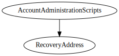
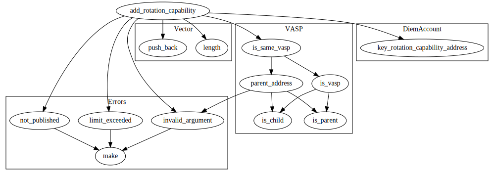

# Module `0x1::RecoveryAddress`

This module defines an account recovery mechanism that can be used by VASPs.

-  [Resource `RecoveryAddress`](#0x1_RecoveryAddress_RecoveryAddress)
-  [Constants](#@Constants_0)
-  [Function `publish`](#0x1_RecoveryAddress_publish)
-  [Function `rotate_authentication_key`](#0x1_RecoveryAddress_rotate_authentication_key)
-  [Function `add_rotation_capability`](#0x1_RecoveryAddress_add_rotation_capability)
-  [Module Specification](#@Module_Specification_1)
    -  [Initialization](#@Initialization_2)
    -  [Persistence of Resource](#@Persistence_of_Resource_3)
    -  [Persistence of KeyRotationCapability](#@Persistence_of_KeyRotationCapability_4)
    -  [Consistency Between Resources and Roles](#@Consistency_Between_Resources_and_Roles_5)
    -  [Helper Functions](#@Helper_Functions_6)

<pre><code><b>use</b> <a href="DiemAccount.md#0x1_DiemAccount">0x1::DiemAccount</a>;
<b>use</b> <a href="../../../move-stdlib/docs/Errors.md#0x1_Errors">0x1::Errors</a>;
<b>use</b> <a href="../../../move-stdlib/docs/Signer.md#0x1_Signer">0x1::Signer</a>;
<b>use</b> <a href="VASP.md#0x1_VASP">0x1::VASP</a>;
<b>use</b> <a href="../../../move-stdlib/docs/Vector.md#0x1_Vector">0x1::Vector</a>;
</code></pre>

Show all the modules that "RecoveryAddress" depends on directly or indirectly

Show all the modules that depend on "RecoveryAddress" directly or indirectly

## Resource `RecoveryAddress`

A resource that holds the <code>KeyRotationCapability</code>s for several accounts belonging to the
same VASP. A VASP account that delegates its <code>KeyRotationCapability</code> to
but also allows the account that stores the <code><a href="RecoveryAddress.md#0x1_RecoveryAddress">RecoveryAddress</a></code> resource to rotate its
authentication key.
This is useful as an account recovery mechanism: VASP accounts can all delegate their
rotation capabilities to a single <code><a href="RecoveryAddress.md#0x1_RecoveryAddress">RecoveryAddress</a></code> resource stored under address A.
The authentication key for A can be "buried in the mountain" and dug up only if the need to
recover one of accounts in <code>rotation_caps</code> arises.

<pre><code><b>resource</b> <b>struct</b> <a href="RecoveryAddress.md#0x1_RecoveryAddress">RecoveryAddress</a>
</code></pre>

Fields

<dl>
<dt>
<code>rotation_caps: vector&lt;<a href="DiemAccount.md#0x1_DiemAccount_KeyRotationCapability">DiemAccount::KeyRotationCapability</a>&gt;</code>
</dt>
<dd>

</dd>
</dl>

## Constants

Only VASPs can create a recovery address

<pre><code><b>const</b> <a href="RecoveryAddress.md#0x1_RecoveryAddress_ENOT_A_VASP">ENOT_A_VASP</a>: u64 = 0;
</code></pre>

The account address couldn't be found in the account recovery resource

<pre><code><b>const</b> <a href="RecoveryAddress.md#0x1_RecoveryAddress_EACCOUNT_NOT_RECOVERABLE">EACCOUNT_NOT_RECOVERABLE</a>: u64 = 4;
</code></pre>

The signer doesn't have the appropriate privileges to rotate the account's key

<pre><code><b>const</b> <a href="RecoveryAddress.md#0x1_RecoveryAddress_ECANNOT_ROTATE_KEY">ECANNOT_ROTATE_KEY</a>: u64 = 2;
</code></pre>

Only accounts belonging to the same VASP can delegate their key rotation capability

<pre><code><b>const</b> <a href="RecoveryAddress.md#0x1_RecoveryAddress_EINVALID_KEY_ROTATION_DELEGATION">EINVALID_KEY_ROTATION_DELEGATION</a>: u64 = 3;
</code></pre>

A cycle would have been created would be created

<pre><code><b>const</b> <a href="RecoveryAddress.md#0x1_RecoveryAddress_EKEY_ROTATION_DEPENDENCY_CYCLE">EKEY_ROTATION_DEPENDENCY_CYCLE</a>: u64 = 1;
</code></pre>

The maximum allowed number of keys have been registered with this recovery address.

<pre><code><b>const</b> <a href="RecoveryAddress.md#0x1_RecoveryAddress_EMAX_KEYS_REGISTERED">EMAX_KEYS_REGISTERED</a>: u64 = 6;
</code></pre>

A <code><a href="RecoveryAddress.md#0x1_RecoveryAddress">RecoveryAddress</a></code> resource was in an unexpected state

<pre><code><b>const</b> <a href="RecoveryAddress.md#0x1_RecoveryAddress_ERECOVERY_ADDRESS">ERECOVERY_ADDRESS</a>: u64 = 5;
</code></pre>

The maximum number of keys that can be registered with a single recovery address.

<pre><code><b>const</b> <a href="RecoveryAddress.md#0x1_RecoveryAddress_MAX_REGISTERED_KEYS">MAX_REGISTERED_KEYS</a>: u64 = 256;
</code></pre>

## Function `publish`

Extract the <code>KeyRotationCapability</code> for <code>recovery_account</code> and publish it in a
<code><a href="RecoveryAddress.md#0x1_RecoveryAddress">RecoveryAddress</a></code> resource under  <code>recovery_account</code>.
Aborts if <code>recovery_account</code> has delegated its <code>KeyRotationCapability</code>, already has a
<code><a href="RecoveryAddress.md#0x1_RecoveryAddress">RecoveryAddress</a></code> resource, or is not a VASP.

<pre><code><b>public</b> <b>fun</b> <a href="RecoveryAddress.md#0x1_RecoveryAddress_publish">publish</a>(recovery_account: &signer, rotation_cap: <a href="DiemAccount.md#0x1_DiemAccount_KeyRotationCapability">DiemAccount::KeyRotationCapability</a>)
</code></pre>

Implementation

<pre><code><b>public</b> <b>fun</b> <a href="RecoveryAddress.md#0x1_RecoveryAddress_publish">publish</a>(recovery_account: &signer, rotation_cap: KeyRotationCapability) {
    <b>let</b> addr = <a href="../../../move-stdlib/docs/Signer.md#0x1_Signer_address_of">Signer::address_of</a>(recovery_account);
    // Only VASPs can create a recovery address
    <b>assert</b>(<a href="VASP.md#0x1_VASP_is_vasp">VASP::is_vasp</a>(addr), <a href="../../../move-stdlib/docs/Errors.md#0x1_Errors_invalid_argument">Errors::invalid_argument</a>(<a href="RecoveryAddress.md#0x1_RecoveryAddress_ENOT_A_VASP">ENOT_A_VASP</a>));
    // put the rotation capability for the recovery account itself in `rotation_caps`. This
    // <b>ensures</b> two things:
    // (1) It's not possible <b>to</b> get into a "recovery cycle" <b>where</b> A is the recovery account for
    //     B and B is the recovery account for A
    // (2) rotation_caps is always nonempty
    <b>assert</b>(
        *<a href="DiemAccount.md#0x1_DiemAccount_key_rotation_capability_address">DiemAccount::key_rotation_capability_address</a>(&rotation_cap) == addr,
         <a href="../../../move-stdlib/docs/Errors.md#0x1_Errors_invalid_argument">Errors::invalid_argument</a>(<a href="RecoveryAddress.md#0x1_RecoveryAddress_EKEY_ROTATION_DEPENDENCY_CYCLE">EKEY_ROTATION_DEPENDENCY_CYCLE</a>)
    );
    <b>assert</b>(!<b>exists</b>&lt;<a href="RecoveryAddress.md#0x1_RecoveryAddress">RecoveryAddress</a>&gt;(addr), <a href="../../../move-stdlib/docs/Errors.md#0x1_Errors_already_published">Errors::already_published</a>(<a href="RecoveryAddress.md#0x1_RecoveryAddress_ERECOVERY_ADDRESS">ERECOVERY_ADDRESS</a>));
    move_to(
        recovery_account,
        <a href="RecoveryAddress.md#0x1_RecoveryAddress">RecoveryAddress</a> { rotation_caps: <a href="../../../move-stdlib/docs/Vector.md#0x1_Vector_singleton">Vector::singleton</a>(rotation_cap) }
    )
}
</code></pre>

Specification

<pre><code><b>include</b> <a href="RecoveryAddress.md#0x1_RecoveryAddress_PublishAbortsIf">PublishAbortsIf</a>;
<b>include</b> <a href="RecoveryAddress.md#0x1_RecoveryAddress_PublishEnsures">PublishEnsures</a>;
</code></pre>

<pre><code><b>schema</b> <a href="RecoveryAddress.md#0x1_RecoveryAddress_PublishAbortsIf">PublishAbortsIf</a> {
    recovery_account: signer;
    rotation_cap: KeyRotationCapability;
    
    <b>let</b> addr = <a href="../../../move-stdlib/docs/Signer.md#0x1_Signer_spec_address_of">Signer::spec_address_of</a>(recovery_account);
    <b>aborts_if</b> !<a href="VASP.md#0x1_VASP_is_vasp">VASP::is_vasp</a>(addr) <b>with</b> <a href="../../../move-stdlib/docs/Errors.md#0x1_Errors_INVALID_ARGUMENT">Errors::INVALID_ARGUMENT</a>;
    <b>aborts_if</b> <a href="RecoveryAddress.md#0x1_RecoveryAddress_spec_is_recovery_address">spec_is_recovery_address</a>(addr) <b>with</b> <a href="../../../move-stdlib/docs/Errors.md#0x1_Errors_ALREADY_PUBLISHED">Errors::ALREADY_PUBLISHED</a>;
    <b>aborts_if</b> <a href="DiemAccount.md#0x1_DiemAccount_key_rotation_capability_address">DiemAccount::key_rotation_capability_address</a>(rotation_cap) != addr
        <b>with</b> <a href="../../../move-stdlib/docs/Errors.md#0x1_Errors_INVALID_ARGUMENT">Errors::INVALID_ARGUMENT</a>;
}
</code></pre>

<pre><code><b>schema</b> <a href="RecoveryAddress.md#0x1_RecoveryAddress_PublishEnsures">PublishEnsures</a> {
    recovery_account: signer;
    rotation_cap: KeyRotationCapability;
    
    <b>let</b> addr = <a href="../../../move-stdlib/docs/Signer.md#0x1_Signer_spec_address_of">Signer::spec_address_of</a>(recovery_account);
    <b>ensures</b> <a href="RecoveryAddress.md#0x1_RecoveryAddress_spec_is_recovery_address">spec_is_recovery_address</a>(addr);
    <b>ensures</b> len(<a href="RecoveryAddress.md#0x1_RecoveryAddress_spec_get_rotation_caps">spec_get_rotation_caps</a>(addr)) == 1;
    <b>ensures</b> <a href="RecoveryAddress.md#0x1_RecoveryAddress_spec_get_rotation_caps">spec_get_rotation_caps</a>(addr)[0] == rotation_cap;
}
</code></pre>

Show all the functions that "publish" calls

## Function `rotate_authentication_key`

Rotate the authentication key of <code>to_recover</code> to <code>new_key</code>. Can be invoked by either
<code>recovery_address</code> or <code>to_recover</code>.
Aborts if <code>recovery_address</code> does not have the <code>KeyRotationCapability</code> for <code>to_recover</code>.

<pre><code><b>public</b> <b>fun</b> <a href="RecoveryAddress.md#0x1_RecoveryAddress_rotate_authentication_key">rotate_authentication_key</a>(account: &signer, recovery_address: address, to_recover: address, new_key: vector&lt;u8&gt;)
</code></pre>

Implementation

<pre><code><b>public</b> <b>fun</b> <a href="RecoveryAddress.md#0x1_RecoveryAddress_rotate_authentication_key">rotate_authentication_key</a>(
    account: &signer,
    recovery_address: address,
    to_recover: address,
    new_key: vector&lt;u8&gt;
) <b>acquires</b> <a href="RecoveryAddress.md#0x1_RecoveryAddress">RecoveryAddress</a> {
    // Check that `recovery_address` has a `<a href="RecoveryAddress.md#0x1_RecoveryAddress">RecoveryAddress</a>` <b>resource</b>
    <b>assert</b>(<b>exists</b>&lt;<a href="RecoveryAddress.md#0x1_RecoveryAddress">RecoveryAddress</a>&gt;(recovery_address), <a href="../../../move-stdlib/docs/Errors.md#0x1_Errors_not_published">Errors::not_published</a>(<a href="RecoveryAddress.md#0x1_RecoveryAddress_ERECOVERY_ADDRESS">ERECOVERY_ADDRESS</a>));
    <b>let</b> sender = <a href="../../../move-stdlib/docs/Signer.md#0x1_Signer_address_of">Signer::address_of</a>(account);
    <b>assert</b>(
        // The original owner of a key rotation capability can rotate its own key
        sender == to_recover ||
        // The owner of the `<a href="RecoveryAddress.md#0x1_RecoveryAddress">RecoveryAddress</a>` <b>resource</b> can rotate any key
        sender == recovery_address,
        <a href="../../../move-stdlib/docs/Errors.md#0x1_Errors_invalid_argument">Errors::invalid_argument</a>(<a href="RecoveryAddress.md#0x1_RecoveryAddress_ECANNOT_ROTATE_KEY">ECANNOT_ROTATE_KEY</a>)
    );

    <b>let</b> caps = &borrow_global&lt;<a href="RecoveryAddress.md#0x1_RecoveryAddress">RecoveryAddress</a>&gt;(recovery_address).rotation_caps;
    <b>let</b> i = 0;
    <b>let</b> len = <a href="../../../move-stdlib/docs/Vector.md#0x1_Vector_length">Vector::length</a>(caps);
    <b>while</b> ({
        <b>spec</b> {
            <b>assert</b> i &lt;= len;
            <b>assert</b> <b>forall</b> j in 0..i: caps[j].account_address != to_recover;
        };
        (i &lt; len)
    })
    {
        <b>let</b> cap = <a href="../../../move-stdlib/docs/Vector.md#0x1_Vector_borrow">Vector::borrow</a>(caps, i);
        <b>if</b> (<a href="DiemAccount.md#0x1_DiemAccount_key_rotation_capability_address">DiemAccount::key_rotation_capability_address</a>(cap) == &to_recover) {
            <a href="DiemAccount.md#0x1_DiemAccount_rotate_authentication_key">DiemAccount::rotate_authentication_key</a>(cap, new_key);
            <b>return</b>
        };
        i = i + 1
    };
    <b>spec</b> {
        <b>assert</b> i == len;
        <b>assert</b> <b>forall</b> j in 0..len: caps[j].account_address != to_recover;
    };
    // Couldn't find `to_recover` in the account recovery <b>resource</b>; <b>abort</b>
    <b>abort</b> <a href="../../../move-stdlib/docs/Errors.md#0x1_Errors_invalid_argument">Errors::invalid_argument</a>(<a href="RecoveryAddress.md#0x1_RecoveryAddress_EACCOUNT_NOT_RECOVERABLE">EACCOUNT_NOT_RECOVERABLE</a>)
}
</code></pre>

Specification

<pre><code><b>include</b> <a href="RecoveryAddress.md#0x1_RecoveryAddress_RotateAuthenticationKeyAbortsIf">RotateAuthenticationKeyAbortsIf</a>;
<b>include</b> <a href="RecoveryAddress.md#0x1_RecoveryAddress_RotateAuthenticationKeyEnsures">RotateAuthenticationKeyEnsures</a>;
</code></pre>

<pre><code><b>schema</b> <a href="RecoveryAddress.md#0x1_RecoveryAddress_RotateAuthenticationKeyAbortsIf">RotateAuthenticationKeyAbortsIf</a> {
    account: signer;
    recovery_address: address;
    to_recover: address;
    new_key: vector&lt;u8&gt;;
    <b>aborts_if</b> !<a href="RecoveryAddress.md#0x1_RecoveryAddress_spec_is_recovery_address">spec_is_recovery_address</a>(recovery_address) <b>with</b> <a href="../../../move-stdlib/docs/Errors.md#0x1_Errors_NOT_PUBLISHED">Errors::NOT_PUBLISHED</a>;
    <b>aborts_if</b> !<a href="DiemAccount.md#0x1_DiemAccount_exists_at">DiemAccount::exists_at</a>(to_recover) <b>with</b> <a href="../../../move-stdlib/docs/Errors.md#0x1_Errors_NOT_PUBLISHED">Errors::NOT_PUBLISHED</a>;
    <b>aborts_if</b> len(new_key) != 32 <b>with</b> <a href="../../../move-stdlib/docs/Errors.md#0x1_Errors_INVALID_ARGUMENT">Errors::INVALID_ARGUMENT</a>;
    <b>aborts_if</b> !<a href="RecoveryAddress.md#0x1_RecoveryAddress_spec_holds_key_rotation_cap_for">spec_holds_key_rotation_cap_for</a>(recovery_address, to_recover) <b>with</b> <a href="../../../move-stdlib/docs/Errors.md#0x1_Errors_INVALID_ARGUMENT">Errors::INVALID_ARGUMENT</a>;
    <b>aborts_if</b> !(<a href="../../../move-stdlib/docs/Signer.md#0x1_Signer_spec_address_of">Signer::spec_address_of</a>(account) == recovery_address
                || <a href="../../../move-stdlib/docs/Signer.md#0x1_Signer_spec_address_of">Signer::spec_address_of</a>(account) == to_recover) <b>with</b> <a href="../../../move-stdlib/docs/Errors.md#0x1_Errors_INVALID_ARGUMENT">Errors::INVALID_ARGUMENT</a>;
}
</code></pre>

<pre><code><b>schema</b> <a href="RecoveryAddress.md#0x1_RecoveryAddress_RotateAuthenticationKeyEnsures">RotateAuthenticationKeyEnsures</a> {
    to_recover: address;
    new_key: vector&lt;u8&gt;;
    <b>ensures</b> <a href="DiemAccount.md#0x1_DiemAccount_authentication_key">DiemAccount::authentication_key</a>(to_recover) == new_key;
}
</code></pre>

Show all the functions that "rotate_authentication_key" calls

## Function `add_rotation_capability`

Add <code>to_recover</code> to the <code><a href="RecoveryAddress.md#0x1_RecoveryAddress">RecoveryAddress</a></code> resource under <code>recovery_address</code>.
Aborts if <code>to_recover.address</code> and <code>recovery_address</code> belong to different VASPs, or if
<code>recovery_address</code> does not have a <code><a href="RecoveryAddress.md#0x1_RecoveryAddress">RecoveryAddress</a></code> resource.

<pre><code><b>public</b> <b>fun</b> <a href="RecoveryAddress.md#0x1_RecoveryAddress_add_rotation_capability">add_rotation_capability</a>(to_recover: <a href="DiemAccount.md#0x1_DiemAccount_KeyRotationCapability">DiemAccount::KeyRotationCapability</a>, recovery_address: address)
</code></pre>

Implementation

<pre><code><b>public</b> <b>fun</b> <a href="RecoveryAddress.md#0x1_RecoveryAddress_add_rotation_capability">add_rotation_capability</a>(to_recover: KeyRotationCapability, recovery_address: address)
<b>acquires</b> <a href="RecoveryAddress.md#0x1_RecoveryAddress">RecoveryAddress</a> {
    // Check that `recovery_address` has a `<a href="RecoveryAddress.md#0x1_RecoveryAddress">RecoveryAddress</a>` <b>resource</b>
    <b>assert</b>(<b>exists</b>&lt;<a href="RecoveryAddress.md#0x1_RecoveryAddress">RecoveryAddress</a>&gt;(recovery_address), <a href="../../../move-stdlib/docs/Errors.md#0x1_Errors_not_published">Errors::not_published</a>(<a href="RecoveryAddress.md#0x1_RecoveryAddress_ERECOVERY_ADDRESS">ERECOVERY_ADDRESS</a>));
    // Only accept the rotation capability <b>if</b> both accounts belong <b>to</b> the same <a href="VASP.md#0x1_VASP">VASP</a>
    <b>let</b> to_recover_address = *<a href="DiemAccount.md#0x1_DiemAccount_key_rotation_capability_address">DiemAccount::key_rotation_capability_address</a>(&to_recover);
    <b>assert</b>(
        <a href="VASP.md#0x1_VASP_is_same_vasp">VASP::is_same_vasp</a>(recovery_address, to_recover_address),
        <a href="../../../move-stdlib/docs/Errors.md#0x1_Errors_invalid_argument">Errors::invalid_argument</a>(<a href="RecoveryAddress.md#0x1_RecoveryAddress_EINVALID_KEY_ROTATION_DELEGATION">EINVALID_KEY_ROTATION_DELEGATION</a>)
    );

    <b>let</b> recovery_caps = &<b>mut</b> borrow_global_mut&lt;<a href="RecoveryAddress.md#0x1_RecoveryAddress">RecoveryAddress</a>&gt;(recovery_address).rotation_caps;
    <b>assert</b>(
        <a href="../../../move-stdlib/docs/Vector.md#0x1_Vector_length">Vector::length</a>(recovery_caps) &lt; <a href="RecoveryAddress.md#0x1_RecoveryAddress_MAX_REGISTERED_KEYS">MAX_REGISTERED_KEYS</a>,
        <a href="../../../move-stdlib/docs/Errors.md#0x1_Errors_limit_exceeded">Errors::limit_exceeded</a>(<a href="RecoveryAddress.md#0x1_RecoveryAddress_EMAX_KEYS_REGISTERED">EMAX_KEYS_REGISTERED</a>)
    );

    <a href="../../../move-stdlib/docs/Vector.md#0x1_Vector_push_back">Vector::push_back</a>(recovery_caps, to_recover);
}
</code></pre>

Specification

<pre><code><b>include</b> <a href="RecoveryAddress.md#0x1_RecoveryAddress_AddRotationCapabilityAbortsIf">AddRotationCapabilityAbortsIf</a>;
<b>include</b> <a href="RecoveryAddress.md#0x1_RecoveryAddress_AddRotationCapabilityEnsures">AddRotationCapabilityEnsures</a>;
</code></pre>

<pre><code><b>schema</b> <a href="RecoveryAddress.md#0x1_RecoveryAddress_AddRotationCapabilityAbortsIf">AddRotationCapabilityAbortsIf</a> {
    to_recover: KeyRotationCapability;
    recovery_address: address;
    <b>aborts_if</b> !<a href="RecoveryAddress.md#0x1_RecoveryAddress_spec_is_recovery_address">spec_is_recovery_address</a>(recovery_address) <b>with</b> <a href="../../../move-stdlib/docs/Errors.md#0x1_Errors_NOT_PUBLISHED">Errors::NOT_PUBLISHED</a>;
    <b>aborts_if</b> len(<b>global</b>&lt;<a href="RecoveryAddress.md#0x1_RecoveryAddress">RecoveryAddress</a>&gt;(recovery_address).rotation_caps) &gt;= <a href="RecoveryAddress.md#0x1_RecoveryAddress_MAX_REGISTERED_KEYS">MAX_REGISTERED_KEYS</a> <b>with</b> <a href="../../../move-stdlib/docs/Errors.md#0x1_Errors_LIMIT_EXCEEDED">Errors::LIMIT_EXCEEDED</a>;
    
    <b>let</b> to_recover_address = <a href="DiemAccount.md#0x1_DiemAccount_key_rotation_capability_address">DiemAccount::key_rotation_capability_address</a>(to_recover);
    <b>aborts_if</b> !<a href="VASP.md#0x1_VASP_spec_is_same_vasp">VASP::spec_is_same_vasp</a>(recovery_address, to_recover_address) <b>with</b> <a href="../../../move-stdlib/docs/Errors.md#0x1_Errors_INVALID_ARGUMENT">Errors::INVALID_ARGUMENT</a>;
}
</code></pre>

<pre><code><b>schema</b> <a href="RecoveryAddress.md#0x1_RecoveryAddress_AddRotationCapabilityEnsures">AddRotationCapabilityEnsures</a> {
    to_recover: KeyRotationCapability;
    recovery_address: address;
    
    <b>let</b> num_rotation_caps = len(<a href="RecoveryAddress.md#0x1_RecoveryAddress_spec_get_rotation_caps">spec_get_rotation_caps</a>(recovery_address));
    <b>ensures</b> <a href="RecoveryAddress.md#0x1_RecoveryAddress_spec_get_rotation_caps">spec_get_rotation_caps</a>(recovery_address)[num_rotation_caps - 1] == to_recover;
}
</code></pre>

Show all the functions that "add_rotation_capability" calls

## Module Specification

### Initialization

A RecoveryAddress has its own <code>KeyRotationCapability</code>.

<pre><code><b>invariant</b> [<b>global</b>, isolated]
    <b>forall</b> addr1: address <b>where</b> <a href="RecoveryAddress.md#0x1_RecoveryAddress_spec_is_recovery_address">spec_is_recovery_address</a>(addr1):
        len(<a href="RecoveryAddress.md#0x1_RecoveryAddress_spec_get_rotation_caps">spec_get_rotation_caps</a>(addr1)) &gt; 0 &&
        <a href="RecoveryAddress.md#0x1_RecoveryAddress_spec_get_rotation_caps">spec_get_rotation_caps</a>(addr1)[0].account_address == addr1;
</code></pre>

### Persistence of Resource

<pre><code><b>invariant</b> <b>update</b> [<b>global</b>]
   <b>forall</b> addr: address:
       <b>old</b>(<a href="RecoveryAddress.md#0x1_RecoveryAddress_spec_is_recovery_address">spec_is_recovery_address</a>(addr)) ==&gt; <a href="RecoveryAddress.md#0x1_RecoveryAddress_spec_is_recovery_address">spec_is_recovery_address</a>(addr);
</code></pre>

### Persistence of KeyRotationCapability

<code><a href="RecoveryAddress.md#0x1_RecoveryAddress">RecoveryAddress</a></code> persists

<pre><code><b>invariant</b> <b>update</b> [<b>global</b>] <b>forall</b> addr: address <b>where</b> <b>old</b>(<b>exists</b>&lt;<a href="RecoveryAddress.md#0x1_RecoveryAddress">RecoveryAddress</a>&gt;(addr)):
    <b>exists</b>&lt;<a href="RecoveryAddress.md#0x1_RecoveryAddress">RecoveryAddress</a>&gt;(addr);
</code></pre>

If <code>recovery_addr</code> holds the <code>KeyRotationCapability</code> of <code>to_recovery_addr</code>
in the previous state, then it continues to hold the capability after the update.

<pre><code><b>invariant</b> <b>update</b> [<b>global</b>]
    <b>forall</b> recovery_addr: address, to_recovery_addr: address
    <b>where</b> <b>old</b>(<a href="RecoveryAddress.md#0x1_RecoveryAddress_spec_is_recovery_address">spec_is_recovery_address</a>(recovery_addr)):
        <b>old</b>(<a href="RecoveryAddress.md#0x1_RecoveryAddress_spec_holds_key_rotation_cap_for">spec_holds_key_rotation_cap_for</a>(recovery_addr, to_recovery_addr))
        ==&gt; <a href="RecoveryAddress.md#0x1_RecoveryAddress_spec_holds_key_rotation_cap_for">spec_holds_key_rotation_cap_for</a>(recovery_addr, to_recovery_addr);
</code></pre>

### Consistency Between Resources and Roles

Only VASPs can hold <code>RecoverAddress</code> resources.

<pre><code><b>invariant</b> [<b>global</b>, isolated]
    <b>forall</b> recovery_addr: address <b>where</b> <a href="RecoveryAddress.md#0x1_RecoveryAddress_spec_is_recovery_address">spec_is_recovery_address</a>(recovery_addr):
        <a href="VASP.md#0x1_VASP_is_vasp">VASP::is_vasp</a>(recovery_addr);
</code></pre>

### Helper Functions

Returns true if <code>addr</code> is a recovery address.

<pre><code><b>define</b> <a href="RecoveryAddress.md#0x1_RecoveryAddress_spec_is_recovery_address">spec_is_recovery_address</a>(addr: address): bool
{
    <b>exists</b>&lt;<a href="RecoveryAddress.md#0x1_RecoveryAddress">RecoveryAddress</a>&gt;(addr)
}
</code></pre>

Returns all the <code>KeyRotationCapability</code>s held at <code>recovery_address</code>.

<pre><code><b>define</b> <a href="RecoveryAddress.md#0x1_RecoveryAddress_spec_get_rotation_caps">spec_get_rotation_caps</a>(recovery_address: address):
    vector&lt;<a href="DiemAccount.md#0x1_DiemAccount_KeyRotationCapability">DiemAccount::KeyRotationCapability</a>&gt;
{
    <b>global</b>&lt;<a href="RecoveryAddress.md#0x1_RecoveryAddress">RecoveryAddress</a>&gt;(recovery_address).rotation_caps
}
</code></pre>

Returns true if <code>recovery_address</code> holds the
<code>KeyRotationCapability</code> for <code>addr</code>.

<pre><code><b>define</b> <a href="RecoveryAddress.md#0x1_RecoveryAddress_spec_holds_key_rotation_cap_for">spec_holds_key_rotation_cap_for</a>(
    recovery_address: address,
    addr: address): bool
{
    <b>exists</b> i: u64
        <b>where</b> 0 &lt;= i && i &lt; len(<a href="RecoveryAddress.md#0x1_RecoveryAddress_spec_get_rotation_caps">spec_get_rotation_caps</a>(recovery_address)):
            <a href="RecoveryAddress.md#0x1_RecoveryAddress_spec_get_rotation_caps">spec_get_rotation_caps</a>(recovery_address)[i].account_address == addr
}
</code></pre>

[//]: # ("File containing references which can be used from documentation")
[ACCESS_CONTROL]: https://github.com/diem/dip/blob/main/dips/dip-2.md
[ROLE]: https://github.com/diem/dip/blob/main/dips/dip-2.md#roles
[PERMISSION]: https://github.com/diem/dip/blob/main/dips/dip-2.md#permissions
