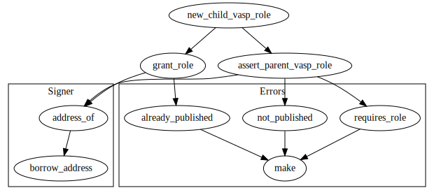
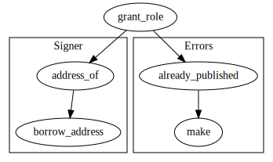
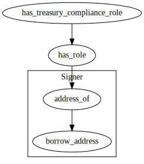
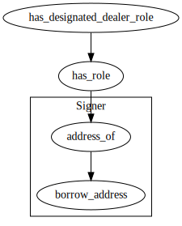
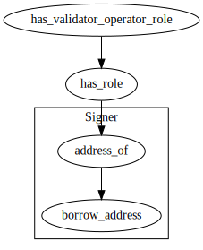
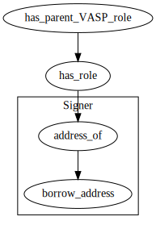
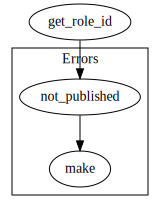

# Module `0x1::Roles`

This module defines role-based access control for the Diem framework.

Roles are associated with accounts and govern what operations are permitted by those accounts. A role
is typically asserted on function entry using a statement like <code><a href="Roles.md#0x1_Roles_assert_diem_root">Self::assert_diem_root</a>(account)</code>. This
module provides multiple assertion functions like this one, as well as the functions to setup roles.

For a conceptual discussion of roles, see the [DIP-2 document][ACCESS_CONTROL].

-  [Resource `RoleId`](#0x1_Roles_RoleId)
-  [Constants](#@Constants_0)
-  [Function `grant_diem_root_role`](#0x1_Roles_grant_diem_root_role)
-  [Function `grant_treasury_compliance_role`](#0x1_Roles_grant_treasury_compliance_role)
-  [Function `new_designated_dealer_role`](#0x1_Roles_new_designated_dealer_role)
-  [Function `new_validator_role`](#0x1_Roles_new_validator_role)
-  [Function `new_validator_operator_role`](#0x1_Roles_new_validator_operator_role)
-  [Function `new_parent_vasp_role`](#0x1_Roles_new_parent_vasp_role)
-  [Function `new_child_vasp_role`](#0x1_Roles_new_child_vasp_role)
-  [Function `grant_role`](#0x1_Roles_grant_role)
-  [Function `has_role`](#0x1_Roles_has_role)
-  [Function `has_diem_root_role`](#0x1_Roles_has_diem_root_role)
-  [Function `has_treasury_compliance_role`](#0x1_Roles_has_treasury_compliance_role)
-  [Function `has_designated_dealer_role`](#0x1_Roles_has_designated_dealer_role)
-  [Function `has_validator_role`](#0x1_Roles_has_validator_role)
-  [Function `has_validator_operator_role`](#0x1_Roles_has_validator_operator_role)
-  [Function `has_parent_VASP_role`](#0x1_Roles_has_parent_VASP_role)
-  [Function `has_child_VASP_role`](#0x1_Roles_has_child_VASP_role)
-  [Function `get_role_id`](#0x1_Roles_get_role_id)
-  [Function `can_hold_balance`](#0x1_Roles_can_hold_balance)
-  [Function `assert_diem_root`](#0x1_Roles_assert_diem_root)
-  [Function `assert_treasury_compliance`](#0x1_Roles_assert_treasury_compliance)
-  [Function `assert_parent_vasp_role`](#0x1_Roles_assert_parent_vasp_role)
-  [Function `assert_child_vasp_role`](#0x1_Roles_assert_child_vasp_role)
-  [Function `assert_designated_dealer`](#0x1_Roles_assert_designated_dealer)
-  [Function `assert_validator`](#0x1_Roles_assert_validator)
-  [Function `assert_validator_operator`](#0x1_Roles_assert_validator_operator)
-  [Function `assert_parent_vasp_or_designated_dealer`](#0x1_Roles_assert_parent_vasp_or_designated_dealer)
-  [Function `assert_parent_vasp_or_child_vasp`](#0x1_Roles_assert_parent_vasp_or_child_vasp)
-  [Module Specification](#@Module_Specification_1)
    -  [Persistence of Roles](#@Persistence_of_Roles_2)
    -  [Access Control](#@Access_Control_3)
    -  [Helper Functions and Schemas](#@Helper_Functions_and_Schemas_4)

<pre><code><b>use</b> <a href="CoreAddresses.md#0x1_CoreAddresses">0x1::CoreAddresses</a>;
<b>use</b> <a href="DiemTimestamp.md#0x1_DiemTimestamp">0x1::DiemTimestamp</a>;
<b>use</b> <a href="../../../move-stdlib/docs/Errors.md#0x1_Errors">0x1::Errors</a>;
<b>use</b> <a href="../../../move-stdlib/docs/Signer.md#0x1_Signer">0x1::Signer</a>;
</code></pre>

Show all the modules that "Roles" depends on directly or indirectly

Show all the modules that depend on "Roles" directly or indirectly

## Resource `RoleId`

The roleId contains the role id for the account. This is only moved
to an account as a top-level resource, and is otherwise immovable.

<pre><code><b>resource</b> <b>struct</b> <a href="Roles.md#0x1_Roles_RoleId">RoleId</a>
</code></pre>

Fields

<dl>
<dt>
<code>role_id: u64</code>
</dt>
<dd>

</dd>
</dl>

## Constants

The signer didn't have the required Diem Root role

<pre><code><b>const</b> <a href="Roles.md#0x1_Roles_EDIEM_ROOT">EDIEM_ROOT</a>: u64 = 1;
</code></pre>

The signer didn't have the required Treasury & Compliance role

<pre><code><b>const</b> <a href="Roles.md#0x1_Roles_ETREASURY_COMPLIANCE">ETREASURY_COMPLIANCE</a>: u64 = 2;
</code></pre>

<pre><code><b>const</b> <a href="Roles.md#0x1_Roles_CHILD_VASP_ROLE_ID">CHILD_VASP_ROLE_ID</a>: u64 = 6;
</code></pre>

<pre><code><b>const</b> <a href="Roles.md#0x1_Roles_DESIGNATED_DEALER_ROLE_ID">DESIGNATED_DEALER_ROLE_ID</a>: u64 = 2;
</code></pre>

<pre><code><b>const</b> <a href="Roles.md#0x1_Roles_DIEM_ROOT_ROLE_ID">DIEM_ROOT_ROLE_ID</a>: u64 = 0;
</code></pre>

The signer didn't have the required Child VASP role

<pre><code><b>const</b> <a href="Roles.md#0x1_Roles_ECHILD_VASP">ECHILD_VASP</a>: u64 = 9;
</code></pre>

The signer didn't have the required Designated Dealer role

<pre><code><b>const</b> <a href="Roles.md#0x1_Roles_EDESIGNATED_DEALER">EDESIGNATED_DEALER</a>: u64 = 6;
</code></pre>

The signer didn't have the required Parent VASP role

<pre><code><b>const</b> <a href="Roles.md#0x1_Roles_EPARENT_VASP">EPARENT_VASP</a>: u64 = 3;
</code></pre>

The signer didn't have the required ParentVASP or ChildVASP role

<pre><code><b>const</b> <a href="Roles.md#0x1_Roles_EPARENT_VASP_OR_CHILD_VASP">EPARENT_VASP_OR_CHILD_VASP</a>: u64 = 4;
</code></pre>

The signer didn't have the required Parent VASP or Designated Dealer role

<pre><code><b>const</b> <a href="Roles.md#0x1_Roles_EPARENT_VASP_OR_DESIGNATED_DEALER">EPARENT_VASP_OR_DESIGNATED_DEALER</a>: u64 = 5;
</code></pre>

A <code><a href="Roles.md#0x1_Roles_RoleId">RoleId</a></code> resource was in an unexpected state

<pre><code><b>const</b> <a href="Roles.md#0x1_Roles_EROLE_ID">EROLE_ID</a>: u64 = 0;
</code></pre>

The signer didn't have the required Validator role

<pre><code><b>const</b> <a href="Roles.md#0x1_Roles_EVALIDATOR">EVALIDATOR</a>: u64 = 7;
</code></pre>

The signer didn't have the required Validator Operator role

<pre><code><b>const</b> <a href="Roles.md#0x1_Roles_EVALIDATOR_OPERATOR">EVALIDATOR_OPERATOR</a>: u64 = 8;
</code></pre>

<pre><code><b>const</b> <a href="Roles.md#0x1_Roles_PARENT_VASP_ROLE_ID">PARENT_VASP_ROLE_ID</a>: u64 = 5;
</code></pre>

<pre><code><b>const</b> <a href="Roles.md#0x1_Roles_TREASURY_COMPLIANCE_ROLE_ID">TREASURY_COMPLIANCE_ROLE_ID</a>: u64 = 1;
</code></pre>

<pre><code><b>const</b> <a href="Roles.md#0x1_Roles_VALIDATOR_OPERATOR_ROLE_ID">VALIDATOR_OPERATOR_ROLE_ID</a>: u64 = 4;
</code></pre>

<pre><code><b>const</b> <a href="Roles.md#0x1_Roles_VALIDATOR_ROLE_ID">VALIDATOR_ROLE_ID</a>: u64 = 3;
</code></pre>

## Function `grant_diem_root_role`

Publishes diem root role. Granted only in genesis.

<pre><code><b>public</b> <b>fun</b> <a href="Roles.md#0x1_Roles_grant_diem_root_role">grant_diem_root_role</a>(dr_account: &signer)
</code></pre>

Implementation

<pre><code><b>public</b> <b>fun</b> <a href="Roles.md#0x1_Roles_grant_diem_root_role">grant_diem_root_role</a>(
    dr_account: &signer,
) {
    <a href="DiemTimestamp.md#0x1_DiemTimestamp_assert_genesis">DiemTimestamp::assert_genesis</a>();
    // Checks actual <a href="Diem.md#0x1_Diem">Diem</a> root because <a href="Diem.md#0x1_Diem">Diem</a> root role is not set
    // until next line of code.
    <a href="CoreAddresses.md#0x1_CoreAddresses_assert_diem_root">CoreAddresses::assert_diem_root</a>(dr_account);
    // Grant the role <b>to</b> the diem root account
    <a href="Roles.md#0x1_Roles_grant_role">grant_role</a>(dr_account, <a href="Roles.md#0x1_Roles_DIEM_ROOT_ROLE_ID">DIEM_ROOT_ROLE_ID</a>);
}
</code></pre>

Specification

<pre><code><b>include</b> <a href="DiemTimestamp.md#0x1_DiemTimestamp_AbortsIfNotGenesis">DiemTimestamp::AbortsIfNotGenesis</a>;
<b>include</b> <a href="CoreAddresses.md#0x1_CoreAddresses_AbortsIfNotDiemRoot">CoreAddresses::AbortsIfNotDiemRoot</a>{account: dr_account};
<b>include</b> <a href="Roles.md#0x1_Roles_GrantRole">GrantRole</a>{addr: <a href="../../../move-stdlib/docs/Signer.md#0x1_Signer_address_of">Signer::address_of</a>(dr_account), role_id: <a href="Roles.md#0x1_Roles_DIEM_ROOT_ROLE_ID">DIEM_ROOT_ROLE_ID</a>};
</code></pre>

Show all the functions that "grant_diem_root_role" calls

## Function `grant_treasury_compliance_role`

Publishes treasury compliance role. Granted only in genesis.

<pre><code><b>public</b> <b>fun</b> <a href="Roles.md#0x1_Roles_grant_treasury_compliance_role">grant_treasury_compliance_role</a>(treasury_compliance_account: &signer, dr_account: &signer)
</code></pre>

Implementation

<pre><code><b>public</b> <b>fun</b> <a href="Roles.md#0x1_Roles_grant_treasury_compliance_role">grant_treasury_compliance_role</a>(
    treasury_compliance_account: &signer,
    dr_account: &signer,
) <b>acquires</b> <a href="Roles.md#0x1_Roles_RoleId">RoleId</a> {
    <a href="DiemTimestamp.md#0x1_DiemTimestamp_assert_genesis">DiemTimestamp::assert_genesis</a>();
    <a href="CoreAddresses.md#0x1_CoreAddresses_assert_treasury_compliance">CoreAddresses::assert_treasury_compliance</a>(treasury_compliance_account);
    <a href="Roles.md#0x1_Roles_assert_diem_root">assert_diem_root</a>(dr_account);
    // Grant the TC role <b>to</b> the treasury_compliance_account
    <a href="Roles.md#0x1_Roles_grant_role">grant_role</a>(treasury_compliance_account, <a href="Roles.md#0x1_Roles_TREASURY_COMPLIANCE_ROLE_ID">TREASURY_COMPLIANCE_ROLE_ID</a>);
}
</code></pre>

Specification

<pre><code><b>include</b> <a href="DiemTimestamp.md#0x1_DiemTimestamp_AbortsIfNotGenesis">DiemTimestamp::AbortsIfNotGenesis</a>;
<b>include</b> <a href="CoreAddresses.md#0x1_CoreAddresses_AbortsIfNotTreasuryCompliance">CoreAddresses::AbortsIfNotTreasuryCompliance</a>{account: treasury_compliance_account};
<b>include</b> <a href="Roles.md#0x1_Roles_AbortsIfNotDiemRoot">AbortsIfNotDiemRoot</a>{account: dr_account};
<b>include</b> <a href="Roles.md#0x1_Roles_GrantRole">GrantRole</a>{addr: <a href="../../../move-stdlib/docs/Signer.md#0x1_Signer_address_of">Signer::address_of</a>(treasury_compliance_account), role_id: <a href="Roles.md#0x1_Roles_TREASURY_COMPLIANCE_ROLE_ID">TREASURY_COMPLIANCE_ROLE_ID</a>};
</code></pre>

Show all the functions that "grant_treasury_compliance_role" calls

## Function `new_designated_dealer_role`

Publishes a DesignatedDealer <code><a href="Roles.md#0x1_Roles_RoleId">RoleId</a></code> under <code>new_account</code>.
The <code>creating_account</code> must be treasury compliance.

<pre><code><b>public</b> <b>fun</b> <a href="Roles.md#0x1_Roles_new_designated_dealer_role">new_designated_dealer_role</a>(creating_account: &signer, new_account: &signer)
</code></pre>

Implementation

<pre><code><b>public</b> <b>fun</b> <a href="Roles.md#0x1_Roles_new_designated_dealer_role">new_designated_dealer_role</a>(
    creating_account: &signer,
    new_account: &signer,
) <b>acquires</b> <a href="Roles.md#0x1_Roles_RoleId">RoleId</a> {
    <a href="Roles.md#0x1_Roles_assert_treasury_compliance">assert_treasury_compliance</a>(creating_account);
    <a href="Roles.md#0x1_Roles_grant_role">grant_role</a>(new_account, <a href="Roles.md#0x1_Roles_DESIGNATED_DEALER_ROLE_ID">DESIGNATED_DEALER_ROLE_ID</a>);
}
</code></pre>

Specification

<pre><code><b>include</b> <a href="Roles.md#0x1_Roles_AbortsIfNotTreasuryCompliance">AbortsIfNotTreasuryCompliance</a>{account: creating_account};
<b>include</b> <a href="Roles.md#0x1_Roles_GrantRole">GrantRole</a>{addr: <a href="../../../move-stdlib/docs/Signer.md#0x1_Signer_address_of">Signer::address_of</a>(new_account), role_id: <a href="Roles.md#0x1_Roles_DESIGNATED_DEALER_ROLE_ID">DESIGNATED_DEALER_ROLE_ID</a>};
</code></pre>

Show all the functions that "new_designated_dealer_role" calls

## Function `new_validator_role`

Publish a Validator <code><a href="Roles.md#0x1_Roles_RoleId">RoleId</a></code> under <code>new_account</code>.
The <code>creating_account</code> must be diem root.

<pre><code><b>public</b> <b>fun</b> <a href="Roles.md#0x1_Roles_new_validator_role">new_validator_role</a>(creating_account: &signer, new_account: &signer)
</code></pre>

Implementation

<pre><code><b>public</b> <b>fun</b> <a href="Roles.md#0x1_Roles_new_validator_role">new_validator_role</a>(
    creating_account: &signer,
    new_account: &signer
) <b>acquires</b> <a href="Roles.md#0x1_Roles_RoleId">RoleId</a> {
    <a href="Roles.md#0x1_Roles_assert_diem_root">assert_diem_root</a>(creating_account);
    <a href="Roles.md#0x1_Roles_grant_role">grant_role</a>(new_account, <a href="Roles.md#0x1_Roles_VALIDATOR_ROLE_ID">VALIDATOR_ROLE_ID</a>);
}
</code></pre>

Specification

<pre><code><b>include</b> <a href="Roles.md#0x1_Roles_AbortsIfNotDiemRoot">AbortsIfNotDiemRoot</a>{account: creating_account};
<b>include</b> <a href="Roles.md#0x1_Roles_GrantRole">GrantRole</a>{addr: <a href="../../../move-stdlib/docs/Signer.md#0x1_Signer_address_of">Signer::address_of</a>(new_account), role_id: <a href="Roles.md#0x1_Roles_VALIDATOR_ROLE_ID">VALIDATOR_ROLE_ID</a>};
</code></pre>

Show all the functions that "new_validator_role" calls

## Function `new_validator_operator_role`

Publish a ValidatorOperator <code><a href="Roles.md#0x1_Roles_RoleId">RoleId</a></code> under <code>new_account</code>.
The <code>creating_account</code> must be DiemRoot

<pre><code><b>public</b> <b>fun</b> <a href="Roles.md#0x1_Roles_new_validator_operator_role">new_validator_operator_role</a>(creating_account: &signer, new_account: &signer)
</code></pre>

Implementation

<pre><code><b>public</b> <b>fun</b> <a href="Roles.md#0x1_Roles_new_validator_operator_role">new_validator_operator_role</a>(
    creating_account: &signer,
    new_account: &signer,
) <b>acquires</b> <a href="Roles.md#0x1_Roles_RoleId">RoleId</a> {
    <a href="Roles.md#0x1_Roles_assert_diem_root">assert_diem_root</a>(creating_account);
    <a href="Roles.md#0x1_Roles_grant_role">grant_role</a>(new_account, <a href="Roles.md#0x1_Roles_VALIDATOR_OPERATOR_ROLE_ID">VALIDATOR_OPERATOR_ROLE_ID</a>);
}
</code></pre>

Specification

<pre><code><b>include</b> <a href="Roles.md#0x1_Roles_AbortsIfNotDiemRoot">AbortsIfNotDiemRoot</a>{account: creating_account};
<b>include</b> <a href="Roles.md#0x1_Roles_GrantRole">GrantRole</a>{addr: <a href="../../../move-stdlib/docs/Signer.md#0x1_Signer_address_of">Signer::address_of</a>(new_account), role_id: <a href="Roles.md#0x1_Roles_VALIDATOR_OPERATOR_ROLE_ID">VALIDATOR_OPERATOR_ROLE_ID</a>};
</code></pre>

Show all the functions that "new_validator_operator_role" calls

## Function `new_parent_vasp_role`

Publish a ParentVASP <code><a href="Roles.md#0x1_Roles_RoleId">RoleId</a></code> under <code>new_account</code>.
The <code>creating_account</code> must be TreasuryCompliance

<pre><code><b>public</b> <b>fun</b> <a href="Roles.md#0x1_Roles_new_parent_vasp_role">new_parent_vasp_role</a>(creating_account: &signer, new_account: &signer)
</code></pre>

Implementation

<pre><code><b>public</b> <b>fun</b> <a href="Roles.md#0x1_Roles_new_parent_vasp_role">new_parent_vasp_role</a>(
    creating_account: &signer,
    new_account: &signer,
) <b>acquires</b> <a href="Roles.md#0x1_Roles_RoleId">RoleId</a> {
    <a href="Roles.md#0x1_Roles_assert_treasury_compliance">assert_treasury_compliance</a>(creating_account);
    <a href="Roles.md#0x1_Roles_grant_role">grant_role</a>(new_account, <a href="Roles.md#0x1_Roles_PARENT_VASP_ROLE_ID">PARENT_VASP_ROLE_ID</a>);
}
</code></pre>

Specification

<pre><code><b>include</b> <a href="Roles.md#0x1_Roles_AbortsIfNotTreasuryCompliance">AbortsIfNotTreasuryCompliance</a>{account: creating_account};
<b>include</b> <a href="Roles.md#0x1_Roles_GrantRole">GrantRole</a>{addr: <a href="../../../move-stdlib/docs/Signer.md#0x1_Signer_address_of">Signer::address_of</a>(new_account), role_id: <a href="Roles.md#0x1_Roles_PARENT_VASP_ROLE_ID">PARENT_VASP_ROLE_ID</a>};
</code></pre>

Show all the functions that "new_parent_vasp_role" calls

## Function `new_child_vasp_role`

Publish a ChildVASP <code><a href="Roles.md#0x1_Roles_RoleId">RoleId</a></code> under <code>new_account</code>.
The <code>creating_account</code> must be a ParentVASP

<pre><code><b>public</b> <b>fun</b> <a href="Roles.md#0x1_Roles_new_child_vasp_role">new_child_vasp_role</a>(creating_account: &signer, new_account: &signer)
</code></pre>

Implementation

<pre><code><b>public</b> <b>fun</b> <a href="Roles.md#0x1_Roles_new_child_vasp_role">new_child_vasp_role</a>(
    creating_account: &signer,
    new_account: &signer,
) <b>acquires</b> <a href="Roles.md#0x1_Roles_RoleId">RoleId</a> {
    <a href="Roles.md#0x1_Roles_assert_parent_vasp_role">assert_parent_vasp_role</a>(creating_account);
    <a href="Roles.md#0x1_Roles_grant_role">grant_role</a>(new_account, <a href="Roles.md#0x1_Roles_CHILD_VASP_ROLE_ID">CHILD_VASP_ROLE_ID</a>);
}
</code></pre>

Specification

<pre><code><b>include</b> <a href="Roles.md#0x1_Roles_AbortsIfNotParentVasp">AbortsIfNotParentVasp</a>{account: creating_account};
<b>include</b> <a href="Roles.md#0x1_Roles_GrantRole">GrantRole</a>{addr: <a href="../../../move-stdlib/docs/Signer.md#0x1_Signer_address_of">Signer::address_of</a>(new_account), role_id: <a href="Roles.md#0x1_Roles_CHILD_VASP_ROLE_ID">CHILD_VASP_ROLE_ID</a>};
</code></pre>

Show all the functions that "new_child_vasp_role" calls

## Function `grant_role`

Helper function to grant a role.

<pre><code><b>fun</b> <a href="Roles.md#0x1_Roles_grant_role">grant_role</a>(account: &signer, role_id: u64)
</code></pre>

Implementation

<pre><code><b>fun</b> <a href="Roles.md#0x1_Roles_grant_role">grant_role</a>(account: &signer, role_id: u64) {
    <b>assert</b>(!<b>exists</b>&lt;<a href="Roles.md#0x1_Roles_RoleId">RoleId</a>&gt;(<a href="../../../move-stdlib/docs/Signer.md#0x1_Signer_address_of">Signer::address_of</a>(account)), <a href="../../../move-stdlib/docs/Errors.md#0x1_Errors_already_published">Errors::already_published</a>(<a href="Roles.md#0x1_Roles_EROLE_ID">EROLE_ID</a>));
    move_to(account, <a href="Roles.md#0x1_Roles_RoleId">RoleId</a> { role_id });
}
</code></pre>

Specification

<pre><code><b>pragma</b> opaque;
<b>include</b> <a href="Roles.md#0x1_Roles_GrantRole">GrantRole</a>{addr: <a href="../../../move-stdlib/docs/Signer.md#0x1_Signer_address_of">Signer::address_of</a>(account)};

<b>let</b> addr = <a href="../../../move-stdlib/docs/Signer.md#0x1_Signer_spec_address_of">Signer::spec_address_of</a>(account);
<b>requires</b> role_id == <a href="Roles.md#0x1_Roles_DIEM_ROOT_ROLE_ID">DIEM_ROOT_ROLE_ID</a> ==&gt; addr == <a href="CoreAddresses.md#0x1_CoreAddresses_DIEM_ROOT_ADDRESS">CoreAddresses::DIEM_ROOT_ADDRESS</a>();
<b>requires</b> role_id == <a href="Roles.md#0x1_Roles_TREASURY_COMPLIANCE_ROLE_ID">TREASURY_COMPLIANCE_ROLE_ID</a> ==&gt; addr == <a href="CoreAddresses.md#0x1_CoreAddresses_TREASURY_COMPLIANCE_ADDRESS">CoreAddresses::TREASURY_COMPLIANCE_ADDRESS</a>();
</code></pre>

<pre><code><b>schema</b> <a href="Roles.md#0x1_Roles_GrantRole">GrantRole</a> {
    addr: address;
    role_id: num;
    <b>aborts_if</b> <b>exists</b>&lt;<a href="Roles.md#0x1_Roles_RoleId">RoleId</a>&gt;(addr) <b>with</b> <a href="../../../move-stdlib/docs/Errors.md#0x1_Errors_ALREADY_PUBLISHED">Errors::ALREADY_PUBLISHED</a>;
    <b>ensures</b> <b>exists</b>&lt;<a href="Roles.md#0x1_Roles_RoleId">RoleId</a>&gt;(addr);
    <b>ensures</b> <b>global</b>&lt;<a href="Roles.md#0x1_Roles_RoleId">RoleId</a>&gt;(addr).role_id == role_id;
    <b>modifies</b> <b>global</b>&lt;<a href="Roles.md#0x1_Roles_RoleId">RoleId</a>&gt;(addr);
}
</code></pre>

Show all the functions that "grant_role" calls

## Function `has_role`

<pre><code><b>fun</b> <a href="Roles.md#0x1_Roles_has_role">has_role</a>(account: &signer, role_id: u64): bool
</code></pre>

Implementation

<pre><code><b>fun</b> <a href="Roles.md#0x1_Roles_has_role">has_role</a>(account: &signer, role_id: u64): bool <b>acquires</b> <a href="Roles.md#0x1_Roles_RoleId">RoleId</a> {
   <b>let</b> addr = <a href="../../../move-stdlib/docs/Signer.md#0x1_Signer_address_of">Signer::address_of</a>(account);
   <b>exists</b>&lt;<a href="Roles.md#0x1_Roles_RoleId">RoleId</a>&gt;(addr)
       && borrow_global&lt;<a href="Roles.md#0x1_Roles_RoleId">RoleId</a>&gt;(addr).role_id == role_id
}
</code></pre>

Show all the functions that "has_role" calls

## Function `has_diem_root_role`

<pre><code><b>public</b> <b>fun</b> <a href="Roles.md#0x1_Roles_has_diem_root_role">has_diem_root_role</a>(account: &signer): bool
</code></pre>

Implementation

<pre><code><b>public</b> <b>fun</b> <a href="Roles.md#0x1_Roles_has_diem_root_role">has_diem_root_role</a>(account: &signer): bool <b>acquires</b> <a href="Roles.md#0x1_Roles_RoleId">RoleId</a> {
    <a href="Roles.md#0x1_Roles_has_role">has_role</a>(account, <a href="Roles.md#0x1_Roles_DIEM_ROOT_ROLE_ID">DIEM_ROOT_ROLE_ID</a>)
}
</code></pre>

Show all the functions that "has_diem_root_role" calls

## Function `has_treasury_compliance_role`

<pre><code><b>public</b> <b>fun</b> <a href="Roles.md#0x1_Roles_has_treasury_compliance_role">has_treasury_compliance_role</a>(account: &signer): bool
</code></pre>

Implementation

<pre><code><b>public</b> <b>fun</b> <a href="Roles.md#0x1_Roles_has_treasury_compliance_role">has_treasury_compliance_role</a>(account: &signer): bool <b>acquires</b> <a href="Roles.md#0x1_Roles_RoleId">RoleId</a> {
    <a href="Roles.md#0x1_Roles_has_role">has_role</a>(account, <a href="Roles.md#0x1_Roles_TREASURY_COMPLIANCE_ROLE_ID">TREASURY_COMPLIANCE_ROLE_ID</a>)
}
</code></pre>

Show all the functions that "has_treasury_compliance_role" calls

## Function `has_designated_dealer_role`

<pre><code><b>public</b> <b>fun</b> <a href="Roles.md#0x1_Roles_has_designated_dealer_role">has_designated_dealer_role</a>(account: &signer): bool
</code></pre>

Implementation

<pre><code><b>public</b> <b>fun</b> <a href="Roles.md#0x1_Roles_has_designated_dealer_role">has_designated_dealer_role</a>(account: &signer): bool <b>acquires</b> <a href="Roles.md#0x1_Roles_RoleId">RoleId</a> {
    <a href="Roles.md#0x1_Roles_has_role">has_role</a>(account, <a href="Roles.md#0x1_Roles_DESIGNATED_DEALER_ROLE_ID">DESIGNATED_DEALER_ROLE_ID</a>)
}
</code></pre>

Show all the functions that "has_designated_dealer_role" calls

## Function `has_validator_role`

<pre><code><b>public</b> <b>fun</b> <a href="Roles.md#0x1_Roles_has_validator_role">has_validator_role</a>(account: &signer): bool
</code></pre>

Implementation

<pre><code><b>public</b> <b>fun</b> <a href="Roles.md#0x1_Roles_has_validator_role">has_validator_role</a>(account: &signer): bool <b>acquires</b> <a href="Roles.md#0x1_Roles_RoleId">RoleId</a> {
    <a href="Roles.md#0x1_Roles_has_role">has_role</a>(account, <a href="Roles.md#0x1_Roles_VALIDATOR_ROLE_ID">VALIDATOR_ROLE_ID</a>)
}
</code></pre>

Show all the functions that "has_validator_role" calls

## Function `has_validator_operator_role`

<pre><code><b>public</b> <b>fun</b> <a href="Roles.md#0x1_Roles_has_validator_operator_role">has_validator_operator_role</a>(account: &signer): bool
</code></pre>

Implementation

<pre><code><b>public</b> <b>fun</b> <a href="Roles.md#0x1_Roles_has_validator_operator_role">has_validator_operator_role</a>(account: &signer): bool <b>acquires</b> <a href="Roles.md#0x1_Roles_RoleId">RoleId</a> {
    <a href="Roles.md#0x1_Roles_has_role">has_role</a>(account, <a href="Roles.md#0x1_Roles_VALIDATOR_OPERATOR_ROLE_ID">VALIDATOR_OPERATOR_ROLE_ID</a>)
}
</code></pre>

Show all the functions that "has_validator_operator_role" calls

## Function `has_parent_VASP_role`

<pre><code><b>public</b> <b>fun</b> <a href="Roles.md#0x1_Roles_has_parent_VASP_role">has_parent_VASP_role</a>(account: &signer): bool
</code></pre>

Implementation

<pre><code><b>public</b> <b>fun</b> <a href="Roles.md#0x1_Roles_has_parent_VASP_role">has_parent_VASP_role</a>(account: &signer): bool <b>acquires</b> <a href="Roles.md#0x1_Roles_RoleId">RoleId</a> {
    <a href="Roles.md#0x1_Roles_has_role">has_role</a>(account, <a href="Roles.md#0x1_Roles_PARENT_VASP_ROLE_ID">PARENT_VASP_ROLE_ID</a>)
}
</code></pre>

Show all the functions that "has_parent_VASP_role" calls

## Function `has_child_VASP_role`

<pre><code><b>public</b> <b>fun</b> <a href="Roles.md#0x1_Roles_has_child_VASP_role">has_child_VASP_role</a>(account: &signer): bool
</code></pre>

Implementation

<pre><code><b>public</b> <b>fun</b> <a href="Roles.md#0x1_Roles_has_child_VASP_role">has_child_VASP_role</a>(account: &signer): bool <b>acquires</b> <a href="Roles.md#0x1_Roles_RoleId">RoleId</a> {
    <a href="Roles.md#0x1_Roles_has_role">has_role</a>(account, <a href="Roles.md#0x1_Roles_CHILD_VASP_ROLE_ID">CHILD_VASP_ROLE_ID</a>)
}
</code></pre>

Show all the functions that "has_child_VASP_role" calls

## Function `get_role_id`

<pre><code><b>public</b> <b>fun</b> <a href="Roles.md#0x1_Roles_get_role_id">get_role_id</a>(a: address): u64
</code></pre>

Implementation

<pre><code><b>public</b> <b>fun</b> <a href="Roles.md#0x1_Roles_get_role_id">get_role_id</a>(a: address): u64 <b>acquires</b> <a href="Roles.md#0x1_Roles_RoleId">RoleId</a> {
    <b>assert</b>(<b>exists</b>&lt;<a href="Roles.md#0x1_Roles_RoleId">RoleId</a>&gt;(a), <a href="../../../move-stdlib/docs/Errors.md#0x1_Errors_not_published">Errors::not_published</a>(<a href="Roles.md#0x1_Roles_EROLE_ID">EROLE_ID</a>));
    borrow_global&lt;<a href="Roles.md#0x1_Roles_RoleId">RoleId</a>&gt;(a).role_id
}
</code></pre>

Show all the functions that "get_role_id" calls

## Function `can_hold_balance`

Return true if <code>addr</code> is allowed to receive and send <code><a href="Diem.md#0x1_Diem">Diem</a>&lt;T&gt;</code> for any T

<pre><code><b>public</b> <b>fun</b> <a href="Roles.md#0x1_Roles_can_hold_balance">can_hold_balance</a>(account: &signer): bool
</code></pre>

Implementation

<pre><code><b>public</b> <b>fun</b> <a href="Roles.md#0x1_Roles_can_hold_balance">can_hold_balance</a>(account: &signer): bool <b>acquires</b> <a href="Roles.md#0x1_Roles_RoleId">RoleId</a> {
    // <a href="VASP.md#0x1_VASP">VASP</a> accounts and designated_dealers can hold balances.
    // Administrative accounts (`Validator`, `ValidatorOperator`, `TreasuryCompliance`, and
    // `DiemRoot`) cannot.
    <a href="Roles.md#0x1_Roles_has_parent_VASP_role">has_parent_VASP_role</a>(account) ||
    <a href="Roles.md#0x1_Roles_has_child_VASP_role">has_child_VASP_role</a>(account) ||
    <a href="Roles.md#0x1_Roles_has_designated_dealer_role">has_designated_dealer_role</a>(account)
}
</code></pre>

Show all the functions that "can_hold_balance" calls

## Function `assert_diem_root`

Assert that the account is diem root.

<pre><code><b>public</b> <b>fun</b> <a href="Roles.md#0x1_Roles_assert_diem_root">assert_diem_root</a>(account: &signer)
</code></pre>

Implementation

<pre><code><b>public</b> <b>fun</b> <a href="Roles.md#0x1_Roles_assert_diem_root">assert_diem_root</a>(account: &signer) <b>acquires</b> <a href="Roles.md#0x1_Roles_RoleId">RoleId</a> {
    <a href="CoreAddresses.md#0x1_CoreAddresses_assert_diem_root">CoreAddresses::assert_diem_root</a>(account);
    <b>let</b> addr = <a href="../../../move-stdlib/docs/Signer.md#0x1_Signer_address_of">Signer::address_of</a>(account);
    <b>assert</b>(<b>exists</b>&lt;<a href="Roles.md#0x1_Roles_RoleId">RoleId</a>&gt;(addr), <a href="../../../move-stdlib/docs/Errors.md#0x1_Errors_not_published">Errors::not_published</a>(<a href="Roles.md#0x1_Roles_EROLE_ID">EROLE_ID</a>));
    <b>assert</b>(borrow_global&lt;<a href="Roles.md#0x1_Roles_RoleId">RoleId</a>&gt;(addr).role_id == <a href="Roles.md#0x1_Roles_DIEM_ROOT_ROLE_ID">DIEM_ROOT_ROLE_ID</a>, <a href="../../../move-stdlib/docs/Errors.md#0x1_Errors_requires_role">Errors::requires_role</a>(<a href="Roles.md#0x1_Roles_EDIEM_ROOT">EDIEM_ROOT</a>));
}
</code></pre>

Specification

<pre><code><b>pragma</b> opaque;
<b>include</b> <a href="CoreAddresses.md#0x1_CoreAddresses_AbortsIfNotDiemRoot">CoreAddresses::AbortsIfNotDiemRoot</a>;
<b>include</b> <a href="Roles.md#0x1_Roles_AbortsIfNotDiemRoot">AbortsIfNotDiemRoot</a>;
</code></pre>

Show all the functions that "assert_diem_root" calls

## Function `assert_treasury_compliance`

Assert that the account is treasury compliance.

<pre><code><b>public</b> <b>fun</b> <a href="Roles.md#0x1_Roles_assert_treasury_compliance">assert_treasury_compliance</a>(account: &signer)
</code></pre>

Implementation

<pre><code><b>public</b> <b>fun</b> <a href="Roles.md#0x1_Roles_assert_treasury_compliance">assert_treasury_compliance</a>(account: &signer) <b>acquires</b> <a href="Roles.md#0x1_Roles_RoleId">RoleId</a> {
    <a href="CoreAddresses.md#0x1_CoreAddresses_assert_treasury_compliance">CoreAddresses::assert_treasury_compliance</a>(account);
    <b>let</b> addr = <a href="../../../move-stdlib/docs/Signer.md#0x1_Signer_address_of">Signer::address_of</a>(account);
    <b>assert</b>(<b>exists</b>&lt;<a href="Roles.md#0x1_Roles_RoleId">RoleId</a>&gt;(addr), <a href="../../../move-stdlib/docs/Errors.md#0x1_Errors_not_published">Errors::not_published</a>(<a href="Roles.md#0x1_Roles_EROLE_ID">EROLE_ID</a>));
    <b>assert</b>(
        borrow_global&lt;<a href="Roles.md#0x1_Roles_RoleId">RoleId</a>&gt;(addr).role_id == <a href="Roles.md#0x1_Roles_TREASURY_COMPLIANCE_ROLE_ID">TREASURY_COMPLIANCE_ROLE_ID</a>,
        <a href="../../../move-stdlib/docs/Errors.md#0x1_Errors_requires_role">Errors::requires_role</a>(<a href="Roles.md#0x1_Roles_ETREASURY_COMPLIANCE">ETREASURY_COMPLIANCE</a>)
    )
}
</code></pre>

Specification

<pre><code><b>pragma</b> opaque;
<b>include</b> <a href="Roles.md#0x1_Roles_AbortsIfNotTreasuryCompliance">AbortsIfNotTreasuryCompliance</a>;
</code></pre>

Show all the functions that "assert_treasury_compliance" calls

## Function `assert_parent_vasp_role`

Assert that the account has the parent vasp role.

<pre><code><b>public</b> <b>fun</b> <a href="Roles.md#0x1_Roles_assert_parent_vasp_role">assert_parent_vasp_role</a>(account: &signer)
</code></pre>

Implementation

<pre><code><b>public</b> <b>fun</b> <a href="Roles.md#0x1_Roles_assert_parent_vasp_role">assert_parent_vasp_role</a>(account: &signer) <b>acquires</b> <a href="Roles.md#0x1_Roles_RoleId">RoleId</a> {
    <b>let</b> addr = <a href="../../../move-stdlib/docs/Signer.md#0x1_Signer_address_of">Signer::address_of</a>(account);
    <b>assert</b>(<b>exists</b>&lt;<a href="Roles.md#0x1_Roles_RoleId">RoleId</a>&gt;(addr), <a href="../../../move-stdlib/docs/Errors.md#0x1_Errors_not_published">Errors::not_published</a>(<a href="Roles.md#0x1_Roles_EROLE_ID">EROLE_ID</a>));
    <b>assert</b>(
        borrow_global&lt;<a href="Roles.md#0x1_Roles_RoleId">RoleId</a>&gt;(addr).role_id == <a href="Roles.md#0x1_Roles_PARENT_VASP_ROLE_ID">PARENT_VASP_ROLE_ID</a>,
        <a href="../../../move-stdlib/docs/Errors.md#0x1_Errors_requires_role">Errors::requires_role</a>(<a href="Roles.md#0x1_Roles_EPARENT_VASP">EPARENT_VASP</a>)
    )
}
</code></pre>

Specification

<pre><code><b>pragma</b> opaque;
<b>include</b> <a href="Roles.md#0x1_Roles_AbortsIfNotParentVasp">AbortsIfNotParentVasp</a>;
</code></pre>

Show all the functions that "assert_parent_vasp_role" calls

## Function `assert_child_vasp_role`

Assert that the account has the child vasp role.

<pre><code><b>public</b> <b>fun</b> <a href="Roles.md#0x1_Roles_assert_child_vasp_role">assert_child_vasp_role</a>(account: &signer)
</code></pre>

Implementation

<pre><code><b>public</b> <b>fun</b> <a href="Roles.md#0x1_Roles_assert_child_vasp_role">assert_child_vasp_role</a>(account: &signer) <b>acquires</b> <a href="Roles.md#0x1_Roles_RoleId">RoleId</a> {
    <b>let</b> addr = <a href="../../../move-stdlib/docs/Signer.md#0x1_Signer_address_of">Signer::address_of</a>(account);
    <b>assert</b>(<b>exists</b>&lt;<a href="Roles.md#0x1_Roles_RoleId">RoleId</a>&gt;(addr), <a href="../../../move-stdlib/docs/Errors.md#0x1_Errors_not_published">Errors::not_published</a>(<a href="Roles.md#0x1_Roles_EROLE_ID">EROLE_ID</a>));
    <b>assert</b>(
        borrow_global&lt;<a href="Roles.md#0x1_Roles_RoleId">RoleId</a>&gt;(addr).role_id == <a href="Roles.md#0x1_Roles_CHILD_VASP_ROLE_ID">CHILD_VASP_ROLE_ID</a>,
        <a href="../../../move-stdlib/docs/Errors.md#0x1_Errors_requires_role">Errors::requires_role</a>(<a href="Roles.md#0x1_Roles_ECHILD_VASP">ECHILD_VASP</a>)
    )
}
</code></pre>

Specification

<pre><code><b>pragma</b> opaque;
<b>include</b> <a href="Roles.md#0x1_Roles_AbortsIfNotChildVasp">AbortsIfNotChildVasp</a>{account: <a href="../../../move-stdlib/docs/Signer.md#0x1_Signer_address_of">Signer::address_of</a>(account)};
</code></pre>

Show all the functions that "assert_child_vasp_role" calls

## Function `assert_designated_dealer`

Assert that the account has the designated dealer role.

<pre><code><b>public</b> <b>fun</b> <a href="Roles.md#0x1_Roles_assert_designated_dealer">assert_designated_dealer</a>(account: &signer)
</code></pre>

Implementation

<pre><code><b>public</b> <b>fun</b> <a href="Roles.md#0x1_Roles_assert_designated_dealer">assert_designated_dealer</a>(account: &signer) <b>acquires</b> <a href="Roles.md#0x1_Roles_RoleId">RoleId</a> {
    <b>let</b> addr = <a href="../../../move-stdlib/docs/Signer.md#0x1_Signer_address_of">Signer::address_of</a>(account);
    <b>assert</b>(<b>exists</b>&lt;<a href="Roles.md#0x1_Roles_RoleId">RoleId</a>&gt;(addr), <a href="../../../move-stdlib/docs/Errors.md#0x1_Errors_not_published">Errors::not_published</a>(<a href="Roles.md#0x1_Roles_EROLE_ID">EROLE_ID</a>));
    <b>assert</b>(
        borrow_global&lt;<a href="Roles.md#0x1_Roles_RoleId">RoleId</a>&gt;(addr).role_id == <a href="Roles.md#0x1_Roles_DESIGNATED_DEALER_ROLE_ID">DESIGNATED_DEALER_ROLE_ID</a>,
        <a href="../../../move-stdlib/docs/Errors.md#0x1_Errors_requires_role">Errors::requires_role</a>(<a href="Roles.md#0x1_Roles_EDESIGNATED_DEALER">EDESIGNATED_DEALER</a>)
    )
}
</code></pre>

Specification

<pre><code><b>pragma</b> opaque;
<b>include</b> <a href="Roles.md#0x1_Roles_AbortsIfNotDesignatedDealer">AbortsIfNotDesignatedDealer</a>;
</code></pre>

Show all the functions that "assert_designated_dealer" calls

## Function `assert_validator`

Assert that the account has the validator role.

<pre><code><b>public</b> <b>fun</b> <a href="Roles.md#0x1_Roles_assert_validator">assert_validator</a>(validator_account: &signer)
</code></pre>

Implementation

<pre><code><b>public</b> <b>fun</b> <a href="Roles.md#0x1_Roles_assert_validator">assert_validator</a>(validator_account: &signer) <b>acquires</b> <a href="Roles.md#0x1_Roles_RoleId">RoleId</a> {
    <b>let</b> validator_addr = <a href="../../../move-stdlib/docs/Signer.md#0x1_Signer_address_of">Signer::address_of</a>(validator_account);
    <b>assert</b>(<b>exists</b>&lt;<a href="Roles.md#0x1_Roles_RoleId">RoleId</a>&gt;(validator_addr), <a href="../../../move-stdlib/docs/Errors.md#0x1_Errors_not_published">Errors::not_published</a>(<a href="Roles.md#0x1_Roles_EROLE_ID">EROLE_ID</a>));
    <b>assert</b>(
        borrow_global&lt;<a href="Roles.md#0x1_Roles_RoleId">RoleId</a>&gt;(validator_addr).role_id == <a href="Roles.md#0x1_Roles_VALIDATOR_ROLE_ID">VALIDATOR_ROLE_ID</a>,
        <a href="../../../move-stdlib/docs/Errors.md#0x1_Errors_requires_role">Errors::requires_role</a>(<a href="Roles.md#0x1_Roles_EVALIDATOR">EVALIDATOR</a>)
    )
}
</code></pre>

Specification

<pre><code><b>pragma</b> opaque;
<b>include</b> <a href="Roles.md#0x1_Roles_AbortsIfNotValidator">AbortsIfNotValidator</a>{validator_addr: <a href="../../../move-stdlib/docs/Signer.md#0x1_Signer_address_of">Signer::address_of</a>(validator_account)};
</code></pre>

Show all the functions that "assert_validator" calls

## Function `assert_validator_operator`

Assert that the account has the validator operator role.

<pre><code><b>public</b> <b>fun</b> <a href="Roles.md#0x1_Roles_assert_validator_operator">assert_validator_operator</a>(validator_operator_account: &signer)
</code></pre>

Implementation

<pre><code><b>public</b> <b>fun</b> <a href="Roles.md#0x1_Roles_assert_validator_operator">assert_validator_operator</a>(validator_operator_account: &signer) <b>acquires</b> <a href="Roles.md#0x1_Roles_RoleId">RoleId</a> {
    <b>let</b> validator_operator_addr = <a href="../../../move-stdlib/docs/Signer.md#0x1_Signer_address_of">Signer::address_of</a>(validator_operator_account);
    <b>assert</b>(<b>exists</b>&lt;<a href="Roles.md#0x1_Roles_RoleId">RoleId</a>&gt;(validator_operator_addr), <a href="../../../move-stdlib/docs/Errors.md#0x1_Errors_not_published">Errors::not_published</a>(<a href="Roles.md#0x1_Roles_EROLE_ID">EROLE_ID</a>));
    <b>assert</b>(
        borrow_global&lt;<a href="Roles.md#0x1_Roles_RoleId">RoleId</a>&gt;(validator_operator_addr).role_id == <a href="Roles.md#0x1_Roles_VALIDATOR_OPERATOR_ROLE_ID">VALIDATOR_OPERATOR_ROLE_ID</a>,
        <a href="../../../move-stdlib/docs/Errors.md#0x1_Errors_requires_role">Errors::requires_role</a>(<a href="Roles.md#0x1_Roles_EVALIDATOR_OPERATOR">EVALIDATOR_OPERATOR</a>)
    )
}
</code></pre>

Specification

<pre><code><b>pragma</b> opaque;
<b>include</b> <a href="Roles.md#0x1_Roles_AbortsIfNotValidatorOperator">AbortsIfNotValidatorOperator</a>{validator_operator_addr: <a href="../../../move-stdlib/docs/Signer.md#0x1_Signer_spec_address_of">Signer::spec_address_of</a>(validator_operator_account)};
</code></pre>

Show all the functions that "assert_validator_operator" calls

## Function `assert_parent_vasp_or_designated_dealer`

Assert that the account has either the parent vasp or designated dealer role.

<pre><code><b>public</b> <b>fun</b> <a href="Roles.md#0x1_Roles_assert_parent_vasp_or_designated_dealer">assert_parent_vasp_or_designated_dealer</a>(account: &signer)
</code></pre>

Implementation

<pre><code><b>public</b> <b>fun</b> <a href="Roles.md#0x1_Roles_assert_parent_vasp_or_designated_dealer">assert_parent_vasp_or_designated_dealer</a>(account: &signer) <b>acquires</b> <a href="Roles.md#0x1_Roles_RoleId">RoleId</a> {
    <b>let</b> addr = <a href="../../../move-stdlib/docs/Signer.md#0x1_Signer_address_of">Signer::address_of</a>(account);
    <b>assert</b>(<b>exists</b>&lt;<a href="Roles.md#0x1_Roles_RoleId">RoleId</a>&gt;(addr), <a href="../../../move-stdlib/docs/Errors.md#0x1_Errors_not_published">Errors::not_published</a>(<a href="Roles.md#0x1_Roles_EROLE_ID">EROLE_ID</a>));
    <b>let</b> role_id = borrow_global&lt;<a href="Roles.md#0x1_Roles_RoleId">RoleId</a>&gt;(addr).role_id;
    <b>assert</b>(
        role_id == <a href="Roles.md#0x1_Roles_PARENT_VASP_ROLE_ID">PARENT_VASP_ROLE_ID</a> || role_id == <a href="Roles.md#0x1_Roles_DESIGNATED_DEALER_ROLE_ID">DESIGNATED_DEALER_ROLE_ID</a>,
        <a href="../../../move-stdlib/docs/Errors.md#0x1_Errors_requires_role">Errors::requires_role</a>(<a href="Roles.md#0x1_Roles_EPARENT_VASP_OR_DESIGNATED_DEALER">EPARENT_VASP_OR_DESIGNATED_DEALER</a>)
    );
}
</code></pre>

Specification

<pre><code><b>pragma</b> opaque;
<b>include</b> <a href="Roles.md#0x1_Roles_AbortsIfNotParentVaspOrDesignatedDealer">AbortsIfNotParentVaspOrDesignatedDealer</a>;
</code></pre>

Show all the functions that "assert_parent_vasp_or_designated_dealer" calls

## Function `assert_parent_vasp_or_child_vasp`

<pre><code><b>public</b> <b>fun</b> <a href="Roles.md#0x1_Roles_assert_parent_vasp_or_child_vasp">assert_parent_vasp_or_child_vasp</a>(account: &signer)
</code></pre>

Implementation

<pre><code><b>public</b> <b>fun</b> <a href="Roles.md#0x1_Roles_assert_parent_vasp_or_child_vasp">assert_parent_vasp_or_child_vasp</a>(account: &signer) <b>acquires</b> <a href="Roles.md#0x1_Roles_RoleId">RoleId</a> {
    <b>let</b> addr = <a href="../../../move-stdlib/docs/Signer.md#0x1_Signer_address_of">Signer::address_of</a>(account);
    <b>assert</b>(<b>exists</b>&lt;<a href="Roles.md#0x1_Roles_RoleId">RoleId</a>&gt;(addr), <a href="../../../move-stdlib/docs/Errors.md#0x1_Errors_not_published">Errors::not_published</a>(<a href="Roles.md#0x1_Roles_EROLE_ID">EROLE_ID</a>));
    <b>let</b> role_id = borrow_global&lt;<a href="Roles.md#0x1_Roles_RoleId">RoleId</a>&gt;(addr).role_id;
    <b>assert</b>(
        role_id == <a href="Roles.md#0x1_Roles_PARENT_VASP_ROLE_ID">PARENT_VASP_ROLE_ID</a> || role_id == <a href="Roles.md#0x1_Roles_CHILD_VASP_ROLE_ID">CHILD_VASP_ROLE_ID</a>,
        <a href="../../../move-stdlib/docs/Errors.md#0x1_Errors_requires_role">Errors::requires_role</a>(<a href="Roles.md#0x1_Roles_EPARENT_VASP_OR_CHILD_VASP">EPARENT_VASP_OR_CHILD_VASP</a>)
    );
}
</code></pre>

Specification

<pre><code><b>pragma</b> opaque;
<b>include</b> <a href="Roles.md#0x1_Roles_AbortsIfNotParentVaspOrChildVasp">AbortsIfNotParentVaspOrChildVasp</a>;
</code></pre>

Show all the functions that "assert_parent_vasp_or_child_vasp" calls

## Module Specification

### Persistence of Roles

Once an account at an address is granted a role it will remain an account role for all time.

<pre><code><b>invariant</b> <b>update</b> [<b>global</b>]
    <b>forall</b> addr: address <b>where</b> <b>old</b>(<b>exists</b>&lt;<a href="Roles.md#0x1_Roles_RoleId">RoleId</a>&gt;(addr)):
        <b>exists</b>&lt;<a href="Roles.md#0x1_Roles_RoleId">RoleId</a>&gt;(addr) && <b>old</b>(<b>global</b>&lt;<a href="Roles.md#0x1_Roles_RoleId">RoleId</a>&gt;(addr).role_id) == <b>global</b>&lt;<a href="Roles.md#0x1_Roles_RoleId">RoleId</a>&gt;(addr).role_id;
</code></pre>

### Access Control

In this section, the conditions from the [requirements for access control][ACCESS_CONTROL] are systematically
applied to the functions in this module. While some of those conditions have already been
included in individual function specifications, listing them here again gives additional
assurance that that all requirements are covered.

The DiemRoot role is only granted in genesis [[A1]][ROLE]. A new <code><a href="Roles.md#0x1_Roles_RoleId">RoleId</a></code> with <code><a href="Roles.md#0x1_Roles_DIEM_ROOT_ROLE_ID">DIEM_ROOT_ROLE_ID</a></code> is only
published through <code>grant_diem_root_role</code> which aborts if it is not invoked in genesis.

<pre><code><b>apply</b> <a href="Roles.md#0x1_Roles_ThisRoleIsNotNewlyPublished">ThisRoleIsNotNewlyPublished</a>{this: <a href="Roles.md#0x1_Roles_DIEM_ROOT_ROLE_ID">DIEM_ROOT_ROLE_ID</a>} <b>to</b> * <b>except</b> grant_diem_root_role, grant_role;
<b>apply</b> <a href="DiemTimestamp.md#0x1_DiemTimestamp_AbortsIfNotGenesis">DiemTimestamp::AbortsIfNotGenesis</a> <b>to</b> grant_diem_root_role;
</code></pre>

TreasuryCompliance role is only granted in genesis [[A2]][ROLE]. A new <code><a href="Roles.md#0x1_Roles_RoleId">RoleId</a></code> with <code><a href="Roles.md#0x1_Roles_TREASURY_COMPLIANCE_ROLE_ID">TREASURY_COMPLIANCE_ROLE_ID</a></code> is only
published through <code>grant_treasury_compliance_role</code> which aborts if it is not invoked in genesis.

<pre><code><b>apply</b> <a href="Roles.md#0x1_Roles_ThisRoleIsNotNewlyPublished">ThisRoleIsNotNewlyPublished</a>{this: <a href="Roles.md#0x1_Roles_TREASURY_COMPLIANCE_ROLE_ID">TREASURY_COMPLIANCE_ROLE_ID</a>} <b>to</b> *
    <b>except</b> grant_treasury_compliance_role, grant_role;
<b>apply</b> <a href="DiemTimestamp.md#0x1_DiemTimestamp_AbortsIfNotGenesis">DiemTimestamp::AbortsIfNotGenesis</a> <b>to</b> grant_treasury_compliance_role;
</code></pre>

Validator roles are only granted by DiemRoot [[A3]][ROLE]. A new <code><a href="Roles.md#0x1_Roles_RoleId">RoleId</a></code> with <code><a href="Roles.md#0x1_Roles_VALIDATOR_ROLE_ID">VALIDATOR_ROLE_ID</a></code> is only
published through <code>new_validator_role</code> which aborts if <code>creating_account</code> does not have the DiemRoot role.

<pre><code><b>apply</b> <a href="Roles.md#0x1_Roles_ThisRoleIsNotNewlyPublished">ThisRoleIsNotNewlyPublished</a>{this: <a href="Roles.md#0x1_Roles_VALIDATOR_ROLE_ID">VALIDATOR_ROLE_ID</a>} <b>to</b> * <b>except</b> new_validator_role, grant_role;
<b>apply</b> <a href="Roles.md#0x1_Roles_AbortsIfNotDiemRoot">AbortsIfNotDiemRoot</a>{account: creating_account} <b>to</b> new_validator_role;
</code></pre>

ValidatorOperator roles are only granted by DiemRoot [[A4]][ROLE]. A new <code><a href="Roles.md#0x1_Roles_RoleId">RoleId</a></code> with <code><a href="Roles.md#0x1_Roles_VALIDATOR_OPERATOR_ROLE_ID">VALIDATOR_OPERATOR_ROLE_ID</a></code> is only
published through <code>new_validator_operator_role</code> which aborts if <code>creating_account</code> does not have the DiemRoot role.

<pre><code><b>apply</b> <a href="Roles.md#0x1_Roles_ThisRoleIsNotNewlyPublished">ThisRoleIsNotNewlyPublished</a>{this: <a href="Roles.md#0x1_Roles_VALIDATOR_OPERATOR_ROLE_ID">VALIDATOR_OPERATOR_ROLE_ID</a>} <b>to</b> *
    <b>except</b> new_validator_operator_role, grant_role;
<b>apply</b> <a href="Roles.md#0x1_Roles_AbortsIfNotDiemRoot">AbortsIfNotDiemRoot</a>{account: creating_account} <b>to</b> new_validator_operator_role;
</code></pre>

DesignatedDealer roles are only granted by TreasuryCompliance [[A5]][ROLE]. A new <code><a href="Roles.md#0x1_Roles_RoleId">RoleId</a></code> with <code><a href="Roles.md#0x1_Roles_DESIGNATED_DEALER_ROLE_ID">DESIGNATED_DEALER_ROLE_ID</a>()</code>
is only published through <code>new_designated_dealer_role</code> which aborts if <code>creating_account</code> does not have the
TreasuryCompliance role.

<pre><code><b>apply</b> <a href="Roles.md#0x1_Roles_ThisRoleIsNotNewlyPublished">ThisRoleIsNotNewlyPublished</a>{this: <a href="Roles.md#0x1_Roles_DESIGNATED_DEALER_ROLE_ID">DESIGNATED_DEALER_ROLE_ID</a>} <b>to</b> *
    <b>except</b> new_designated_dealer_role, grant_role;
<b>apply</b> <a href="Roles.md#0x1_Roles_AbortsIfNotTreasuryCompliance">AbortsIfNotTreasuryCompliance</a>{account: creating_account} <b>to</b> new_designated_dealer_role;
</code></pre>

ParentVASP roles are only granted by TreasuryCompliance [[A6]][ROLE]. A new <code><a href="Roles.md#0x1_Roles_RoleId">RoleId</a></code> with <code><a href="Roles.md#0x1_Roles_PARENT_VASP_ROLE_ID">PARENT_VASP_ROLE_ID</a>()</code> is only
published through <code>new_parent_vasp_role</code> which aborts if <code>creating_account</code> does not have the TreasuryCompliance role.

<pre><code><b>apply</b> <a href="Roles.md#0x1_Roles_ThisRoleIsNotNewlyPublished">ThisRoleIsNotNewlyPublished</a>{this: <a href="Roles.md#0x1_Roles_PARENT_VASP_ROLE_ID">PARENT_VASP_ROLE_ID</a>} <b>to</b> * <b>except</b> new_parent_vasp_role, grant_role;
<b>apply</b> <a href="Roles.md#0x1_Roles_AbortsIfNotTreasuryCompliance">AbortsIfNotTreasuryCompliance</a>{account: creating_account} <b>to</b> new_parent_vasp_role;
</code></pre>

ChildVASP roles are only granted by ParentVASP [[A7]][ROLE]. A new <code><a href="Roles.md#0x1_Roles_RoleId">RoleId</a></code> with <code><a href="Roles.md#0x1_Roles_CHILD_VASP_ROLE_ID">CHILD_VASP_ROLE_ID</a></code> is only
published through <code>new_child_vasp_role</code> which aborts if <code>creating_account</code> does not have the ParentVASP role.

<pre><code><b>apply</b> <a href="Roles.md#0x1_Roles_ThisRoleIsNotNewlyPublished">ThisRoleIsNotNewlyPublished</a>{this: <a href="Roles.md#0x1_Roles_CHILD_VASP_ROLE_ID">CHILD_VASP_ROLE_ID</a>} <b>to</b> * <b>except</b> new_child_vasp_role, grant_role;
<b>apply</b> <a href="Roles.md#0x1_Roles_AbortsIfNotParentVasp">AbortsIfNotParentVasp</a>{account: creating_account} <b>to</b> new_child_vasp_role;
</code></pre>

The DiemRoot role is globally unique [[B1]][ROLE], and is published at DIEM_ROOT_ADDRESS [[C1]][ROLE].
In other words, a <code><a href="Roles.md#0x1_Roles_RoleId">RoleId</a></code> with <code><a href="Roles.md#0x1_Roles_DIEM_ROOT_ROLE_ID">DIEM_ROOT_ROLE_ID</a></code> uniquely exists at <code>DIEM_ROOT_ADDRESS</code>.

<pre><code><b>invariant</b> [<b>global</b>, isolated] <b>forall</b> addr: address <b>where</b> <a href="Roles.md#0x1_Roles_spec_has_diem_root_role_addr">spec_has_diem_root_role_addr</a>(addr):
  addr == <a href="CoreAddresses.md#0x1_CoreAddresses_DIEM_ROOT_ADDRESS">CoreAddresses::DIEM_ROOT_ADDRESS</a>();
<b>invariant</b> [<b>global</b>, isolated]
    <a href="DiemTimestamp.md#0x1_DiemTimestamp_is_operating">DiemTimestamp::is_operating</a>() ==&gt; <a href="Roles.md#0x1_Roles_spec_has_diem_root_role_addr">spec_has_diem_root_role_addr</a>(<a href="CoreAddresses.md#0x1_CoreAddresses_DIEM_ROOT_ADDRESS">CoreAddresses::DIEM_ROOT_ADDRESS</a>());
</code></pre>

The TreasuryCompliance role is globally unique [[B2]][ROLE], and is published at TREASURY_COMPLIANCE_ADDRESS [[C2]][ROLE].
In other words, a <code><a href="Roles.md#0x1_Roles_RoleId">RoleId</a></code> with <code><a href="Roles.md#0x1_Roles_TREASURY_COMPLIANCE_ROLE_ID">TREASURY_COMPLIANCE_ROLE_ID</a></code> uniquely exists at <code>TREASURY_COMPLIANCE_ADDRESS</code>.

<pre><code><b>invariant</b> [<b>global</b>, isolated] <b>forall</b> addr: address <b>where</b> <a href="Roles.md#0x1_Roles_spec_has_treasury_compliance_role_addr">spec_has_treasury_compliance_role_addr</a>(addr):
  addr == <a href="CoreAddresses.md#0x1_CoreAddresses_TREASURY_COMPLIANCE_ADDRESS">CoreAddresses::TREASURY_COMPLIANCE_ADDRESS</a>();
<b>invariant</b> [<b>global</b>, isolated]
    <a href="DiemTimestamp.md#0x1_DiemTimestamp_is_operating">DiemTimestamp::is_operating</a>() ==&gt;
        <a href="Roles.md#0x1_Roles_spec_has_treasury_compliance_role_addr">spec_has_treasury_compliance_role_addr</a>(<a href="CoreAddresses.md#0x1_CoreAddresses_TREASURY_COMPLIANCE_ADDRESS">CoreAddresses::TREASURY_COMPLIANCE_ADDRESS</a>());
</code></pre>

DiemRoot cannot have balances [[D1]][ROLE].

<pre><code><b>invariant</b> [<b>global</b>, isolated] <b>forall</b> addr: address <b>where</b> <a href="Roles.md#0x1_Roles_spec_has_diem_root_role_addr">spec_has_diem_root_role_addr</a>(addr):
    !<a href="Roles.md#0x1_Roles_spec_can_hold_balance_addr">spec_can_hold_balance_addr</a>(addr);
</code></pre>

TreasuryCompliance cannot have balances [[D2]][ROLE].

<pre><code><b>invariant</b> [<b>global</b>, isolated] <b>forall</b> addr: address <b>where</b> <a href="Roles.md#0x1_Roles_spec_has_treasury_compliance_role_addr">spec_has_treasury_compliance_role_addr</a>(addr):
    !<a href="Roles.md#0x1_Roles_spec_can_hold_balance_addr">spec_can_hold_balance_addr</a>(addr);
</code></pre>

Validator cannot have balances [[D3]][ROLE].

<pre><code><b>invariant</b> [<b>global</b>, isolated] <b>forall</b> addr: address <b>where</b> <a href="Roles.md#0x1_Roles_spec_has_validator_role_addr">spec_has_validator_role_addr</a>(addr):
    !<a href="Roles.md#0x1_Roles_spec_can_hold_balance_addr">spec_can_hold_balance_addr</a>(addr);
</code></pre>

ValidatorOperator cannot have balances [[D4]][ROLE].

<pre><code><b>invariant</b> [<b>global</b>, isolated] <b>forall</b> addr: address <b>where</b> <a href="Roles.md#0x1_Roles_spec_has_validator_operator_role_addr">spec_has_validator_operator_role_addr</a>(addr):
    !<a href="Roles.md#0x1_Roles_spec_can_hold_balance_addr">spec_can_hold_balance_addr</a>(addr);
</code></pre>

DesignatedDealer have balances [[D5]][ROLE].

<pre><code><b>invariant</b> [<b>global</b>, isolated] <b>forall</b> addr: address <b>where</b> <a href="Roles.md#0x1_Roles_spec_has_designated_dealer_role_addr">spec_has_designated_dealer_role_addr</a>(addr):
    <a href="Roles.md#0x1_Roles_spec_can_hold_balance_addr">spec_can_hold_balance_addr</a>(addr);
</code></pre>

ParentVASP have balances [[D6]][ROLE].

<pre><code><b>invariant</b> [<b>global</b>, isolated] <b>forall</b> addr: address <b>where</b> <a href="Roles.md#0x1_Roles_spec_has_parent_VASP_role_addr">spec_has_parent_VASP_role_addr</a>(addr):
    <a href="Roles.md#0x1_Roles_spec_can_hold_balance_addr">spec_can_hold_balance_addr</a>(addr);
</code></pre>

ChildVASP have balances [[D7]][ROLE].

<pre><code><b>invariant</b> [<b>global</b>, isolated] <b>forall</b> addr: address <b>where</b> <a href="Roles.md#0x1_Roles_spec_has_child_VASP_role_addr">spec_has_child_VASP_role_addr</a>(addr):
    <a href="Roles.md#0x1_Roles_spec_can_hold_balance_addr">spec_can_hold_balance_addr</a>(addr);
</code></pre>

### Helper Functions and Schemas

<pre><code><b>define</b> <a href="Roles.md#0x1_Roles_spec_get_role_id">spec_get_role_id</a>(addr: address): u64 {
    <b>global</b>&lt;<a href="Roles.md#0x1_Roles_RoleId">RoleId</a>&gt;(addr).role_id
}

<b>define</b> <a href="Roles.md#0x1_Roles_spec_has_role_id_addr">spec_has_role_id_addr</a>(addr: address, role_id: u64): bool {
    <b>exists</b>&lt;<a href="Roles.md#0x1_Roles_RoleId">RoleId</a>&gt;(addr) && <b>global</b>&lt;<a href="Roles.md#0x1_Roles_RoleId">RoleId</a>&gt;(addr).role_id == role_id
}

<b>define</b> <a href="Roles.md#0x1_Roles_spec_has_diem_root_role_addr">spec_has_diem_root_role_addr</a>(addr: address): bool {
    <a href="Roles.md#0x1_Roles_spec_has_role_id_addr">spec_has_role_id_addr</a>(addr, <a href="Roles.md#0x1_Roles_DIEM_ROOT_ROLE_ID">DIEM_ROOT_ROLE_ID</a>)
}

<b>define</b> <a href="Roles.md#0x1_Roles_spec_has_treasury_compliance_role_addr">spec_has_treasury_compliance_role_addr</a>(addr: address): bool {
    <a href="Roles.md#0x1_Roles_spec_has_role_id_addr">spec_has_role_id_addr</a>(addr, <a href="Roles.md#0x1_Roles_TREASURY_COMPLIANCE_ROLE_ID">TREASURY_COMPLIANCE_ROLE_ID</a>)
}

<b>define</b> <a href="Roles.md#0x1_Roles_spec_has_designated_dealer_role_addr">spec_has_designated_dealer_role_addr</a>(addr: address): bool {
    <a href="Roles.md#0x1_Roles_spec_has_role_id_addr">spec_has_role_id_addr</a>(addr, <a href="Roles.md#0x1_Roles_DESIGNATED_DEALER_ROLE_ID">DESIGNATED_DEALER_ROLE_ID</a>)
}

<b>define</b> <a href="Roles.md#0x1_Roles_spec_has_validator_role_addr">spec_has_validator_role_addr</a>(addr: address): bool {
    <a href="Roles.md#0x1_Roles_spec_has_role_id_addr">spec_has_role_id_addr</a>(addr, <a href="Roles.md#0x1_Roles_VALIDATOR_ROLE_ID">VALIDATOR_ROLE_ID</a>)
}

<b>define</b> <a href="Roles.md#0x1_Roles_spec_has_validator_operator_role_addr">spec_has_validator_operator_role_addr</a>(addr: address): bool {
    <a href="Roles.md#0x1_Roles_spec_has_role_id_addr">spec_has_role_id_addr</a>(addr, <a href="Roles.md#0x1_Roles_VALIDATOR_OPERATOR_ROLE_ID">VALIDATOR_OPERATOR_ROLE_ID</a>)
}

<b>define</b> <a href="Roles.md#0x1_Roles_spec_has_parent_VASP_role_addr">spec_has_parent_VASP_role_addr</a>(addr: address): bool {
    <a href="Roles.md#0x1_Roles_spec_has_role_id_addr">spec_has_role_id_addr</a>(addr, <a href="Roles.md#0x1_Roles_PARENT_VASP_ROLE_ID">PARENT_VASP_ROLE_ID</a>)
}

<b>define</b> <a href="Roles.md#0x1_Roles_spec_has_child_VASP_role_addr">spec_has_child_VASP_role_addr</a>(addr: address): bool {
    <a href="Roles.md#0x1_Roles_spec_has_role_id_addr">spec_has_role_id_addr</a>(addr, <a href="Roles.md#0x1_Roles_CHILD_VASP_ROLE_ID">CHILD_VASP_ROLE_ID</a>)
}

<b>define</b> <a href="Roles.md#0x1_Roles_spec_can_hold_balance_addr">spec_can_hold_balance_addr</a>(addr: address): bool {
    <a href="Roles.md#0x1_Roles_spec_has_parent_VASP_role_addr">spec_has_parent_VASP_role_addr</a>(addr) ||
        <a href="Roles.md#0x1_Roles_spec_has_child_VASP_role_addr">spec_has_child_VASP_role_addr</a>(addr) ||
        <a href="Roles.md#0x1_Roles_spec_has_designated_dealer_role_addr">spec_has_designated_dealer_role_addr</a>(addr)
}
</code></pre>

<pre><code><b>schema</b> <a href="Roles.md#0x1_Roles_ThisRoleIsNotNewlyPublished">ThisRoleIsNotNewlyPublished</a> {
    this: u64;
    <b>ensures</b> <b>forall</b> addr: address <b>where</b> <b>exists</b>&lt;<a href="Roles.md#0x1_Roles_RoleId">RoleId</a>&gt;(addr) && <b>global</b>&lt;<a href="Roles.md#0x1_Roles_RoleId">RoleId</a>&gt;(addr).role_id == this:
        <b>old</b>(<b>exists</b>&lt;<a href="Roles.md#0x1_Roles_RoleId">RoleId</a>&gt;(addr)) && <b>old</b>(<b>global</b>&lt;<a href="Roles.md#0x1_Roles_RoleId">RoleId</a>&gt;(addr).role_id) == this;
}
</code></pre>

<pre><code><b>schema</b> <a href="Roles.md#0x1_Roles_AbortsIfNotDiemRoot">AbortsIfNotDiemRoot</a> {
    account: signer;
    <b>include</b> <a href="CoreAddresses.md#0x1_CoreAddresses_AbortsIfNotDiemRoot">CoreAddresses::AbortsIfNotDiemRoot</a>;
    
    <b>let</b> addr = <a href="../../../move-stdlib/docs/Signer.md#0x1_Signer_spec_address_of">Signer::spec_address_of</a>(account);
    <b>aborts_if</b> !<b>exists</b>&lt;<a href="Roles.md#0x1_Roles_RoleId">RoleId</a>&gt;(addr) <b>with</b> <a href="../../../move-stdlib/docs/Errors.md#0x1_Errors_NOT_PUBLISHED">Errors::NOT_PUBLISHED</a>;
    <b>aborts_if</b> <b>global</b>&lt;<a href="Roles.md#0x1_Roles_RoleId">RoleId</a>&gt;(addr).role_id != <a href="Roles.md#0x1_Roles_DIEM_ROOT_ROLE_ID">DIEM_ROOT_ROLE_ID</a> <b>with</b> <a href="../../../move-stdlib/docs/Errors.md#0x1_Errors_REQUIRES_ROLE">Errors::REQUIRES_ROLE</a>;
}
</code></pre>

<pre><code><b>schema</b> <a href="Roles.md#0x1_Roles_AbortsIfNotTreasuryCompliance">AbortsIfNotTreasuryCompliance</a> {
    account: signer;
    <b>include</b> <a href="CoreAddresses.md#0x1_CoreAddresses_AbortsIfNotTreasuryCompliance">CoreAddresses::AbortsIfNotTreasuryCompliance</a>;
    
    <b>let</b> addr = <a href="../../../move-stdlib/docs/Signer.md#0x1_Signer_spec_address_of">Signer::spec_address_of</a>(account);
    <b>aborts_if</b> !<b>exists</b>&lt;<a href="Roles.md#0x1_Roles_RoleId">RoleId</a>&gt;(addr) <b>with</b> <a href="../../../move-stdlib/docs/Errors.md#0x1_Errors_NOT_PUBLISHED">Errors::NOT_PUBLISHED</a>;
    <b>aborts_if</b> <b>global</b>&lt;<a href="Roles.md#0x1_Roles_RoleId">RoleId</a>&gt;(addr).role_id != <a href="Roles.md#0x1_Roles_TREASURY_COMPLIANCE_ROLE_ID">TREASURY_COMPLIANCE_ROLE_ID</a> <b>with</b> <a href="../../../move-stdlib/docs/Errors.md#0x1_Errors_REQUIRES_ROLE">Errors::REQUIRES_ROLE</a>;
}
</code></pre>

<pre><code><b>schema</b> <a href="Roles.md#0x1_Roles_AbortsIfNotParentVasp">AbortsIfNotParentVasp</a> {
    account: signer;
    
    <b>let</b> addr = <a href="../../../move-stdlib/docs/Signer.md#0x1_Signer_spec_address_of">Signer::spec_address_of</a>(account);
    <b>aborts_if</b> !<b>exists</b>&lt;<a href="Roles.md#0x1_Roles_RoleId">RoleId</a>&gt;(addr) <b>with</b> <a href="../../../move-stdlib/docs/Errors.md#0x1_Errors_NOT_PUBLISHED">Errors::NOT_PUBLISHED</a>;
    <b>aborts_if</b> <b>global</b>&lt;<a href="Roles.md#0x1_Roles_RoleId">RoleId</a>&gt;(addr).role_id != <a href="Roles.md#0x1_Roles_PARENT_VASP_ROLE_ID">PARENT_VASP_ROLE_ID</a> <b>with</b> <a href="../../../move-stdlib/docs/Errors.md#0x1_Errors_REQUIRES_ROLE">Errors::REQUIRES_ROLE</a>;
}
</code></pre>

<pre><code><b>schema</b> <a href="Roles.md#0x1_Roles_AbortsIfNotChildVasp">AbortsIfNotChildVasp</a> {
    account: address;
    <b>aborts_if</b> !<b>exists</b>&lt;<a href="Roles.md#0x1_Roles_RoleId">RoleId</a>&gt;(account) <b>with</b> <a href="../../../move-stdlib/docs/Errors.md#0x1_Errors_NOT_PUBLISHED">Errors::NOT_PUBLISHED</a>;
    <b>aborts_if</b> <b>global</b>&lt;<a href="Roles.md#0x1_Roles_RoleId">RoleId</a>&gt;(account).role_id != <a href="Roles.md#0x1_Roles_CHILD_VASP_ROLE_ID">CHILD_VASP_ROLE_ID</a> <b>with</b> <a href="../../../move-stdlib/docs/Errors.md#0x1_Errors_REQUIRES_ROLE">Errors::REQUIRES_ROLE</a>;
}
</code></pre>

<pre><code><b>schema</b> <a href="Roles.md#0x1_Roles_AbortsIfNotDesignatedDealer">AbortsIfNotDesignatedDealer</a> {
    account: signer;
    
    <b>let</b> addr = <a href="../../../move-stdlib/docs/Signer.md#0x1_Signer_spec_address_of">Signer::spec_address_of</a>(account);
    <b>aborts_if</b> !<b>exists</b>&lt;<a href="Roles.md#0x1_Roles_RoleId">RoleId</a>&gt;(addr) <b>with</b> <a href="../../../move-stdlib/docs/Errors.md#0x1_Errors_NOT_PUBLISHED">Errors::NOT_PUBLISHED</a>;
    <b>aborts_if</b> <b>global</b>&lt;<a href="Roles.md#0x1_Roles_RoleId">RoleId</a>&gt;(addr).role_id != <a href="Roles.md#0x1_Roles_DESIGNATED_DEALER_ROLE_ID">DESIGNATED_DEALER_ROLE_ID</a> <b>with</b> <a href="../../../move-stdlib/docs/Errors.md#0x1_Errors_REQUIRES_ROLE">Errors::REQUIRES_ROLE</a>;
}
</code></pre>

<pre><code><b>schema</b> <a href="Roles.md#0x1_Roles_AbortsIfNotParentVaspOrDesignatedDealer">AbortsIfNotParentVaspOrDesignatedDealer</a> {
    account: signer;
    
    <b>let</b> addr = <a href="../../../move-stdlib/docs/Signer.md#0x1_Signer_spec_address_of">Signer::spec_address_of</a>(account);
    <b>aborts_if</b> !<b>exists</b>&lt;<a href="Roles.md#0x1_Roles_RoleId">RoleId</a>&gt;(addr) <b>with</b> <a href="../../../move-stdlib/docs/Errors.md#0x1_Errors_NOT_PUBLISHED">Errors::NOT_PUBLISHED</a>;
    
    <b>let</b> role_id = <b>global</b>&lt;<a href="Roles.md#0x1_Roles_RoleId">RoleId</a>&gt;(addr).role_id;
    <b>aborts_if</b> role_id != <a href="Roles.md#0x1_Roles_PARENT_VASP_ROLE_ID">PARENT_VASP_ROLE_ID</a> && role_id != <a href="Roles.md#0x1_Roles_DESIGNATED_DEALER_ROLE_ID">DESIGNATED_DEALER_ROLE_ID</a>
        <b>with</b> <a href="../../../move-stdlib/docs/Errors.md#0x1_Errors_REQUIRES_ROLE">Errors::REQUIRES_ROLE</a>;
}
</code></pre>

<pre><code><b>schema</b> <a href="Roles.md#0x1_Roles_AbortsIfNotParentVaspOrChildVasp">AbortsIfNotParentVaspOrChildVasp</a> {
    account: signer;
    
    <b>let</b> addr = <a href="../../../move-stdlib/docs/Signer.md#0x1_Signer_spec_address_of">Signer::spec_address_of</a>(account);
    <b>aborts_if</b> !<b>exists</b>&lt;<a href="Roles.md#0x1_Roles_RoleId">RoleId</a>&gt;(addr) <b>with</b> <a href="../../../move-stdlib/docs/Errors.md#0x1_Errors_NOT_PUBLISHED">Errors::NOT_PUBLISHED</a>;
    
    <b>let</b> role_id = <b>global</b>&lt;<a href="Roles.md#0x1_Roles_RoleId">RoleId</a>&gt;(addr).role_id;
    <b>aborts_if</b> role_id != <a href="Roles.md#0x1_Roles_PARENT_VASP_ROLE_ID">PARENT_VASP_ROLE_ID</a> && role_id != <a href="Roles.md#0x1_Roles_CHILD_VASP_ROLE_ID">CHILD_VASP_ROLE_ID</a>
        <b>with</b> <a href="../../../move-stdlib/docs/Errors.md#0x1_Errors_REQUIRES_ROLE">Errors::REQUIRES_ROLE</a>;
}
</code></pre>

<pre><code><b>schema</b> <a href="Roles.md#0x1_Roles_AbortsIfNotValidator">AbortsIfNotValidator</a> {
    validator_addr: address;
    <b>aborts_if</b> !<b>exists</b>&lt;<a href="Roles.md#0x1_Roles_RoleId">RoleId</a>&gt;(validator_addr) <b>with</b> <a href="../../../move-stdlib/docs/Errors.md#0x1_Errors_NOT_PUBLISHED">Errors::NOT_PUBLISHED</a>;
    <b>aborts_if</b> <b>global</b>&lt;<a href="Roles.md#0x1_Roles_RoleId">RoleId</a>&gt;(validator_addr).role_id != <a href="Roles.md#0x1_Roles_VALIDATOR_ROLE_ID">VALIDATOR_ROLE_ID</a> <b>with</b> <a href="../../../move-stdlib/docs/Errors.md#0x1_Errors_REQUIRES_ROLE">Errors::REQUIRES_ROLE</a>;
}
</code></pre>

<pre><code><b>schema</b> <a href="Roles.md#0x1_Roles_AbortsIfNotValidatorOperator">AbortsIfNotValidatorOperator</a> {
    validator_operator_addr: address;
    <b>aborts_if</b> !<b>exists</b>&lt;<a href="Roles.md#0x1_Roles_RoleId">RoleId</a>&gt;(validator_operator_addr) <b>with</b> <a href="../../../move-stdlib/docs/Errors.md#0x1_Errors_NOT_PUBLISHED">Errors::NOT_PUBLISHED</a>;
    <b>aborts_if</b> <b>global</b>&lt;<a href="Roles.md#0x1_Roles_RoleId">RoleId</a>&gt;(validator_operator_addr).role_id != <a href="Roles.md#0x1_Roles_VALIDATOR_OPERATOR_ROLE_ID">VALIDATOR_OPERATOR_ROLE_ID</a>
        <b>with</b> <a href="../../../move-stdlib/docs/Errors.md#0x1_Errors_REQUIRES_ROLE">Errors::REQUIRES_ROLE</a>;
}
</code></pre>

[//]: # ("File containing references which can be used from documentation")
[ACCESS_CONTROL]: https://github.com/diem/dip/blob/main/dips/dip-2.md
[ROLE]: https://github.com/diem/dip/blob/main/dips/dip-2.md#roles
[PERMISSION]: https://github.com/diem/dip/blob/main/dips/dip-2.md#permissions
