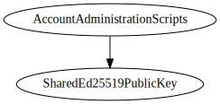
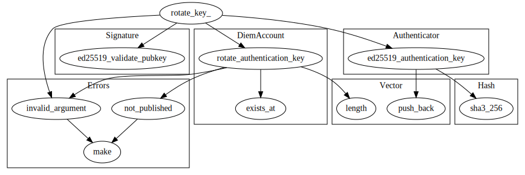
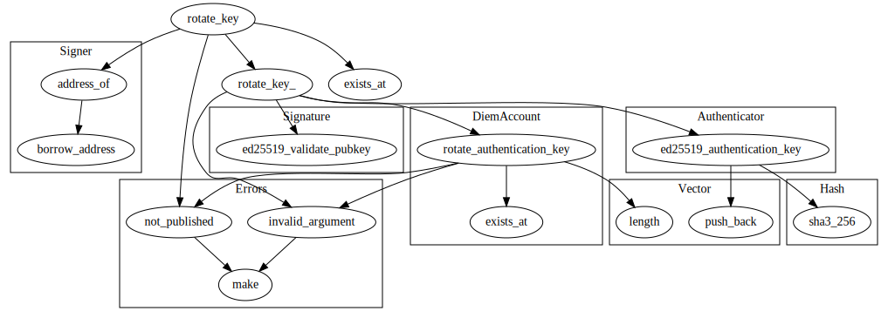

# Module `0x1::SharedEd25519PublicKey`

Each address that holds a <code><a href="SharedEd25519PublicKey.md#0x1_SharedEd25519PublicKey">SharedEd25519PublicKey</a></code> resource can rotate the public key stored in
this resource, but the account's authentication key will be updated in lockstep. This ensures
that the two keys always stay in sync.

-  [Resource `SharedEd25519PublicKey`](#0x1_SharedEd25519PublicKey_SharedEd25519PublicKey)
-  [Constants](#@Constants_0)
-  [Function `publish`](#0x1_SharedEd25519PublicKey_publish)
-  [Function `rotate_key_`](#0x1_SharedEd25519PublicKey_rotate_key_)
-  [Function `rotate_key`](#0x1_SharedEd25519PublicKey_rotate_key)
-  [Function `key`](#0x1_SharedEd25519PublicKey_key)
-  [Function `exists_at`](#0x1_SharedEd25519PublicKey_exists_at)
-  [Module Specification](#@Module_Specification_1)
    -  [Persistence](#@Persistence_2)

<pre><code><b>use</b> <a href="Authenticator.md#0x1_Authenticator">0x1::Authenticator</a>;
<b>use</b> <a href="DiemAccount.md#0x1_DiemAccount">0x1::DiemAccount</a>;
<b>use</b> <a href="../../../move-stdlib/docs/Errors.md#0x1_Errors">0x1::Errors</a>;
<b>use</b> <a href="Signature.md#0x1_Signature">0x1::Signature</a>;
<b>use</b> <a href="../../../move-stdlib/docs/Signer.md#0x1_Signer">0x1::Signer</a>;
</code></pre>

Show all the modules that "SharedEd25519PublicKey" depends on directly or indirectly

Show all the modules that depend on "SharedEd25519PublicKey" directly or indirectly

## Resource `SharedEd25519PublicKey`

A resource that forces the account associated with <code>rotation_cap</code> to use a ed25519
authentication key derived from <code>key</code>

<pre><code><b>resource</b> <b>struct</b> <a href="SharedEd25519PublicKey.md#0x1_SharedEd25519PublicKey">SharedEd25519PublicKey</a>
</code></pre>

Fields

<dl>
<dt>
<code>key: vector&lt;u8&gt;</code>
</dt>
<dd>
 32 byte ed25519 public key
</dd>
<dt>
<code>rotation_cap: <a href="DiemAccount.md#0x1_DiemAccount_KeyRotationCapability">DiemAccount::KeyRotationCapability</a></code>
</dt>
<dd>
 rotation capability for an account whose authentication key is always derived from <code>key</code>
</dd>
</dl>

## Constants

The shared ed25519 public key is not valid ed25519 public key

<pre><code><b>const</b> <a href="SharedEd25519PublicKey.md#0x1_SharedEd25519PublicKey_EMALFORMED_PUBLIC_KEY">EMALFORMED_PUBLIC_KEY</a>: u64 = 0;
</code></pre>

A shared ed25519 public key resource was not in the required state

<pre><code><b>const</b> <a href="SharedEd25519PublicKey.md#0x1_SharedEd25519PublicKey_ESHARED_KEY">ESHARED_KEY</a>: u64 = 1;
</code></pre>

## Function `publish`

(1) Rotate the authentication key of the sender to <code>key</code>
(2) Publish a resource containing a 32-byte ed25519 public key and the rotation capability
of the sender under the <code>account</code>'s address.
Aborts if the sender already has a <code><a href="SharedEd25519PublicKey.md#0x1_SharedEd25519PublicKey">SharedEd25519PublicKey</a></code> resource.
Aborts if the length of <code>new_public_key</code> is not 32.

<pre><code><b>public</b> <b>fun</b> <a href="SharedEd25519PublicKey.md#0x1_SharedEd25519PublicKey_publish">publish</a>(account: &signer, key: vector&lt;u8&gt;)
</code></pre>

Implementation

<pre><code><b>public</b> <b>fun</b> <a href="SharedEd25519PublicKey.md#0x1_SharedEd25519PublicKey_publish">publish</a>(account: &signer, key: vector&lt;u8&gt;) {
    <b>let</b> t = <a href="SharedEd25519PublicKey.md#0x1_SharedEd25519PublicKey">SharedEd25519PublicKey</a> {
        key: x"",
        rotation_cap: <a href="DiemAccount.md#0x1_DiemAccount_extract_key_rotation_capability">DiemAccount::extract_key_rotation_capability</a>(account)
    };
    <a href="SharedEd25519PublicKey.md#0x1_SharedEd25519PublicKey_rotate_key_">rotate_key_</a>(&<b>mut</b> t, key);
    <b>assert</b>(!<a href="SharedEd25519PublicKey.md#0x1_SharedEd25519PublicKey_exists_at">exists_at</a>(<a href="../../../move-stdlib/docs/Signer.md#0x1_Signer_address_of">Signer::address_of</a>(account)), <a href="../../../move-stdlib/docs/Errors.md#0x1_Errors_already_published">Errors::already_published</a>(<a href="SharedEd25519PublicKey.md#0x1_SharedEd25519PublicKey_ESHARED_KEY">ESHARED_KEY</a>));
    move_to(account, t);
}
</code></pre>

Specification

<pre><code><b>include</b> <a href="SharedEd25519PublicKey.md#0x1_SharedEd25519PublicKey_PublishAbortsIf">PublishAbortsIf</a>;
<b>include</b> <a href="SharedEd25519PublicKey.md#0x1_SharedEd25519PublicKey_PublishEnsures">PublishEnsures</a>;
</code></pre>

<pre><code><b>schema</b> <a href="SharedEd25519PublicKey.md#0x1_SharedEd25519PublicKey_PublishAbortsIf">PublishAbortsIf</a> {
    account: signer;
    key: vector&lt;u8&gt;;
    
    <b>let</b> addr = <a href="../../../move-stdlib/docs/Signer.md#0x1_Signer_spec_address_of">Signer::spec_address_of</a>(account);
    <b>include</b> <a href="DiemAccount.md#0x1_DiemAccount_ExtractKeyRotationCapabilityAbortsIf">DiemAccount::ExtractKeyRotationCapabilityAbortsIf</a>;
    <b>include</b> <a href="SharedEd25519PublicKey.md#0x1_SharedEd25519PublicKey_RotateKey_AbortsIf">RotateKey_AbortsIf</a> {
            shared_key: <a href="SharedEd25519PublicKey.md#0x1_SharedEd25519PublicKey">SharedEd25519PublicKey</a> {
                key: x"",
                rotation_cap: <a href="DiemAccount.md#0x1_DiemAccount_spec_get_key_rotation_cap">DiemAccount::spec_get_key_rotation_cap</a>(addr)
            },
            new_public_key: key
    };
    <b>aborts_if</b> <a href="SharedEd25519PublicKey.md#0x1_SharedEd25519PublicKey_exists_at">exists_at</a>(addr) <b>with</b> <a href="../../../move-stdlib/docs/Errors.md#0x1_Errors_ALREADY_PUBLISHED">Errors::ALREADY_PUBLISHED</a>;
}
</code></pre>

<pre><code><b>schema</b> <a href="SharedEd25519PublicKey.md#0x1_SharedEd25519PublicKey_PublishEnsures">PublishEnsures</a> {
    account: signer;
    key: vector&lt;u8&gt;;
    
    <b>let</b> addr = <a href="../../../move-stdlib/docs/Signer.md#0x1_Signer_spec_address_of">Signer::spec_address_of</a>(account);
    <b>ensures</b> <a href="SharedEd25519PublicKey.md#0x1_SharedEd25519PublicKey_exists_at">exists_at</a>(addr);
    <b>include</b> <a href="SharedEd25519PublicKey.md#0x1_SharedEd25519PublicKey_RotateKey_Ensures">RotateKey_Ensures</a> { shared_key: <b>global</b>&lt;<a href="SharedEd25519PublicKey.md#0x1_SharedEd25519PublicKey">SharedEd25519PublicKey</a>&gt;(addr), new_public_key: key};
}
</code></pre>

Show all the functions that "publish" calls

## Function `rotate_key_`

<pre><code><b>fun</b> <a href="SharedEd25519PublicKey.md#0x1_SharedEd25519PublicKey_rotate_key_">rotate_key_</a>(shared_key: &<b>mut</b> <a href="SharedEd25519PublicKey.md#0x1_SharedEd25519PublicKey_SharedEd25519PublicKey">SharedEd25519PublicKey::SharedEd25519PublicKey</a>, new_public_key: vector&lt;u8&gt;)
</code></pre>

Implementation

<pre><code><b>fun</b> <a href="SharedEd25519PublicKey.md#0x1_SharedEd25519PublicKey_rotate_key_">rotate_key_</a>(shared_key: &<b>mut</b> <a href="SharedEd25519PublicKey.md#0x1_SharedEd25519PublicKey">SharedEd25519PublicKey</a>, new_public_key: vector&lt;u8&gt;) {
    // Cryptographic check of <b>public</b> key validity
    <b>assert</b>(
        <a href="Signature.md#0x1_Signature_ed25519_validate_pubkey">Signature::ed25519_validate_pubkey</a>(<b>copy</b> new_public_key),
        <a href="../../../move-stdlib/docs/Errors.md#0x1_Errors_invalid_argument">Errors::invalid_argument</a>(<a href="SharedEd25519PublicKey.md#0x1_SharedEd25519PublicKey_EMALFORMED_PUBLIC_KEY">EMALFORMED_PUBLIC_KEY</a>)
    );
    <a href="DiemAccount.md#0x1_DiemAccount_rotate_authentication_key">DiemAccount::rotate_authentication_key</a>(
        &shared_key.rotation_cap,
        <a href="Authenticator.md#0x1_Authenticator_ed25519_authentication_key">Authenticator::ed25519_authentication_key</a>(<b>copy</b> new_public_key)
    );
    shared_key.key = new_public_key;
}
</code></pre>

Specification

<pre><code><b>include</b> <a href="SharedEd25519PublicKey.md#0x1_SharedEd25519PublicKey_RotateKey_AbortsIf">RotateKey_AbortsIf</a>;
<b>include</b> <a href="SharedEd25519PublicKey.md#0x1_SharedEd25519PublicKey_RotateKey_Ensures">RotateKey_Ensures</a>;
</code></pre>

<pre><code><b>schema</b> <a href="SharedEd25519PublicKey.md#0x1_SharedEd25519PublicKey_RotateKey_AbortsIf">RotateKey_AbortsIf</a> {
    shared_key: <a href="SharedEd25519PublicKey.md#0x1_SharedEd25519PublicKey">SharedEd25519PublicKey</a>;
    new_public_key: vector&lt;u8&gt;;
    <b>aborts_if</b> !<a href="Signature.md#0x1_Signature_ed25519_validate_pubkey">Signature::ed25519_validate_pubkey</a>(new_public_key) <b>with</b> <a href="../../../move-stdlib/docs/Errors.md#0x1_Errors_INVALID_ARGUMENT">Errors::INVALID_ARGUMENT</a>;
    <b>include</b> <a href="DiemAccount.md#0x1_DiemAccount_RotateAuthenticationKeyAbortsIf">DiemAccount::RotateAuthenticationKeyAbortsIf</a> {
        cap: shared_key.rotation_cap,
        new_authentication_key: <a href="Authenticator.md#0x1_Authenticator_spec_ed25519_authentication_key">Authenticator::spec_ed25519_authentication_key</a>(new_public_key)
    };
}
</code></pre>

<pre><code><b>schema</b> <a href="SharedEd25519PublicKey.md#0x1_SharedEd25519PublicKey_RotateKey_Ensures">RotateKey_Ensures</a> {
    shared_key: <a href="SharedEd25519PublicKey.md#0x1_SharedEd25519PublicKey">SharedEd25519PublicKey</a>;
    new_public_key: vector&lt;u8&gt;;
    <b>ensures</b> shared_key.key == new_public_key;
}
</code></pre>

Show all the functions that "rotate_key_" calls

## Function `rotate_key`

(1) rotate the public key stored <code>account</code>'s <code><a href="SharedEd25519PublicKey.md#0x1_SharedEd25519PublicKey">SharedEd25519PublicKey</a></code> resource to
<code>new_public_key</code>
(2) rotate the authentication key using the capability stored in the <code>account</code>'s
<code><a href="SharedEd25519PublicKey.md#0x1_SharedEd25519PublicKey">SharedEd25519PublicKey</a></code> to a new value derived from <code>new_public_key</code>
Aborts if the sender does not have a <code><a href="SharedEd25519PublicKey.md#0x1_SharedEd25519PublicKey">SharedEd25519PublicKey</a></code> resource.
Aborts if the length of <code>new_public_key</code> is not 32.

<pre><code><b>public</b> <b>fun</b> <a href="SharedEd25519PublicKey.md#0x1_SharedEd25519PublicKey_rotate_key">rotate_key</a>(account: &signer, new_public_key: vector&lt;u8&gt;)
</code></pre>

Implementation

<pre><code><b>public</b> <b>fun</b> <a href="SharedEd25519PublicKey.md#0x1_SharedEd25519PublicKey_rotate_key">rotate_key</a>(account: &signer, new_public_key: vector&lt;u8&gt;) <b>acquires</b> <a href="SharedEd25519PublicKey.md#0x1_SharedEd25519PublicKey">SharedEd25519PublicKey</a> {
    <b>let</b> addr = <a href="../../../move-stdlib/docs/Signer.md#0x1_Signer_address_of">Signer::address_of</a>(account);
    <b>assert</b>(<a href="SharedEd25519PublicKey.md#0x1_SharedEd25519PublicKey_exists_at">exists_at</a>(addr), <a href="../../../move-stdlib/docs/Errors.md#0x1_Errors_not_published">Errors::not_published</a>(<a href="SharedEd25519PublicKey.md#0x1_SharedEd25519PublicKey_ESHARED_KEY">ESHARED_KEY</a>));
    <a href="SharedEd25519PublicKey.md#0x1_SharedEd25519PublicKey_rotate_key_">rotate_key_</a>(borrow_global_mut&lt;<a href="SharedEd25519PublicKey.md#0x1_SharedEd25519PublicKey">SharedEd25519PublicKey</a>&gt;(addr), new_public_key);
}
</code></pre>

Specification

<pre><code><b>include</b> <a href="SharedEd25519PublicKey.md#0x1_SharedEd25519PublicKey_RotateKeyAbortsIf">RotateKeyAbortsIf</a>;
<b>include</b> <a href="SharedEd25519PublicKey.md#0x1_SharedEd25519PublicKey_RotateKeyEnsures">RotateKeyEnsures</a>;
</code></pre>

<pre><code><b>schema</b> <a href="SharedEd25519PublicKey.md#0x1_SharedEd25519PublicKey_RotateKeyAbortsIf">RotateKeyAbortsIf</a> {
    account: signer;
    new_public_key: vector&lt;u8&gt;;
    
    <b>let</b> addr = <a href="../../../move-stdlib/docs/Signer.md#0x1_Signer_spec_address_of">Signer::spec_address_of</a>(account);
    <b>aborts_if</b> !<a href="SharedEd25519PublicKey.md#0x1_SharedEd25519PublicKey_exists_at">exists_at</a>(addr) <b>with</b> <a href="../../../move-stdlib/docs/Errors.md#0x1_Errors_NOT_PUBLISHED">Errors::NOT_PUBLISHED</a>;
    <b>include</b> <a href="SharedEd25519PublicKey.md#0x1_SharedEd25519PublicKey_RotateKey_AbortsIf">RotateKey_AbortsIf</a> {shared_key: <b>global</b>&lt;<a href="SharedEd25519PublicKey.md#0x1_SharedEd25519PublicKey">SharedEd25519PublicKey</a>&gt;(addr)};
}
</code></pre>

<pre><code><b>schema</b> <a href="SharedEd25519PublicKey.md#0x1_SharedEd25519PublicKey_RotateKeyEnsures">RotateKeyEnsures</a> {
    account: signer;
    new_public_key: vector&lt;u8&gt;;
    
    <b>let</b> addr = <a href="../../../move-stdlib/docs/Signer.md#0x1_Signer_spec_address_of">Signer::spec_address_of</a>(account);
    <b>include</b> <a href="SharedEd25519PublicKey.md#0x1_SharedEd25519PublicKey_RotateKey_Ensures">RotateKey_Ensures</a> {shared_key: <b>global</b>&lt;<a href="SharedEd25519PublicKey.md#0x1_SharedEd25519PublicKey">SharedEd25519PublicKey</a>&gt;(addr)};
}
</code></pre>

Show all the functions that "rotate_key" calls

## Function `key`

Return the public key stored under <code>addr</code>.
Aborts if <code>addr</code> does not hold a <code><a href="SharedEd25519PublicKey.md#0x1_SharedEd25519PublicKey">SharedEd25519PublicKey</a></code> resource.

<pre><code><b>public</b> <b>fun</b> <a href="SharedEd25519PublicKey.md#0x1_SharedEd25519PublicKey_key">key</a>(addr: address): vector&lt;u8&gt;
</code></pre>

Implementation

<pre><code><b>public</b> <b>fun</b> <a href="SharedEd25519PublicKey.md#0x1_SharedEd25519PublicKey_key">key</a>(addr: address): vector&lt;u8&gt; <b>acquires</b> <a href="SharedEd25519PublicKey.md#0x1_SharedEd25519PublicKey">SharedEd25519PublicKey</a> {
    <b>assert</b>(<a href="SharedEd25519PublicKey.md#0x1_SharedEd25519PublicKey_exists_at">exists_at</a>(addr), <a href="../../../move-stdlib/docs/Errors.md#0x1_Errors_not_published">Errors::not_published</a>(<a href="SharedEd25519PublicKey.md#0x1_SharedEd25519PublicKey_ESHARED_KEY">ESHARED_KEY</a>));
    *&borrow_global&lt;<a href="SharedEd25519PublicKey.md#0x1_SharedEd25519PublicKey">SharedEd25519PublicKey</a>&gt;(addr).key
}
</code></pre>

Show all the functions that "key" calls

## Function `exists_at`

Returns true if <code>addr</code> holds a <code><a href="SharedEd25519PublicKey.md#0x1_SharedEd25519PublicKey">SharedEd25519PublicKey</a></code> resource.

<pre><code><b>public</b> <b>fun</b> <a href="SharedEd25519PublicKey.md#0x1_SharedEd25519PublicKey_exists_at">exists_at</a>(addr: address): bool
</code></pre>

Implementation

<pre><code><b>public</b> <b>fun</b> <a href="SharedEd25519PublicKey.md#0x1_SharedEd25519PublicKey_exists_at">exists_at</a>(addr: address): bool {
    <b>exists</b>&lt;<a href="SharedEd25519PublicKey.md#0x1_SharedEd25519PublicKey">SharedEd25519PublicKey</a>&gt;(addr)
}
</code></pre>

Show all the functions that "exists_at" calls

## Module Specification

### Persistence

<pre><code><b>invariant</b> <b>update</b> [<b>global</b>] <b>forall</b> addr: address <b>where</b> <b>old</b>(<b>exists</b>&lt;<a href="SharedEd25519PublicKey.md#0x1_SharedEd25519PublicKey">SharedEd25519PublicKey</a>&gt;(addr)):
    <b>exists</b>&lt;<a href="SharedEd25519PublicKey.md#0x1_SharedEd25519PublicKey">SharedEd25519PublicKey</a>&gt;(addr);
</code></pre>

[//]: # ("File containing references which can be used from documentation")
[ACCESS_CONTROL]: https://github.com/diem/dip/blob/main/dips/dip-2.md
[ROLE]: https://github.com/diem/dip/blob/main/dips/dip-2.md#roles
[PERMISSION]: https://github.com/diem/dip/blob/main/dips/dip-2.md#permissions
