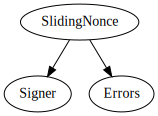
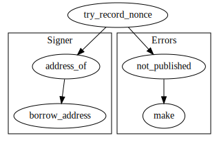

<a name="0x1_SlidingNonce"></a>

# Module `0x1::SlidingNonce`

Allows transactions to be executed out-of-order while ensuring that they are executed at most once.
Nonces are assigned to transactions off-chain by clients submitting the transactions.
It maintains a sliding window bitvector of 128 flags.  A flag of 0 indicates that the transaction
with that nonce has not yet been executed.
When nonce X is recorded, all transactions with nonces lower then X-128 will abort.


-  [Resource `SlidingNonce`](#0x1_SlidingNonce_SlidingNonce)
-  [Constants](#@Constants_0)
-  [Function `record_nonce_or_abort`](#0x1_SlidingNonce_record_nonce_or_abort)
-  [Function `try_record_nonce`](#0x1_SlidingNonce_try_record_nonce)
    -  [Explanation of the Algorithm](#@Explanation_of_the_Algorithm_1)
    -  [Some Examples](#@Some_Examples_2)
    -  [Example 1:](#@Example_1:_3)
    -  [Example 2:](#@Example_2:_4)
    -  [Example 3:](#@Example_3:_5)
-  [Function `publish`](#0x1_SlidingNonce_publish)
-  [Module Specification](#@Module_Specification_6)


<pre><code><b>use</b> <a href="../../../move-stdlib/docs/Errors.md#0x1_Errors">0x1::Errors</a>;
<b>use</b> <a href="../../../move-stdlib/docs/Signer.md#0x1_Signer">0x1::Signer</a>;
</code></pre>


<details>
<summary>Show all the modules that "SlidingNonce" depends on directly or indirectly</summary>





</details>

<details>
<summary>Show all the modules that depend on "SlidingNonce" directly or indirectly</summary>


</details>

<a name="0x1_SlidingNonce_SlidingNonce"></a>

## Resource `SlidingNonce`


<pre><code><b>resource</b> <b>struct</b> <a href="SlidingNonce.md#0x1_SlidingNonce">SlidingNonce</a>
</code></pre>


<details>
<summary>Fields</summary>


<dl>
<dt>
<code>min_nonce: u64</code>
</dt>
<dd>
 Minimum nonce in sliding window. All transactions with smaller
 nonces will be automatically rejected, since the window cannot
 tell whether they have been executed or not.
</dd>
<dt>
<code>nonce_mask: u128</code>
</dt>
<dd>
 Bit-vector of window of nonce values
</dd>
</dl>


</details>

<a name="@Constants_0"></a>

## Constants


<a name="0x1_SlidingNonce_ENONCE_ALREADY_PUBLISHED"></a>

The sliding nonce resource was already published


<pre><code><b>const</b> <a href="SlidingNonce.md#0x1_SlidingNonce_ENONCE_ALREADY_PUBLISHED">ENONCE_ALREADY_PUBLISHED</a>: u64 = 4;
</code></pre>


<a name="0x1_SlidingNonce_ENONCE_ALREADY_RECORDED"></a>

The nonce was already recorded previously


<pre><code><b>const</b> <a href="SlidingNonce.md#0x1_SlidingNonce_ENONCE_ALREADY_RECORDED">ENONCE_ALREADY_RECORDED</a>: u64 = 3;
</code></pre>


<a name="0x1_SlidingNonce_ENONCE_TOO_NEW"></a>

The nonce is too large - this protects against nonce exhaustion


<pre><code><b>const</b> <a href="SlidingNonce.md#0x1_SlidingNonce_ENONCE_TOO_NEW">ENONCE_TOO_NEW</a>: u64 = 2;
</code></pre>


<a name="0x1_SlidingNonce_ENONCE_TOO_OLD"></a>

The nonce aborted because it's too old (nonce smaller than <code>min_nonce</code>)


<pre><code><b>const</b> <a href="SlidingNonce.md#0x1_SlidingNonce_ENONCE_TOO_OLD">ENONCE_TOO_OLD</a>: u64 = 1;
</code></pre>


<a name="0x1_SlidingNonce_ESLIDING_NONCE"></a>

The <code><a href="SlidingNonce.md#0x1_SlidingNonce">SlidingNonce</a></code> resource is in an invalid state


<pre><code><b>const</b> <a href="SlidingNonce.md#0x1_SlidingNonce_ESLIDING_NONCE">ESLIDING_NONCE</a>: u64 = 0;
</code></pre>


<a name="0x1_SlidingNonce_NONCE_MASK_SIZE"></a>

Size of SlidingNonce::nonce_mask in bits.


<pre><code><b>const</b> <a href="SlidingNonce.md#0x1_SlidingNonce_NONCE_MASK_SIZE">NONCE_MASK_SIZE</a>: u64 = 128;
</code></pre>


<a name="0x1_SlidingNonce_record_nonce_or_abort"></a>

## Function `record_nonce_or_abort`

Calls <code>try_record_nonce</code> and aborts transaction if returned code is non-0


<pre><code><b>public</b> <b>fun</b> <a href="SlidingNonce.md#0x1_SlidingNonce_record_nonce_or_abort">record_nonce_or_abort</a>(account: &signer, seq_nonce: u64)
</code></pre>


<details>
<summary>Implementation</summary>


<pre><code><b>public</b> <b>fun</b> <a href="SlidingNonce.md#0x1_SlidingNonce_record_nonce_or_abort">record_nonce_or_abort</a>(account: &signer, seq_nonce: u64) <b>acquires</b> <a href="SlidingNonce.md#0x1_SlidingNonce">SlidingNonce</a> {
    <b>let</b> code = <a href="SlidingNonce.md#0x1_SlidingNonce_try_record_nonce">try_record_nonce</a>(account, seq_nonce);
    <b>assert</b>(code == 0, <a href="../../../move-stdlib/docs/Errors.md#0x1_Errors_invalid_argument">Errors::invalid_argument</a>(code));
}
</code></pre>


</details>

<details>
<summary>Specification</summary>


<pre><code><b>include</b> <a href="SlidingNonce.md#0x1_SlidingNonce_RecordNonceAbortsIf">RecordNonceAbortsIf</a>;
</code></pre>


<a name="0x1_SlidingNonce_RecordNonceAbortsIf"></a>


<pre><code><b>schema</b> <a href="SlidingNonce.md#0x1_SlidingNonce_RecordNonceAbortsIf">RecordNonceAbortsIf</a> {
    account: signer;
    seq_nonce: u64;
    <b>aborts_if</b> !<b>exists</b>&lt;<a href="SlidingNonce.md#0x1_SlidingNonce">SlidingNonce</a>&gt;(<a href="../../../move-stdlib/docs/Signer.md#0x1_Signer_spec_address_of">Signer::spec_address_of</a>(account)) <b>with</b> <a href="../../../move-stdlib/docs/Errors.md#0x1_Errors_NOT_PUBLISHED">Errors::NOT_PUBLISHED</a>;
    <b>aborts_if</b> <a href="SlidingNonce.md#0x1_SlidingNonce_spec_try_record_nonce">spec_try_record_nonce</a>(account, seq_nonce) != 0 <b>with</b> <a href="../../../move-stdlib/docs/Errors.md#0x1_Errors_INVALID_ARGUMENT">Errors::INVALID_ARGUMENT</a>;
}
</code></pre>


</details>

<details>
<summary>Show all the functions that "record_nonce_or_abort" calls</summary>


</details>

<a name="0x1_SlidingNonce_try_record_nonce"></a>

## Function `try_record_nonce`


<a name="@Explanation_of_the_Algorithm_1"></a>

### Explanation of the Algorithm


We have an "infinite" bitvector. The <code>min_nonce</code> tells us the starting
index of the window. The window size is the size of the bitmask we can
represent in a 128-bit wide bitmap. The <code>seq_nonce</code> that is sent represents
setting a bit at index <code>seq_nonce</code> in this infinite bitvector. Because of
this, if the same <code>seq_nonce</code> is passed in multiple times, that bit will be
set, and we can signal an error. In order to represent
the <code>seq_nonce</code> the window we are looking at must be shifted so that
<code>seq_nonce</code> lies within that 128-bit window and, since the <code>min_nonce</code>
represents the left-hand-side of this window, it must be increased to be no
less than <code>seq_nonce - 128</code>.

The process of shifting window will invalidate other transactions that
have a <code>seq_nonce</code> number that are to the "left" of this window (i.e., less
than <code>min_nonce</code>) since it cannot be represented in the current window, and the
window can only move forward and never backwards.

In order to prevent shifting this window over too much at any one time, a
<code>jump_limit</code> is imposed. If a <code>seq_nonce</code> is provided that would cause the
<code>min_nonce</code> to need to be increased by more than the <code>jump_limit</code> this will
cause a failure.


<a name="@Some_Examples_2"></a>

### Some Examples


Let's say we start out with a clean <code><a href="SlidingNonce.md#0x1_SlidingNonce">SlidingNonce</a></code> published under <code>account</code>,
this will look like this:
```
000000000000000000...00000000000000000000000000000...
^             ...                ^
|_____________...________________|
min_nonce = 0             min_nonce + NONCE_MASK_SIZE = 0 + 64 = 64
```


<a name="@Example_1:_3"></a>

### Example 1:


Let's see what happens when we call<code><a href="SlidingNonce.md#0x1_SlidingNonce_try_record_nonce">SlidingNonce::try_record_nonce</a>(account, 8)</code>:

1. Determine the bit position w.r.t. the current window:
```
bit_pos = 8 - min_nonce ~~~ 8 - 0 = 8
```
2. See if the bit position that was calculated is not within the current window:
```
bit_pos >= NONCE_MASK_SIZE ~~~ 8 >= 128 = FALSE
```
3. <code>bit_pos</code> is in window, so set the 8'th bit in the window:
```
000000010000000000...00000000000000000000000000000...
^             ...                ^
|_____________...________________|
min_nonce = 0             min_nonce + NONCE_MASK_SIZE = 0 + 64 = 64
```


<a name="@Example_2:_4"></a>

### Example 2:


Let's see what happens when we call <code><a href="SlidingNonce.md#0x1_SlidingNonce_try_record_nonce">SlidingNonce::try_record_nonce</a>(account, 129)</code>:

1. Figure out the bit position w.r.t. the current window:
```
bit_pos = 129 - min_nonce ~~~ 129 - 0 = 129
```
2. See if bit position calculated is not within the current window starting at <code>min_nonce</code>:
```
bit_pos >= NONCE_MASK_SIZE ~~~ 129 >= 128 = TRUE
```
3. <code>bit_pos</code> is outside of the current window. So we need to shift the window over. Now calculate the amount that
the window needs to be shifted over (i.e., the amount that <code>min_nonce</code> needs to be increased by) so that
<code>seq_nonce</code> lies within the <code><a href="SlidingNonce.md#0x1_SlidingNonce_NONCE_MASK_SIZE">NONCE_MASK_SIZE</a></code> window starting at <code>min_nonce</code>.
3a. Calculate the amount that the window needs to be shifted for <code>bit_pos</code> to lie within it:
```
shift = bit_pos - NONCE_MASK_SIZE + 1 ~~~ 129 - 128 + 1 = 2
```
3b. See if there is no overlap between the new window that we need to shift to and the old window:
```
shift >= NONCE_MASK_SIZE ~~~ 2 >= 128 = FALSE
```
3c. Since there is an overlap between the new window that we need to shift to and the previous
window, shift the window over, but keep the current set bits in the overlapping part of the window:
```
nonce_mask = nonce_mask >> shift; min_nonce += shift;
```
4. Now that the window has been shifted over so that the <code>seq_nonce</code> index lies within the new window we
recompute the <code>bit_pos</code> w.r.t. to it (recall <code>min_nonce</code> was updated):
```
bit_pos = seq - min_nonce ~~~ 129 - 2 = 127
```
5. We set the bit_pos position bit within the new window:
```
00000001000000000000000...000000000000000000000000000000000000000000010...
^               ...                                           ^^
|               ...                                           ||
|               ...                                 new_set_bit|
|_______________...____________________________________________|
min_nonce = 2                            min_nonce + NONCE_MASK_SIZE = 2 + 128 = 130
```


<a name="@Example_3:_5"></a>

### Example 3:


Let's see what happens when we call <code><a href="SlidingNonce.md#0x1_SlidingNonce_try_record_nonce">SlidingNonce::try_record_nonce</a>(account, 400)</code>:

1. Figure out the bit position w.r.t. the current window:
```
bit_pos = 400 - min_nonce ~~~ 400 - 2 = 398
```
2. See if bit position calculated is not within the current window:
```
bit_pos >= NONCE_MASK_SIZE ~~~ 398 >= 128 = TRUE
```
3. <code>bit_pos</code> is out of the window. Now calculate the amount that
the window needs to be shifted over (i.e., that <code>min_nonce</code> needs to be incremented) so
<code>seq_nonce</code> lies within the <code><a href="SlidingNonce.md#0x1_SlidingNonce_NONCE_MASK_SIZE">NONCE_MASK_SIZE</a></code> window starting at min_nonce.
3a. Calculate the amount that the window needs to be shifted for <code>bit_pos</code> to lie within it:
```
shift = bit_pos - NONCE_MASK_SIZE + 1 ~~~ 398 - 128 + 1 = 271
```
3b. See if there is no overlap between the new window that we need to shift to and the old window:
```
shift >= NONCE_MASK_SIZE ~~~ 271 >= 128 = TRUE
```
3c. Since there is no overlap between the new window that we need to shift to and the previous
window we zero out the bitmap, and update the <code>min_nonce</code> to start at the out-of-range <code>seq_nonce</code>:
```
nonce_mask = 0; min_nonce = seq_nonce + 1 - NONCE_MASK_SIZE = 273;
```
4. Now that the window has been shifted over so that the <code>seq_nonce</code> index lies within the window we
recompute the bit_pos:
```
bit_pos = seq_nonce - min_nonce ~~~ 400 - 273 = 127
```
5. We set the bit_pos position bit within the new window:
```
...00000001000000000000000...000000000000000000000000000000000000000000010...
^               ...                                           ^^
|               ...                                           ||
|               ...                                 new_set_bit|
|_______________...____________________________________________|
min_nonce = 273                          min_nonce + NONCE_MASK_SIZE = 273 + 128 = 401
```
Tries to record this nonce in the account.
Returns 0 if a nonce was recorded and non-0 otherwise


<pre><code><b>public</b> <b>fun</b> <a href="SlidingNonce.md#0x1_SlidingNonce_try_record_nonce">try_record_nonce</a>(account: &signer, seq_nonce: u64): u64
</code></pre>


<details>
<summary>Implementation</summary>


<pre><code><b>public</b> <b>fun</b> <a href="SlidingNonce.md#0x1_SlidingNonce_try_record_nonce">try_record_nonce</a>(account: &signer, seq_nonce: u64): u64 <b>acquires</b> <a href="SlidingNonce.md#0x1_SlidingNonce">SlidingNonce</a> {
    <b>if</b> (seq_nonce == 0) {
        <b>return</b> 0
    };
    <b>assert</b>(<b>exists</b>&lt;<a href="SlidingNonce.md#0x1_SlidingNonce">SlidingNonce</a>&gt;(<a href="../../../move-stdlib/docs/Signer.md#0x1_Signer_address_of">Signer::address_of</a>(account)), <a href="../../../move-stdlib/docs/Errors.md#0x1_Errors_not_published">Errors::not_published</a>(<a href="SlidingNonce.md#0x1_SlidingNonce_ESLIDING_NONCE">ESLIDING_NONCE</a>));
    <b>let</b> t = borrow_global_mut&lt;<a href="SlidingNonce.md#0x1_SlidingNonce">SlidingNonce</a>&gt;(<a href="../../../move-stdlib/docs/Signer.md#0x1_Signer_address_of">Signer::address_of</a>(account));
    // The `seq_nonce` is outside the current window <b>to</b> the "left" and is
    // no longer valid since we can't shift the window back.
    <b>if</b> (t.min_nonce &gt; seq_nonce) {
        <b>return</b> <a href="SlidingNonce.md#0x1_SlidingNonce_ENONCE_TOO_OLD">ENONCE_TOO_OLD</a>
    };
    // Don't allow giant leaps in nonce <b>to</b> protect against nonce exhaustion
    // If we try <b>to</b> <b>move</b> a window by more than this amount, we will fail.
    <b>let</b> jump_limit = 10000;
    <b>if</b> (t.min_nonce + jump_limit &lt;= seq_nonce) {
        <b>return</b> <a href="SlidingNonce.md#0x1_SlidingNonce_ENONCE_TOO_NEW">ENONCE_TOO_NEW</a>
    };
    // Calculate The bit position in the window that will be set in our window
    <b>let</b> bit_pos = seq_nonce - t.min_nonce;

    // See <b>if</b> the bit position that we want <b>to</b> set lies outside the current
    // window that we have under the current `min_nonce`.
    <b>if</b> (bit_pos &gt;= <a href="SlidingNonce.md#0x1_SlidingNonce_NONCE_MASK_SIZE">NONCE_MASK_SIZE</a>) {
        // Determine how much we need <b>to</b> shift the current window over (<b>to</b>
        // the "right") so that `bit_pos` lies within the new window.
        <b>let</b> shift = (bit_pos - <a href="SlidingNonce.md#0x1_SlidingNonce_NONCE_MASK_SIZE">NONCE_MASK_SIZE</a> + 1);

        // If we are shifting the window over by more than one window's width
        // reset the bits in the window, and <b>update</b> the
        // new start of the `min_nonce` so that `seq_nonce` is the
        // right-most bit in the new window.
        <b>if</b>(shift &gt;= <a href="SlidingNonce.md#0x1_SlidingNonce_NONCE_MASK_SIZE">NONCE_MASK_SIZE</a>) {
            t.nonce_mask = 0;
            t.min_nonce = seq_nonce + 1 - <a href="SlidingNonce.md#0x1_SlidingNonce_NONCE_MASK_SIZE">NONCE_MASK_SIZE</a>;
        } <b>else</b> {
            // We are shifting the window over by less than a windows width,
            // so we need <b>to</b> keep the current set bits in the window
            t.nonce_mask = t.nonce_mask &gt;&gt; (shift <b>as</b> u8);
            t.min_nonce = t.min_nonce + shift;
        }
    };
    // The window has been (possibly) shifted over so that `seq_nonce` lies
    // within the window. Recompute the bit positition that needs <b>to</b> be set
    // within the (possibly) new window.
    <b>let</b> bit_pos = seq_nonce - t.min_nonce;
    <b>let</b> set = 1u128 &lt;&lt; (bit_pos <b>as</b> u8);
    // The bit was already set, so <b>return</b> an error.
    <b>if</b> (t.nonce_mask & set != 0) {
        <b>return</b> <a href="SlidingNonce.md#0x1_SlidingNonce_ENONCE_ALREADY_RECORDED">ENONCE_ALREADY_RECORDED</a>
    };
    t.nonce_mask = t.nonce_mask | set;
    0
}
</code></pre>


</details>

<details>
<summary>Specification</summary>


It is currently assumed that this function raises no arithmetic overflow/underflow.
>Note: Verification is turned off. For verifying callers, this is effectively abstracted into a function
that returns arbitrary results because <code>spec_try_record_nonce</code> is uninterpreted.


<pre><code><b>pragma</b> opaque, verify = <b>false</b>;
<b>ensures</b> result == <a href="SlidingNonce.md#0x1_SlidingNonce_spec_try_record_nonce">spec_try_record_nonce</a>(account, seq_nonce);
<b>aborts_if</b> !<b>exists</b>&lt;<a href="SlidingNonce.md#0x1_SlidingNonce">SlidingNonce</a>&gt;(<a href="../../../move-stdlib/docs/Signer.md#0x1_Signer_spec_address_of">Signer::spec_address_of</a>(account)) <b>with</b> <a href="../../../move-stdlib/docs/Errors.md#0x1_Errors_NOT_PUBLISHED">Errors::NOT_PUBLISHED</a>;
<b>modifies</b> <b>global</b>&lt;<a href="SlidingNonce.md#0x1_SlidingNonce">SlidingNonce</a>&gt;(<a href="../../../move-stdlib/docs/Signer.md#0x1_Signer_spec_address_of">Signer::spec_address_of</a>(account));
</code></pre>


Specification version of <code><a href="SlidingNonce.md#0x1_SlidingNonce_try_record_nonce">Self::try_record_nonce</a></code>.


<a name="0x1_SlidingNonce_spec_try_record_nonce"></a>


<pre><code><b>define</b> <a href="SlidingNonce.md#0x1_SlidingNonce_spec_try_record_nonce">spec_try_record_nonce</a>(account: signer, seq_nonce: u64): u64;
</code></pre>


</details>

<details>
<summary>Show all the functions that "try_record_nonce" calls</summary>





</details>

<a name="0x1_SlidingNonce_publish"></a>

## Function `publish`

Publishes nonce resource for <code>account</code>
This is required before other functions in this module can be called for <code>account</code>


<pre><code><b>public</b> <b>fun</b> <a href="SlidingNonce.md#0x1_SlidingNonce_publish">publish</a>(account: &signer)
</code></pre>


<details>
<summary>Implementation</summary>


<pre><code><b>public</b> <b>fun</b> <a href="SlidingNonce.md#0x1_SlidingNonce_publish">publish</a>(account: &signer) {
    <b>assert</b>(!<b>exists</b>&lt;<a href="SlidingNonce.md#0x1_SlidingNonce">SlidingNonce</a>&gt;(<a href="../../../move-stdlib/docs/Signer.md#0x1_Signer_address_of">Signer::address_of</a>(account)), <a href="../../../move-stdlib/docs/Errors.md#0x1_Errors_already_published">Errors::already_published</a>(<a href="SlidingNonce.md#0x1_SlidingNonce_ENONCE_ALREADY_PUBLISHED">ENONCE_ALREADY_PUBLISHED</a>));
    move_to(account, <a href="SlidingNonce.md#0x1_SlidingNonce">SlidingNonce</a> {  min_nonce: 0, nonce_mask: 0 });
}
</code></pre>


</details>

<details>
<summary>Specification</summary>


<pre><code><b>pragma</b> opaque;
<b>modifies</b> <b>global</b>&lt;<a href="SlidingNonce.md#0x1_SlidingNonce">SlidingNonce</a>&gt;(<a href="../../../move-stdlib/docs/Signer.md#0x1_Signer_spec_address_of">Signer::spec_address_of</a>(account));
<b>aborts_if</b> <b>exists</b>&lt;<a href="SlidingNonce.md#0x1_SlidingNonce">SlidingNonce</a>&gt;(<a href="../../../move-stdlib/docs/Signer.md#0x1_Signer_spec_address_of">Signer::spec_address_of</a>(account)) <b>with</b> <a href="../../../move-stdlib/docs/Errors.md#0x1_Errors_ALREADY_PUBLISHED">Errors::ALREADY_PUBLISHED</a>;
<b>ensures</b> <b>exists</b>&lt;<a href="SlidingNonce.md#0x1_SlidingNonce">SlidingNonce</a>&gt;(<a href="../../../move-stdlib/docs/Signer.md#0x1_Signer_spec_address_of">Signer::spec_address_of</a>(account));
</code></pre>


</details>

<details>
<summary>Show all the functions that "publish" calls</summary>


</details>

<a name="@Module_Specification_6"></a>

## Module Specification


Sliding nonces are initialized at Diem root and treasury compliance addresses


<pre><code><b>invariant</b> [<b>global</b>] <a href="DiemTimestamp.md#0x1_DiemTimestamp_is_operating">DiemTimestamp::is_operating</a>()
    ==&gt; <b>exists</b>&lt;<a href="SlidingNonce.md#0x1_SlidingNonce">SlidingNonce</a>&gt;(<a href="CoreAddresses.md#0x1_CoreAddresses_DIEM_ROOT_ADDRESS">CoreAddresses::DIEM_ROOT_ADDRESS</a>());
<b>invariant</b> [<b>global</b>] <a href="DiemTimestamp.md#0x1_DiemTimestamp_is_operating">DiemTimestamp::is_operating</a>()
    ==&gt; <b>exists</b>&lt;<a href="SlidingNonce.md#0x1_SlidingNonce">SlidingNonce</a>&gt;(<a href="CoreAddresses.md#0x1_CoreAddresses_TREASURY_COMPLIANCE_ADDRESS">CoreAddresses::TREASURY_COMPLIANCE_ADDRESS</a>());
</code></pre>


[//]: # ("File containing references which can be used from documentation")
[ACCESS_CONTROL]: https://github.com/diem/dip/blob/main/dips/dip-2.md
[ROLE]: https://github.com/diem/dip/blob/main/dips/dip-2.md#roles
[PERMISSION]: https://github.com/diem/dip/blob/main/dips/dip-2.md#permissions
