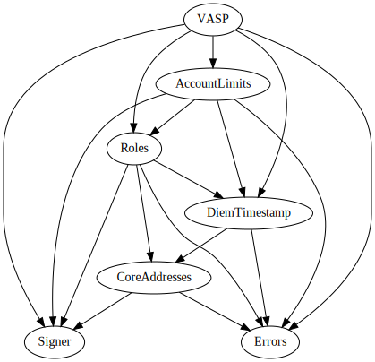
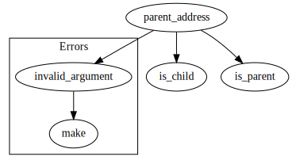
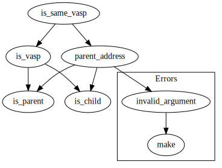

# Module `0x1::VASP`

A VASP is one type of balance-holding account on the blockchain. VASPs from a two-layer
hierarchy.  The main account, called a "parent VASP" and a collection of "child VASP"s.
This module provides functions to manage VASP accounts.

-  [Resource `ParentVASP`](#0x1_VASP_ParentVASP)
-  [Resource `ChildVASP`](#0x1_VASP_ChildVASP)
-  [Constants](#@Constants_0)
-  [Function `publish_parent_vasp_credential`](#0x1_VASP_publish_parent_vasp_credential)
-  [Function `publish_child_vasp_credential`](#0x1_VASP_publish_child_vasp_credential)
-  [Function `has_account_limits`](#0x1_VASP_has_account_limits)
-  [Function `parent_address`](#0x1_VASP_parent_address)
-  [Function `is_parent`](#0x1_VASP_is_parent)
-  [Function `is_child`](#0x1_VASP_is_child)
-  [Function `is_vasp`](#0x1_VASP_is_vasp)
-  [Function `is_same_vasp`](#0x1_VASP_is_same_vasp)
-  [Function `num_children`](#0x1_VASP_num_children)
-  [Module Specification](#@Module_Specification_1)
    -  [Persistence of parent and child VASPs](#@Persistence_of_parent_and_child_VASPs_2)
    -  [Existence of Parents](#@Existence_of_Parents_3)
    -  [Creation of Child VASPs](#@Creation_of_Child_VASPs_4)
    -  [Immutability of Parent Address](#@Immutability_of_Parent_Address_5)

<pre><code><b>use</b> <a href="AccountLimits.md#0x1_AccountLimits">0x1::AccountLimits</a>;
<b>use</b> <a href="DiemTimestamp.md#0x1_DiemTimestamp">0x1::DiemTimestamp</a>;
<b>use</b> <a href="../../../move-stdlib/docs/Errors.md#0x1_Errors">0x1::Errors</a>;
<b>use</b> <a href="Roles.md#0x1_Roles">0x1::Roles</a>;
<b>use</b> <a href="../../../move-stdlib/docs/Signer.md#0x1_Signer">0x1::Signer</a>;
</code></pre>

Show all the modules that "VASP" depends on directly or indirectly

Show all the modules that depend on "VASP" directly or indirectly

## Resource `ParentVASP`

Each VASP has a unique root account that holds a <code><a href="VASP.md#0x1_VASP_ParentVASP">ParentVASP</a></code> resource. This resource holds
the VASP's globally unique name and all of the metadata that other VASPs need to perform
off-chain protocols with this one.

<pre><code><b>resource</b> <b>struct</b> <a href="VASP.md#0x1_VASP_ParentVASP">ParentVASP</a>
</code></pre>

Fields

<dl>
<dt>
<code>num_children: u64</code>
</dt>
<dd>
 Number of child accounts this parent has created.
</dd>
</dl>

## Resource `ChildVASP`

A resource that represents a child account of the parent VASP account at <code>parent_vasp_addr</code>

<pre><code><b>resource</b> <b>struct</b> <a href="VASP.md#0x1_VASP_ChildVASP">ChildVASP</a>
</code></pre>

Fields

<dl>
<dt>
<code>parent_vasp_addr: address</code>
</dt>
<dd>

</dd>
</dl>

## Constants

The creating account must be a Parent VASP account

<pre><code><b>const</b> <a href="VASP.md#0x1_VASP_ENOT_A_PARENT_VASP">ENOT_A_PARENT_VASP</a>: u64 = 3;
</code></pre>

The account must be a Parent or Child VASP account

<pre><code><b>const</b> <a href="VASP.md#0x1_VASP_ENOT_A_VASP">ENOT_A_VASP</a>: u64 = 2;
</code></pre>

The <code><a href="VASP.md#0x1_VASP_ParentVASP">ParentVASP</a></code> or <code><a href="VASP.md#0x1_VASP_ChildVASP">ChildVASP</a></code> resources are not in the required state

<pre><code><b>const</b> <a href="VASP.md#0x1_VASP_EPARENT_OR_CHILD_VASP">EPARENT_OR_CHILD_VASP</a>: u64 = 0;
</code></pre>

The creation of a new Child VASP account would exceed the number of children permitted for a VASP

<pre><code><b>const</b> <a href="VASP.md#0x1_VASP_ETOO_MANY_CHILDREN">ETOO_MANY_CHILDREN</a>: u64 = 1;
</code></pre>

Maximum number of child accounts that can be created by a single ParentVASP

<pre><code><b>const</b> <a href="VASP.md#0x1_VASP_MAX_CHILD_ACCOUNTS">MAX_CHILD_ACCOUNTS</a>: u64 = 65536;
</code></pre>

## Function `publish_parent_vasp_credential`

Create a new <code><a href="VASP.md#0x1_VASP_ParentVASP">ParentVASP</a></code> resource under <code>vasp</code>
Aborts if <code>dr_account</code> is not the diem root account,
or if there is already a VASP (child or parent) at this account.

<pre><code><b>public</b> <b>fun</b> <a href="VASP.md#0x1_VASP_publish_parent_vasp_credential">publish_parent_vasp_credential</a>(vasp: &signer, tc_account: &signer)
</code></pre>

Implementation

<pre><code><b>public</b> <b>fun</b> <a href="VASP.md#0x1_VASP_publish_parent_vasp_credential">publish_parent_vasp_credential</a>(vasp: &signer, tc_account: &signer) {
    <a href="DiemTimestamp.md#0x1_DiemTimestamp_assert_operating">DiemTimestamp::assert_operating</a>();
    <a href="Roles.md#0x1_Roles_assert_treasury_compliance">Roles::assert_treasury_compliance</a>(tc_account);
    <a href="Roles.md#0x1_Roles_assert_parent_vasp_role">Roles::assert_parent_vasp_role</a>(vasp);
    <b>let</b> vasp_addr = <a href="../../../move-stdlib/docs/Signer.md#0x1_Signer_address_of">Signer::address_of</a>(vasp);
    <b>assert</b>(!<a href="VASP.md#0x1_VASP_is_vasp">is_vasp</a>(vasp_addr), <a href="../../../move-stdlib/docs/Errors.md#0x1_Errors_already_published">Errors::already_published</a>(<a href="VASP.md#0x1_VASP_EPARENT_OR_CHILD_VASP">EPARENT_OR_CHILD_VASP</a>));
    move_to(vasp, <a href="VASP.md#0x1_VASP_ParentVASP">ParentVASP</a> { num_children: 0 });
}
</code></pre>

Specification

<pre><code><b>include</b> <a href="DiemTimestamp.md#0x1_DiemTimestamp_AbortsIfNotOperating">DiemTimestamp::AbortsIfNotOperating</a>;
<b>include</b> <a href="Roles.md#0x1_Roles_AbortsIfNotTreasuryCompliance">Roles::AbortsIfNotTreasuryCompliance</a>{account: tc_account};
<b>include</b> <a href="Roles.md#0x1_Roles_AbortsIfNotParentVasp">Roles::AbortsIfNotParentVasp</a>{account: vasp};

<b>let</b> vasp_addr = <a href="../../../move-stdlib/docs/Signer.md#0x1_Signer_spec_address_of">Signer::spec_address_of</a>(vasp);
<b>aborts_if</b> <a href="VASP.md#0x1_VASP_is_vasp">is_vasp</a>(vasp_addr) <b>with</b> <a href="../../../move-stdlib/docs/Errors.md#0x1_Errors_ALREADY_PUBLISHED">Errors::ALREADY_PUBLISHED</a>;
<b>include</b> <a href="VASP.md#0x1_VASP_PublishParentVASPEnsures">PublishParentVASPEnsures</a>{vasp_addr: vasp_addr};
</code></pre>

<pre><code><b>schema</b> <a href="VASP.md#0x1_VASP_PublishParentVASPEnsures">PublishParentVASPEnsures</a> {
    vasp_addr: address;
    <b>ensures</b> <a href="VASP.md#0x1_VASP_is_parent">is_parent</a>(vasp_addr);
    <b>ensures</b> <a href="VASP.md#0x1_VASP_spec_num_children">spec_num_children</a>(vasp_addr) == 0;
}
</code></pre>

Show all the functions that "publish_parent_vasp_credential" calls

## Function `publish_child_vasp_credential`

Create a child VASP resource for the <code>parent</code>
Aborts if <code>parent</code> is not a ParentVASP

<pre><code><b>public</b> <b>fun</b> <a href="VASP.md#0x1_VASP_publish_child_vasp_credential">publish_child_vasp_credential</a>(parent: &signer, child: &signer)
</code></pre>

Implementation

<pre><code><b>public</b> <b>fun</b> <a href="VASP.md#0x1_VASP_publish_child_vasp_credential">publish_child_vasp_credential</a>(
    parent: &signer,
    child: &signer,
) <b>acquires</b> <a href="VASP.md#0x1_VASP_ParentVASP">ParentVASP</a> {
    <a href="Roles.md#0x1_Roles_assert_parent_vasp_role">Roles::assert_parent_vasp_role</a>(parent);
    <a href="Roles.md#0x1_Roles_assert_child_vasp_role">Roles::assert_child_vasp_role</a>(child);
    <b>let</b> child_vasp_addr = <a href="../../../move-stdlib/docs/Signer.md#0x1_Signer_address_of">Signer::address_of</a>(child);
    <b>assert</b>(!<a href="VASP.md#0x1_VASP_is_vasp">is_vasp</a>(child_vasp_addr), <a href="../../../move-stdlib/docs/Errors.md#0x1_Errors_already_published">Errors::already_published</a>(<a href="VASP.md#0x1_VASP_EPARENT_OR_CHILD_VASP">EPARENT_OR_CHILD_VASP</a>));
    <b>let</b> parent_vasp_addr = <a href="../../../move-stdlib/docs/Signer.md#0x1_Signer_address_of">Signer::address_of</a>(parent);
    <b>assert</b>(<a href="VASP.md#0x1_VASP_is_parent">is_parent</a>(parent_vasp_addr), <a href="../../../move-stdlib/docs/Errors.md#0x1_Errors_invalid_argument">Errors::invalid_argument</a>(<a href="VASP.md#0x1_VASP_ENOT_A_PARENT_VASP">ENOT_A_PARENT_VASP</a>));
    <b>let</b> num_children = &<b>mut</b> borrow_global_mut&lt;<a href="VASP.md#0x1_VASP_ParentVASP">ParentVASP</a>&gt;(parent_vasp_addr).num_children;
    // Abort <b>if</b> creating this child account would put the parent <a href="VASP.md#0x1_VASP">VASP</a> over the limit
    <b>assert</b>(*<a href="VASP.md#0x1_VASP_num_children">num_children</a> &lt; <a href="VASP.md#0x1_VASP_MAX_CHILD_ACCOUNTS">MAX_CHILD_ACCOUNTS</a>, <a href="../../../move-stdlib/docs/Errors.md#0x1_Errors_limit_exceeded">Errors::limit_exceeded</a>(<a href="VASP.md#0x1_VASP_ETOO_MANY_CHILDREN">ETOO_MANY_CHILDREN</a>));
    *num_children = *num_children + 1;
    move_to(child, <a href="VASP.md#0x1_VASP_ChildVASP">ChildVASP</a> { parent_vasp_addr });
}
</code></pre>

Specification

<pre><code><b>let</b> child_addr = <a href="../../../move-stdlib/docs/Signer.md#0x1_Signer_spec_address_of">Signer::spec_address_of</a>(child);
<b>include</b> <a href="VASP.md#0x1_VASP_PublishChildVASPAbortsIf">PublishChildVASPAbortsIf</a>{child_addr};
<b>include</b> <a href="Roles.md#0x1_Roles_AbortsIfNotChildVasp">Roles::AbortsIfNotChildVasp</a>{account: child_addr};
<b>include</b> <a href="VASP.md#0x1_VASP_PublishChildVASPEnsures">PublishChildVASPEnsures</a>{parent_addr: <a href="../../../move-stdlib/docs/Signer.md#0x1_Signer_spec_address_of">Signer::spec_address_of</a>(parent), child_addr: child_addr};
</code></pre>

<pre><code><b>schema</b> <a href="VASP.md#0x1_VASP_PublishChildVASPAbortsIf">PublishChildVASPAbortsIf</a> {
    parent: signer;
    child_addr: address;
    
    <b>let</b> parent_addr = <a href="../../../move-stdlib/docs/Signer.md#0x1_Signer_spec_address_of">Signer::spec_address_of</a>(parent);
    <b>include</b> <a href="Roles.md#0x1_Roles_AbortsIfNotParentVasp">Roles::AbortsIfNotParentVasp</a>{account: parent};
    <b>aborts_if</b> <a href="VASP.md#0x1_VASP_is_vasp">is_vasp</a>(child_addr) <b>with</b> <a href="../../../move-stdlib/docs/Errors.md#0x1_Errors_ALREADY_PUBLISHED">Errors::ALREADY_PUBLISHED</a>;
    <b>aborts_if</b> !<a href="VASP.md#0x1_VASP_is_parent">is_parent</a>(parent_addr) <b>with</b> <a href="../../../move-stdlib/docs/Errors.md#0x1_Errors_INVALID_ARGUMENT">Errors::INVALID_ARGUMENT</a>;
    <b>aborts_if</b> <a href="VASP.md#0x1_VASP_spec_num_children">spec_num_children</a>(parent_addr) + 1 &gt; <a href="VASP.md#0x1_VASP_MAX_CHILD_ACCOUNTS">MAX_CHILD_ACCOUNTS</a> <b>with</b> <a href="../../../move-stdlib/docs/Errors.md#0x1_Errors_LIMIT_EXCEEDED">Errors::LIMIT_EXCEEDED</a>;
}
</code></pre>

<pre><code><b>schema</b> <a href="VASP.md#0x1_VASP_PublishChildVASPEnsures">PublishChildVASPEnsures</a> {
    parent_addr: address;
    child_addr: address;
    <b>ensures</b> <a href="VASP.md#0x1_VASP_spec_num_children">spec_num_children</a>(parent_addr) == <b>old</b>(<a href="VASP.md#0x1_VASP_spec_num_children">spec_num_children</a>(parent_addr)) + 1;
    <b>ensures</b> <a href="VASP.md#0x1_VASP_is_child">is_child</a>(child_addr);
    <b>ensures</b> <a href="VASP.md#0x1_VASP_spec_parent_address">spec_parent_address</a>(child_addr) == parent_addr;
}
</code></pre>

Show all the functions that "publish_child_vasp_credential" calls

## Function `has_account_limits`

Return <code><b>true</b></code> if <code>addr</code> is a parent or child VASP whose parent VASP account contains an
<code><a href="AccountLimits.md#0x1_AccountLimits">AccountLimits</a>&lt;CoinType&gt;</code> resource.
Aborts if <code>addr</code> is not a VASP

<pre><code><b>public</b> <b>fun</b> <a href="VASP.md#0x1_VASP_has_account_limits">has_account_limits</a>&lt;CoinType&gt;(addr: address): bool
</code></pre>

Implementation

<pre><code><b>public</b> <b>fun</b> <a href="VASP.md#0x1_VASP_has_account_limits">has_account_limits</a>&lt;CoinType: store&gt;(addr: address): bool <b>acquires</b> <a href="VASP.md#0x1_VASP_ChildVASP">ChildVASP</a> {
    <a href="AccountLimits.md#0x1_AccountLimits_has_window_published">AccountLimits::has_window_published</a>&lt;CoinType&gt;(<a href="VASP.md#0x1_VASP_parent_address">parent_address</a>(addr))
}
</code></pre>

Show all the functions that "has_account_limits" calls

## Function `parent_address`

Return <code>addr</code> if <code>addr</code> is a <code><a href="VASP.md#0x1_VASP_ParentVASP">ParentVASP</a></code> or its parent's address if it is a <code><a href="VASP.md#0x1_VASP_ChildVASP">ChildVASP</a></code>
Aborts otherwise

<pre><code><b>public</b> <b>fun</b> <a href="VASP.md#0x1_VASP_parent_address">parent_address</a>(addr: address): address
</code></pre>

Implementation

<pre><code><b>public</b> <b>fun</b> <a href="VASP.md#0x1_VASP_parent_address">parent_address</a>(addr: address): address <b>acquires</b> <a href="VASP.md#0x1_VASP_ChildVASP">ChildVASP</a> {
    <b>if</b> (<a href="VASP.md#0x1_VASP_is_parent">is_parent</a>(addr)) {
        addr
    } <b>else</b> <b>if</b> (<a href="VASP.md#0x1_VASP_is_child">is_child</a>(addr)) {
        borrow_global&lt;<a href="VASP.md#0x1_VASP_ChildVASP">ChildVASP</a>&gt;(addr).parent_vasp_addr
    } <b>else</b> { // wrong account type, <b>abort</b>
        <b>abort</b>(<a href="../../../move-stdlib/docs/Errors.md#0x1_Errors_invalid_argument">Errors::invalid_argument</a>(<a href="VASP.md#0x1_VASP_ENOT_A_VASP">ENOT_A_VASP</a>))
    }
}
</code></pre>

Specification

<pre><code><b>pragma</b> opaque;
<b>aborts_if</b> !<a href="VASP.md#0x1_VASP_is_parent">is_parent</a>(addr) && !<a href="VASP.md#0x1_VASP_is_child">is_child</a>(addr) <b>with</b> <a href="../../../move-stdlib/docs/Errors.md#0x1_Errors_INVALID_ARGUMENT">Errors::INVALID_ARGUMENT</a>;
<b>ensures</b> result == <a href="VASP.md#0x1_VASP_spec_parent_address">spec_parent_address</a>(addr);
</code></pre>

Spec version of <code><a href="VASP.md#0x1_VASP_parent_address">Self::parent_address</a></code>.

<pre><code><b>define</b> <a href="VASP.md#0x1_VASP_spec_parent_address">spec_parent_address</a>(addr: address): address {
    <b>if</b> (<a href="VASP.md#0x1_VASP_is_parent">is_parent</a>(addr)) {
        addr
    } <b>else</b> {
        <b>global</b>&lt;<a href="VASP.md#0x1_VASP_ChildVASP">ChildVASP</a>&gt;(addr).parent_vasp_addr
    }
}

<b>define</b> <a href="VASP.md#0x1_VASP_spec_has_account_limits">spec_has_account_limits</a>&lt;Token&gt;(addr: address): bool {
    <a href="AccountLimits.md#0x1_AccountLimits_has_window_published">AccountLimits::has_window_published</a>&lt;Token&gt;(<a href="VASP.md#0x1_VASP_spec_parent_address">spec_parent_address</a>(addr))
}
</code></pre>

Show all the functions that "parent_address" calls

## Function `is_parent`

Returns true if <code>addr</code> is a parent VASP.

<pre><code><b>public</b> <b>fun</b> <a href="VASP.md#0x1_VASP_is_parent">is_parent</a>(addr: address): bool
</code></pre>

Implementation

<pre><code><b>public</b> <b>fun</b> <a href="VASP.md#0x1_VASP_is_parent">is_parent</a>(addr: address): bool {
    <b>exists</b>&lt;<a href="VASP.md#0x1_VASP_ParentVASP">ParentVASP</a>&gt;(addr)
}
</code></pre>

Specification

<pre><code><b>pragma</b> opaque = <b>true</b>;
<b>aborts_if</b> <b>false</b>;
<b>ensures</b> result == <a href="VASP.md#0x1_VASP_is_parent">is_parent</a>(addr);
</code></pre>

Show all the functions that "is_parent" calls

## Function `is_child`

Returns true if <code>addr</code> is a child VASP.

<pre><code><b>public</b> <b>fun</b> <a href="VASP.md#0x1_VASP_is_child">is_child</a>(addr: address): bool
</code></pre>

Implementation

<pre><code><b>public</b> <b>fun</b> <a href="VASP.md#0x1_VASP_is_child">is_child</a>(addr: address): bool {
    <b>exists</b>&lt;<a href="VASP.md#0x1_VASP_ChildVASP">ChildVASP</a>&gt;(addr)
}
</code></pre>

Specification

<pre><code><b>pragma</b> opaque = <b>true</b>;
<b>aborts_if</b> <b>false</b>;
<b>ensures</b> result == <a href="VASP.md#0x1_VASP_is_child">is_child</a>(addr);
</code></pre>

Show all the functions that "is_child" calls

## Function `is_vasp`

Returns true if <code>addr</code> is a VASP.

<pre><code><b>public</b> <b>fun</b> <a href="VASP.md#0x1_VASP_is_vasp">is_vasp</a>(addr: address): bool
</code></pre>

Implementation

<pre><code><b>public</b> <b>fun</b> <a href="VASP.md#0x1_VASP_is_vasp">is_vasp</a>(addr: address): bool {
    <a href="VASP.md#0x1_VASP_is_parent">is_parent</a>(addr) || <a href="VASP.md#0x1_VASP_is_child">is_child</a>(addr)
}
</code></pre>

Specification

<pre><code><b>pragma</b> opaque = <b>true</b>;
<b>aborts_if</b> <b>false</b>;
<b>ensures</b> result == <a href="VASP.md#0x1_VASP_is_vasp">is_vasp</a>(addr);
</code></pre>

<pre><code><b>schema</b> <a href="VASP.md#0x1_VASP_AbortsIfNotVASP">AbortsIfNotVASP</a> {
    addr: address;
    <b>aborts_if</b> !<a href="VASP.md#0x1_VASP_is_vasp">is_vasp</a>(addr);
}
</code></pre>

Show all the functions that "is_vasp" calls

## Function `is_same_vasp`

Returns true if both addresses are VASPs and they have the same parent address.

<pre><code><b>public</b> <b>fun</b> <a href="VASP.md#0x1_VASP_is_same_vasp">is_same_vasp</a>(addr1: address, addr2: address): bool
</code></pre>

Implementation

<pre><code><b>public</b> <b>fun</b> <a href="VASP.md#0x1_VASP_is_same_vasp">is_same_vasp</a>(addr1: address, addr2: address): bool <b>acquires</b> <a href="VASP.md#0x1_VASP_ChildVASP">ChildVASP</a> {
    <a href="VASP.md#0x1_VASP_is_vasp">is_vasp</a>(addr1) && <a href="VASP.md#0x1_VASP_is_vasp">is_vasp</a>(addr2) && <a href="VASP.md#0x1_VASP_parent_address">parent_address</a>(addr1) == <a href="VASP.md#0x1_VASP_parent_address">parent_address</a>(addr2)
}
</code></pre>

Specification

<pre><code><b>pragma</b> opaque = <b>true</b>;
<b>aborts_if</b> <b>false</b>;
<b>ensures</b> result == <a href="VASP.md#0x1_VASP_spec_is_same_vasp">spec_is_same_vasp</a>(addr1, addr2);
</code></pre>

Spec version of <code><a href="VASP.md#0x1_VASP_is_same_vasp">Self::is_same_vasp</a></code>.

<pre><code><b>define</b> <a href="VASP.md#0x1_VASP_spec_is_same_vasp">spec_is_same_vasp</a>(addr1: address, addr2: address): bool {
   <a href="VASP.md#0x1_VASP_is_vasp">is_vasp</a>(addr1) && <a href="VASP.md#0x1_VASP_is_vasp">is_vasp</a>(addr2) && <a href="VASP.md#0x1_VASP_spec_parent_address">spec_parent_address</a>(addr1) == <a href="VASP.md#0x1_VASP_spec_parent_address">spec_parent_address</a>(addr2)
}
</code></pre>

Show all the functions that "is_same_vasp" calls

## Function `num_children`

If <code>addr</code> is the address of a <code><a href="VASP.md#0x1_VASP_ParentVASP">ParentVASP</a></code>, return the number of children.
If it is the address of a ChildVASP, return the number of children of the parent.
The total number of accounts for this VASP is num_children() + 1
Aborts if <code>addr</code> is not a ParentVASP or ChildVASP account

<pre><code><b>public</b> <b>fun</b> <a href="VASP.md#0x1_VASP_num_children">num_children</a>(addr: address): u64
</code></pre>

Implementation

<pre><code><b>public</b> <b>fun</b> <a href="VASP.md#0x1_VASP_num_children">num_children</a>(addr: address): u64  <b>acquires</b> <a href="VASP.md#0x1_VASP_ChildVASP">ChildVASP</a>, <a href="VASP.md#0x1_VASP_ParentVASP">ParentVASP</a> {
    // If parent <a href="VASP.md#0x1_VASP">VASP</a> succeeds, the parent is guaranteed <b>to</b> exist.
    *&borrow_global&lt;<a href="VASP.md#0x1_VASP_ParentVASP">ParentVASP</a>&gt;(<a href="VASP.md#0x1_VASP_parent_address">parent_address</a>(addr)).num_children
}
</code></pre>

Specification

<pre><code><b>aborts_if</b> !<a href="VASP.md#0x1_VASP_is_vasp">is_vasp</a>(addr) <b>with</b> <a href="../../../move-stdlib/docs/Errors.md#0x1_Errors_INVALID_ARGUMENT">Errors::INVALID_ARGUMENT</a>;
</code></pre>

Spec version of <code><a href="VASP.md#0x1_VASP_num_children">Self::num_children</a></code>.

<pre><code><b>define</b> <a href="VASP.md#0x1_VASP_spec_num_children">spec_num_children</a>(parent: address): u64 {
   <b>global</b>&lt;<a href="VASP.md#0x1_VASP_ParentVASP">ParentVASP</a>&gt;(parent).num_children
}
</code></pre>

Show all the functions that "num_children" calls

## Module Specification

### Persistence of parent and child VASPs

<pre><code><b>invariant</b> <b>update</b> [<b>global</b>] <b>forall</b> addr: address <b>where</b> <b>old</b>(<a href="VASP.md#0x1_VASP_is_parent">is_parent</a>(addr)):
    <a href="VASP.md#0x1_VASP_is_parent">is_parent</a>(addr);
<b>invariant</b> <b>update</b> [<b>global</b>] <b>forall</b> addr: address <b>where</b> <b>old</b>(<a href="VASP.md#0x1_VASP_is_child">is_child</a>(addr)):
    <a href="VASP.md#0x1_VASP_is_child">is_child</a>(addr);
</code></pre>

### Existence of Parents

<pre><code><b>invariant</b> [<b>global</b>]
    <b>forall</b> child_addr: address <b>where</b> <a href="VASP.md#0x1_VASP_is_child">is_child</a>(child_addr):
        <a href="VASP.md#0x1_VASP_is_parent">is_parent</a>(<b>global</b>&lt;<a href="VASP.md#0x1_VASP_ChildVASP">ChildVASP</a>&gt;(child_addr).parent_vasp_addr);
</code></pre>

### Creation of Child VASPs

Only a parent VASP calling <code><a href="VASP.md#0x1_VASP_publish_child_vasp_credential">Self::publish_child_vasp_credential</a></code> can create
child VASPs.

<pre><code><b>apply</b> <a href="VASP.md#0x1_VASP_ChildVASPsDontChange">ChildVASPsDontChange</a> <b>to</b> *&lt;T&gt;, * <b>except</b> publish_child_vasp_credential;
</code></pre>

The number of children of a parent VASP can only changed by adding
a child through <code>Self::publish_child_vast_credential</code>.

<pre><code><b>apply</b> <a href="VASP.md#0x1_VASP_NumChildrenRemainsSame">NumChildrenRemainsSame</a> <b>to</b> * <b>except</b> publish_child_vasp_credential;
</code></pre>

A ChildVASP resource is at an address if and only if it was there in the
previous state.

<pre><code><b>schema</b> <a href="VASP.md#0x1_VASP_ChildVASPsDontChange">ChildVASPsDontChange</a> {
    <b>ensures</b> <b>forall</b> a: address : <b>exists</b>&lt;<a href="VASP.md#0x1_VASP_ChildVASP">ChildVASP</a>&gt;(a) == <b>old</b>(<b>exists</b>&lt;<a href="VASP.md#0x1_VASP_ChildVASP">ChildVASP</a>&gt;(a));
}
</code></pre>

<pre><code><b>schema</b> <a href="VASP.md#0x1_VASP_NumChildrenRemainsSame">NumChildrenRemainsSame</a> {
    <b>ensures</b> <b>forall</b> parent: address
        <b>where</b> <b>old</b>(<a href="VASP.md#0x1_VASP_is_parent">is_parent</a>(parent)):
            <a href="VASP.md#0x1_VASP_spec_num_children">spec_num_children</a>(parent) == <b>old</b>(<a href="VASP.md#0x1_VASP_spec_num_children">spec_num_children</a>(parent));
}
</code></pre>

### Immutability of Parent Address

The parent address stored at ChildVASP resource never changes.

<pre><code><b>invariant</b> <b>update</b> [<b>global</b>]
    <b>forall</b> a: address <b>where</b> <b>old</b>(<a href="VASP.md#0x1_VASP_is_child">is_child</a>(a)): <a href="VASP.md#0x1_VASP_spec_parent_address">spec_parent_address</a>(a) == <b>old</b>(<a href="VASP.md#0x1_VASP_spec_parent_address">spec_parent_address</a>(a));
</code></pre>

[//]: # ("File containing references which can be used from documentation")
[ACCESS_CONTROL]: https://github.com/diem/dip/blob/main/dips/dip-2.md
[ROLE]: https://github.com/diem/dip/blob/main/dips/dip-2.md#roles
[PERMISSION]: https://github.com/diem/dip/blob/main/dips/dip-2.md#permissions
