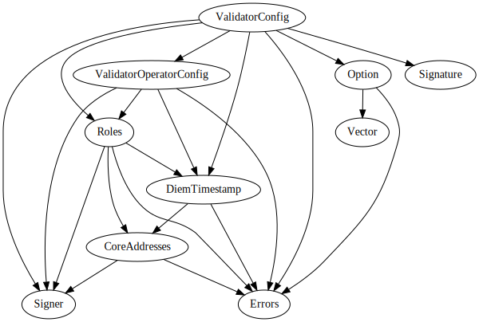
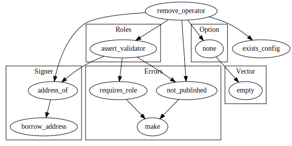
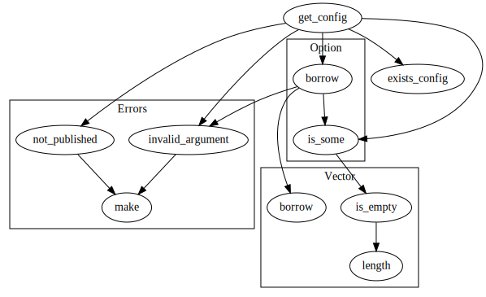
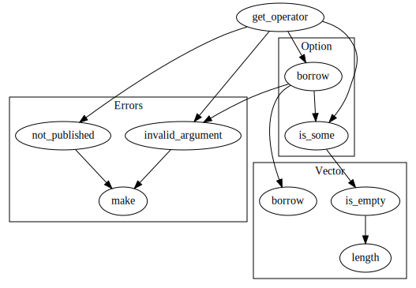

# Module `0x1::ValidatorConfig`

The ValidatorConfig resource holds information about a validator. Information
is published and updated by Diem root in a <code><a href="ValidatorConfig.md#0x1_ValidatorConfig_ValidatorConfig">Self::ValidatorConfig</a></code> in preparation for
later inclusion (by functions in DiemConfig) in a <code><a href="DiemConfig.md#0x1_DiemConfig_DiemConfig">DiemConfig::DiemConfig</a>&lt;<a href="DiemSystem.md#0x1_DiemSystem">DiemSystem</a>&gt;</code>
struct (the <code><a href="ValidatorConfig.md#0x1_ValidatorConfig_ValidatorConfig">Self::ValidatorConfig</a></code> in a <code>DiemConfig::ValidatorInfo</code> which is a member
of the <code><a href="DiemSystem.md#0x1_DiemSystem_DiemSystem">DiemSystem::DiemSystem</a>.validators</code> vector).

-  [Struct `Config`](#0x1_ValidatorConfig_Config)
-  [Resource `ValidatorConfig`](#0x1_ValidatorConfig_ValidatorConfig)
-  [Constants](#@Constants_0)
-  [Function `publish`](#0x1_ValidatorConfig_publish)
-  [Function `exists_config`](#0x1_ValidatorConfig_exists_config)
-  [Function `set_operator`](#0x1_ValidatorConfig_set_operator)
-  [Function `remove_operator`](#0x1_ValidatorConfig_remove_operator)
-  [Function `set_config`](#0x1_ValidatorConfig_set_config)
-  [Function `is_valid`](#0x1_ValidatorConfig_is_valid)
-  [Function `get_config`](#0x1_ValidatorConfig_get_config)
-  [Function `get_human_name`](#0x1_ValidatorConfig_get_human_name)
-  [Function `get_operator`](#0x1_ValidatorConfig_get_operator)
-  [Function `get_consensus_pubkey`](#0x1_ValidatorConfig_get_consensus_pubkey)
-  [Function `get_validator_network_addresses`](#0x1_ValidatorConfig_get_validator_network_addresses)
-  [Module Specification](#@Module_Specification_1)
    -  [Access Control](#@Access_Control_2)
    -  [Validity of Validators](#@Validity_of_Validators_3)
    -  [Consistency Between Resources and Roles](#@Consistency_Between_Resources_and_Roles_4)
    -  [Helper Function](#@Helper_Function_5)

<pre><code><b>use</b> <a href="DiemTimestamp.md#0x1_DiemTimestamp">0x1::DiemTimestamp</a>;
<b>use</b> <a href="../../../move-stdlib/docs/Errors.md#0x1_Errors">0x1::Errors</a>;
<b>use</b> <a href="../../../move-stdlib/docs/Option.md#0x1_Option">0x1::Option</a>;
<b>use</b> <a href="Roles.md#0x1_Roles">0x1::Roles</a>;
<b>use</b> <a href="Signature.md#0x1_Signature">0x1::Signature</a>;
<b>use</b> <a href="../../../move-stdlib/docs/Signer.md#0x1_Signer">0x1::Signer</a>;
<b>use</b> <a href="ValidatorOperatorConfig.md#0x1_ValidatorOperatorConfig">0x1::ValidatorOperatorConfig</a>;
</code></pre>

Show all the modules that "ValidatorConfig" depends on directly or indirectly

Show all the modules that depend on "ValidatorConfig" directly or indirectly

## Struct `Config`

<pre><code><b>struct</b> <a href="ValidatorConfig.md#0x1_ValidatorConfig_Config">Config</a>
</code></pre>

Fields

<dl>
<dt>
<code>consensus_pubkey: vector&lt;u8&gt;</code>
</dt>
<dd>

</dd>
<dt>
<code>validator_network_addresses: vector&lt;u8&gt;</code>
</dt>
<dd>

</dd>
<dt>
<code>fullnode_network_addresses: vector&lt;u8&gt;</code>
</dt>
<dd>

</dd>
</dl>

## Resource `ValidatorConfig`

<pre><code><b>resource</b> <b>struct</b> <a href="ValidatorConfig.md#0x1_ValidatorConfig">ValidatorConfig</a>
</code></pre>

Fields

<dl>
<dt>
<code>config: <a href="../../../move-stdlib/docs/Option.md#0x1_Option_Option">Option::Option</a>&lt;<a href="ValidatorConfig.md#0x1_ValidatorConfig_Config">ValidatorConfig::Config</a>&gt;</code>
</dt>
<dd>
 set and rotated by the operator_account
</dd>
<dt>
<code>operator_account: <a href="../../../move-stdlib/docs/Option.md#0x1_Option_Option">Option::Option</a>&lt;address&gt;</code>
</dt>
<dd>

</dd>
<dt>
<code>human_name: vector&lt;u8&gt;</code>
</dt>
<dd>
 The human readable name of this entity. Immutable.
</dd>
</dl>

## Constants

The provided consensus public key is malformed

<pre><code><b>const</b> <a href="ValidatorConfig.md#0x1_ValidatorConfig_EINVALID_CONSENSUS_KEY">EINVALID_CONSENSUS_KEY</a>: u64 = 2;
</code></pre>

The sender is not the operator for the specified validator

<pre><code><b>const</b> <a href="ValidatorConfig.md#0x1_ValidatorConfig_EINVALID_TRANSACTION_SENDER">EINVALID_TRANSACTION_SENDER</a>: u64 = 1;
</code></pre>

Tried to set an account without the correct operator role as a Validator Operator

<pre><code><b>const</b> <a href="ValidatorConfig.md#0x1_ValidatorConfig_ENOT_A_VALIDATOR_OPERATOR">ENOT_A_VALIDATOR_OPERATOR</a>: u64 = 3;
</code></pre>

The <code><a href="ValidatorConfig.md#0x1_ValidatorConfig">ValidatorConfig</a></code> resource was not in the required state

<pre><code><b>const</b> <a href="ValidatorConfig.md#0x1_ValidatorConfig_EVALIDATOR_CONFIG">EVALIDATOR_CONFIG</a>: u64 = 0;
</code></pre>

## Function `publish`

Publishes a mostly empty ValidatorConfig struct. Eventually, it
will have critical info such as keys, network addresses for validators,
and the address of the validator operator.

<pre><code><b>public</b> <b>fun</b> <a href="ValidatorConfig.md#0x1_ValidatorConfig_publish">publish</a>(validator_account: &signer, dr_account: &signer, human_name: vector&lt;u8&gt;)
</code></pre>

Implementation

<pre><code><b>public</b> <b>fun</b> <a href="ValidatorConfig.md#0x1_ValidatorConfig_publish">publish</a>(
    validator_account: &signer,
    dr_account: &signer,
    human_name: vector&lt;u8&gt;,
) {
    <a href="DiemTimestamp.md#0x1_DiemTimestamp_assert_operating">DiemTimestamp::assert_operating</a>();
    <a href="Roles.md#0x1_Roles_assert_diem_root">Roles::assert_diem_root</a>(dr_account);
    <a href="Roles.md#0x1_Roles_assert_validator">Roles::assert_validator</a>(validator_account);
    <b>assert</b>(
        !<b>exists</b>&lt;<a href="ValidatorConfig.md#0x1_ValidatorConfig">ValidatorConfig</a>&gt;(<a href="../../../move-stdlib/docs/Signer.md#0x1_Signer_address_of">Signer::address_of</a>(validator_account)),
        <a href="../../../move-stdlib/docs/Errors.md#0x1_Errors_already_published">Errors::already_published</a>(<a href="ValidatorConfig.md#0x1_ValidatorConfig_EVALIDATOR_CONFIG">EVALIDATOR_CONFIG</a>)
    );
    move_to(validator_account, <a href="ValidatorConfig.md#0x1_ValidatorConfig">ValidatorConfig</a> {
        config: <a href="../../../move-stdlib/docs/Option.md#0x1_Option_none">Option::none</a>(),
        operator_account: <a href="../../../move-stdlib/docs/Option.md#0x1_Option_none">Option::none</a>(),
        human_name,
    });
}
</code></pre>

Specification

<pre><code><b>include</b> <a href="ValidatorConfig.md#0x1_ValidatorConfig_PublishAbortsIf">PublishAbortsIf</a> {validator_addr: <a href="../../../move-stdlib/docs/Signer.md#0x1_Signer_spec_address_of">Signer::spec_address_of</a>(validator_account)};
<b>ensures</b> <a href="ValidatorConfig.md#0x1_ValidatorConfig_exists_config">exists_config</a>(<a href="../../../move-stdlib/docs/Signer.md#0x1_Signer_spec_address_of">Signer::spec_address_of</a>(validator_account));
</code></pre>

<pre><code><b>schema</b> <a href="ValidatorConfig.md#0x1_ValidatorConfig_PublishAbortsIf">PublishAbortsIf</a> {
    validator_addr: address;
    dr_account: signer;
    <b>include</b> <a href="DiemTimestamp.md#0x1_DiemTimestamp_AbortsIfNotOperating">DiemTimestamp::AbortsIfNotOperating</a>;
    <b>include</b> <a href="Roles.md#0x1_Roles_AbortsIfNotDiemRoot">Roles::AbortsIfNotDiemRoot</a>{account: dr_account};
    <b>include</b> <a href="Roles.md#0x1_Roles_AbortsIfNotValidator">Roles::AbortsIfNotValidator</a>{validator_addr: validator_addr};
    <b>aborts_if</b> <a href="ValidatorConfig.md#0x1_ValidatorConfig_exists_config">exists_config</a>(validator_addr)
        <b>with</b> <a href="../../../move-stdlib/docs/Errors.md#0x1_Errors_ALREADY_PUBLISHED">Errors::ALREADY_PUBLISHED</a>;
}
</code></pre>

Show all the functions that "publish" calls

## Function `exists_config`

Returns true if a ValidatorConfig resource exists under addr.

<pre><code><b>fun</b> <a href="ValidatorConfig.md#0x1_ValidatorConfig_exists_config">exists_config</a>(addr: address): bool
</code></pre>

Implementation

<pre><code><b>fun</b> <a href="ValidatorConfig.md#0x1_ValidatorConfig_exists_config">exists_config</a>(addr: address): bool {
    <b>exists</b>&lt;<a href="ValidatorConfig.md#0x1_ValidatorConfig">ValidatorConfig</a>&gt;(addr)
}
</code></pre>

Show all the functions that "exists_config" calls

## Function `set_operator`

Sets a new operator account, preserving the old config.
Note: Access control.  No one but the owner of the account may change .operator_account

<pre><code><b>public</b> <b>fun</b> <a href="ValidatorConfig.md#0x1_ValidatorConfig_set_operator">set_operator</a>(validator_account: &signer, operator_addr: address)
</code></pre>

Implementation

<pre><code><b>public</b> <b>fun</b> <a href="ValidatorConfig.md#0x1_ValidatorConfig_set_operator">set_operator</a>(validator_account: &signer, operator_addr: address) <b>acquires</b> <a href="ValidatorConfig.md#0x1_ValidatorConfig">ValidatorConfig</a> {
    <a href="Roles.md#0x1_Roles_assert_validator">Roles::assert_validator</a>(validator_account);
    // Check for validator role is not necessary since the role is checked when the config
    // <b>resource</b> is published.
    <b>assert</b>(
        <a href="ValidatorOperatorConfig.md#0x1_ValidatorOperatorConfig_has_validator_operator_config">ValidatorOperatorConfig::has_validator_operator_config</a>(operator_addr),
        <a href="../../../move-stdlib/docs/Errors.md#0x1_Errors_invalid_argument">Errors::invalid_argument</a>(<a href="ValidatorConfig.md#0x1_ValidatorConfig_ENOT_A_VALIDATOR_OPERATOR">ENOT_A_VALIDATOR_OPERATOR</a>)
    );
    <b>let</b> sender = <a href="../../../move-stdlib/docs/Signer.md#0x1_Signer_address_of">Signer::address_of</a>(validator_account);
    <b>assert</b>(<a href="ValidatorConfig.md#0x1_ValidatorConfig_exists_config">exists_config</a>(sender), <a href="../../../move-stdlib/docs/Errors.md#0x1_Errors_not_published">Errors::not_published</a>(<a href="ValidatorConfig.md#0x1_ValidatorConfig_EVALIDATOR_CONFIG">EVALIDATOR_CONFIG</a>));
    (borrow_global_mut&lt;<a href="ValidatorConfig.md#0x1_ValidatorConfig">ValidatorConfig</a>&gt;(sender)).operator_account = <a href="../../../move-stdlib/docs/Option.md#0x1_Option_some">Option::some</a>(operator_addr);
}
</code></pre>

Specification

Must abort if the signer does not have the Validator role [[H15]][PERMISSION].

<pre><code><b>let</b> sender = <a href="../../../move-stdlib/docs/Signer.md#0x1_Signer_spec_address_of">Signer::spec_address_of</a>(validator_account);
<b>include</b> <a href="Roles.md#0x1_Roles_AbortsIfNotValidator">Roles::AbortsIfNotValidator</a>{validator_addr: sender};
<b>include</b> <a href="ValidatorConfig.md#0x1_ValidatorConfig_SetOperatorAbortsIf">SetOperatorAbortsIf</a>;
<b>include</b> <a href="ValidatorConfig.md#0x1_ValidatorConfig_SetOperatorEnsures">SetOperatorEnsures</a>;
</code></pre>

Must abort if the signer does not have the Validator role [B24].

<pre><code><b>schema</b> <a href="ValidatorConfig.md#0x1_ValidatorConfig_SetOperatorAbortsIf">SetOperatorAbortsIf</a> {
    validator_account: signer;
    operator_addr: address;
    
    <b>let</b> validator_addr = <a href="../../../move-stdlib/docs/Signer.md#0x1_Signer_spec_address_of">Signer::spec_address_of</a>(validator_account);
    <b>include</b> <a href="Roles.md#0x1_Roles_AbortsIfNotValidator">Roles::AbortsIfNotValidator</a>{validator_addr: validator_addr};
    <b>aborts_if</b> !<a href="ValidatorOperatorConfig.md#0x1_ValidatorOperatorConfig_has_validator_operator_config">ValidatorOperatorConfig::has_validator_operator_config</a>(operator_addr)
        <b>with</b> <a href="../../../move-stdlib/docs/Errors.md#0x1_Errors_INVALID_ARGUMENT">Errors::INVALID_ARGUMENT</a>;
    <b>include</b> <a href="ValidatorConfig.md#0x1_ValidatorConfig_AbortsIfNoValidatorConfig">AbortsIfNoValidatorConfig</a>{addr: validator_addr};
    <b>aborts_if</b> !<a href="ValidatorOperatorConfig.md#0x1_ValidatorOperatorConfig_has_validator_operator_config">ValidatorOperatorConfig::has_validator_operator_config</a>(operator_addr) <b>with</b> <a href="../../../move-stdlib/docs/Errors.md#0x1_Errors_NOT_PUBLISHED">Errors::NOT_PUBLISHED</a>;
}
</code></pre>

<pre><code><b>schema</b> <a href="ValidatorConfig.md#0x1_ValidatorConfig_SetOperatorEnsures">SetOperatorEnsures</a> {
    validator_account: signer;
    operator_addr: address;
    
    <b>let</b> validator_addr = <a href="../../../move-stdlib/docs/Signer.md#0x1_Signer_spec_address_of">Signer::spec_address_of</a>(validator_account);
    <b>ensures</b> <a href="ValidatorConfig.md#0x1_ValidatorConfig_spec_has_operator">spec_has_operator</a>(validator_addr);
    <b>ensures</b> <a href="ValidatorConfig.md#0x1_ValidatorConfig_get_operator">get_operator</a>(validator_addr) == operator_addr;
}
</code></pre>

The signer can only change its own operator account [[H15]][PERMISSION].

<pre><code><b>schema</b> <a href="ValidatorConfig.md#0x1_ValidatorConfig_SetOperatorEnsures">SetOperatorEnsures</a> {
    <b>ensures</b> <b>forall</b> addr: address <b>where</b> addr != validator_addr:
        <b>global</b>&lt;<a href="ValidatorConfig.md#0x1_ValidatorConfig">ValidatorConfig</a>&gt;(addr).operator_account == <b>old</b>(<b>global</b>&lt;<a href="ValidatorConfig.md#0x1_ValidatorConfig">ValidatorConfig</a>&gt;(addr).operator_account);
}
</code></pre>

Show all the functions that "set_operator" calls

## Function `remove_operator`

Removes an operator account, setting a corresponding field to Option::none.
The old config is preserved.

<pre><code><b>public</b> <b>fun</b> <a href="ValidatorConfig.md#0x1_ValidatorConfig_remove_operator">remove_operator</a>(validator_account: &signer)
</code></pre>

Implementation

<pre><code><b>public</b> <b>fun</b> <a href="ValidatorConfig.md#0x1_ValidatorConfig_remove_operator">remove_operator</a>(validator_account: &signer) <b>acquires</b> <a href="ValidatorConfig.md#0x1_ValidatorConfig">ValidatorConfig</a> {
    <a href="Roles.md#0x1_Roles_assert_validator">Roles::assert_validator</a>(validator_account);
    <b>let</b> sender = <a href="../../../move-stdlib/docs/Signer.md#0x1_Signer_address_of">Signer::address_of</a>(validator_account);
    // <a href="ValidatorConfig.md#0x1_ValidatorConfig_Config">Config</a> field remains set
    <b>assert</b>(<a href="ValidatorConfig.md#0x1_ValidatorConfig_exists_config">exists_config</a>(sender), <a href="../../../move-stdlib/docs/Errors.md#0x1_Errors_not_published">Errors::not_published</a>(<a href="ValidatorConfig.md#0x1_ValidatorConfig_EVALIDATOR_CONFIG">EVALIDATOR_CONFIG</a>));
    (borrow_global_mut&lt;<a href="ValidatorConfig.md#0x1_ValidatorConfig">ValidatorConfig</a>&gt;(sender)).operator_account = <a href="../../../move-stdlib/docs/Option.md#0x1_Option_none">Option::none</a>();
}
</code></pre>

Specification

Must abort if the signer does not have the Validator role [[H15]][PERMISSION].

<pre><code><b>let</b> sender = <a href="../../../move-stdlib/docs/Signer.md#0x1_Signer_spec_address_of">Signer::spec_address_of</a>(validator_account);
<b>include</b> <a href="Roles.md#0x1_Roles_AbortsIfNotValidator">Roles::AbortsIfNotValidator</a>{validator_addr: sender};
<b>include</b> <a href="ValidatorConfig.md#0x1_ValidatorConfig_AbortsIfNoValidatorConfig">AbortsIfNoValidatorConfig</a>{addr: sender};
<b>ensures</b> !<a href="ValidatorConfig.md#0x1_ValidatorConfig_spec_has_operator">spec_has_operator</a>(<a href="../../../move-stdlib/docs/Signer.md#0x1_Signer_spec_address_of">Signer::spec_address_of</a>(validator_account));
</code></pre>

The signer can only change its own operator account [[H15]][PERMISSION].

<pre><code><b>ensures</b> <b>forall</b> addr: address <b>where</b> addr != sender:
    <b>global</b>&lt;<a href="ValidatorConfig.md#0x1_ValidatorConfig">ValidatorConfig</a>&gt;(addr).operator_account == <b>old</b>(<b>global</b>&lt;<a href="ValidatorConfig.md#0x1_ValidatorConfig">ValidatorConfig</a>&gt;(addr).operator_account);
</code></pre>

Show all the functions that "remove_operator" calls

## Function `set_config`

Rotate the config in the validator_account.
Once the config is set, it can not go back to <code><a href="../../../move-stdlib/docs/Option.md#0x1_Option_none">Option::none</a></code> - this is crucial for validity
of the DiemSystem's code.

<pre><code><b>public</b> <b>fun</b> <a href="ValidatorConfig.md#0x1_ValidatorConfig_set_config">set_config</a>(validator_operator_account: &signer, validator_addr: address, consensus_pubkey: vector&lt;u8&gt;, validator_network_addresses: vector&lt;u8&gt;, fullnode_network_addresses: vector&lt;u8&gt;)
</code></pre>

Implementation

<pre><code><b>public</b> <b>fun</b> <a href="ValidatorConfig.md#0x1_ValidatorConfig_set_config">set_config</a>(
    validator_operator_account: &signer,
    validator_addr: address,
    consensus_pubkey: vector&lt;u8&gt;,
    validator_network_addresses: vector&lt;u8&gt;,
    fullnode_network_addresses: vector&lt;u8&gt;,
) <b>acquires</b> <a href="ValidatorConfig.md#0x1_ValidatorConfig">ValidatorConfig</a> {
    <b>assert</b>(
        <a href="../../../move-stdlib/docs/Signer.md#0x1_Signer_address_of">Signer::address_of</a>(validator_operator_account) == <a href="ValidatorConfig.md#0x1_ValidatorConfig_get_operator">get_operator</a>(validator_addr),
        <a href="../../../move-stdlib/docs/Errors.md#0x1_Errors_invalid_argument">Errors::invalid_argument</a>(<a href="ValidatorConfig.md#0x1_ValidatorConfig_EINVALID_TRANSACTION_SENDER">EINVALID_TRANSACTION_SENDER</a>)
    );
    <b>assert</b>(
        <a href="Signature.md#0x1_Signature_ed25519_validate_pubkey">Signature::ed25519_validate_pubkey</a>(<b>copy</b> consensus_pubkey),
        <a href="../../../move-stdlib/docs/Errors.md#0x1_Errors_invalid_argument">Errors::invalid_argument</a>(<a href="ValidatorConfig.md#0x1_ValidatorConfig_EINVALID_CONSENSUS_KEY">EINVALID_CONSENSUS_KEY</a>)
    );
    // TODO(valerini): verify the proof of posession for consensus_pubkey
    <b>assert</b>(<a href="ValidatorConfig.md#0x1_ValidatorConfig_exists_config">exists_config</a>(validator_addr), <a href="../../../move-stdlib/docs/Errors.md#0x1_Errors_not_published">Errors::not_published</a>(<a href="ValidatorConfig.md#0x1_ValidatorConfig_EVALIDATOR_CONFIG">EVALIDATOR_CONFIG</a>));
    <b>let</b> t_ref = borrow_global_mut&lt;<a href="ValidatorConfig.md#0x1_ValidatorConfig">ValidatorConfig</a>&gt;(validator_addr);
    t_ref.config = <a href="../../../move-stdlib/docs/Option.md#0x1_Option_some">Option::some</a>(<a href="ValidatorConfig.md#0x1_ValidatorConfig_Config">Config</a> {
        consensus_pubkey,
        validator_network_addresses,
        fullnode_network_addresses,
    });
}
</code></pre>

Specification

<pre><code><b>pragma</b> opaque;
<b>modifies</b> <b>global</b>&lt;<a href="ValidatorConfig.md#0x1_ValidatorConfig">ValidatorConfig</a>&gt;(validator_addr);
<b>include</b> <a href="ValidatorConfig.md#0x1_ValidatorConfig_SetConfigAbortsIf">SetConfigAbortsIf</a>;
<b>ensures</b> <a href="ValidatorConfig.md#0x1_ValidatorConfig_is_valid">is_valid</a>(validator_addr);
<b>ensures</b> <b>global</b>&lt;<a href="ValidatorConfig.md#0x1_ValidatorConfig">ValidatorConfig</a>&gt;(validator_addr)
        == update_field(<b>old</b>(<b>global</b>&lt;<a href="ValidatorConfig.md#0x1_ValidatorConfig">ValidatorConfig</a>&gt;(validator_addr)),
                        config,
                        <a href="../../../move-stdlib/docs/Option.md#0x1_Option_spec_some">Option::spec_some</a>(<a href="ValidatorConfig.md#0x1_ValidatorConfig_Config">Config</a> {
                                         consensus_pubkey,
                                         validator_network_addresses,
                                         fullnode_network_addresses,
                                     }));
</code></pre>

<pre><code><b>schema</b> <a href="ValidatorConfig.md#0x1_ValidatorConfig_SetConfigAbortsIf">SetConfigAbortsIf</a> {
    validator_operator_account: signer;
    validator_addr: address;
    consensus_pubkey: vector&lt;u8&gt;;
    <b>aborts_if</b> <a href="../../../move-stdlib/docs/Signer.md#0x1_Signer_address_of">Signer::address_of</a>(validator_operator_account) != <a href="ValidatorConfig.md#0x1_ValidatorConfig_get_operator">get_operator</a>(validator_addr)
        <b>with</b> <a href="../../../move-stdlib/docs/Errors.md#0x1_Errors_INVALID_ARGUMENT">Errors::INVALID_ARGUMENT</a>;
    <b>include</b> <a href="ValidatorConfig.md#0x1_ValidatorConfig_AbortsIfGetOperator">AbortsIfGetOperator</a>{addr: validator_addr};
    <b>aborts_if</b> !<a href="Signature.md#0x1_Signature_ed25519_validate_pubkey">Signature::ed25519_validate_pubkey</a>(consensus_pubkey) <b>with</b> <a href="../../../move-stdlib/docs/Errors.md#0x1_Errors_INVALID_ARGUMENT">Errors::INVALID_ARGUMENT</a>;
}
</code></pre>

Show all the functions that "set_config" calls

## Function `is_valid`

Returns true if all of the following is true:
1) there is a ValidatorConfig resource under the address, and
2) the config is set, and
we do not require the operator_account to be set to make sure
that if the validator account becomes valid, it stays valid, e.g.
all validators in the Validator Set are valid

<pre><code><b>public</b> <b>fun</b> <a href="ValidatorConfig.md#0x1_ValidatorConfig_is_valid">is_valid</a>(addr: address): bool
</code></pre>

Implementation

<pre><code><b>public</b> <b>fun</b> <a href="ValidatorConfig.md#0x1_ValidatorConfig_is_valid">is_valid</a>(addr: address): bool <b>acquires</b> <a href="ValidatorConfig.md#0x1_ValidatorConfig">ValidatorConfig</a> {
    <b>exists</b>&lt;<a href="ValidatorConfig.md#0x1_ValidatorConfig">ValidatorConfig</a>&gt;(addr) && <a href="../../../move-stdlib/docs/Option.md#0x1_Option_is_some">Option::is_some</a>(&borrow_global&lt;<a href="ValidatorConfig.md#0x1_ValidatorConfig">ValidatorConfig</a>&gt;(addr).config)
}
</code></pre>

Specification

<pre><code><b>pragma</b> opaque;
<b>aborts_if</b> <b>false</b>;
<b>ensures</b> result == <a href="ValidatorConfig.md#0x1_ValidatorConfig_is_valid">is_valid</a>(addr);
</code></pre>

Show all the functions that "is_valid" calls

## Function `get_config`

Get Config
Aborts if there is no ValidatorConfig resource or if its config is empty

<pre><code><b>public</b> <b>fun</b> <a href="ValidatorConfig.md#0x1_ValidatorConfig_get_config">get_config</a>(addr: address): <a href="ValidatorConfig.md#0x1_ValidatorConfig_Config">ValidatorConfig::Config</a>
</code></pre>

Implementation

<pre><code><b>public</b> <b>fun</b> <a href="ValidatorConfig.md#0x1_ValidatorConfig_get_config">get_config</a>(addr: address): <a href="ValidatorConfig.md#0x1_ValidatorConfig_Config">Config</a> <b>acquires</b> <a href="ValidatorConfig.md#0x1_ValidatorConfig">ValidatorConfig</a> {
    <b>assert</b>(<a href="ValidatorConfig.md#0x1_ValidatorConfig_exists_config">exists_config</a>(addr), <a href="../../../move-stdlib/docs/Errors.md#0x1_Errors_not_published">Errors::not_published</a>(<a href="ValidatorConfig.md#0x1_ValidatorConfig_EVALIDATOR_CONFIG">EVALIDATOR_CONFIG</a>));
    <b>let</b> config = &borrow_global&lt;<a href="ValidatorConfig.md#0x1_ValidatorConfig">ValidatorConfig</a>&gt;(addr).config;
    <b>assert</b>(<a href="../../../move-stdlib/docs/Option.md#0x1_Option_is_some">Option::is_some</a>(config), <a href="../../../move-stdlib/docs/Errors.md#0x1_Errors_invalid_argument">Errors::invalid_argument</a>(<a href="ValidatorConfig.md#0x1_ValidatorConfig_EVALIDATOR_CONFIG">EVALIDATOR_CONFIG</a>));
    *<a href="../../../move-stdlib/docs/Option.md#0x1_Option_borrow">Option::borrow</a>(config)
}
</code></pre>

Specification

<pre><code><b>pragma</b> opaque;
<b>include</b> <a href="ValidatorConfig.md#0x1_ValidatorConfig_AbortsIfNoValidatorConfig">AbortsIfNoValidatorConfig</a>;
<b>aborts_if</b> <a href="../../../move-stdlib/docs/Option.md#0x1_Option_is_none">Option::is_none</a>(<b>global</b>&lt;<a href="ValidatorConfig.md#0x1_ValidatorConfig">ValidatorConfig</a>&gt;(addr).config) <b>with</b> <a href="../../../move-stdlib/docs/Errors.md#0x1_Errors_INVALID_ARGUMENT">Errors::INVALID_ARGUMENT</a>;
<b>ensures</b> result == <a href="ValidatorConfig.md#0x1_ValidatorConfig_spec_get_config">spec_get_config</a>(addr);
</code></pre>

Returns the config published under addr.

<pre><code><b>define</b> <a href="ValidatorConfig.md#0x1_ValidatorConfig_spec_get_config">spec_get_config</a>(addr: address): <a href="ValidatorConfig.md#0x1_ValidatorConfig_Config">Config</a> {
   <a href="../../../move-stdlib/docs/Option.md#0x1_Option_borrow">Option::borrow</a>(<b>global</b>&lt;<a href="ValidatorConfig.md#0x1_ValidatorConfig">ValidatorConfig</a>&gt;(addr).config)
}
</code></pre>

Show all the functions that "get_config" calls

## Function `get_human_name`

Get validator's account human name
Aborts if there is no ValidatorConfig resource

<pre><code><b>public</b> <b>fun</b> <a href="ValidatorConfig.md#0x1_ValidatorConfig_get_human_name">get_human_name</a>(addr: address): vector&lt;u8&gt;
</code></pre>

Implementation

<pre><code><b>public</b> <b>fun</b> <a href="ValidatorConfig.md#0x1_ValidatorConfig_get_human_name">get_human_name</a>(addr: address): vector&lt;u8&gt; <b>acquires</b> <a href="ValidatorConfig.md#0x1_ValidatorConfig">ValidatorConfig</a> {
    <b>assert</b>(<b>exists</b>&lt;<a href="ValidatorConfig.md#0x1_ValidatorConfig">ValidatorConfig</a>&gt;(addr), <a href="../../../move-stdlib/docs/Errors.md#0x1_Errors_not_published">Errors::not_published</a>(<a href="ValidatorConfig.md#0x1_ValidatorConfig_EVALIDATOR_CONFIG">EVALIDATOR_CONFIG</a>));
    <b>let</b> t_ref = borrow_global&lt;<a href="ValidatorConfig.md#0x1_ValidatorConfig">ValidatorConfig</a>&gt;(addr);
    *&t_ref.human_name
}
</code></pre>

Specification

<pre><code><b>pragma</b> opaque;
<b>include</b> <a href="ValidatorConfig.md#0x1_ValidatorConfig_AbortsIfNoValidatorConfig">AbortsIfNoValidatorConfig</a>;
<b>ensures</b> result == <a href="ValidatorConfig.md#0x1_ValidatorConfig_get_human_name">get_human_name</a>(addr);
</code></pre>

Show all the functions that "get_human_name" calls

## Function `get_operator`

Get operator's account
Aborts if there is no ValidatorConfig resource or
if the operator_account is unset

<pre><code><b>public</b> <b>fun</b> <a href="ValidatorConfig.md#0x1_ValidatorConfig_get_operator">get_operator</a>(addr: address): address
</code></pre>

Implementation

<pre><code><b>public</b> <b>fun</b> <a href="ValidatorConfig.md#0x1_ValidatorConfig_get_operator">get_operator</a>(addr: address): address <b>acquires</b> <a href="ValidatorConfig.md#0x1_ValidatorConfig">ValidatorConfig</a> {
    <b>assert</b>(<b>exists</b>&lt;<a href="ValidatorConfig.md#0x1_ValidatorConfig">ValidatorConfig</a>&gt;(addr), <a href="../../../move-stdlib/docs/Errors.md#0x1_Errors_not_published">Errors::not_published</a>(<a href="ValidatorConfig.md#0x1_ValidatorConfig_EVALIDATOR_CONFIG">EVALIDATOR_CONFIG</a>));
    <b>let</b> t_ref = borrow_global&lt;<a href="ValidatorConfig.md#0x1_ValidatorConfig">ValidatorConfig</a>&gt;(addr);
    <b>assert</b>(<a href="../../../move-stdlib/docs/Option.md#0x1_Option_is_some">Option::is_some</a>(&t_ref.operator_account), <a href="../../../move-stdlib/docs/Errors.md#0x1_Errors_invalid_argument">Errors::invalid_argument</a>(<a href="ValidatorConfig.md#0x1_ValidatorConfig_EVALIDATOR_CONFIG">EVALIDATOR_CONFIG</a>));
    *<a href="../../../move-stdlib/docs/Option.md#0x1_Option_borrow">Option::borrow</a>(&t_ref.operator_account)
}
</code></pre>

Specification

<pre><code><b>pragma</b> opaque;
<b>include</b> <a href="ValidatorConfig.md#0x1_ValidatorConfig_AbortsIfGetOperator">AbortsIfGetOperator</a>;
<b>ensures</b> result == <a href="ValidatorConfig.md#0x1_ValidatorConfig_get_operator">get_operator</a>(addr);
</code></pre>

<pre><code><b>schema</b> <a href="ValidatorConfig.md#0x1_ValidatorConfig_AbortsIfGetOperator">AbortsIfGetOperator</a> {
    addr: address;
    <b>include</b> <a href="ValidatorConfig.md#0x1_ValidatorConfig_AbortsIfNoValidatorConfig">AbortsIfNoValidatorConfig</a>;
    <b>aborts_if</b> !<a href="ValidatorConfig.md#0x1_ValidatorConfig_spec_has_operator">spec_has_operator</a>(addr) <b>with</b> <a href="../../../move-stdlib/docs/Errors.md#0x1_Errors_INVALID_ARGUMENT">Errors::INVALID_ARGUMENT</a>;
}
</code></pre>

Show all the functions that "get_operator" calls

## Function `get_consensus_pubkey`

Get consensus_pubkey from Config
Never aborts

<pre><code><b>public</b> <b>fun</b> <a href="ValidatorConfig.md#0x1_ValidatorConfig_get_consensus_pubkey">get_consensus_pubkey</a>(config_ref: &<a href="ValidatorConfig.md#0x1_ValidatorConfig_Config">ValidatorConfig::Config</a>): &vector&lt;u8&gt;
</code></pre>

Implementation

<pre><code><b>public</b> <b>fun</b> <a href="ValidatorConfig.md#0x1_ValidatorConfig_get_consensus_pubkey">get_consensus_pubkey</a>(config_ref: &<a href="ValidatorConfig.md#0x1_ValidatorConfig_Config">Config</a>): &vector&lt;u8&gt; {
    &config_ref.consensus_pubkey
}
</code></pre>

Show all the functions that "get_consensus_pubkey" calls

## Function `get_validator_network_addresses`

Get validator's network address from Config
Never aborts

<pre><code><b>public</b> <b>fun</b> <a href="ValidatorConfig.md#0x1_ValidatorConfig_get_validator_network_addresses">get_validator_network_addresses</a>(config_ref: &<a href="ValidatorConfig.md#0x1_ValidatorConfig_Config">ValidatorConfig::Config</a>): &vector&lt;u8&gt;
</code></pre>

Implementation

<pre><code><b>public</b> <b>fun</b> <a href="ValidatorConfig.md#0x1_ValidatorConfig_get_validator_network_addresses">get_validator_network_addresses</a>(config_ref: &<a href="ValidatorConfig.md#0x1_ValidatorConfig_Config">Config</a>): &vector&lt;u8&gt; {
    &config_ref.validator_network_addresses
}
</code></pre>

Show all the functions that "get_validator_network_addresses" calls

## Module Specification

<pre><code><b>pragma</b> aborts_if_is_strict;
</code></pre>

### Access Control

Only <code><a href="ValidatorConfig.md#0x1_ValidatorConfig_set_operator">Self::set_operator</a></code> and <code><a href="ValidatorConfig.md#0x1_ValidatorConfig_remove_operator">Self::remove_operator</a></code> may change the operator for a
particular (validator owner) address [[H15]][PERMISSION].
These two functions have a &signer argument for the validator account, so we know
that the change has been authorized by the validator owner via signing the transaction.

<pre><code><b>apply</b> <a href="ValidatorConfig.md#0x1_ValidatorConfig_OperatorRemainsSame">OperatorRemainsSame</a> <b>to</b> * <b>except</b> set_operator, remove_operator;
</code></pre>

<pre><code><b>schema</b> <a href="ValidatorConfig.md#0x1_ValidatorConfig_OperatorRemainsSame">OperatorRemainsSame</a> {
    <b>ensures</b> <b>forall</b> addr1: address <b>where</b> <b>old</b>(<b>exists</b>&lt;<a href="ValidatorConfig.md#0x1_ValidatorConfig">ValidatorConfig</a>&gt;(addr1)):
        <b>global</b>&lt;<a href="ValidatorConfig.md#0x1_ValidatorConfig">ValidatorConfig</a>&gt;(addr1).operator_account == <b>old</b>(<b>global</b>&lt;<a href="ValidatorConfig.md#0x1_ValidatorConfig">ValidatorConfig</a>&gt;(addr1).operator_account);
}
</code></pre>

### Validity of Validators

See comment on <code><a href="ValidatorConfig.md#0x1_ValidatorConfig_set_config">ValidatorConfig::set_config</a></code> -- DiemSystem depends on this.

A validator stays valid once it becomes valid.

<pre><code><b>invariant</b> <b>update</b> [<b>global</b>]
    <b>forall</b> validator: address <b>where</b> <b>old</b>(<a href="ValidatorConfig.md#0x1_ValidatorConfig_is_valid">is_valid</a>(validator)): <a href="ValidatorConfig.md#0x1_ValidatorConfig_is_valid">is_valid</a>(validator);
</code></pre>

### Consistency Between Resources and Roles

Every address that has a ValidatorConfig also has a validator role.

<pre><code><b>invariant</b> [<b>global</b>] <b>forall</b> addr: address <b>where</b> <a href="ValidatorConfig.md#0x1_ValidatorConfig_exists_config">exists_config</a>(addr):
    <a href="Roles.md#0x1_Roles_spec_has_validator_role_addr">Roles::spec_has_validator_role_addr</a>(addr);
</code></pre>

DIP-6 Property: If address has a ValidatorConfig, it has a validator role.  This invariant is useful
in DiemSystem so we don't have to check whether every validator address has a validator role.

<pre><code><b>invariant</b> [<b>global</b>] <b>forall</b> addr: address <b>where</b> <a href="ValidatorConfig.md#0x1_ValidatorConfig_exists_config">exists_config</a>(addr):
    <a href="Roles.md#0x1_Roles_spec_has_validator_role_addr">Roles::spec_has_validator_role_addr</a>(addr);
</code></pre>

DIP-6 Property: Every address that is_valid (meaning it has a ValidatorConfig with
a config option that is "some") has a validator role. This is a trivial consequence
of the previous invariant, but it is not inductive and can't be proved without the
previous one as a helper.

<pre><code><b>invariant</b> [<b>global</b>] <b>forall</b> addr: address <b>where</b> <a href="ValidatorConfig.md#0x1_ValidatorConfig_is_valid">is_valid</a>(addr):
    <a href="Roles.md#0x1_Roles_spec_has_validator_role_addr">Roles::spec_has_validator_role_addr</a>(addr);
</code></pre>

### Helper Function

Returns true if addr has an operator account.

<pre><code><b>define</b> <a href="ValidatorConfig.md#0x1_ValidatorConfig_spec_has_operator">spec_has_operator</a>(addr: address): bool {
   <a href="../../../move-stdlib/docs/Option.md#0x1_Option_is_some">Option::is_some</a>(<b>global</b>&lt;<a href="ValidatorConfig.md#0x1_ValidatorConfig">ValidatorConfig</a>&gt;(addr).operator_account)
}
</code></pre>

[//]: # ("File containing references which can be used from documentation")
[ACCESS_CONTROL]: https://github.com/diem/dip/blob/main/dips/dip-2.md
[ROLE]: https://github.com/diem/dip/blob/main/dips/dip-2.md#roles
[PERMISSION]: https://github.com/diem/dip/blob/main/dips/dip-2.md#permissions
