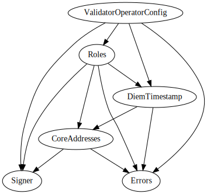

# Module `0x1::ValidatorOperatorConfig`

Stores the string name of a ValidatorOperator account.

-  [Resource `ValidatorOperatorConfig`](#0x1_ValidatorOperatorConfig_ValidatorOperatorConfig)
-  [Constants](#@Constants_0)
-  [Function `publish`](#0x1_ValidatorOperatorConfig_publish)
-  [Function `get_human_name`](#0x1_ValidatorOperatorConfig_get_human_name)
-  [Function `has_validator_operator_config`](#0x1_ValidatorOperatorConfig_has_validator_operator_config)
-  [Module Specification](#@Module_Specification_1)
    -  [Consistency Between Resources and Roles](#@Consistency_Between_Resources_and_Roles_2)
    -  [Persistence](#@Persistence_3)

<pre><code><b>use</b> <a href="DiemTimestamp.md#0x1_DiemTimestamp">0x1::DiemTimestamp</a>;
<b>use</b> <a href="../../../move-stdlib/docs/Errors.md#0x1_Errors">0x1::Errors</a>;
<b>use</b> <a href="Roles.md#0x1_Roles">0x1::Roles</a>;
<b>use</b> <a href="../../../move-stdlib/docs/Signer.md#0x1_Signer">0x1::Signer</a>;
</code></pre>

Show all the modules that "ValidatorOperatorConfig" depends on directly or indirectly

Show all the modules that depend on "ValidatorOperatorConfig" directly or indirectly

## Resource `ValidatorOperatorConfig`

<pre><code><b>resource</b> <b>struct</b> <a href="ValidatorOperatorConfig.md#0x1_ValidatorOperatorConfig">ValidatorOperatorConfig</a>
</code></pre>

Fields

<dl>
<dt>
<code>human_name: vector&lt;u8&gt;</code>
</dt>
<dd>
 The human readable name of this entity. Immutable.
</dd>
</dl>

## Constants

The <code><a href="ValidatorOperatorConfig.md#0x1_ValidatorOperatorConfig">ValidatorOperatorConfig</a></code> was not in the required state

<pre><code><b>const</b> <a href="ValidatorOperatorConfig.md#0x1_ValidatorOperatorConfig_EVALIDATOR_OPERATOR_CONFIG">EVALIDATOR_OPERATOR_CONFIG</a>: u64 = 0;
</code></pre>

## Function `publish`

<pre><code><b>public</b> <b>fun</b> <a href="ValidatorOperatorConfig.md#0x1_ValidatorOperatorConfig_publish">publish</a>(validator_operator_account: &signer, dr_account: &signer, human_name: vector&lt;u8&gt;)
</code></pre>

Implementation

<pre><code><b>public</b> <b>fun</b> <a href="ValidatorOperatorConfig.md#0x1_ValidatorOperatorConfig_publish">publish</a>(
    validator_operator_account: &signer,
    dr_account: &signer,
    human_name: vector&lt;u8&gt;,
) {
    <a href="DiemTimestamp.md#0x1_DiemTimestamp_assert_operating">DiemTimestamp::assert_operating</a>();
    <a href="Roles.md#0x1_Roles_assert_diem_root">Roles::assert_diem_root</a>(dr_account);
    <a href="Roles.md#0x1_Roles_assert_validator_operator">Roles::assert_validator_operator</a>(validator_operator_account);
    <b>assert</b>(
        !<a href="ValidatorOperatorConfig.md#0x1_ValidatorOperatorConfig_has_validator_operator_config">has_validator_operator_config</a>(<a href="../../../move-stdlib/docs/Signer.md#0x1_Signer_address_of">Signer::address_of</a>(validator_operator_account)),
        <a href="../../../move-stdlib/docs/Errors.md#0x1_Errors_already_published">Errors::already_published</a>(<a href="ValidatorOperatorConfig.md#0x1_ValidatorOperatorConfig_EVALIDATOR_OPERATOR_CONFIG">EVALIDATOR_OPERATOR_CONFIG</a>)
    );

    move_to(validator_operator_account, <a href="ValidatorOperatorConfig.md#0x1_ValidatorOperatorConfig">ValidatorOperatorConfig</a> {
        human_name,
    });
}
</code></pre>

Specification

<pre><code><b>include</b> <a href="Roles.md#0x1_Roles_AbortsIfNotDiemRoot">Roles::AbortsIfNotDiemRoot</a>{account: dr_account};
<b>include</b> <a href="Roles.md#0x1_Roles_AbortsIfNotValidatorOperator">Roles::AbortsIfNotValidatorOperator</a>{validator_operator_addr: <a href="../../../move-stdlib/docs/Signer.md#0x1_Signer_address_of">Signer::address_of</a>(validator_operator_account)};
<b>include</b> <a href="ValidatorOperatorConfig.md#0x1_ValidatorOperatorConfig_PublishAbortsIf">PublishAbortsIf</a> {validator_operator_addr: <a href="../../../move-stdlib/docs/Signer.md#0x1_Signer_spec_address_of">Signer::spec_address_of</a>(validator_operator_account)};
<b>ensures</b> <a href="ValidatorOperatorConfig.md#0x1_ValidatorOperatorConfig_has_validator_operator_config">has_validator_operator_config</a>(<a href="../../../move-stdlib/docs/Signer.md#0x1_Signer_spec_address_of">Signer::spec_address_of</a>(validator_operator_account));
</code></pre>

<pre><code><b>schema</b> <a href="ValidatorOperatorConfig.md#0x1_ValidatorOperatorConfig_PublishAbortsIf">PublishAbortsIf</a> {
    validator_operator_addr: address;
    dr_account: signer;
    <b>include</b> <a href="DiemTimestamp.md#0x1_DiemTimestamp_AbortsIfNotOperating">DiemTimestamp::AbortsIfNotOperating</a>;
    <b>include</b> <a href="Roles.md#0x1_Roles_AbortsIfNotDiemRoot">Roles::AbortsIfNotDiemRoot</a>{account: dr_account};
    <b>include</b> <a href="Roles.md#0x1_Roles_AbortsIfNotValidatorOperator">Roles::AbortsIfNotValidatorOperator</a>;
    <b>aborts_if</b> <a href="ValidatorOperatorConfig.md#0x1_ValidatorOperatorConfig_has_validator_operator_config">has_validator_operator_config</a>(validator_operator_addr)
        <b>with</b> <a href="../../../move-stdlib/docs/Errors.md#0x1_Errors_ALREADY_PUBLISHED">Errors::ALREADY_PUBLISHED</a>;
}
</code></pre>

Show all the functions that "publish" calls

## Function `get_human_name`

Get validator's account human name
Aborts if there is no ValidatorOperatorConfig resource

<pre><code><b>public</b> <b>fun</b> <a href="ValidatorOperatorConfig.md#0x1_ValidatorOperatorConfig_get_human_name">get_human_name</a>(validator_operator_addr: address): vector&lt;u8&gt;
</code></pre>

Implementation

<pre><code><b>public</b> <b>fun</b> <a href="ValidatorOperatorConfig.md#0x1_ValidatorOperatorConfig_get_human_name">get_human_name</a>(validator_operator_addr: address): vector&lt;u8&gt; <b>acquires</b> <a href="ValidatorOperatorConfig.md#0x1_ValidatorOperatorConfig">ValidatorOperatorConfig</a> {
    <b>assert</b>(<a href="ValidatorOperatorConfig.md#0x1_ValidatorOperatorConfig_has_validator_operator_config">has_validator_operator_config</a>(validator_operator_addr), <a href="../../../move-stdlib/docs/Errors.md#0x1_Errors_not_published">Errors::not_published</a>(<a href="ValidatorOperatorConfig.md#0x1_ValidatorOperatorConfig_EVALIDATOR_OPERATOR_CONFIG">EVALIDATOR_OPERATOR_CONFIG</a>));
    *&borrow_global&lt;<a href="ValidatorOperatorConfig.md#0x1_ValidatorOperatorConfig">ValidatorOperatorConfig</a>&gt;(validator_operator_addr).human_name
}
</code></pre>

Specification

<pre><code><b>pragma</b> opaque;
<b>aborts_if</b> !<a href="ValidatorOperatorConfig.md#0x1_ValidatorOperatorConfig_has_validator_operator_config">has_validator_operator_config</a>(validator_operator_addr) <b>with</b> <a href="../../../move-stdlib/docs/Errors.md#0x1_Errors_NOT_PUBLISHED">Errors::NOT_PUBLISHED</a>;
<b>ensures</b> result == <a href="ValidatorOperatorConfig.md#0x1_ValidatorOperatorConfig_get_human_name">get_human_name</a>(validator_operator_addr);
</code></pre>

Show all the functions that "get_human_name" calls

## Function `has_validator_operator_config`

<pre><code><b>public</b> <b>fun</b> <a href="ValidatorOperatorConfig.md#0x1_ValidatorOperatorConfig_has_validator_operator_config">has_validator_operator_config</a>(validator_operator_addr: address): bool
</code></pre>

Implementation

<pre><code><b>public</b> <b>fun</b> <a href="ValidatorOperatorConfig.md#0x1_ValidatorOperatorConfig_has_validator_operator_config">has_validator_operator_config</a>(validator_operator_addr: address): bool {
    <b>exists</b>&lt;<a href="ValidatorOperatorConfig.md#0x1_ValidatorOperatorConfig">ValidatorOperatorConfig</a>&gt;(validator_operator_addr)
}
</code></pre>

Specification

<pre><code><b>ensures</b> result == <a href="ValidatorOperatorConfig.md#0x1_ValidatorOperatorConfig_has_validator_operator_config">has_validator_operator_config</a>(validator_operator_addr);
</code></pre>

Show all the functions that "has_validator_operator_config" calls

## Module Specification

### Consistency Between Resources and Roles

If an address has a ValidatorOperatorConfig resource, it has a validator operator role.

<pre><code><b>invariant</b> [<b>global</b>] <b>forall</b> addr: address <b>where</b> <a href="ValidatorOperatorConfig.md#0x1_ValidatorOperatorConfig_has_validator_operator_config">has_validator_operator_config</a>(addr):
    <a href="Roles.md#0x1_Roles_spec_has_validator_operator_role_addr">Roles::spec_has_validator_operator_role_addr</a>(addr);
</code></pre>

### Persistence

<pre><code><b>invariant</b> <b>update</b> [<b>global</b>] <b>forall</b> addr: address <b>where</b> <b>old</b>(<b>exists</b>&lt;<a href="ValidatorOperatorConfig.md#0x1_ValidatorOperatorConfig">ValidatorOperatorConfig</a>&gt;(addr)):
    <b>exists</b>&lt;<a href="ValidatorOperatorConfig.md#0x1_ValidatorOperatorConfig">ValidatorOperatorConfig</a>&gt;(addr);
</code></pre>

[//]: # ("File containing references which can be used from documentation")
[ACCESS_CONTROL]: https://github.com/diem/dip/blob/main/dips/dip-2.md
[ROLE]: https://github.com/diem/dip/blob/main/dips/dip-2.md#roles
[PERMISSION]: https://github.com/diem/dip/blob/main/dips/dip-2.md#permissions
