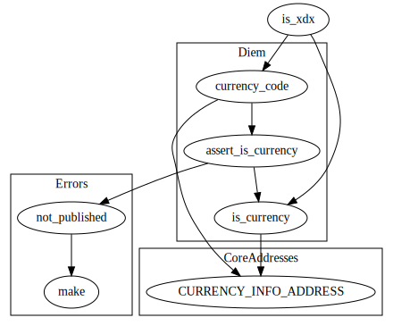

# Module `0x1::XDX`

NB: This module is a stub of the <code><a href="XDX.md#0x1_XDX">XDX</a></code> at the moment.

Once the component makeup of the XDX has been chosen the
<code><a href="XDX.md#0x1_XDX_Reserve">Reserve</a></code> will be updated to hold the backing coins in the correct ratios.

-  [Struct `XDX`](#0x1_XDX_XDX)
-  [Resource `Reserve`](#0x1_XDX_Reserve)
-  [Constants](#@Constants_0)
-  [Function `initialize`](#0x1_XDX_initialize)
-  [Function `is_xdx`](#0x1_XDX_is_xdx)
-  [Function `reserve_address`](#0x1_XDX_reserve_address)
-  [Module Specification](#@Module_Specification_1)
    -  [Persistence of Resources](#@Persistence_of_Resources_2)
    -  [Helper Functions](#@Helper_Functions_3)

<pre><code><b>use</b> <a href="AccountLimits.md#0x1_AccountLimits">0x1::AccountLimits</a>;
<b>use</b> <a href="CoreAddresses.md#0x1_CoreAddresses">0x1::CoreAddresses</a>;
<b>use</b> <a href="Diem.md#0x1_Diem">0x1::Diem</a>;
<b>use</b> <a href="DiemTimestamp.md#0x1_DiemTimestamp">0x1::DiemTimestamp</a>;
<b>use</b> <a href="../../../move-stdlib/docs/Errors.md#0x1_Errors">0x1::Errors</a>;
<b>use</b> <a href="../../../move-stdlib/docs/FixedPoint32.md#0x1_FixedPoint32">0x1::FixedPoint32</a>;
</code></pre>

Show all the modules that "XDX" depends on directly or indirectly

Show all the modules that depend on "XDX" directly or indirectly

## Struct `XDX`

The type tag representing the <code><a href="XDX.md#0x1_XDX">XDX</a></code> currency on-chain.

<pre><code><b>struct</b> <a href="XDX.md#0x1_XDX">XDX</a>
</code></pre>

Fields

<dl>
<dt>
<code>dummy_field: bool</code>
</dt>
<dd>

</dd>
</dl>

## Resource `Reserve`

Note: Currently only holds the mint, burn, and preburn capabilities for
XDX. Once the makeup of the XDX has been determined this resource will
be updated to hold the backing XDX reserve compnents on-chain.

The on-chain reserve for the <code><a href="XDX.md#0x1_XDX">XDX</a></code> holds both the capability for minting <code><a href="XDX.md#0x1_XDX">XDX</a></code>
coins, and also each reserve component that holds the backing for these coins on-chain.
Currently this holds no coins since XDX is not able to be minted/created.

<pre><code><b>resource</b> <b>struct</b> <a href="XDX.md#0x1_XDX_Reserve">Reserve</a>
</code></pre>

Fields

<dl>
<dt>
<code>mint_cap: <a href="Diem.md#0x1_Diem_MintCapability">Diem::MintCapability</a>&lt;<a href="XDX.md#0x1_XDX_XDX">XDX::XDX</a>&gt;</code>
</dt>
<dd>
 The mint capability allowing minting of <code><a href="XDX.md#0x1_XDX">XDX</a></code> coins.
</dd>
<dt>
<code>burn_cap: <a href="Diem.md#0x1_Diem_BurnCapability">Diem::BurnCapability</a>&lt;<a href="XDX.md#0x1_XDX_XDX">XDX::XDX</a>&gt;</code>
</dt>
<dd>
 The burn capability for <code><a href="XDX.md#0x1_XDX">XDX</a></code> coins. This is used for the unpacking
 of <code><a href="XDX.md#0x1_XDX">XDX</a></code> coins into the underlying backing currencies.
</dd>
<dt>
<code>preburn_cap: <a href="Diem.md#0x1_Diem_Preburn">Diem::Preburn</a>&lt;<a href="XDX.md#0x1_XDX_XDX">XDX::XDX</a>&gt;</code>
</dt>
<dd>
 The preburn for <code><a href="XDX.md#0x1_XDX">XDX</a></code>. This is an administrative field since we
 need to alway preburn before we burn.
</dd>
</dl>

## Constants

The <code><a href="XDX.md#0x1_XDX_Reserve">Reserve</a></code> resource is in an invalid state

<pre><code><b>const</b> <a href="XDX.md#0x1_XDX_ERESERVE">ERESERVE</a>: u64 = 0;
</code></pre>

## Function `initialize`

Initializes the <code><a href="XDX.md#0x1_XDX">XDX</a></code> module. This sets up the initial <code><a href="XDX.md#0x1_XDX">XDX</a></code> ratios and
reserve components, and creates the mint, preburn, and burn
capabilities for <code><a href="XDX.md#0x1_XDX">XDX</a></code> coins. The <code><a href="XDX.md#0x1_XDX">XDX</a></code> currency must not already be
registered in order for this to succeed. The sender must both be the
correct address (<code><a href="CoreAddresses.md#0x1_CoreAddresses_CURRENCY_INFO_ADDRESS">CoreAddresses::CURRENCY_INFO_ADDRESS</a></code>) and have the
correct permissions (<code>&Capability&lt;RegisterNewCurrency&gt;</code>). Both of these
restrictions are enforced in the <code><a href="Diem.md#0x1_Diem_register_currency">Diem::register_currency</a></code> function, but also enforced here.

<pre><code><b>public</b> <b>fun</b> <a href="XDX.md#0x1_XDX_initialize">initialize</a>(dr_account: &signer, tc_account: &signer)
</code></pre>

Implementation

<pre><code><b>public</b> <b>fun</b> <a href="XDX.md#0x1_XDX_initialize">initialize</a>(
    dr_account: &signer,
    tc_account: &signer,
) {
    <a href="DiemTimestamp.md#0x1_DiemTimestamp_assert_genesis">DiemTimestamp::assert_genesis</a>();
    // Operational constraint
    <a href="CoreAddresses.md#0x1_CoreAddresses_assert_currency_info">CoreAddresses::assert_currency_info</a>(dr_account);
    // <a href="XDX.md#0x1_XDX_Reserve">Reserve</a> must not exist.
    <b>assert</b>(!<b>exists</b>&lt;<a href="XDX.md#0x1_XDX_Reserve">Reserve</a>&gt;(<a href="CoreAddresses.md#0x1_CoreAddresses_DIEM_ROOT_ADDRESS">CoreAddresses::DIEM_ROOT_ADDRESS</a>()), <a href="../../../move-stdlib/docs/Errors.md#0x1_Errors_already_published">Errors::already_published</a>(<a href="XDX.md#0x1_XDX_ERESERVE">ERESERVE</a>));
    <b>let</b> (mint_cap, burn_cap) = <a href="Diem.md#0x1_Diem_register_currency">Diem::register_currency</a>&lt;<a href="XDX.md#0x1_XDX">XDX</a>&gt;(
        dr_account,
        <a href="../../../move-stdlib/docs/FixedPoint32.md#0x1_FixedPoint32_create_from_rational">FixedPoint32::create_from_rational</a>(1, 1), // exchange rate <b>to</b> <a href="XDX.md#0x1_XDX">XDX</a>
        <b>true</b>,    // is_synthetic
        1000000, // scaling_factor = 10^6
        1000,    // fractional_part = 10^3
        b"<a href="XDX.md#0x1_XDX">XDX</a>"
    );
    // <a href="XDX.md#0x1_XDX">XDX</a> cannot be minted.
    <a href="Diem.md#0x1_Diem_update_minting_ability">Diem::update_minting_ability</a>&lt;<a href="XDX.md#0x1_XDX">XDX</a>&gt;(tc_account, <b>false</b>);
    <a href="AccountLimits.md#0x1_AccountLimits_publish_unrestricted_limits">AccountLimits::publish_unrestricted_limits</a>&lt;<a href="XDX.md#0x1_XDX">XDX</a>&gt;(dr_account);
    <b>let</b> preburn_cap = <a href="Diem.md#0x1_Diem_create_preburn">Diem::create_preburn</a>&lt;<a href="XDX.md#0x1_XDX">XDX</a>&gt;(tc_account);
    move_to(dr_account, <a href="XDX.md#0x1_XDX_Reserve">Reserve</a> { mint_cap, burn_cap, preburn_cap });
}
</code></pre>

Specification

<pre><code><b>include</b> <a href="CoreAddresses.md#0x1_CoreAddresses_AbortsIfNotCurrencyInfo">CoreAddresses::AbortsIfNotCurrencyInfo</a>{account: dr_account};
<b>aborts_if</b> <b>exists</b>&lt;<a href="XDX.md#0x1_XDX_Reserve">Reserve</a>&gt;(<a href="CoreAddresses.md#0x1_CoreAddresses_DIEM_ROOT_ADDRESS">CoreAddresses::DIEM_ROOT_ADDRESS</a>()) <b>with</b> <a href="../../../move-stdlib/docs/Errors.md#0x1_Errors_ALREADY_PUBLISHED">Errors::ALREADY_PUBLISHED</a>;
<b>include</b> <a href="Diem.md#0x1_Diem_RegisterCurrencyAbortsIf">Diem::RegisterCurrencyAbortsIf</a>&lt;<a href="XDX.md#0x1_XDX">XDX</a>&gt;{
    currency_code: b"<a href="XDX.md#0x1_XDX">XDX</a>",
    scaling_factor: 1000000
};
<b>include</b> <a href="AccountLimits.md#0x1_AccountLimits_PublishUnrestrictedLimitsAbortsIf">AccountLimits::PublishUnrestrictedLimitsAbortsIf</a>&lt;<a href="XDX.md#0x1_XDX">XDX</a>&gt;{publish_account: dr_account};
<b>include</b> <a href="Diem.md#0x1_Diem_RegisterCurrencyEnsures">Diem::RegisterCurrencyEnsures</a>&lt;<a href="XDX.md#0x1_XDX">XDX</a>&gt;;
<b>include</b> <a href="Diem.md#0x1_Diem_UpdateMintingAbilityEnsures">Diem::UpdateMintingAbilityEnsures</a>&lt;<a href="XDX.md#0x1_XDX">XDX</a>&gt;{can_mint: <b>false</b>};
<b>include</b> <a href="AccountLimits.md#0x1_AccountLimits_PublishUnrestrictedLimitsEnsures">AccountLimits::PublishUnrestrictedLimitsEnsures</a>&lt;<a href="XDX.md#0x1_XDX">XDX</a>&gt;{publish_account: dr_account};
<b>ensures</b> <b>exists</b>&lt;<a href="XDX.md#0x1_XDX_Reserve">Reserve</a>&gt;(<a href="CoreAddresses.md#0x1_CoreAddresses_DIEM_ROOT_ADDRESS">CoreAddresses::DIEM_ROOT_ADDRESS</a>());
</code></pre>

Registering XDX can only be done in genesis.

<pre><code><b>include</b> <a href="DiemTimestamp.md#0x1_DiemTimestamp_AbortsIfNotGenesis">DiemTimestamp::AbortsIfNotGenesis</a>;
</code></pre>

Only the DiemRoot account can register a new currency [[H8]][PERMISSION].

<pre><code><b>include</b> <a href="Roles.md#0x1_Roles_AbortsIfNotDiemRoot">Roles::AbortsIfNotDiemRoot</a>{account: dr_account};
</code></pre>

Only the TreasuryCompliance role can update the <code>can_mint</code> field of CurrencyInfo [[H2]][PERMISSION].
Moreover, only the TreasuryCompliance role can create Preburn.

<pre><code><b>include</b> <a href="Roles.md#0x1_Roles_AbortsIfNotTreasuryCompliance">Roles::AbortsIfNotTreasuryCompliance</a>{account: tc_account};
</code></pre>

Show all the functions that "initialize" calls

## Function `is_xdx`

Returns true if <code>CoinType</code> is <code><a href="XDX.md#0x1_XDX_XDX">XDX::XDX</a></code>

<pre><code><b>public</b> <b>fun</b> <a href="XDX.md#0x1_XDX_is_xdx">is_xdx</a>&lt;CoinType&gt;(): bool
</code></pre>

Implementation

<pre><code><b>public</b> <b>fun</b> <a href="XDX.md#0x1_XDX_is_xdx">is_xdx</a>&lt;CoinType: store&gt;(): bool {
    <a href="Diem.md#0x1_Diem_is_currency">Diem::is_currency</a>&lt;CoinType&gt;() &&
        <a href="Diem.md#0x1_Diem_currency_code">Diem::currency_code</a>&lt;CoinType&gt;() == <a href="Diem.md#0x1_Diem_currency_code">Diem::currency_code</a>&lt;<a href="XDX.md#0x1_XDX">XDX</a>&gt;()
}
</code></pre>

Specification

<pre><code><b>pragma</b> opaque;
<b>include</b> <a href="Diem.md#0x1_Diem_spec_is_currency">Diem::spec_is_currency</a>&lt;CoinType&gt;() ==&gt; <a href="Diem.md#0x1_Diem_AbortsIfNoCurrency">Diem::AbortsIfNoCurrency</a>&lt;<a href="XDX.md#0x1_XDX">XDX</a>&gt;;
<b>ensures</b> result == <a href="XDX.md#0x1_XDX_spec_is_xdx">spec_is_xdx</a>&lt;CoinType&gt;();
</code></pre>

<pre><code><b>define</b> <a href="XDX.md#0x1_XDX_spec_is_xdx">spec_is_xdx</a>&lt;CoinType&gt;(): bool {
   <a href="Diem.md#0x1_Diem_spec_is_currency">Diem::spec_is_currency</a>&lt;CoinType&gt;() && <a href="Diem.md#0x1_Diem_spec_is_currency">Diem::spec_is_currency</a>&lt;<a href="XDX.md#0x1_XDX">XDX</a>&gt;() &&
       (<a href="Diem.md#0x1_Diem_spec_currency_code">Diem::spec_currency_code</a>&lt;CoinType&gt;() == <a href="Diem.md#0x1_Diem_spec_currency_code">Diem::spec_currency_code</a>&lt;<a href="XDX.md#0x1_XDX">XDX</a>&gt;())
}
</code></pre>

Show all the functions that "is_xdx" calls

## Function `reserve_address`

Return the account address where the globally unique XDX::Reserve resource is stored

<pre><code><b>public</b> <b>fun</b> <a href="XDX.md#0x1_XDX_reserve_address">reserve_address</a>(): address
</code></pre>

Implementation

<pre><code><b>public</b> <b>fun</b> <a href="XDX.md#0x1_XDX_reserve_address">reserve_address</a>(): address {
    <a href="CoreAddresses.md#0x1_CoreAddresses_CURRENCY_INFO_ADDRESS">CoreAddresses::CURRENCY_INFO_ADDRESS</a>()
}
</code></pre>

Show all the functions that "reserve_address" calls

## Module Specification

### Persistence of Resources

After genesis, the Reserve resource exists.

<pre><code><b>invariant</b> [<b>global</b>] <a href="DiemTimestamp.md#0x1_DiemTimestamp_is_operating">DiemTimestamp::is_operating</a>() ==&gt; <a href="XDX.md#0x1_XDX_reserve_exists">reserve_exists</a>();
</code></pre>

After genesis, XDX is registered.

<pre><code><b>invariant</b> [<b>global</b>] <a href="DiemTimestamp.md#0x1_DiemTimestamp_is_operating">DiemTimestamp::is_operating</a>() ==&gt; <a href="Diem.md#0x1_Diem_is_currency">Diem::is_currency</a>&lt;<a href="XDX.md#0x1_XDX">XDX</a>&gt;();
</code></pre>

### Helper Functions

Checks whether the Reserve resource exists.

<pre><code><b>define</b> <a href="XDX.md#0x1_XDX_reserve_exists">reserve_exists</a>(): bool {
   <b>exists</b>&lt;<a href="XDX.md#0x1_XDX_Reserve">Reserve</a>&gt;(<a href="CoreAddresses.md#0x1_CoreAddresses_CURRENCY_INFO_ADDRESS">CoreAddresses::CURRENCY_INFO_ADDRESS</a>())
}
</code></pre>

After genesis, <code>LimitsDefinition&lt;<a href="XDX.md#0x1_XDX">XDX</a>&gt;</code> is published at Diem root. It's published by
AccountLimits::publish_unrestricted_limits, but we can't prove the condition there because
it does not hold for all types (but does hold for XDX).

<pre><code><b>invariant</b> [<b>global</b>] <a href="DiemTimestamp.md#0x1_DiemTimestamp_is_operating">DiemTimestamp::is_operating</a>()
    ==&gt; <b>exists</b>&lt;<a href="AccountLimits.md#0x1_AccountLimits_LimitsDefinition">AccountLimits::LimitsDefinition</a>&lt;<a href="XDX.md#0x1_XDX">XDX</a>&gt;&gt;(<a href="CoreAddresses.md#0x1_CoreAddresses_DIEM_ROOT_ADDRESS">CoreAddresses::DIEM_ROOT_ADDRESS</a>());
</code></pre>

<code>LimitsDefinition&lt;<a href="XDX.md#0x1_XDX">XDX</a>&gt;</code> is not published at any other address

<pre><code><b>invariant</b> [<b>global</b>] <b>forall</b> addr: address <b>where</b> <b>exists</b>&lt;<a href="AccountLimits.md#0x1_AccountLimits_LimitsDefinition">AccountLimits::LimitsDefinition</a>&lt;<a href="XDX.md#0x1_XDX">XDX</a>&gt;&gt;(addr):
    addr == <a href="CoreAddresses.md#0x1_CoreAddresses_DIEM_ROOT_ADDRESS">CoreAddresses::DIEM_ROOT_ADDRESS</a>();
</code></pre>

<code><a href="XDX.md#0x1_XDX_Reserve">Reserve</a></code> is persistent

<pre><code><b>invariant</b> <b>update</b> [<b>global</b>] <b>old</b>(<b>exists</b>&lt;<a href="XDX.md#0x1_XDX_Reserve">Reserve</a>&gt;(<a href="XDX.md#0x1_XDX_reserve_address">reserve_address</a>()))
    ==&gt; <b>exists</b>&lt;<a href="XDX.md#0x1_XDX_Reserve">Reserve</a>&gt;(<a href="XDX.md#0x1_XDX_reserve_address">reserve_address</a>());
</code></pre>

[//]: # ("File containing references which can be used from documentation")
[ACCESS_CONTROL]: https://github.com/diem/dip/blob/main/dips/dip-2.md
[ROLE]: https://github.com/diem/dip/blob/main/dips/dip-2.md#roles
[PERMISSION]: https://github.com/diem/dip/blob/main/dips/dip-2.md#permissions
